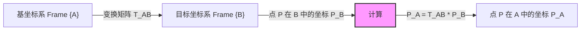

#### 1. 简介

在机器人学中，描述物体在空间中的位置和姿态（位姿）是所有后续分析的基础。本模块详细介绍了如何使用旋转矩阵和平移向量来描述刚体运动，以及如何通过**齐次变换矩阵 (Homogeneous Transformation Matrix)** 将两者结合。

#### 2. 核心理论

##### 2.1 旋转矩阵 (Rotation Matrix)

二维或三维空间中的旋转可以通过正交矩阵描述。以绕 $Z$ 轴旋转 $\theta$ 角为例，其旋转矩阵 $R_z(\theta)$ 为：

$$R_z(\theta) = \begin{bmatrix} \cos\theta & -\sin\theta & 0 \\ \sin\theta & \cos\theta & 0 \\ 0 & 0 & 1 \end{bmatrix}$$

##### 2.2 齐次变换矩阵 (Homogeneous Transformation)

为了将旋转 ($R, 3\times3$) 和平移 ($P, 3\times1$) 统一在通过线性运算中，引入了 $4\times4$ 的齐次变换矩阵 $T$：

$$T = \begin{bmatrix} R & P \\ 0 & 1 \end{bmatrix} = \begin{bmatrix} r_{11} & r_{12} & r_{13} & p_x \\ r_{21} & r_{22} & r_{23} & p_y \\ r_{31} & r_{32} & r_{33} & p_z \\ 0 & 0 & 0 & 1 \end{bmatrix}$$

#### 3. 架构流程 (Mermaid)




#### 4. Python 代码验证

下面的代码演示了如何使用 `numpy` 构建齐次变换矩阵，并将一个点从局部坐标系变换到全局坐标系。


```python
import numpy as np

def get_rotation_z(theta_deg):
    """生成绕Z轴的旋转矩阵"""
    theta = np.radians(theta_deg)
    c, s = np.cos(theta), np.sin(theta)
    return np.array([
        [c, -s, 0],
        [s,  c, 0],
        [0,  0, 1]
    ])

def get_homogeneous_matrix(R, P):
    """组合旋转和平移生成4x4齐次变换矩阵"""
    T = np.eye(4)
    T[:3, :3] = R
    T[:3, 3] = P
    return T

# --- 场景模拟 ---
# 机器人末端坐标系 {B} 相对于基坐标系 {A}:
# 1. 绕 Z 轴旋转 90 度
# 2. 沿 X 轴平移 2 米, 沿 Y 轴平移 1 米

# 1. 定义旋转和平移
R_AB = get_rotation_z(90)
P_AB = np.array([2, 1, 0])

# 2. 构建变换矩阵 T_AB
T_AB = get_homogeneous_matrix(R_AB, P_AB)

# 3. 定义末端上的一个点 P (在 {B} 系中坐标为 [1, 0, 0])
P_B = np.array([1, 0, 0, 1]) # 齐次坐标

# 4. 计算该点在基坐标系 {A} 中的位置
P_A = T_AB @ P_B

print("变换矩阵 T_AB:\n", T_AB)
print("-" * 30)
print(f"点在局部坐标系 B: {P_B[:3]}")
print(f"点在全局坐标系 A: {P_A[:3]}")

# 预期结果分析:
# B系旋转90度后，B的X轴指向A的Y轴。
# B的原点在A的(2,1)。
# B系中的点(1,0)即沿B的X轴走1米，相当于沿A的Y轴走1米。
# 所以最终位置应该是 (2, 1+1) = (2, 2)。
```

