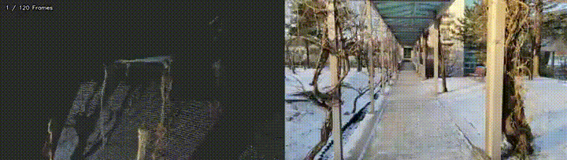
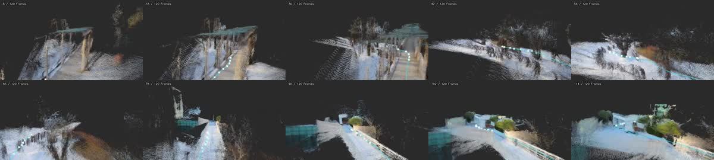
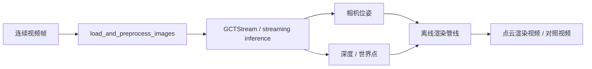

# 03-LingBot-Map：从视频扫描到三维点云地图

LingBot-Map 是一个面向长视频的流式三维重建项目。它可以从连续视频帧中估计相机轨迹、深度、点云和可视化渲染结果，适合用来理解“机器人拿着相机扫一圈环境，逐步形成空间地图”的流程。

本章会完成三个目标：

- 在本地复现官方连续场景 `university`，生成点云渲染视频。
- 解释 LingBot-Map 的代码入口、数据流和论文思路。
- 提供一个轻量 Web demo：上传视频后调用本地推理脚本，输出原视频与点云渲染对照。

> 说明：LingBot-Map 的输出更接近“流式相机位姿 + 深度 + 点云/体素渲染”，不是把视频实时训练成完整 3D Gaussian Splatting 场景。它可以作为 3DGS、NeRF、SLAM 或机器人导航前端的空间理解输入，但本章的复现重点是视频扫描建图和点云可视化。

## 一、效果预览

本章使用官方示例 `example/university`。它是一个校园雪景的连续单场景序列，运动轨迹不是简单直线，适合展示“边走边扫描”的效果。

输入视频预览：

<video controls muted preload="metadata" width="100%">
  <source src="assets/lingbot-map/university_input.mp4" type="video/mp4">
</video>

点云渲染结果：

<video controls muted preload="metadata" width="100%">
  <source src="assets/lingbot-map/university_pointcloud.mp4" type="video/mp4">
</video>

原始帧与点云渲染对照：

<video controls muted preload="metadata" width="100%">
  <source src="assets/lingbot-map/university_compare.mp4" type="video/mp4">
</video>

如果文档站点不直接播放视频，可以查看 GIF 预览：



点云关键帧缩略图：



## 二、环境准备

建议新建独立 mamba 环境，因为 LingBot-Map 同时依赖 PyTorch、CUDA 扩展、Kaolin、viser 和渲染相关包，和普通具身仿真环境混在一起很容易冲突。

以下命令假设读者已经把 LingBot-Map 克隆到 `$PROJECT_ROOT`：

```bash
export PROJECT_ROOT=/path/to/lingbot-map
cd "$PROJECT_ROOT"
```

创建环境：

```bash
mamba create -n lingbot-map python=3.10 -y
mamba activate lingbot-map
```

安装 PyTorch。官方 README 推荐 PyTorch 2.8.0 + CUDA 12.8，因为批量渲染管线需要的 Kaolin 有对应预编译轮子：

```bash
pip install torch==2.8.0 torchvision==0.23.0 --index-url https://download.pytorch.org/whl/cu128
```

安装项目和渲染依赖：

```bash
pip install -e .
pip install -r demo_render/requirements.txt
```

如果要使用离线点云渲染，需要编译渲染 CUDA 扩展：

```bash
cd demo_render/render_cuda_ext
python setup.py build_ext --inplace
cd ../..
```

下载权重后放到：

```text
$PROJECT_ROOT/checkpoints/lingbot-map-long.pt
```

官方权重可从项目 README 中的 Hugging Face 或 ModelScope 链接下载。长视频和大场景优先使用 `lingbot-map-long.pt`。

### CUDA 与 Blackwell 注意事项

如果服务器是 Blackwell 架构 GPU，建议尽量使用 CUDA 12.8 或更高版本的 PyTorch 轮子；部分工具在查询 SM 12.x 能力时会提示 “SM 12.x requires CUDA >= 12.9”。如果推理本身可以跑通，这个提示不一定阻塞本章 smoke test；如果遇到 CUDA kernel、FlashInfer 或 Kaolin 编译失败，再升级系统 CUDA Toolkit 或改用与 PyTorch 轮子匹配的 CUDA 版本。

## 三、官方连续场景 smoke test

官方仓库自带几个示例序列：

| 场景 | 特点 | 本章建议 |
| :--- | :--- | :--- |
| `university` | 校园室外连续移动，有树、栏杆、建筑和地面层次 | 推荐 |
| `loop` | 室内走廊闭环运动 | 适合讲闭环和漂移 |
| `courthouse` | 建筑外立面绕行 | 适合建筑扫描 |
| `oxford` | 校园建筑外景 | 适合室外大场景 |

运行本章使用的 `university` 示例：

```bash
export PROJECT_ROOT=/path/to/lingbot-map
cd "$PROJECT_ROOT"
mamba activate lingbot-map

python demo_render/batch_demo.py \
  --input_folder example \
  --scenes university \
  --image_range 0:240:2 \
  --output_folder outputs/official_university_scan \
  --model_path checkpoints/lingbot-map-long.pt \
  --config demo_render/config/outdoor_large.yaml \
  --num_scale_frames 4 \
  --use_sdpa \
  --video_width 640 \
  --video_height 360 \
  --video_fps 12 \
  --camera_vis default \
  --frame_tag \
  --save_predictions \
  --video_suffix _pointcloud
```

运行完成后重点查看：

```text
outputs/official_university_scan/university_pointcloud.mp4
outputs/official_university_scan/university_pointcloud_combined.mp4
outputs/official_university_scan/batch_results.json
```

本章 smoke test 使用 120 帧，日志中可以看到推理速度约为十几 FPS，并生成约百万级以上点云/体素用于渲染。实际速度会随 GPU、CUDA、分辨率、帧数和渲染参数变化。

## 四、用自己的视频扫描环境

如果读者有自己录制的视频，可以直接传给 `--video_path`。建议先用连续单镜头视频测试，避免频繁剪辑、快速变焦、大片运动模糊和大面积纯天空。

```bash
export PROJECT_ROOT=/path/to/lingbot-map
export VIDEO_PATH=/path/to/your_scan_video.mp4
cd "$PROJECT_ROOT"
mamba activate lingbot-map

python demo_render/batch_demo.py \
  --video_path "$VIDEO_PATH" \
  --target_frames 120 \
  --output_folder outputs/my_scan \
  --model_path checkpoints/lingbot-map-long.pt \
  --config demo_render/config/outdoor_large.yaml \
  --num_scale_frames 4 \
  --use_sdpa \
  --video_width 640 \
  --video_height 360 \
  --video_fps 12 \
  --camera_vis default \
  --frame_tag \
  --save_predictions \
  --video_suffix _pointcloud
```

拍摄建议：

- 单场景连续移动比剪辑视频更适合重建。
- 可以转弯、环绕、上下轻微俯仰，不要求走直线。
- 相机运动要有视差，纯原地旋转或远景平移很难恢复稳定尺度。
- 室外场景建议尽量减少纯天空占比，必要时启用 sky mask。
- 先用 60 到 120 帧 smoke test，确认管线稳定后再加长视频。

## 五、Web demo

教程仓库提供一个极简 Web 包装器，目录为：

```text
tools/lingbot_map_web_demo/
```

它不会内置 LingBot-Map 权重，也不会把运行结果写入教程仓库。读者需要用环境变量告诉它 LingBot-Map 项目位置和 checkpoint 位置：

```bash
export LINGBOT_MAP_ROOT=/path/to/lingbot-map
export LINGBOT_MAP_CKPT=/path/to/lingbot-map/checkpoints/lingbot-map-long.pt
export LINGBOT_MAP_PYTHON=/path/to/mamba/envs/lingbot-map/bin/python
export LINGBOT_MAP_RUN_ROOT=/path/to/lingbot_map_runs

cd /path/to/every-embodied/tools/lingbot_map_web_demo
pip install -r requirements.txt
python app.py
```

打开浏览器访问：

```text
http://127.0.0.1:7860
```

上传一段连续视频后，Web demo 会调用 `demo_render/batch_demo.py`，并在页面里展示：

- 原始输入视频；
- 点云渲染视频；
- 原视频与点云渲染对照视频；
- 执行日志与输出目录。

这个 Web demo 适合作为教程展示和 smoke test，不建议直接作为生产服务。长视频推理会占用较多显存和磁盘空间，公开部署时还需要任务队列、并发限制、文件清理和访问控制。

## 六、代码和论文怎么对应

LingBot-Map 的关键数据流可以简化为：



主要入口：

| 文件 | 作用 |
| :--- | :--- |
| `demo.py` | 交互式 3D viewer，适合短序列调试。 |
| `demo_render/batch_demo.py` | 离线批处理入口，适合视频、长序列和教程产物生成。 |
| `lingbot_map/` | 模型、加载、视觉工具和推理实现。 |
| `demo_render/rgbd_render/` | 将预测的深度、相机和点云渲染成视频。 |
| `demo_render/render_cuda_ext/` | 点云/体素渲染相关 CUDA 扩展。 |

从论文思路看，LingBot-Map 关注的是长视频场景下的在线空间记忆。模型不是每次只孤立处理一帧，而是维护跨帧状态，把前面看到的内容作为后续帧理解的上下文。这样做的好处是：机器人沿着走廊、校园道路或房间移动时，不必等完整视频结束再重建，而是可以边输入边更新空间表示。

可以把它理解成三层能力：

1. 视觉编码：把每一帧图像转换成特征。
2. 时序聚合：用流式状态保留之前帧的信息，减少长视频重复计算。
3. 几何输出：预测相机、深度和世界点，再转成点云或体素渲染结果。

因此，它回答的问题不是“把视频做成一个最终可编辑 3DGS 模型”，而是“从机器人视角的视频流中持续恢复可用于导航、检查和可视化的三维结构”。

## 七、常见问题

**1. 输出是不是实时 3DGS？**

不是。它可以实时或接近实时地产生流式几何估计，但本章展示的是点云/体素渲染。3DGS 通常还需要显式高斯参数优化或训练流程。

**2. 为什么连续视频比剪辑视频重要？**

重建依赖相邻帧之间的几何一致性。剪辑视频会突然切换地点和视角，模型会把不连续的空间关系硬接在一起，容易产生漂移、错位或破碎点云。

**3. Blackwell GPU 一定要升级 CUDA 吗？**

如果 PyTorch wheel、FlashInfer、Kaolin 和本项目 CUDA 扩展都能正常运行，可以先不动系统 CUDA。若出现 SM 12.x 不支持、CUDA extension 编译失败或 kernel launch 报错，再考虑升级到更高 CUDA Toolkit，并确保 PyTorch、驱动、编译器和依赖库版本一致。

**4. 原始视频、权重和输出 NPZ 要提交到教程仓库吗？**

不建议。教程仓库只保留压缩后的预览 MP4/GIF/JPG。权重、原始视频、大量 `.npz` 预测文件和长视频输出应放在本地数据目录或外部对象存储中。

## 八、参考

- LingBot-Map 官方仓库和 README。
- LingBot-Map 论文 PDF。
- 官方示例 `example/university`，本章仅提交压缩后的教学预览，不提交原始权重、原始序列或大体积预测文件。
