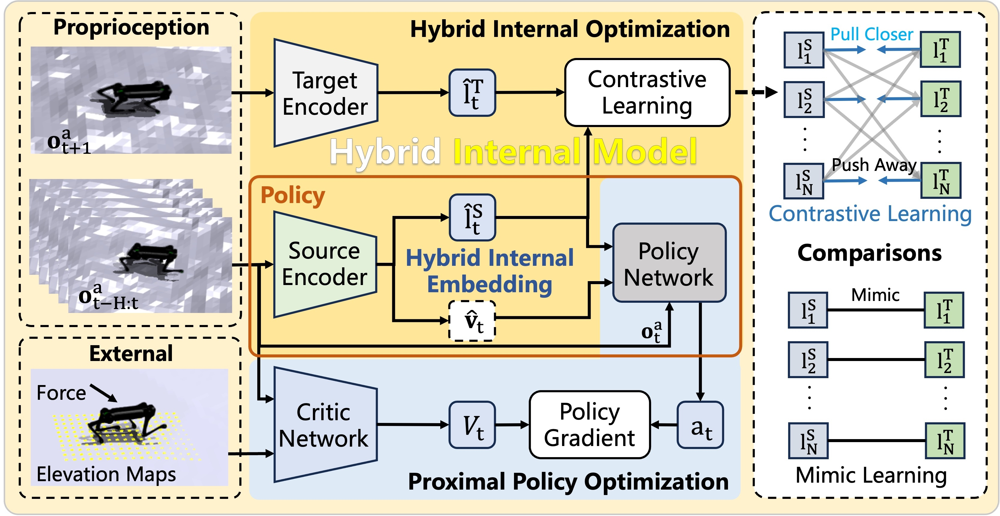
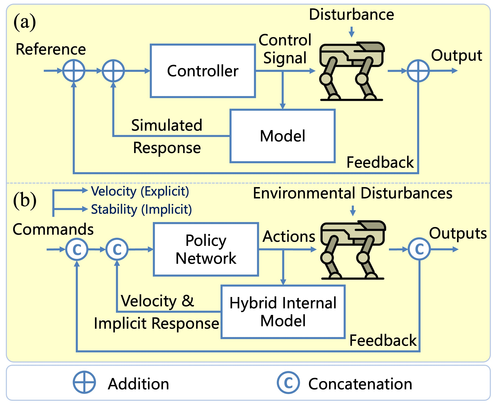
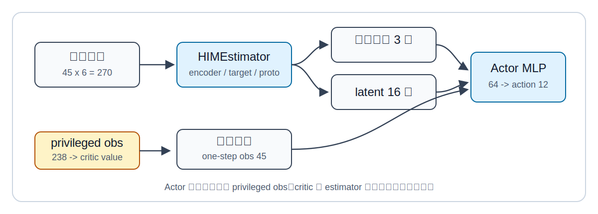
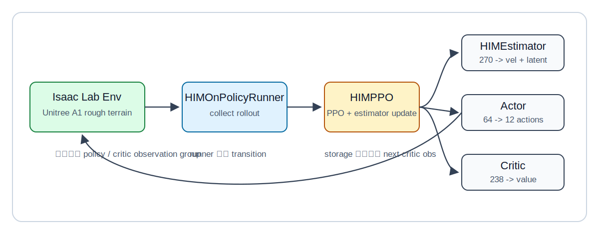
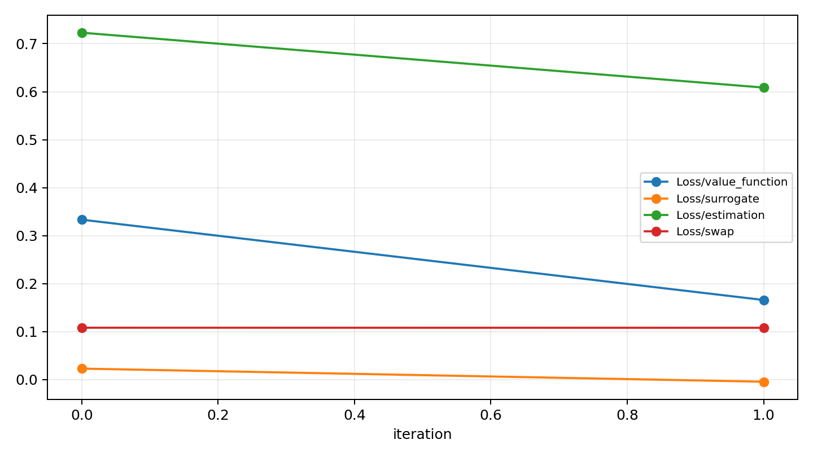
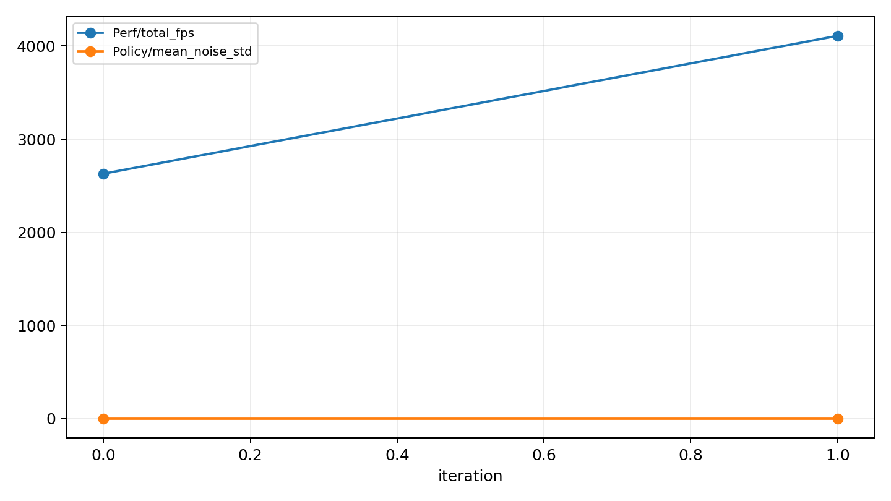

# HIMLoco 四足机器人运动控制：从论文理解到 Isaac Lab 新栈复现

这一章带大家完成一次 HIMLoco 的工程化学习：先理解 ICLR 2024 论文 **Hybrid Internal Model: Learning Agile Legged Locomotion with Simulated Robot Response** 到底想解决什么，再顺着开源仓库看清楚观测、内部模型、PPO 训练和 Sim2Real 设计，最后把原本依赖 Isaac Gym Preview 4 的训练链路迁移到 Isaac Sim / Isaac Lab 新栈，并在 Blackwell GPU 上跑通 smoke test。

本章的目标不是训练出论文级最终策略，而是让大家先把最关键的工程链路摸清楚：

- HIMLoco 为什么不是普通的 `obs -> action` PPO；
- `45 x 6 = 270` 的历史观测、`238` 维 privileged critic observation 分别来自哪里；
- `HIMEstimator` 如何从历史 proprioception 中学习速度和隐变量；
- 旧 Isaac Gym 栈为什么会在 Blackwell GPU 上失效；
- 如何用 Isaac Lab / PyTorch CUDA 12.8 新栈把任务和 HIM 算法跑起来；
- 官方 demo 视频、本地渲染视频和完整训练结果之间是什么关系；
- smoke test 能证明什么，以及它不能证明什么。

> 说明：本章复现使用的是开源仓库 [OpenRobotLab/HIMLoco](https://github.com/OpenRobotLab/HIMLoco)，论文项目页为 [HIMLoco 官方主页](https://junfeng-long.github.io/HIMLoco/)，论文为 [arXiv:2312.11460](https://arxiv.org/abs/2312.11460)。官方仓库 README 标注训练代码已释放，但部署指导尚未释放。因此本章重点放在训练链路、算法结构和 Isaac Lab 新栈迁移，不把 smoke test 结果误解为真机部署完成。

## 复现路线图

大家可以把本章看成一次四足机器人强化学习实验课。我们先从原论文和原仓库出发，理解作者为什么要设计 Hybrid Internal Model；然后再看工程实现中每个张量如何流动；最后用本地迁移版任务完成最小训练验证。

| 阶段 | 主要目标 | 成功信号 | 失败时优先检查 |
| :-- | :-- | :-- | :-- |
| 1. 理解论文方法 | 明白 HIM、privileged critic、history observation 的关系 | 能解释 actor 为什么只用可部署观测 | 不要先纠结所有 reward 细节 |
| 2. 阅读原仓库 | 找到环境、算法、runner、estimator 的代码位置 | 能定位 `him_ppo.py` 和 `him_estimator.py` | 确认使用仓库内修改过的 `rsl_rl` |
| 3. 旧栈验证 | 搭起 Isaac Gym Preview 4 环境 | `train.py --help` 能运行 | Python 3.7/3.8、`LD_LIBRARY_PATH` |
| 4. Blackwell 排障 | 判断旧 PyTorch/CUDA 是否支持当前显卡 | 发现 `sm_120` 与旧 wheel 不兼容 | `torch.cuda.get_arch_list()` |
| 5. Isaac Lab 迁移 | 注册新任务和新 runner | policy obs `270`，critic obs `238` | Isaac Lab 路径、任务 entry point |
| 6. HIM smoke test | 跑通 64 envs、2 iterations | 产生 loss、fps、checkpoint | 观测组、batch shape、CUDA 版本 |
| 7. 渲染验证 | 录制 Isaac Lab 训练过程视频 | 能看到 A1 在 rough terrain 场景中被仿真推进 | 不要把短步数随机策略当作收敛步态 |

smoke test 的意义要说清楚：它证明环境创建、观测构造、动作执行、reward 计算、rollout storage、反向传播和优化器更新都能过；它不证明策略已经收敛，也不证明可以直接上真机。

## 一、HIMLoco 在解决什么问题

四足机器人运动控制里，强化学习策略经常面对一个矛盾：仿真器知道很多真实机器人部署时拿不到的信息，例如准确的 base linear velocity、外部扰动力、地形高度、接触状态和刚体质量变化；但真机部署时，策略通常只能依赖 IMU、关节编码器、上一时刻动作和少量状态估计。

如果训练时让 actor 直接读取这些仿真特权信息，策略在仿真里会很好看，但部署时信息缺失，Sim2Real 会变得脆弱。如果完全不用这些信息，训练又浪费了仿真器能提供的监督信号。

HIMLoco 的核心想法就是在两者之间搭一座桥：

- 训练时 critic 可以使用 privileged observation，帮助 PPO 学到更准确的 value function；
- actor 不直接读取 privileged observation，只读取真实部署更可能拿到的历史 proprioception；
- 额外训练一个 `HIMEstimator`，从历史观测中推断 base velocity 和隐变量 latent；
- actor 最终使用 `当前观测 + 估计速度 + latent` 输出 12 个关节动作。

换句话说，HIMLoco 不是让策略“偷看答案”，而是训练一个内部模型，让机器人学会从自身历史响应中推断当前动力学状态。

<p align="center">
  
</p>

**图 1 HIMLoco 官方方法总览。** 这张图展示了 HIMLoco 的核心思想：策略不只依赖当前一帧观测，而是利用历史机器人响应学习内部状态表示，再把这个表示接入运动控制策略。大家重点看两点：第一，内部模型连接了历史响应和当前控制；第二，训练时的仿真信息被用于学习表示，而不是简单作为部署时必需输入。

<p align="center"><sub>来源：HIMLoco 官方项目页，图片文件 `overview.jpeg`。</sub></p>

<p align="center">
  
</p>

**图 2 HIMLoco 官方内部模型控制示意。** 这张图更强调 internal model control 的思路：机器人执行动作后产生物理响应，历史响应再被编码成策略需要的内部状态。对于做机器人控制的小伙伴，这一点很关键：HIMLoco 不是只在网络结构上加一层 MLP，而是在训练目标里显式让网络学习“机器人响应中隐含的动力学信息”。

<p align="center"><sub>来源：HIMLoco 官方项目页，图片文件 `imc.jpeg`。</sub></p>

### 官方视频和本地复刻视频的关系

HIMLoco 官方主页还提供了多段 demo 视频。大家学习时建议先看官方视频，建立“论文想达到什么行为效果”的直观印象；再看本章后面的本地 smoke-test 视频，确认我们机器上的 Isaac Lab 迁移链路已经能渲染、推进仿真、输出动作和写 checkpoint。两类视频的含义不同：官方视频展示的是论文项目效果，本地视频展示的是迁移后的最小可运行证据。

<table>
  <tr>
    <td width="50%">
      <iframe width="100%" height="260" src="https://www.youtube.com/embed/WUXcnNHXk20?si=1EdxpU6VFoh_xpSI" title="Demo of HIMLoco" frameborder="0" allowfullscreen></iframe>
      <p><strong>视频 1 HIMLoco 官方总览 demo。</strong> 这段视频展示论文方法在不同任务中的整体运动效果，适合先形成对 agile locomotion 的直观认识。</p>
    </td>
    <td width="50%">
      <iframe width="100%" height="260" src="https://www.youtube.com/embed/AU-vu2kezQY?si=9nrQv7CHw47P5Q9R" title="Running along Huangpu River" frameborder="0" allowfullscreen></iframe>
      <p><strong>视频 2 官方真机户外跑动 demo。</strong> 这段视频展示 Unitree A1 在户外场景中的运动表现，帮助大家理解论文强调的 Sim2Real 目标。</p>
    </td>
  </tr>
  <tr>
    <td width="50%">
      <iframe width="100%" height="260" src="https://www.youtube.com/embed/k7r-MDys6Pg?si=1zrnB3I3Vo-1yvWZ" title="Walking on Steep Slope Covered by Sands" frameborder="0" allowfullscreen></iframe>
      <p><strong>视频 3 官方沙地陡坡 demo。</strong> 这类场景考验策略对接触变化、地形坡度和动力学扰动的适应能力。</p>
    </td>
    <td width="50%">
      <iframe width="100%" height="260" src="https://www.youtube.com/embed/5rUPhZlX2-Q?si=TAIwQOxHWDjXaEDy" title="Walking on Stairs in Different Ways" frameborder="0" allowfullscreen></iframe>
      <p><strong>视频 4 官方楼梯运动 demo。</strong> 这段视频可以和后文的 rough terrain 仿真环境对应起来看：训练时需要让策略接触多样地形，部署时才更有鲁棒性。</p>
    </td>
  </tr>
</table>

<p align="center"><sub>来源：HIMLoco 官方项目页中嵌入的 YouTube demo 视频。</sub></p>

## 二、原仓库的代码组织

HIMLoco 开源仓库基于 `legged_gym` 和 `rsl_rl` 修改而来。大家阅读代码时不要用原版 `legged_gym` 或原版 `rsl_rl` 去对照安装，因为作者在仓库内加入了 HIM 专用的 runner、storage、actor-critic 和 PPO。

核心目录可以这样理解：

| 路径 | 作用 |
| :-- | :-- |
| `legged_gym/legged_gym/envs/base/legged_robot.py` | 四足机器人环境基类，负责仿真 step、reward、termination、observation |
| `legged_gym/legged_gym/envs/a1/a1_config.py` | Unitree A1 的初始姿态、PD 参数、奖励权重、命令范围 |
| `legged_gym/legged_gym/scripts/train.py` | 训练入口，创建环境和 runner |
| `legged_gym/legged_gym/scripts/play.py` | 测试与 TorchScript 导出入口 |
| `rsl_rl/rsl_rl/runners/him_on_policy_runner.py` | HIM 训练主循环 |
| `rsl_rl/rsl_rl/algorithms/him_ppo.py` | PPO 更新和 estimator 更新 |
| `rsl_rl/rsl_rl/modules/him_actor_critic.py` | actor、critic、estimator 的组合网络 |
| `rsl_rl/rsl_rl/modules/him_estimator.py` | 内部模型估计器和自监督 loss |
| `rsl_rl/rsl_rl/storage/him_rollout_storage.py` | 保存 next privileged observation 的 rollout buffer |

训练入口本身很短：

```python
env, env_cfg = task_registry.make_env(name=args.task, args=args)
ppo_runner, train_cfg = task_registry.make_alg_runner(env=env, name=args.task, args=args)
ppo_runner.learn(num_learning_iterations=train_cfg.runner.max_iterations, init_at_random_ep_len=True)
```

真正的逻辑在 registry 创建出来的环境和 runner 里。大家看代码时可以按“环境先产生张量，runner 再消费张量”的顺序读，不要一开始就陷进 PPO 公式。

## 三、观测张量如何流动

HIMLoco 的观测设计是整篇论文和仓库最值得学习的部分。它把 actor 能看见的信息和 critic 能看见的信息分开。

### 1. actor 的 one-step observation

原仓库中每一帧 actor observation 是 45 维：

| 组成 | 维度 | 含义 |
| :-- | --: | :-- |
| command | 3 | 目标 x/y 速度和 yaw 速度 |
| base angular velocity | 3 | 机体坐标系角速度 |
| projected gravity | 3 | 重力在机体坐标系下的投影，用于表示姿态 |
| joint position error | 12 | 当前关节位置与默认关节位置的差 |
| joint velocity | 12 | 关节速度 |
| last action | 12 | 上一时刻动作 |
| 合计 | 45 | 单帧 proprioception |

然后 HIMLoco 堆叠 6 帧历史：

```text
actor observation = 45 x 6 = 270
```

这件事很像机器人上的“短期记忆”。单帧 proprioception 可能无法准确知道速度、延迟、接触和外界扰动，但 6 帧历史能让网络从响应趋势里推断这些状态。

### 2. critic 的 privileged observation

critic 使用 238 维 privileged observation：

| 组成 | 维度 | 含义 |
| :-- | --: | :-- |
| one-step actor observation | 45 | 与 actor 当前帧观测一致 |
| base linear velocity | 3 | 仿真器可直接提供，真机部署时通常不可靠 |
| external force | 3 | 仿真中的外部扰动力 |
| height scan | 187 | 机体周围地形高度采样 |
| 合计 | 238 | critic / estimator 训练用特权信息 |

这里的设计是典型 asymmetric actor-critic：actor 模拟部署约束，critic 利用仿真真值降低训练难度。

### 3. HIM actor 真正吃进去的是 64 维

很多小伙伴第一次看代码会以为 actor MLP 输入是 270 维，其实不是。`HIMEstimator` 先把 270 维历史观测编码成：

```text
estimated base velocity: 3
latent: 16
```

然后 actor MLP 的输入是：

```text
当前 one-step obs 45
+ estimated base velocity 3
+ latent 16
= 64
```

这就是 HIMLoco 的“内部模型”落在代码里的形态。

<p align="center">
  
</p>

**图 3 HIMLoco 的张量流。** 这张图是本章根据源码整理的复现版数据流。大家重点看 actor 和 critic 的输入并不相同：actor 通过 estimator 从历史观测中获得内部状态，critic 则直接读取训练时的 privileged observation。

## 四、Estimator 的训练目标

`HIMEstimator` 不只是一个普通 encoder。它有两个训练目标：

1. 预测 base linear velocity；
2. 通过 prototype / Sinkhorn 风格的 swap loss 学习结构化 latent。

代码里的关键切片是：

```python
vel = next_critic_obs[:, self.num_one_step_obs:self.num_one_step_obs+3].detach()
next_obs = next_critic_obs.detach()[:, 3:self.num_one_step_obs+3]
```

这里 `vel` 来自 next privileged observation 中的真实 base linear velocity，作为 estimator 的监督信号。`next_obs` 用于 target network 产生 latent target。随后代码会计算：

```python
estimation_loss = F.mse_loss(pred_vel, vel)
swap_loss = -0.5 * (q_s * log_p_t + q_t * log_p_s).mean()
```

对于机器人学习来说，这个设计很有启发：它不是只让策略端到端追 reward，而是在策略内部放入一个可解释的中间任务，让网络学会估计部署时难以直接测准的动力学量。

## 五、原始 Isaac Gym 栈为什么在新显卡上跑不动

官方 README 推荐环境是：

```text
Ubuntu 20.04
Python 3.7.16
PyTorch 1.10.0+cu113
Isaac Gym Preview 4
```

这套环境在旧显卡上是合理的，但在 Blackwell GPU 上会遇到 CUDA 架构不匹配。我们的实测显卡是 `NVIDIA RTX PRO 6000 Blackwell Workstation Edition`，compute capability 是 `sm_120`。而 PyTorch 1.10.0+cu113 只支持到较老架构，运行训练时会出现：

```text
CUDA error: no kernel image is available for execution on the device
```

我们也尝试过在 Python 3.8 下使用较新的 PyTorch 2.4.1+cu124，这是 Isaac Gym Preview 4 绑定还能接受的较高 Python 版本之一。但该 wheel 的 `torch.cuda.get_arch_list()` 仍然只到 `sm_90`，无法覆盖 `sm_120`。

因此，对于 Blackwell 路线，更靠谱的办法不是继续修补 Isaac Gym Preview 4，而是迁移到：

```text
Isaac Sim / Isaac Lab
Python 3.11
PyTorch 2.7.0+cu128
rsl-rl-lib 3.0.1
```

这也是本章后半部分采用 Isaac Lab 新栈的原因。

## 六、Isaac Lab 迁移后的工程结构

迁移后的目标不是重写所有物理细节，而是尽量保留 HIMLoco 的训练语义：

- Unitree A1，12 维 joint position action；
- action scale `0.25`；
- PD stiffness `40.0`，damping `1.0`；
- `dt=0.005`，decimation `4`，episode length `20s`；
- rough terrain curriculum；
- command range `x/y = [-1, 1]`，yaw/heading `[-pi, pi]`；
- policy observation `270`；
- critic observation `238`；
- HIM runner 包含 `HIMActorCritic`、`HIMEstimator`、`HIMPPO`。

迁移后的项目局部结构如下：

```text
HIMLoco/
  source/himloco_isaaclab_tasks/
    himloco_isaaclab_tasks/
      a1/
        rough_env_cfg.py
        agents/rsl_rl_ppo_cfg.py
      rsl_rl_him.py
  scripts/
    isaaclab_train_himloco.py
    train_himloco_isaaclab.sh
    train_himloco_isaaclab_him.sh
```

其中 `rough_env_cfg.py` 负责把 Isaac Lab 的 A1 rough terrain task 改造成 HIMLoco 风格的 observation/reward/domain-randomization 配置；`rsl_rl_him.py` 则把原仓库 HIM 相关算法适配到 `rsl-rl-lib 3.x` 的 observation group 和 TensorDict 接口。

<p align="center">
  
</p>

**图 4 Isaac Lab 迁移后的本地复现链路。** 这张图是本章的工程复现图，和官方图不同，它关注的是大家实际运行时哪些模块在交互。环境产生 observation group，runner 收集 rollout，PPO 更新 actor/critic，同时 estimator 通过 next critic observation 学习内部模型。

## 七、环境准备

建议大家先定义几个路径变量，避免把命令写死到某台机器：

```bash
export HIMLOCO_ROOT=/path/to/HIMLoco
export ISAACLAB_ROOT=/path/to/IsaacLab
export PYTHON_BIN=/path/to/isaaclab-python/bin/python
```

本章实测环境的关键版本如下：

```text
GPU: NVIDIA RTX PRO 6000 Blackwell Workstation Edition, sm_120
Torch: 2.7.0+cu128
Isaac Sim: 5.1
rsl-rl-lib: 3.0.1
```

迁移任务包需要以 editable 方式安装：

```bash
cd "$HIMLOCO_ROOT"

"$PYTHON_BIN" -m pip install -e \
  "$HIMLOCO_ROOT/source/himloco_isaaclab_tasks" \
  --no-deps
```

这里使用 `--no-deps` 是为了避免 pip 重新解析 Isaac Sim / Isaac Lab 的大依赖。Isaac 系环境最好保持由已有 Isaac Lab 环境管理，不要让一个小任务包触发整套依赖重装。

## 八、Checkpoint 1：普通 PPO baseline 跑通

迁移后保留了一条普通 PPO baseline，用来确认 Isaac Lab 任务本身没有问题：

```bash
cd "$HIMLOCO_ROOT"
./scripts/train_himloco_isaaclab.sh --num_envs 1 --max_iterations 1
```

成功时，大家应该看到类似的 observation manager 输出：

```text
Active Observation Terms in Group: 'policy' (shape: (270,))
Active Observation Terms in Group: 'critic' (shape: (238,))
Action Terms (shape: 12)
```

随后 actor/critic 结构会显示为：

```text
Actor MLP: Linear(in_features=270, ...)
Critic MLP: Linear(in_features=238, ...)
```

这条 baseline 的作用是检查任务注册、环境创建、terrain、reward、observation group 和 rsl-rl 3.x 标准 runner 是否正常。它不是 HIM 原算法复现，因为 actor 直接吃 270 维历史观测，没有使用 estimator 产生的 64 维 actor input。

## 九、Checkpoint 2：HIM 算法 smoke test

更接近原 HIMLoco 的复现入口是：

```bash
cd "$HIMLOCO_ROOT"
./scripts/train_himloco_isaaclab_him.sh --num_envs 1 --max_iterations 1
```

成功时，大家应该看到：

```text
HIMActorCritic ...
Actor MLP: Linear(in_features=64, out_features=512, ...)
Critic MLP: Linear(in_features=238, out_features=512, ...)
Estimator: Linear(in_features=270, out_features=128, ...)
```

这说明三个关键维度都对上了：

| 模块 | 输入维度 | 输出或用途 |
| :-- | --: | :-- |
| `HIMEstimator` | 270 | 估计 velocity 3 维和 latent 16 维 |
| `Actor` | 64 | 输出 12 维动作 |
| `Critic` | 238 | 输出 value |

单环境 smoke test 能证明代码链路可运行，但 batch 相关问题不一定暴露。因此建议大家再跑一个稍微接近真实训练形态的小规模调试：

```bash
cd "$HIMLOCO_ROOT"
./scripts/train_himloco_isaaclab_him.sh --num_envs 64 --max_iterations 2
```

本章实测的关键日志如下：

```text
Iteration 0/2:
Computation: 2630 steps/s
Mean value_function loss: 0.3333
Mean surrogate loss: 0.0228
Mean entropy loss: 17.0127
Mean estimation loss: 0.7230
Mean swap loss: 0.1080
Mean reward: -2.80
Total timesteps: 6400

Iteration 1/2:
Computation: 4110 steps/s
Mean value_function loss: 0.1658
Mean surrogate loss: -0.0045
Mean entropy loss: 17.0122
Mean estimation loss: 0.6086
Mean swap loss: 0.1079
Mean reward: -3.24
Total timesteps: 12800
```

完整摘录保存在 [assets/logs/him_smoke_64env_2iter.txt](assets/logs/him_smoke_64env_2iter.txt)。这些 loss 在 2 iterations 内不用于判断策略好坏，只用于确认 PPO loss、estimator loss、swap loss 都参与了更新。

<p align="center">
  
</p>

**图 5 HIM smoke test 的 loss 曲线。** 这是 64 个环境、2 次 iteration 的本地验证图。曲线很短，不能用来讨论收敛，但可以确认 value loss、surrogate loss、estimation loss 和 swap loss 都被记录到了 TensorBoard。

<p align="center">
  
</p>

**图 6 HIM smoke test 的性能记录。** 这张图展示了本地小规模训练的 `total_fps` 和 action noise std。对于 smoke test，性能数值只作为环境是否在 GPU 上正常推进的参考，不代表完整训练吞吐。

### Checkpoint 3：录制本地渲染视频

如果想确认 Isaac Lab 渲染链路也正常，可以在 HIM 训练入口上打开视频录制：

```bash
cd "$HIMLOCO_ROOT"
./scripts/train_himloco_isaaclab_him.sh \
  --num_envs 4 \
  --max_iterations 2 \
  --video \
  --video_length 120 \
  --video_interval 100000
```

录制视频时还需要注意相机位置。迁移脚本默认在 `--video` 打开时让 viewport camera 跟随第一个环境中的 `robot/trunk`，否则 Isaac Lab 可能只录到一大片 rough terrain，看不到机器狗。`video_interval` 也不要设得太小；如果每一步都触发一次录制，Gymnasium `RecordVideo` 会产生许多 1 帧 clip，不适合直接放进教程。

这个视频能证明 A1 rough-terrain 环境、camera capture、action step 和训练循环已经接起来了；但它只有 2 个 iteration，策略还没有学会稳定步态，所以大家不要用它和官方视频里的最终运动效果做对比。画面中的蓝绿箭头来自 Isaac Lab 的 command visualization，用来显示速度命令和当前速度方向。

<video controls muted preload="metadata" poster="assets/videos/him_local_smoke_train_4env_poster.png" width="100%">
  <source src="assets/videos/him_local_smoke_train_4env.mp4" type="video/mp4">
</video>

**视频 5 本地 Isaac Lab smoke-test 渲染。** 这是本章在 Blackwell GPU + Isaac Lab 新栈上录制的 4 envs、2 iterations 调试片段。它的价值是证明渲染和训练闭环能跑通；由于策略还处在随机初始化后的极早期训练阶段，画面中出现站立不稳或翻倒是正常现象。真正接近论文效果需要长时间训练、合适 checkpoint，以及后续 play/record 流程。

## 十、正常训练入口

如果 smoke test 都通过，可以把环境数量和 iteration 数调回训练规模：

```bash
cd "$HIMLOCO_ROOT"
./scripts/train_himloco_isaaclab_him.sh --num_envs 4096 --max_iterations 200000
```

日志默认写入：

```text
logs/rsl_rl/himloco_a1_rough_him_isaaclab
```

如果只是继续调试，建议不要一上来跑 4096 envs。更稳妥的调试阶梯是：

```bash
./scripts/train_himloco_isaaclab_him.sh --num_envs 1 --max_iterations 1
./scripts/train_himloco_isaaclab_him.sh --num_envs 64 --max_iterations 2
./scripts/train_himloco_isaaclab_him.sh --num_envs 512 --max_iterations 10
./scripts/train_himloco_isaaclab_him.sh --num_envs 4096 --max_iterations 200000
```

每一级都检查 observation shape、loss 是否出现 NaN、GPU 显存是否稳定、checkpoint 是否正常保存。这样比直接跑满训练更容易定位问题。

## 十一、迁移实现中的几个边界

迁移不是逐行平移。大家在复刻时要知道哪些地方是严格对齐，哪些地方是工程近似。

严格对齐的部分：

- policy observation 维度保持 `270`；
- critic observation 维度保持 `238`；
- actor 输入保持 `64 = 45 + 3 + 16`；
- A1 action scale、PD gains、dt、decimation、episode length 对齐；
- PPO 超参数按原仓库配置映射；
- estimator 的 velocity loss 和 swap loss 被保留。

工程近似的部分：

- Isaac Lab 的外力 event 不直接暴露原 `legged_gym` 的 `disturbance` buffer，因此 privileged observation 中 external force 的 3 个槽位保留为 0，用于维持 238 维布局；
- 原仓库对 termination privileged observation 做了专门处理，Isaac Lab 迁移版使用 next critic observation 做近似；
- 地形生成器、USD 资产和接触命名来自 Isaac Lab，不是 Isaac Gym Preview 4 的逐像素等价场景；
- smoke test 只验证训练链路，不验证论文指标和真机性能。

这些边界并不影响大家学习 HIMLoco 的核心流水线，但如果要做严肃论文复现，需要进一步做长时间训练、多个随机种子、官方指标对齐和真实机器人部署验证。

## 十二、常见错误和排查

### 1. `no kernel image is available for execution on the device`

这通常是 PyTorch CUDA wheel 不支持当前 GPU 架构。Blackwell 显卡需要检查：

```bash
"$PYTHON_BIN" - <<'PY'
import torch
print(torch.__version__, torch.version.cuda)
print(torch.cuda.get_device_name(0))
print(torch.cuda.get_arch_list())
PY
```

如果列表里没有 `sm_120` 或 `compute_120`，旧栈很可能跑不起来。建议迁移到 PyTorch 2.7+ CUDA 12.8 这类支持 Blackwell 的 wheel。

### 2. Isaac Gym 找不到 `libpython3.7m.so.1.0`

这是旧 Isaac Gym Preview 4 常见问题，需要把 conda env 的 `lib` 加入 `LD_LIBRARY_PATH`：

```bash
export LD_LIBRARY_PATH=/path/to/conda/env/lib:${LD_LIBRARY_PATH:-}
```

但如果大家已经走 Isaac Lab 新栈，这个问题通常不再是主线问题。

### 3. 任务注册失败

如果报找不到 `Isaac-HIMLoco-Rough-Unitree-A1-v0`，先检查：

```bash
echo "$HIMLOCO_ROOT"
echo "$ISAACLAB_ROOT"
"$PYTHON_BIN" -m pip show himloco_isaaclab_tasks
```

同时确认训练脚本已经把下面几个路径加入 `sys.path`：

```text
HIMLoco/source/himloco_isaaclab_tasks
IsaacLab/source/isaaclab
IsaacLab/source/isaaclab_tasks
IsaacLab/source/isaaclab_assets
IsaacLab/source/isaaclab_rl
```

### 4. actor 输入维度不是 64

如果 HIM runner 打印的 actor 输入不是 64，优先检查 policy observation 是否仍然是 `45 x 6 = 270`。Isaac Lab 的 observation history 默认顺序和旧仓库不同，迁移代码里需要把 history 做一次顺序处理，再取当前帧 45 维送入 actor。

### 5. loss 出现 NaN

先把规模降到：

```bash
./scripts/train_himloco_isaaclab_him.sh --num_envs 1 --max_iterations 1
```

确认 observation shape、reward terms 和 estimator loss 都正常后，再逐步增加 `num_envs`。如果一上来 4096 环境 NaN，问题可能来自某个 reset、height scan、terrain 或 batch 维度，不容易直接定位。

## 十三、学完这一章后应该掌握什么

学完这一章后，大家应该能够把 HIMLoco 的实现讲成一条完整流水线：

```text
Unitree A1 / rough terrain
  -> 并行仿真环境
  -> 45 维 one-step observation
  -> 6 帧历史堆叠成 270 维 policy observation
  -> 238 维 privileged critic observation
  -> HIMEstimator 从历史观测估计 velocity 和 latent
  -> Actor 使用 64 维输入输出 12 维动作
  -> Critic 使用 238 维 privileged observation 估计 value
  -> HIMPPO 同时更新 policy、critic 和 estimator
  -> checkpoint / TensorBoard / 后续 play 或部署
```

更重要的是，大家应该理解这类四足机器人强化学习项目的工程核心不只是“跑 PPO”。真正决定项目质量的往往是：

- 观测里哪些量部署时能拿到，哪些量只能训练时使用；
- 历史观测如何补偿不可观测状态；
- privileged critic 如何利用仿真真值；
- domain randomization 如何制造 Sim2Real 鲁棒性；
- smoke test、debug training、full training 分别验证什么。

这些思想不只适用于 HIMLoco，也适用于很多腿足机器人、移动机器人和仿真到真实迁移的项目。

## 参考资料

- HIMLoco 官方项目页：[https://junfeng-long.github.io/HIMLoco/](https://junfeng-long.github.io/HIMLoco/)
- HIMLoco 论文：[Hybrid Internal Model: Learning Agile Legged Locomotion with Simulated Robot Response](https://arxiv.org/abs/2312.11460)
- HIMLoco 开源仓库：[https://github.com/OpenRobotLab/HIMLoco](https://github.com/OpenRobotLab/HIMLoco)
- Isaac Lab 官方仓库：[https://github.com/isaac-sim/IsaacLab](https://github.com/isaac-sim/IsaacLab)
- legged_gym 原始项目：[https://github.com/leggedrobotics/legged_gym](https://github.com/leggedrobotics/legged_gym)
