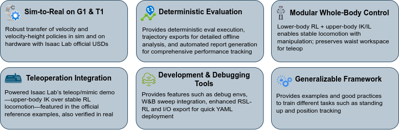
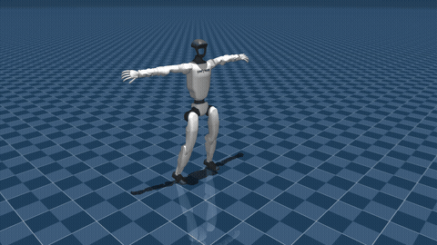
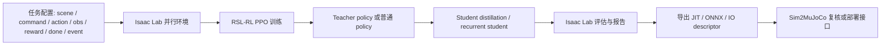
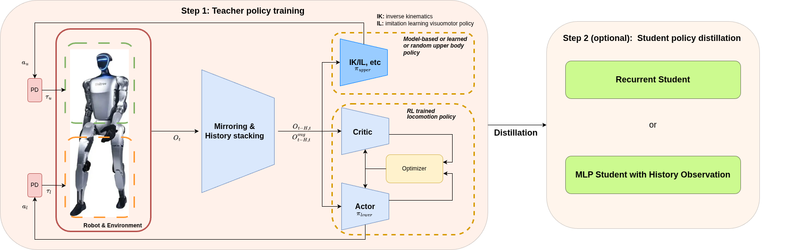
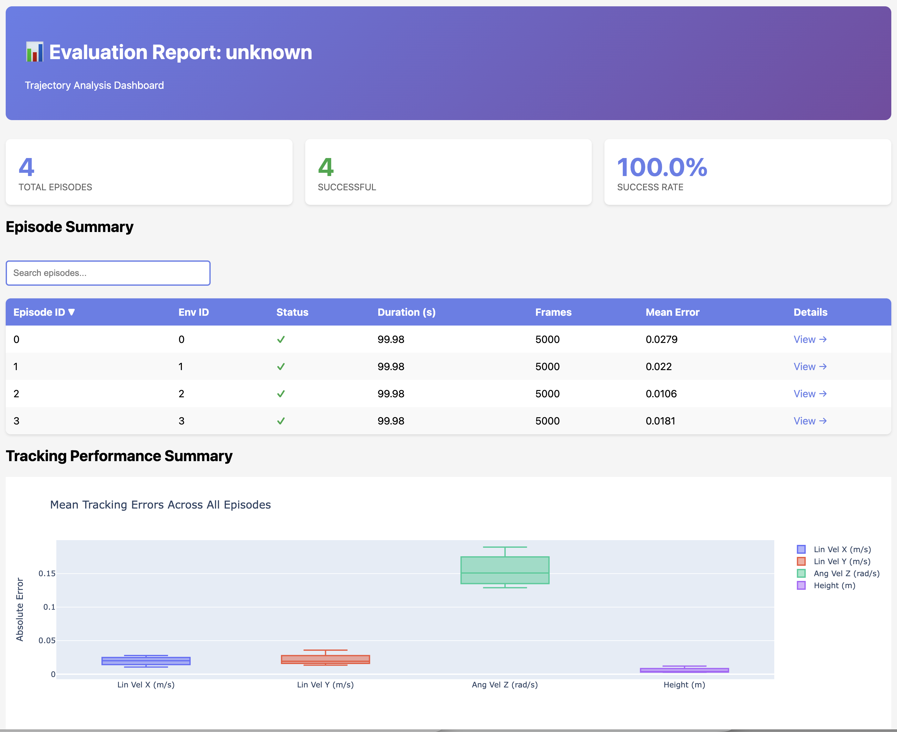
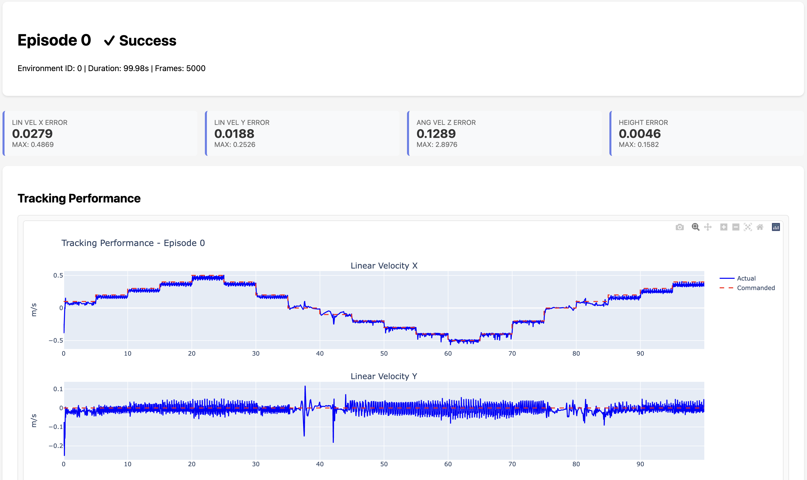

# AGILE 人形机器人 Loco-Manipulation：从论文任务到 Isaac Lab 5.1 复现

这一章带大家学习 NVIDIA Isaac 团队开源的 **AGILE: A Generic Isaac-Lab based Engine for humanoid loco-manipulation learning**。AGILE 对应论文为 **AGILE: A Comprehensive Workflow for Humanoid Loco-Manipulation Learning**，官方仓库为 [nvidia-isaac/WBC-AGILE](https://github.com/nvidia-isaac/WBC-AGILE)，论文地址为 [arXiv:2603.20147](https://arxiv.org/abs/2603.20147)。

本章不是把 AGILE 包装成“已经完成室内通用家务机器人”的系统。恰恰相反，大家要先把它的边界看清楚：AGILE 更像一套面向人形机器人的强化学习工作流，它把任务配置、PPO 训练、teacher-student 蒸馏、策略导出、评估报告和 MuJoCo 复核放在同一个工程里。论文展示的任务包括速度跟踪、高度控制、站起恢复、动作模仿和一个有限场景下的 pick-and-place，它还没有直接解决长程室内导航、开放词汇物体识别、全身避障和跨房间搬运。

学完这一章后，大家可以完成三件事：

- 理解 AGILE 论文真正验证了哪些人形机器人任务，以及这些任务为什么比“完整室内移动操作”简单；
- 在 Isaac Sim 5.1 / Isaac Lab 2.3.2 环境中复刻 AGILE 仓库，跑通 T1 velocity、G1 velocity-height 和 G1 pick-place debug 场景的短视频验证；
- 顺着源码看清楚一个 AGILE 任务如何由 scene、command、action、observation、reward、termination、event 和 agent config 组成。

## 一、AGILE 到底在解决什么问题

人形机器人强化学习很容易停留在“某个策略在仿真里能走几步”的层面。真正做复现和实机迁移时，困难通常不在 PPO 公式本身，而在这些工程细节：

- 任务配置分散在多层继承里，大家很难确认 reward、termination、action scale 到底是什么；
- actor 训练时能偷看仿真真值，但实机部署时只能拿到 IMU、关节编码器和上一时刻动作；
- checkpoint 导出后缺少清晰的 observation / action descriptor，换到 MuJoCo 或实机接口时容易发生维度、顺序和归一化错误；
- 只看随机 rollout 视频，很难判断策略是否真的跟踪了速度、高度、转向和稳定性指标；
- 同一个项目里同时有 locomotion、stand-up、motion imitation、manipulation，很容易混淆“框架支持”和“论文已经完整解决”。

AGILE 的价值在于把这些环节组织成一条可复查的流水线。它不是只给一个网络结构，而是给出一套从任务定义到评估导出的工程模板。

<p align="center">
  
</p>

**图 1 AGILE 官方任务效果总览。** 这张图把 Booster T1 和 Unitree G1 上的代表性任务放在一起，大家可以先建立直观印象：论文覆盖的是速度跟踪、站起、速度高度控制、遥操作和舞蹈模仿等技能，而不是完整室内导航抓取系统。

<p align="center"><sub>来源：NVIDIA Isaac WBC-AGILE 官方仓库 `docs/figures/agile_highlights.png`。</sub></p>

## 二、论文实际做了哪些任务

论文的任务可以分成五组。这里建议大家特别注意“任务边界”，因为 AGILE 的名字里有 loco-manipulation，但它不是现成的开放场景移动操作系统。

| 任务类别 | 机器人 | 控制目标 | 任务复杂度边界 |
| :-- | :-- | :-- | :-- |
| Velocity tracking | Booster T1 / Unitree G1 | 跟踪 `vx, vy, yaw_rate` 速度命令 | 下肢运动控制，不涉及视觉导航 |
| Velocity-height tracking | Unitree G1 | 同时跟踪速度和机身高度 | teacher-student 蒸馏，主要控制下肢 |
| Stand-up | Booster T1 / Unitree G1 | 从摔倒状态恢复站立 | 全身控制，但不是移动操作任务 |
| Motion imitation | Unitree G1 | 模仿参考动作，例如舞蹈 | 依赖参考动作数据，不是自主规划 |
| Pick-and-place / VLA 数据生成 | Unitree G1 | 在固定场景中抓取并放置物体 | 冻结下肢 locomotion，上肢跟踪轨迹或用于 VLA 数据生成 |

所以，如果大家问“能不能直接实现室内导航，然后抓起一张桌子放到另一个房间”，答案是：**原仓库不能直接做到**。AGILE 提供的是底层 locomotion、局部操作、蒸馏和评估框架。完整室内移动操作还需要再接上语义地图、定位导航、目标检测、6D pose、抓取规划、全身避障和长程状态机。

本章后面会把这个边界继续讲清楚：AGILE 可以作为人形机器人 RL 课程里的核心案例，但不要把官方 demo 误解成“已经通用家务机器人化”。

## 三、官方视频和本地复刻视频的关系

AGILE 官方仓库自带多段 GIF，这些是作者发布的论文/项目效果素材。本章把其中几段下载到本地 `assets/official_videos/`，用于学习者对照。我们本地重新跑出来的视频放在 `assets/local_videos/`，用于证明复刻环境、资产链路和脚本可以在当前 Isaac Sim 5.1 栈上跑通。

两类视频的含义不同：

- 官方视频展示论文/项目希望达到的技能效果；
- 本地 smoke-test 视频展示我们这台机器上环境创建、策略加载、渲染和短 rollout 能跑通；
- smoke test 不代表策略已经重新训练收敛，也不代表可以直接上真机。

<table>
  <tr>
    <td width="50%">
      
      <p><strong>视频 1 Booster T1 velocity tracking 官方仿真效果。</strong> 这段视频展示 T1 在仿真中跟踪速度命令，是 AGILE locomotion 任务的基础能力。</p>
      <p align="center"><sub>来源：NVIDIA Isaac WBC-AGILE 官方仓库 `docs/videos/booster_t1_vel_sim2sim.gif`。</sub></p>
    </td>
    <td width="50%">
      
      <p><strong>视频 2 Booster T1 velocity tracking 官方真机效果。</strong> 这段视频用于说明论文强调的 sim-to-real 目标，大家不要把它和本章本地短视频混为一谈。</p>
      <p align="center"><sub>来源：NVIDIA Isaac WBC-AGILE 官方仓库 `docs/videos/booster_t1_vel_sim2real.gif`。</sub></p>
    </td>
  </tr>
  <tr>
    <td width="50%">
      
      <p><strong>视频 3 Unitree G1 velocity-height 官方仿真效果。</strong> 这里展示的是 G1 同时跟踪移动速度和机身高度，背后使用 teacher-student 思路提升部署可行性。</p>
      <p align="center"><sub>来源：NVIDIA Isaac WBC-AGILE 官方仓库 `docs/videos/unitree_g1_vel_height_sim2sim.gif`。</sub></p>
    </td>
    <td width="50%">
      
      <p><strong>视频 4 Unitree G1 velocity-height 官方真机效果。</strong> 这段视频对应论文中的 G1 速度和高度控制实验。</p>
      <p align="center"><sub>来源：NVIDIA Isaac WBC-AGILE 官方仓库 `docs/videos/unitree_g1_vel_height_sim2real.gif`。</sub></p>
    </td>
  </tr>
</table>

<p align="center">
  
</p>

**视频 5 Unitree G1 pick-and-place 官方演示。** 这段视频展示的是固定桌面场景中的抓取放置效果。学习时要注意，它更接近局部场景操作和数据生成，不等同于开放室内长程导航抓取。

<p align="center"><sub>来源：NVIDIA Isaac WBC-AGILE 官方仓库 `docs/videos/g1_apple_grasp_black_sort_bin_multi_objects_no_marker_reduced.gif`。</sub></p>

<p align="center">
  
</p>

**视频 6 Unitree G1 motion imitation 官方仿真演示。** 这段视频对应论文里的 dancing / motion tracking 类任务，重点是模仿参考动作，不是自主生成舞蹈或室内任务规划。

<p align="center"><sub>来源：NVIDIA Isaac WBC-AGILE 官方仓库 `docs/videos/unitree_g1_dancing_sim.gif`。</sub></p>

## 四、AGILE 的工程流水线

AGILE 的整体结构可以理解为“任务配置 + 强化学习算法 + 评估导出 + 跨仿真复核”。



AGILE 对 Isaac Lab 的一个重要改动是：它不鼓励大家把任务写成很深的继承链，而是让每个 `*_env_cfg.py` 尽量自包含。这样学习者打开一个文件，就能看到这个任务的 scene、observation、action、reward、termination 和 curriculum。

核心目录可以这样读：

| 路径 | 学习重点 |
| :-- | :-- |
| `agile/rl_env/tasks/` | 每个任务的完整 MDP 配置和 gym 注册入口 |
| `agile/rl_env/mdp/` | 共享的 observation、reward、action、event、termination 函数 |
| `agile/rl_env/assets/robots/` | G1、T1 机器人关节名、action scale、USD 配置和 actuator 配置 |
| `agile/rl_env/rsl_rl/` | AGILE 对 RSL-RL wrapper 和 config 的适配 |
| `agile/algorithms/rsl_rl/` | fork 后的 PPO、distillation、recurrent policy 等算法实现 |
| `agile/sim2mujoco/` | 通过 IO descriptor 把策略搬到 MuJoCo 复核 |
| `scripts/train.py` | 训练入口，负责加载 task config、创建环境、创建 runner |
| `scripts/eval.py` | 评估和导出入口，支持视频、轨迹、报告、IO descriptor |
| `scripts/play.py` | 不加载策略的环境验证入口，适合做 smoke test 和 debug 视频 |

<p align="center">
  
</p>

**图 2 AGILE 上下身策略解耦示意。** 这张官方图展示了 pick-place 中非常关键的设计：下半身使用冻结的 locomotion policy 保持稳定，上半身单独学习或跟踪操作轨迹。大家做移动操作时可以借鉴这个分层思路，但也要看到它还不是完整的室内导航抓取系统。

<p align="center"><sub>来源：NVIDIA Isaac WBC-AGILE 官方仓库 `docs/figures/separate_upper_lower_body_policy_diagram.png`。</sub></p>

## 五、任务配置如何落到代码

以 locomotion 任务为例，一个 AGILE task config 通常包含以下几类配置。

### 1. Scene：机器人、地形和传感器

`SceneCfg` 会定义地形、机器人 USD、contact sensor、ray caster 和光照。比如 T1 velocity 任务会创建 rough terrain，把 `booster_t1.T1_DELAYED_DC_CFG` 放进场景，并挂上 contact force sensor 和高度测量 ray caster。

这一步解决的是“机器人在哪个世界里训练”的问题。对于做机器人强化学习的小伙伴，scene 不是装饰，它决定了接触、摩擦、地形、传感器和初始化状态。

### 2. Commands：策略要跟踪什么目标

velocity 任务的命令通常是：

```text
lin_vel_x, lin_vel_y, ang_vel_z
```

velocity-height 任务会多一个机身高度命令：

```text
lin_vel_x, lin_vel_y, ang_vel_z, base_height
```

这些命令不是网络输出，而是环境采样出来的目标。policy 的任务是根据当前 proprioception 和命令输出关节动作。

### 3. Actions：policy 输出如何变成关节目标

AGILE 常用 joint position action。policy 输出一个归一化动作向量，环境根据 joint name、action scale、default offset 和 clip 范围转换成目标关节位置。这里最容易出错的是 joint order 和 action scale，所以 AGILE 后面会导出 IO descriptor，帮助大家在 MuJoCo 或部署时对齐。

### 4. Observations：actor、critic、teacher、student 看到的信息不同

AGILE 很多任务使用 asymmetric actor-critic 或 teacher-student 设计。以 G1 velocity-height 为例：

- teacher / critic 可以使用仿真中特权信息，例如 terrain height scan；
- student policy 只使用更接近实机可用的信息，例如 IMU 相关量、关节位置速度、上一时刻动作和命令；
- recurrent student 通过 LSTM 记忆补偿缺失的特权观测。

这个设计和很多 legged locomotion 工作一脉相承：训练时借助仿真真值，部署时收敛到可用传感器。

### 5. Rewards 和 Terminations：把任务目标变成可优化信号

locomotion 任务的 reward 一般会包含：

- 线速度和角速度跟踪；
- base height / flat orientation；
- 关节力矩、速度、加速度和动作变化惩罚；
- 脚滑、脚姿态、脚间距、碰撞惩罚；
- 关节限位和 torque limit 惩罚。

termination 则负责在摔倒、非法接触、姿态过大、脚/膝距离异常或超时时结束 episode。AGILE 还扩展了 good/bad termination shaping，让终止原因影响 PPO 学习。

### 6. Events：domain randomization

AGILE 的 sim-to-real 目标很依赖事件随机化。常见随机化包括：

- 刚体摩擦、恢复系数；
- actuator stiffness / damping；
- joint friction / armature；
- body mass 和 COM；
- 外力和外力矩扰动；
- reset 时的 root pose 和 joint pose。

这些随机化不是为了让仿真更“好看”，而是为了逼策略学到对物理参数变化更鲁棒的控制规律。

## 六、Teacher-Student：为什么 G1 velocity-height 要蒸馏

G1 velocity-height 任务是 AGILE 里最值得细看的学习案例。它不是简单训练一个 MLP，而是先训练 teacher，再把 teacher 蒸馏成 deployable student。

teacher 的优势是可以看 privileged observation，例如脚下 terrain height scan。它在仿真里更容易学会如何根据地形和高度命令调整下肢。问题是这些信息在真实机器人上不一定能稳定获得。

student 的输入更接近实机可用观测。AGILE 提供两种 student：

- recurrent student：用 LSTM/GRU 从历史中记忆隐含状态；
- history student：把多帧历史堆叠后输入 MLP。

蒸馏时，student 学 teacher 的动作输出。这样最终部署时，student 不需要直接访问仿真特权信息，也能继承 teacher 的控制行为。大家以后做自己的机器人时，这个套路很常用：**teacher 负责利用仿真信息把任务学出来，student 负责把策略压回实机可用观测空间**。

## 七、Pick-and-place 为什么还不是完整室内移动操作

AGILE 的 pick-and-place 很适合教学，因为它展示了“下肢 locomotion + 上肢 manipulation”如何模块化组合。但它的任务边界也必须写清楚。

AGILE 中的 G1 pick-place 不是从任意房间自主导航到桌边，再识别任意物体，再规划全身抓取和放置。它更接近：

- 场景中已有桌子、目标物体和参考操作轨迹；
- lower-body locomotion policy 冻结，用于维持下肢稳定；
- upper-body policy 或 debug action 负责右臂、手和腰部的操作；
- 任务主要验证局部操作、轨迹跟踪和数据生成链路。

要把它扩展成室内导航抓取，大家还需要再接：

- 室内地图或 SLAM；
- 目标检测和 6D pose；
- waypoint navigation 和 approach pose 规划；
- 站姿切换和全身避障；
- 抓取规划、放置规划和失败恢复；
- 高层状态机或 VLA/VLM 任务规划。

所以这章把 AGILE 定位为“人形机器人 RL 底层技能和工程框架”，不是完整 embodied household agent。

### 完整抓取评测需要额外 checkpoint

AGILE 官方仓库随附的 `agile/data/policy/` 预训练策略主要是 velocity、velocity-height 和 lower-body 相关策略。本章复刻时没有在仓库或本地训练日志中找到 `G1-PickPlace-Tracking-v0` 的上身抓取 RL checkpoint。官方 `data-recording` 文档也把 `G1-PickPlace-Tracking-v0-Record` 的 `--checkpoint <path/to/rl/checkpoint.pt>` 写成前置条件。

因此，完整 pick-place 评测需要先获得一个训练好的 pick-place checkpoint。拿到 checkpoint 后，可以用下面的形式评测：

```bash
cd "$AGILE_ROOT"
OMNI_KIT_ACCEPT_EULA=YES \
ISAACLAB_PATH="$ISAACLAB_PATH" \
"$AGILE_PY" scripts/eval.py \
  --task G1-PickPlace-Tracking-v0 \
  --num_envs 1 \
  --headless \
  --video \
  --video_length 300 \
  --num_steps 300 \
  --checkpoint /path/to/g1_pick_place_tracking_checkpoint.pt \
  --run_evaluation \
  --save_trajectories
```

如果没有这个 checkpoint，只能完成场景 smoke test、参考轨迹可视化或官方 GIF 对照，不能声称已经跑通完整抓取评测。

## 八、本地复刻环境准备

本章使用的复刻路线是 Isaac Sim 5.1 + Isaac Lab 2.3.2。为了避免污染已有 Isaac 环境，建议大家复制一个新环境，而不是在原环境里直接 `pip install`。

下面命令使用变量表示路径。请大家按自己的机器修改：

```bash
export WORKSPACE=/path/to/06Agile-Loco-Manipulation
export ISAACLAB_PATH=$WORKSPACE/IsaacLab
export AGILE_ROOT=$WORKSPACE/WBC-AGILE
export AGILE_ENV=/path/to/envs/agile-wbc-isaac51-py311
export AGILE_PY=$AGILE_ENV/bin/python
```

### Checkpoint 1：克隆仓库和锁定 Isaac Lab

```bash
mkdir -p "$WORKSPACE"
cd "$WORKSPACE"

git clone https://github.com/nvidia-isaac/WBC-AGILE.git
git clone https://github.com/isaac-sim/IsaacLab.git

cd "$ISAACLAB_PATH"
git checkout v2.3.2
```

AGILE README 要求 Isaac Lab v2.3.2 和 Isaac Sim 5.1。大家不要把 Isaac Lab 1.x、2.0 或 Isaac Sim 4.x 混进同一个环境。

### Checkpoint 2：拉取 Git LFS 模型资产

AGILE 的预训练策略和官方媒体走 Git LFS。克隆后要执行：

```bash
cd "$AGILE_ROOT"
git lfs install
git lfs pull
git lfs ls-files
```

如果 `.pt` 或 `.onnx` 文件只有一百多字节，说明大家拿到的是 LFS pointer，不是真正权重。

本章复刻时确认的关键策略文件包括：

| 文件 | 用途 |
| :-- | :-- |
| `agile/data/policy/velocity_t1/booster_t1_velocity_v0.pt` | Booster T1 速度跟踪预训练策略 |
| `agile/data/policy/velocity_g1/unitree_g1_velocity_history.pt` | Unitree G1 velocity history 策略 |
| `agile/data/policy/velocity_height_g1/unitree_g1_velocity_height_teacher.pt` | G1 velocity-height teacher |
| `agile/data/policy/velocity_height_g1/unitree_g1_velocity_height_recurrent_student_checkpoint.pt` | G1 recurrent student 完整 checkpoint |
| `agile/data/policy/velocity_height_g1/unitree_g1_velocity_height_recurrent_student.pt` | G1 recurrent student TorchScript 导出策略 |
| `agile/data/policy/velocity_height_g1/unitree_g1_velocity_height_recurrent_student.onnx` | G1 recurrent student ONNX 导出策略 |

### Checkpoint 3：安装 AGILE 到复制环境

环境创建方式因机器而异。本章复刻时采用的是“复制已有 Isaac 5.1 micromamba 环境，再在副本里安装 AGILE”，这样不会破坏原环境。读者也可以用官方安装流程重新建环境。

```bash
cd "$AGILE_ROOT"
export ISAACLAB_PATH="$ISAACLAB_PATH"

"$AGILE_PY" -m pip install -e "$ISAACLAB_PATH/source/isaaclab"
"$AGILE_PY" -m pip install -e "$ISAACLAB_PATH/source/isaaclab_tasks"
"$AGILE_PY" -m pip install -e "$ISAACLAB_PATH/source/isaaclab_assets"
"$AGILE_PY" -m pip install -e .
```

如果启动 Isaac 时出现大量 extension cache warning，可以补装 Isaac Sim 5.1 对应的 extscache 包。这个包很大，建议先下载到共享缓存目录，校验哈希后再安装到复制环境。不要直接在原 Isaac 环境里试错。

## 九、本地 smoke test：我们跑通了什么

本章在本地生成了三段短视频。它们都不是重新训练出的最终结果，而是复现链路验证：

1. T1 velocity 预训练策略能加载并渲染短 rollout；
2. G1 velocity-height recurrent student 完整 checkpoint 能加载并渲染短 rollout；
3. G1 pick-place tracking 场景能加载并生成短视频，用于观察场景、机器人、参考轨迹 marker 和 action 链路。

### 1. T1 velocity policy 短视频

```bash
cd "$AGILE_ROOT"
OMNI_KIT_ACCEPT_EULA=YES \
ISAACLAB_PATH="$ISAACLAB_PATH" \
"$AGILE_PY" scripts/eval.py \
  --task Velocity-T1-v0 \
  --num_envs 1 \
  --headless \
  --video \
  --video_length 180 \
  --num_steps 180 \
  --checkpoint agile/data/policy/velocity_t1/booster_t1_velocity_v0.pt
```

<video controls muted preload="metadata" width="100%">
  <source src="assets/local_videos/t1_velocity_policy_smoke.mp4" type="video/mp4">
</video>

**视频 7 本地复刻：Booster T1 velocity policy smoke test。** 这段视频证明本地环境可以启动 Isaac Lab、加载 T1 预训练策略、创建场景并录制短 rollout。它不是重新训练收敛结果。

<p align="center"><sub>来源：本章本地复刻生成，命令见上方。</sub></p>

### 2. G1 velocity-height recurrent student 短视频

G1 recurrent student 的 TorchScript `.pt` 在 `eval.py` 中会触发 recurrent fallback 分支，直接作为 regular checkpoint 加载时可能失败。因此本章用完整 checkpoint 进行本地短视频验证：

```bash
cd "$AGILE_ROOT"
OMNI_KIT_ACCEPT_EULA=YES \
ISAACLAB_PATH="$ISAACLAB_PATH" \
"$AGILE_PY" scripts/eval.py \
  --task Velocity-Height-G1-Distillation-Recurrent-v0 \
  --num_envs 1 \
  --headless \
  --video \
  --video_length 120 \
  --num_steps 120 \
  --checkpoint agile/data/policy/velocity_height_g1/unitree_g1_velocity_height_recurrent_student_checkpoint.pt
```

<video controls muted preload="metadata" width="100%">
  <source src="assets/local_videos/g1_velocity_height_checkpoint_smoke.mp4" type="video/mp4">
</video>

**视频 8 本地复刻：Unitree G1 velocity-height recurrent checkpoint smoke test。** 这段视频验证完整 checkpoint 可以在本地 Isaac Lab 5.1 栈中加载和渲染。短视频只说明推理链路通了，不代表重新训练完成。

<p align="center"><sub>来源：本章本地复刻生成，命令见上方。</sub></p>

### 3. G1 pick-place tracking 场景短视频

这里使用非 Debug 的 `G1-PickPlace-Tracking-v0` 录制短视频。它仍然不是最终抓取策略评测，而是用 `scripts/play.py` 的 sinusoidal action 做场景验证；相比 Debug 配置，它不会把原始 upper-body / lower-body action 替换成 GUI action，更适合 headless 视频演示。

```bash
cd "$AGILE_ROOT"
OMNI_KIT_ACCEPT_EULA=YES \
ISAACLAB_PATH="$ISAACLAB_PATH" \
"$AGILE_PY" scripts/play.py \
  --task G1-PickPlace-Tracking-v0 \
  --num_envs 1 \
  --headless \
  --video \
  --video_length 180 \
  --num_steps 180
```

<video controls muted preload="metadata" width="100%">
  <source src="assets/local_videos/g1_pickplace_tracking_scene_smoke.mp4" type="video/mp4">
</video>

**视频 9 本地复刻：G1 pick-place tracking scene smoke test。** 这段视频用于学习 pick-place 场景加载、参考轨迹可视化和 action 链路，不代表 pick-and-place policy 已经完成闭环抓取。真正的抓取效果仍应参考官方 demo 或使用训练好的上身策略进行评估。

<p align="center"><sub>来源：本章本地复刻生成，命令见上方。</sub></p>

## 十、评估与报告：不要只看视频

AGILE 的评估设计比单纯录视频更完整。它支持两条路径：

- Isaac Lab 评估：GPU 并行 rollout，可以保存 Parquet 轨迹、metrics 和 HTML report；
- Sim2MuJoCo 评估：CPU MuJoCo 单环境复核，用同样的 YAML command schedule 检查策略跨仿真表现。

<p align="center">
  
</p>

**图 3 AGILE 官方评估报告总览图。** 这张图展示了 AGILE 评估报告中的指标汇总。学习时建议大家把 velocity tracking、height tracking、episode termination 和动作平滑指标一起看，而不是只凭视频判断策略好坏。

<p align="center"><sub>来源：NVIDIA Isaac WBC-AGILE 官方仓库 `docs/figures/evaluation_report_summary.png`。</sub></p>

<p align="center">
  
</p>

**图 4 AGILE 官方评估报告跟踪曲线。** 这类曲线能帮助大家检查命令和实际运动之间的误差，例如速度命令变化时策略是否跟得上。

<p align="center"><sub>来源：NVIDIA Isaac WBC-AGILE 官方仓库 `docs/figures/evaluation_report_tracking.png`。</sub></p>

典型 Isaac Lab 评估命令如下：

```bash
cd "$AGILE_ROOT"
OMNI_KIT_ACCEPT_EULA=YES \
ISAACLAB_PATH="$ISAACLAB_PATH" \
"$AGILE_PY" scripts/eval.py \
  --task Velocity-T1-v0 \
  --num_envs 32 \
  --checkpoint agile/data/policy/velocity_t1/booster_t1_velocity_v0.pt \
  --run_evaluation \
  --save_trajectories \
  --generate_report
```

如果要做 deterministic sweep，可以传入 AGILE 自带的 eval config：

```bash
"$AGILE_PY" scripts/eval.py \
  --task Velocity-Height-G1-v0 \
  --num_envs 16 \
  --checkpoint /path/to/model.pt \
  --run_evaluation \
  --eval_config agile/algorithms/evaluation/configs/examples/x_velocity_sweep.yaml
```

## 十一、Sim2MuJoCo：为什么要跨仿真器复核

AGILE 还提供 `agile/sim2mujoco/`，用于把导出的策略放到 MuJoCo 中跑。它的关键不是“MuJoCo 比 Isaac 更真实”，而是多一个物理后端可以帮助大家发现策略是否过度依赖某个仿真器的接触、关节、延迟或 actuator 实现。

基本流程是：

1. 从 Isaac Lab checkpoint 导出 policy 和 IO descriptor；
2. 准备机器人 MJCF，例如 Unitree 官方 `unitree_mujoco`；
3. 用同一套 command schedule 在 MuJoCo 中跑短 rollout；
4. 保存 trajectory parquet，和 Isaac Lab 输出一起分析。

示例命令：

```bash
cd "$AGILE_ROOT"

"$AGILE_PY" scripts/export_IODescriptors.py \
  --task Velocity-G1-History-v0 \
  --output_dir /path/to/exported_policy

"$AGILE_PY" scripts/sim2mujoco_eval.py \
  --checkpoint /path/to/exported_policy/policy.pt \
  --config /path/to/exported_policy/config.yaml \
  --mjcf /path/to/unitree_mujoco/unitree_robots/g1/scene_29dof.xml \
  --eval-config agile/sim2mujoco/configs/x_velocity_sweep.yaml \
  --save-data \
  --no-viewer
```

如果 MuJoCo 里明显不稳，可以先试 `--pd-scale 0.3` 降低 PD gain。这个参数不是最终答案，只是帮助大家判断不稳定是否来自控制增益和仿真器差异。

## 十二、常见问题和排查

### 1. Isaac 启动时出现很多 extscache warning

如果 warning 指向缺少 `isaacsim/extscache/.../extension.toml`，通常是 Isaac Sim 扩展缓存包没有装全。可以安装对应版本的 `isaacsim-extscache-kit`、`isaacsim-extscache-kit-sdk` 和 `isaacsim-extscache-physics`。这些包很大，建议下载后校验哈希，再装到复制环境。

### 2. Nucleus 资产路径显示为 `None/Isaac/...`

直接用 `SimulationApp` 启动时可能没有加载 Isaac Lab app 的 asset root 设置。建议使用 `isaaclab.app.AppLauncher` 或 AGILE 脚本入口，这样 `ISAAC_NUCLEUS_DIR` 和 `ISAACLAB_NUCLEUS_DIR` 会指向 Isaac 5.1 的官方 S3 资产根目录。

### 3. G1 recurrent TorchScript 直接 eval 失败

本章实测中，`unitree_g1_velocity_height_recurrent_student.pt` 会被 `eval.py` 识别为 recurrent TorchScript，然后 fallback 到 regular checkpoint 路径，导致加载失败。使用完整 checkpoint：

```text
agile/data/policy/velocity_height_g1/unitree_g1_velocity_height_recurrent_student_checkpoint.pt
```

可以完成本地短视频 smoke test。

### 4. Pick-place Debug 配置 headless 看起来不动

`G1-PickPlace-Tracking-v0-Debug` 会主动禁用原始 `upper_body_joint_pos` 和 `lower_body_joint_pos`，换成 GUI joint control、GUI object pose control 和 reward visualizer。headless 录制时没有人拖动 GUI，物体控制也没有输入，所以视频中后段会接近静止。本章最终采用非 Debug 的 `G1-PickPlace-Tracking-v0` 做本地场景视频。

### 5. smoke test 能证明什么

smoke test 能证明：

- Python 环境、Isaac Sim、Isaac Lab、AGILE import 链路可用；
- 机器人 USD 和 Nucleus 资产可以加载；
- 预训练策略或 checkpoint 可以进入推理流程；
- headless rendering 可以录出短视频。

smoke test 不能证明：

- 重新训练已经收敛；
- 策略可以直接上真机；
- pick-and-place 已经在开放室内环境中泛化；
- 室内导航、语义感知和长程任务规划已经完成。

## 十三、如何继续扩展到室内导航抓取

如果大家的目标是“室内导航 + 抓取桌上物体 + 放到另一个地方”，AGILE 可以作为底层技能库，但还需要额外系统层。

一个合理的研究路线是：

1. 先复现 `Velocity-G1-History-v0` 或 `Velocity-Height-G1-Distillation-Recurrent-v0`，得到稳定的下肢 velocity command 接口；
2. 接一个简单 waypoint follower，把导航器输出转换为 `vx, vy, yaw_rate`；
3. 复现 `G1-PickPlace-Tracking-v0`，理解 frozen lower-body policy 和 upper-body action 如何组合；
4. 用视觉模块或 VLA 生成 object pose / grasp pose / place pose；
5. 用状态机组织 `navigate -> approach -> stabilize -> reach -> grasp -> carry -> place -> recover`；
6. 再加入全身碰撞检测、手臂避障和失败重试。

也就是说，AGILE 是很好的“人形机器人 RL 底座”，但完整室内移动操作还需要导航、感知、规划和任务控制共同完成。

## 参考资料与素材来源

- 论文：Huihua Zhao 等，**AGILE: A Comprehensive Workflow for Humanoid Loco-Manipulation Learning**，arXiv:2603.20147。
- 官方仓库：[nvidia-isaac/WBC-AGILE](https://github.com/nvidia-isaac/WBC-AGILE)。
- 官方文档：[NVIDIA Isaac WBC-AGILE Documentation](https://nvidia-isaac.github.io/WBC-AGILE/)。
- Isaac Lab：[isaac-sim/IsaacLab](https://github.com/isaac-sim/IsaacLab)，本章复刻使用 v2.3.2。
- 本章官方图片和 GIF 均来自 WBC-AGILE 官方仓库 `docs/figures/` 与 `docs/videos/`，已按学习用途本地化到 `assets/official_figures/` 和 `assets/official_videos/`。
- 本章本地短视频由 AGILE 脚本在 Isaac Sim 5.1 / Isaac Lab 2.3.2 环境中生成，已保存到 `assets/local_videos/`。
