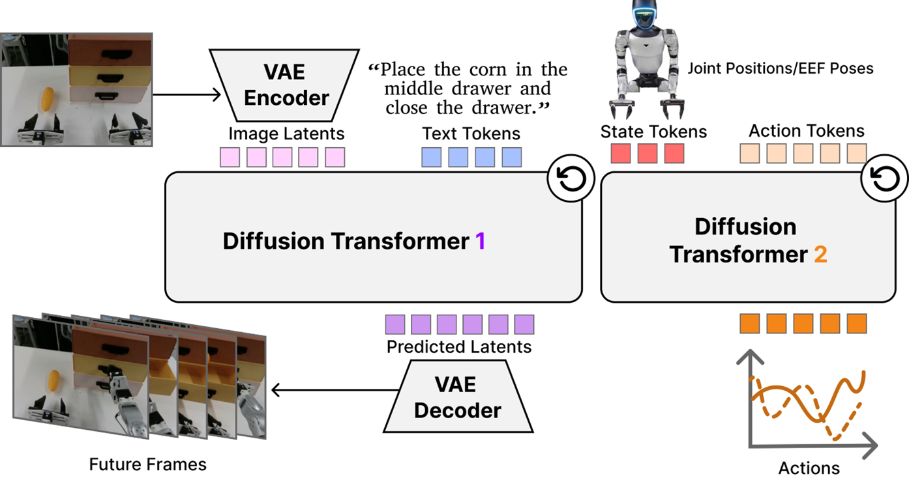
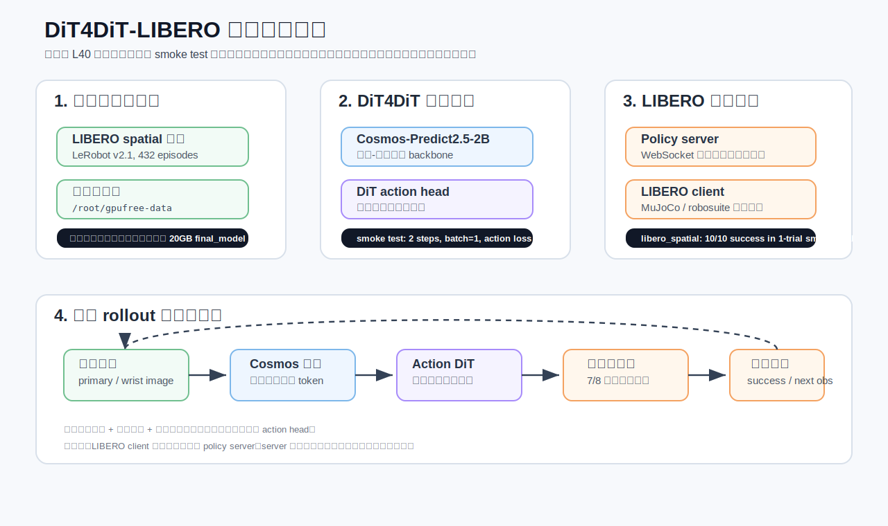
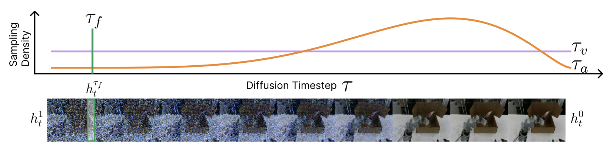

# DiT4DiT-LIBERO 训练与评估复现教程

这一章带大家完成一次 DiT4DiT 在 LIBERO 基准上的最小可复现流程：先跑通预训练模型评估，再用 `libero_spatial` 数据做 2 step 训练 smoke test。这个目标不是复刻论文级完整训练，而是让小伙伴们先把 DiT4DiT 的工程链路摸清楚：数据如何进入模型，模型服务如何连接仿真环境，训练脚本如何验证反向传播能正常工作。

本教程的实测环境是一台单卡 NVIDIA L40 服务器。最终完成了两项验证：

- `libero_spatial` 评估 smoke test：10 个任务，每个任务 1 次 rollout，成功率 `10/10`。
- `libero_spatial` 训练 smoke test：2 个 optimization steps，batch size 为 1，能够完成模型加载、数据读取、反向传播、DeepSpeed 初始化和 W&B offline 记录。

> 说明：DiT4DiT 的公开仿真复现主要依赖 LIBERO / RoboCasa 这类 MuJoCo 系环境。本章的 LIBERO 复现不需要 Isaac Sim。

建议大家把这一章当成一次“上手实验课”，不要一开始就把目标定成完整论文训练。完整训练涉及更多数据、更多 GPU、长时间稳定运行和更复杂的 checkpoint 管理；本章先把最容易出错的链路拆成几个小检查点。只要这些检查点都过了，后面再扩大数据集、增加训练步数和多卡并行，排障会轻松很多。

## 复刻路线图

小伙伴们在复刻的时候，可以按下面这条路线走。每一步都对应一个清晰的成功信号，避免“命令跑了很久，但不知道到底卡在哪里”的情况。

| 阶段 | 运行环境 | 主要目标 | 成功信号 | 失败时优先检查 |
| :-- | :-- | :-- | :-- | :-- |
| 1. 服务器准备 | Linux shell | 确认 GPU、磁盘、代理、token | `nvidia-smi` 正常，`HF_TOKEN=set` | CUDA 驱动、磁盘挂载、HF 授权 |
| 2. 模型下载 | DiT4DiT 环境 | 下载 DiT4DiT checkpoint 和 Cosmos backbone | 模型目录存在，无 `.incomplete` 文件 | Hugging Face gated 权限、代理节点 |
| 3. LIBERO 评估 | 两个环境配合 | policy server 连接 LIBERO client | `Total success rate` 打印出来 | server 端口、websockets、EGL 渲染 |
| 4. 数据准备 | DiT4DiT 环境 | 下载 `libero_spatial` 并补元数据 | dataloader 长度为 `52970` | `modality.json`、`pyarrow`、视频解码 |
| 5. 训练 smoke test | DiT4DiT 环境 | 跑通 2 step 训练链路 | 出现 `Step 1`、`Step 2`、`Training complete` | 显存、DeepSpeed、缺包、checkpoint 保存 |

这张表也可以当成排障索引：如果模型服务都没有启动，就先不要查 LIBERO 成功率；如果 dataloader 都没有建起来，就先不要查 loss 是否正常。把问题定位到具体阶段，复现效率会高很多。

## 一、DiT4DiT 在做什么

DiT4DiT 可以理解为一个面向机器人操作任务的“大模型 + 扩散动作头”框架。它用 Cosmos-Predict2.5-2B 这类视频/视觉语言 backbone 提取图像与语言条件，再用 DiT 风格的 action model 预测未来一段动作序列。

这里的名字容易让人困惑，可以拆开看：

- 第一个 `DiT` 更接近 diffusion transformer 的含义，用扩散模型思路生成连续动作。
- 第二个 `DiT` 指向这个项目的整体策略学习框架，把视频/语言 backbone 和动作扩散头接在一起。
- 在 LIBERO 任务里，它最终要输出的不是一句文本，而是机械臂下一段要执行的连续控制量。

所以大家在复刻时要抓住主线：这不是单纯跑一个语言模型，也不是只跑一个 MuJoCo 环境，而是让“视觉语言模型、动作生成头、仿真环境”三部分对齐。

在 LIBERO 任务中，模型每一步接收：

- 当前相机观测，例如主视角和腕部视角图像；
- 语言任务指令，例如 “pick up the black bowl ...”；
- 当前机器人状态；
- 训练时还会读取动作标签，用于计算 action loss。

评估时，LIBERO 仿真环境把观测发送给 policy server，policy server 返回动作，仿真环境执行动作并统计任务是否成功。

<p align="center">
  
</p>

**图 1 DiT4DiT 官方方法总览。** 这张图给出了原论文中的核心思路：先用视频扩散/视频预测模型理解视觉和语言条件，再把动作生成也组织成扩散式的 transformer 过程。大家重点看两点：第一，策略不是直接从一张图输出一个动作，而是利用历史观测、语言和时序条件生成一段动作；第二，视觉世界模型和动作扩散头之间有明确的条件传递关系。

<p align="center"><sub>来源：DiT4DiT 官方项目页 / 论文方法图。</sub></p>

官方图更适合帮助大家理解论文方法，下面这张复刻版架构图则把本章真正跑到的工程链路拆开：哪些东西在服务器磁盘上，哪些脚本在 DiT4DiT 环境里运行，哪些脚本在 LIBERO 环境里运行，以及评估时两个进程如何通信。

<p align="center">
  
</p>

**图 2 DiT4DiT-LIBERO 最小复现架构。** 左侧是训练数据和目录规划，中间是 DiT4DiT 的 Cosmos backbone 与 DiT action head，右侧是评估时的 policy server 与 LIBERO 仿真 client。图中虚线表示一次 rollout 会不断循环：观测进入模型，动作返回环境，环境产生下一帧观测。

<p align="center">
  
</p>

**图 3 DiT4DiT 的 tri-timestep 机制。** 这张官方图可以理解为 DiT4DiT 处理“时间”的细节补充：视频模型有自己的时间步，动作扩散头也有自己的去噪时间步，机器人轨迹本身还有真实控制时间。小伙伴们在复刻训练时不需要先改这个机制，但要知道 loss、采样步数和动作 horizon 的问题都和这里有关。

<p align="center"><sub>来源：DiT4DiT 官方项目页 / 论文机制图。</sub></p>

## 二、训练数据长什么样

这次只下载了 `libero_spatial_no_noops_1.0.0_lerobot` 一个数据集。它是 LeRobot 格式数据，包含 432 条 episode、约 5.3 万帧，总体约 362 MB，非常适合教学和 smoke test。

下面三个视频来自同一个训练数据目录，用来说明模型实际会看到的 LIBERO 视觉观测。第一、二列是同一个 episode 的主视角和腕部视角；第三列是另一条 episode 的主视角，用来展示任务差异。

<table>
  <tr>
    <td width="33%">
      <video controls muted preload="metadata" poster="assets/libero_spatial_episode_285_primary.png" width="100%">
        <source src="assets/libero_spatial_episode_285_primary.mp4" type="video/mp4">
      </video>
      <br>
      <strong>视频 1 主视角观测</strong><br>
      <sub>episode 285，桌面全局视角，用于观察物体和目标区域。</sub>
    </td>
    <td width="33%">
      <video controls muted preload="metadata" poster="assets/libero_spatial_episode_285_wrist.png" width="100%">
        <source src="assets/libero_spatial_episode_285_wrist.mp4" type="video/mp4">
      </video>
      <br>
      <strong>视频 2 腕部视角观测</strong><br>
      <sub>episode 285，机械臂末端视角，更关注手爪附近的局部接触。</sub>
    </td>
    <td width="33%">
      <video controls muted preload="metadata" poster="assets/libero_spatial_episode_372_primary.png" width="100%">
        <source src="assets/libero_spatial_episode_372_primary.mp4" type="video/mp4">
      </video>
      <br>
      <strong>视频 3 另一条任务轨迹</strong><br>
      <sub>episode 372，展示不同初始状态下的空间操作数据。</sub>
    </td>
  </tr>
</table>

**图 4 LIBERO spatial 训练数据的多视角视频样例。** 这些视频不是评估 rollout 的最终渲染，而是训练数据集中的演示轨迹。它们的作用是帮助大家理解模型输入：语言指令负责定义任务，视觉序列提供场景状态，动作标签提供监督信号。

## 三、服务器和目录规划

本章的一个关键原则是：大模型和 conda 环境可以复用收费共享盘，训练数据、日志和教学产物放到免费数据盘。这样既能跑通流程，又不会因为 smoke test 留下 20GB 级 checkpoint 把免费盘撑满。

| 类型 | 实测路径 | 用途 |
| :-- | :-- | :-- |
| 项目根目录 | `/root/gpufree-share/dit4dit_eval` | DiT4DiT 仓库、LIBERO 仓库、模型缓存 |
| DiT4DiT 环境 | `/root/gpufree-share/conda-envs/dit4dit` | policy server 与训练脚本 |
| LIBERO 环境 | `/root/gpufree-share/conda-envs/libero` | MuJoCo / robosuite 仿真评估 |
| 免费数据盘 | `/root/gpufree-data/dit4dit_train_test` | 单 suite 数据集、训练日志、smoke test 输出 |
| Cosmos backbone | `/root/gpufree-share/dit4dit_eval/models/Cosmos-Predict2.5-2B` | gated Hugging Face 模型 |
| DiT4DiT checkpoint | `/root/gpufree-share/dit4dit_eval/models/dit4dit-model/dit4dit_libero/final_model/pytorch_model.pt` | 预训练策略权重 |

如果大家使用自己的服务器，可以保留这个思想，但把路径换成自己的挂载盘。建议至少准备 48GB 显存做单卡评估和 smoke training。RTX 4090 也可能跑通部分流程，但 24GB 显存更容易遇到 OOM。

这里特别提醒一下磁盘规划。DiT4DiT 的模型权重、Cosmos backbone、conda 环境都比较大，适合放在空间更大的共享盘或长期盘；训练 smoke test 的数据、日志和临时输出则适合放在便宜的数据盘。小伙伴们如果直接把所有内容都塞进系统盘，很容易出现 `No space left on device`，而且这个错误常常会在 pip 安装、HF 下载或 checkpoint 保存时才暴露出来，排查起来比较浪费时间。

## 四、代理和 Hugging Face 权限

Cosmos-Predict2.5-2B 是 gated model，需要 Hugging Face 账号同意 NVIDIA 模型许可。服务器上只要保证当前 shell 能读取 `HF_TOKEN` 即可，不建议把 token 写进教程、脚本或 Git 仓库。

推荐做法是在服务器上保存一个私有 env 文件：

```bash
mkdir -p /root/.secrets
chmod 700 /root/.secrets
cat > /root/.secrets/codex_tokens.env <<'EOF'
export HF_TOKEN=hf_xxx
export HUGGING_FACE_HUB_TOKEN="$HF_TOKEN"
EOF
chmod 600 /root/.secrets/codex_tokens.env
```

然后在项目环境脚本或当前 shell 中加载：

```bash
source /root/.secrets/codex_tokens.env
```

检查 token 是否已经被当前 shell 读到时，不要直接打印 token 值。可以只检查变量是否存在：

```bash
for k in HF_TOKEN HUGGING_FACE_HUB_TOKEN; do
  v=${!k:-}
  [ -n "$v" ] && echo "$k=set" || echo "$k=missing"
done
```

如果输出是 `HF_TOKEN=set`，说明环境变量已经生效；如果还是 `missing`，先检查是不是没有 `source /root/.secrets/codex_tokens.env`，或者登录 shell 没有自动加载这个文件。

如果服务器访问 GitHub / Hugging Face 很慢，可以在远程服务器直接安装 Clash-compatible core，例如 `mihomo`。本次复现中，Hugging Face 下载曾经卡在 Xet 分片下载路径，最后通过固定较稳定代理节点，并设置下面几个环境变量恢复：

```bash
export HF_HUB_DISABLE_XET=1
export HF_HUB_ENABLE_HF_TRANSFER=0
export HF_HUB_DOWNLOAD_TIMEOUT=600
```

## 五、下载模型和数据

本章复现需要两个模型资源：

```bash
source /root/gpufree-share/dit4dit_eval/env.sh

# DiT4DiT LIBERO checkpoint
huggingface-cli download mondo-robotics/dit4dit-model \
  --local-dir /root/gpufree-share/dit4dit_eval/models/dit4dit-model

# Cosmos backbone，需要 HF gated model 权限
huggingface-cli download nvidia/Cosmos-Predict2.5-2B \
  --local-dir /root/gpufree-share/dit4dit_eval/models/Cosmos-Predict2.5-2B
```

下载完成后，建议大家立刻做两个检查：

```bash
du -sh /root/gpufree-share/dit4dit_eval/models/dit4dit-model
du -sh /root/gpufree-share/dit4dit_eval/models/Cosmos-Predict2.5-2B
find /root/gpufree-share/dit4dit_eval/models/Cosmos-Predict2.5-2B -name '*.incomplete' | wc -l
```

第一个检查确认模型确实落盘；第二个检查确认 Cosmos 目录里没有残留的 `.incomplete` 文件。如果 `.incomplete` 数量不为 0，说明下载可能被中断过，后面加载模型时很容易报 shard 缺失或 safetensors 读取错误。

训练 smoke test 只需要下载一个 LIBERO suite：

```bash
mkdir -p /root/gpufree-data/dit4dit_train_test/datasets

huggingface-cli download IPEC-COMMUNITY/libero_spatial_no_noops_1.0.0_lerobot \
  --repo-type dataset \
  --local-dir /root/gpufree-data/dit4dit_train_test/datasets/libero_spatial_no_noops_1.0.0_lerobot
```

实测下载后的目录占用如下：

```text
362M  /root/gpufree-data/dit4dit_train_test/datasets
```

只下载一个 suite 的好处是很明显的：它足够小，可以快速验证训练 dataloader；同时又是真实 LIBERO 数据，不是随便造的假样本。这样大家看到的 loss、video decode、state/action 字段映射，都和后续扩大实验时一致。

## 六、跑通 LIBERO 评估

DiT4DiT 的 LIBERO 评估一般分成两个进程：一个进程启动 policy server，另一个进程启动 LIBERO 仿真 client。为了教学方便，可以把它封装成一个脚本：

```bash
/root/gpufree-share/dit4dit_eval/scripts/run_libero_one_suite.sh \
  /root/gpufree-share/dit4dit_eval/models/dit4dit-model/dit4dit_libero/final_model/pytorch_model.pt \
  libero_spatial \
  1 \
  0
```

四个参数分别是：

| 参数 | 含义 |
| :-- | :-- |
| checkpoint path | DiT4DiT-LIBERO 预训练 checkpoint |
| task suite | 这里选择 `libero_spatial` |
| trials per task | 每个任务跑几次，smoke test 用 `1` |
| GPU id | 单卡服务器通常用 `0` |

这一步成功时，大家应该看到两个层面的信号：

- `server.log` 中出现 `server running` 和 `connection open`，说明 policy server 已经加载 checkpoint，并且 LIBERO client 能连上它。
- `eval_libero_spatial.log` 中不断出现 `Success: True` 或 `Success: False`，说明仿真环境正在执行 rollout，而不是卡在模型加载或环境初始化阶段。

本次 smoke test 的最后日志如下：

```text
Task: pick up the black bowl on the wooden cabinet and place it on the plate
Starting episode 1...
Success: True
# episodes completed so far: 10
# successes: 10 (100.0%)
Current task success rate: 1.0
Current total success rate: 1.0
Total success rate: 1.0
Total episodes: 10
```

**表 1 LIBERO spatial 评估 smoke test 结果。** 本次只用于验证链路，因此每个任务只跑 1 次。正式评估时可以把 `trials per task` 改为 `50`，但耗时会明显增加。

评估结束时可能出现 EGL 清理 warning：

```text
Exception ignored in: <function MjRenderContext.__del__ ...>
OpenGL.raw.EGL._errors.EGLError: EGL_NOT_INITIALIZED
```

这个 warning 出现在 robosuite / EGL 上下文析构阶段。只要前面已经打印 `Total success rate` 和 `Total episodes`，就说明评估本身已经完成。

如果大家的日志只停在 `server listening`，但没有 `connection open`，通常是 client 没有启动、端口写错，或者 client 环境缺包。如果 client 已经启动但一直没有任务日志，要优先检查 LIBERO 数据路径和 EGL 离屏渲染是否能初始化。

## 七、跑通 2 step 训练 smoke test

完整 DiT4DiT 训练非常重，官方脚本默认面向多卡训练。教学时更合理的目标是先证明训练链路能跑通：数据能读、模型能加载、action head 有可训练参数、loss 能反传、optimizer 能 step。

这个 2 step smoke test 证明的是“训练程序能跑”，不是“模型已经训练好了”。大家不要用这 2 step 的 loss 去判断模型效果，也不要拿这个 checkpoint 做正式评估。它的价值在于快速验证环境、数据格式、显存、DeepSpeed 和模型代码都没有明显断点。

本章使用的 smoke 脚本已经归档在：

```text
assets/logs/run_train_smoke_libero_spatial.sh
```

服务器上的执行命令是：

```bash
/root/gpufree-data/dit4dit_train_test/run_train_smoke_libero_spatial.sh 2 1
```

其中 `2` 表示训练 2 step，`1` 表示 per-device batch size 为 1。脚本做了几件关键事情：

```bash
export WANDB_MODE=offline
export HF_HOME="$FREE_ROOT/hf_cache"
export CUDA_VISIBLE_DEVICES="${CUDA_VISIBLE_DEVICES:-0}"

accelerate launch \
  --config_file DiT4DiT/config/deepseeds/deepspeed_zero2.yaml \
  --num_processes 1 \
  DiT4DiT/training/train.py \
  --datasets.vla_data.data_mix libero_spatial_only \
  --datasets.vla_data.per_device_batch_size "$BATCH" \
  --trainer.pretrained_checkpoint "$PRETRAINED" \
  --trainer.freeze_modules backbone_interface \
  --trainer.max_train_steps "$STEPS" \
  --trainer.save_interval 999999 \
  --trainer.eval_interval 999999
```

这里最重要的是三点：

1. `data_mix=libero_spatial_only`：只跑一个 suite，避免下载四个 LIBERO 数据集。
2. `freeze_modules=backbone_interface`：冻结 Cosmos backbone，只验证 action head 的训练路径。
3. `save_interval=999999`：训练过程中不保存中间 checkpoint，避免频繁写大文件。

脚本还把 `WANDB_MODE` 设置成 `offline`。这样 W&B 只在本地记录曲线和 summary，不会要求大家必须登录在线账号。对教学复现来说，这个设置更友好：先保证训练能跑，后面如果要长期实验，再把 W&B 切回 online。

训练日志中可以看到模型参数统计：

```text
Total parameters:      10,641,307,643 (10641.308M)
Trainable parameters:  163,073,544 (163.074M)
Frozen parameters:     10,478,234,099 (10478.234M)
Trainable ratio:       1.53%
```

这说明 smoke test 没有试图微调整个 10B 级参数模型，而是只训练 action model 相关参数。对于教学来说，这个设置更稳，也更节省显存。

2 step 训练完成后的关键日志如下：

```text
Total optimization steps = 2
Per device batch size = 1
len(vla_train_dataloader) = 52970

Step 1, Loss: {
  'action_dit_loss': 0.005973855499178171,
  'future_video_loss': 0.009470176883041859,
  'future_video_loss_scaled': 0.0,
  'total_loss': 0.005973855499178171
}

Step 2, Loss: {
  'action_dit_loss': 2.472470998764038,
  'future_video_loss': 0.004216373898088932,
  'future_video_loss_scaled': 0.0,
  'total_loss': 2.472470998764038
}

Training complete. Final model saved ...
```

**表 2 DiT4DiT 训练 smoke test 检查点。** 这个结果说明训练主循环已经完成两次 optimizer step。由于 step 数太少，loss 数值不代表收敛效果，只代表链路可运行。

大家也可以通过下面几个点确认训练是真的走完了，而不是只启动了模型：

- 日志中出现 `Total optimization steps = 2`，说明配置被正确覆盖。
- 日志中出现 `len(vla_train_dataloader) = 52970`，说明数据集被正确索引。
- 日志中出现 `Step 1` 和 `Step 2`，说明 dataloader、forward、backward、optimizer step 都走过。
- 最后出现 `Training complete`，说明训练主循环正常退出。

## 八、为什么训练结束后要删除 final_model

DiT4DiT 的 `_finalize_training()` 会在训练结束时保存一个完整 `final_model/pytorch_model.pt`。即使只训练 2 step，这个文件也接近 20GB。为了避免免费盘爆满，smoke 脚本默认在确认训练完成后删除这个目录：

```bash
FINAL="$RUN_ROOT/$RUN_ID/final_model/pytorch_model.pt"
if [ -f "$FINAL" ]; then
  du -sh "$RUN_ROOT/$RUN_ID" || true
  if [ "${KEEP_FINAL_MODEL:-0}" != "1" ]; then
    rm -rf "$RUN_ROOT/$RUN_ID/final_model"
    echo "Removed large final_model to keep free data disk small."
  fi
fi
```

如果大家确实想保留 checkpoint，可以这样运行：

```bash
KEEP_FINAL_MODEL=1 /root/gpufree-data/dit4dit_train_test/run_train_smoke_libero_spatial.sh 2 1
```

本次清理后的磁盘占用如下：

```text
362M  /root/gpufree-data/dit4dit_train_test/datasets
96K   /root/gpufree-data/dit4dit_train_test/logs
76K   /root/gpufree-data/dit4dit_train_test/results
```

## 九、为训练数据补充 DiT4DiT 需要的元数据

本次使用的 HF 数据集是 LeRobot v2.1 格式，原始 `meta/` 目录中没有 DiT4DiT dataloader 期望的 `meta/modality.json`。因此需要补一个字段映射文件，把 LIBERO 的 `observation.state` 和 `action` 向量拆成 DiT4DiT 代码中使用的字段名。

这个问题非常典型：数据本身是完整的，但不同项目对同一个数据集的“字段命名”和“元数据描述”不完全一致。DiT4DiT 的 dataloader 不只是读取 parquet，它还会先读 `meta/modality.json`，确认 `state.x`、`action.gripper`、`video.primary_image` 这些抽象字段分别对应原始数据里的哪一列、哪一段向量。因此这里补的不是新数据，而是让 dataloader 知道如何解释已有数据。

示例映射如下：

```json
{
  "state": {
    "x": {"start": 0, "end": 1, "absolute": true, "dtype": "float32", "original_key": "observation.state"},
    "y": {"start": 1, "end": 2, "absolute": true, "dtype": "float32", "original_key": "observation.state"},
    "z": {"start": 2, "end": 3, "absolute": true, "dtype": "float32", "original_key": "observation.state"},
    "gripper": {"start": 7, "end": 8, "absolute": true, "dtype": "float32", "original_key": "observation.state"}
  },
  "action": {
    "x": {"start": 0, "end": 1, "absolute": false, "dtype": "float32", "original_key": "action"},
    "y": {"start": 1, "end": 2, "absolute": false, "dtype": "float32", "original_key": "action"},
    "z": {"start": 2, "end": 3, "absolute": false, "dtype": "float32", "original_key": "action"},
    "gripper": {"start": 6, "end": 7, "absolute": false, "dtype": "float32", "original_key": "action"}
  },
  "video": {
    "primary_image": {"original_key": "observation.images.image"},
    "wrist_image": {"original_key": "observation.images.wrist_image"}
  },
  "annotation": {
    "human.action.task_description": {"original_key": "task_index"}
  }
}
```

第一次启动 dataloader 时，代码会自动统计 `stats_gr00t.json` 并生成 `steps_data_index.pkl`。本次统计 432 个 parquet 文件耗时很短，后续再次运行会直接读取缓存。

如果大家看到第一次运行比后续慢很多，不用紧张。第一次慢主要是在做两件事：扫描所有 parquet 文件计算统计量，以及为每个 episode 生成可采样 step 索引。只要 `meta/stats_gr00t.json` 和 `meta/steps_data_index.pkl` 生成成功，后续启动会明显快一些。

## 十、常见问题和修复

### 1. Hugging Face 返回 403

如果下载 Cosmos 时出现：

```text
403 Forbidden: not in the authorized list
```

说明当前 HF 账号还没有同意 `nvidia/Cosmos-Predict2.5-2B` 的 gated model 许可。先在 Hugging Face 模型页申请/同意许可，再重新运行下载脚本。

### 2. 下载速度突然卡住

如果模型下载停在某个 shard 很久，可以尝试：

```bash
export HF_HUB_DISABLE_XET=1
export HF_HUB_ENABLE_HF_TRANSFER=0
```

如果服务器使用 Clash-compatible 代理，建议固定一个对 Hugging Face 更稳定的节点，而不是依赖自动选择。

### 3. LIBERO 环境的 Python 版本兼容

LIBERO 环境常用 Python 3.8。如果评估 client 中出现 `list[int]` 或 `np.ndarray | float` 这类 Python 3.10 类型注解错误，可以在对应文件顶部加：

```python
from __future__ import annotations
```

这不会改变运行逻辑，只是让旧 Python 版本推迟解析类型注解。

### 4. 训练缺少轻量依赖

本次训练路径补过这些依赖：

```bash
pip install wandb numpydantic albumentations opencv-python-headless pyarrow
```

不建议一开始直接全量安装训练版 `requirements.txt`，因为它可能包含很多与 smoke test 无关的包，下载时间和失败面都会变大。

### 5. `pytorch3d` 不想编译怎么办

DiT4DiT 的通用 state/action transform 文件顶层导入了 `pytorch3d.transforms`。但 LIBERO 这条路径没有实际使用旋转表示转换。为了避免编译 `pytorch3d`，可以把导入改成懒加载：

```python
try:
    import pytorch3d.transforms as pt
except ImportError:
    pt = None
```

并在真正初始化 `RotationTransform` 时再抛出错误。这样不会影响 LIBERO smoke training。

### 6. 评估 client 的 websockets 版本问题

如果 Python 3.8 环境中的 `websockets` 版本较老，连接参数可能不兼容，例如 `ping_interval` 被底层 socket 当成未知参数。修复思路是让 client 使用兼容写法，只传当前版本支持的参数。

## 十一、大家应该保留哪些文件

开源教程里不要提交模型权重、conda 环境、HF 缓存和完整数据集。建议只保留本章这种轻量证据：

```text
05DiT4DiT-LIBERO/
  01DiT4DiT-LIBERO训练与评估.md
  assets/
    dit4dit_architecture.svg
    official_images/
      pipeline.jpg
      tri_timestep.png
    libero_spatial_episode_285_primary.mp4
    libero_spatial_episode_285_primary.png
    libero_spatial_episode_285_wrist.mp4
    libero_spatial_episode_285_wrist.png
    libero_spatial_episode_372_primary.mp4
    libero_spatial_episode_372_primary.png
    logs/
      train_smoke_libero_spatial_2steps.log
      eval_libero_spatial_1trial.log
      policy_server.log
      run_train_smoke_libero_spatial.sh
      dataset_statistics.json
```

这些文件足够支撑大家理解复现过程，同时不会把仓库变成模型或数据仓库。模型权重和数据集都可以通过脚本重新下载，教程仓库里更应该保留“怎么复现”和“复现成功是什么样”的证据。

## 十二、下一步可以怎么扩展

完成本章后，大家可以沿着三个方向继续扩展：

1. 把 `trials per task` 从 `1` 改成 `50`，跑更接近正式评估的 LIBERO spatial 成功率。
2. 下载 `libero_object`、`libero_goal`、`libero_10`，把 `libero_spatial_only` 扩展回 `libero_all`。
3. 在多卡服务器上取消 action head 的极小 smoke 设置，逐步增加 batch size、训练步数和保存频率。

本章最重要的结论是：不要一上来追求完整论文训练。先用单 suite、单卡、2 step smoke test 把环境、数据、模型和仿真链路打通，再逐步放大训练规模，排障成本会低很多。
