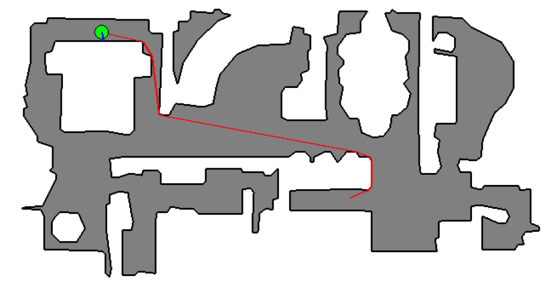
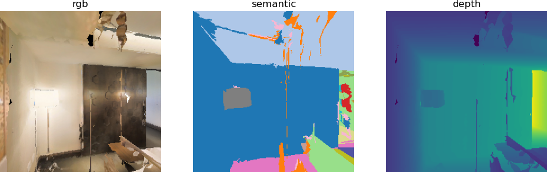
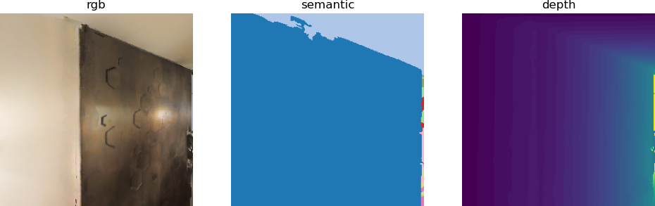
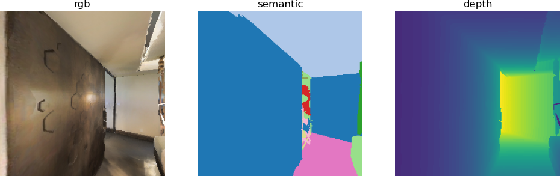

# Habitat-lab基础实践

### 在了解habitat_lab的基本环境、yaml配置以及habitat_lab基本测试后，本章中将完成从habitat-lab入门到上手这个目标，以Habitat-lab 0.2.5 版本（当前应用最广泛的稳定版）为基准，从完整的智能体Point-NAV导航到引入RL框架的智能体导航。（后续采用大语言模型做导航，不采用RL算法，RL框架仅用作环境构建，因为有一些项目也是用了RL框架但是并没有进行RL训练，所以对采用RLEnv创建任务执行环境的也做一个讲解。）

## 一、Habitat-lab的Agent全自动导航

### 在habitat_lab环境搭建及配置中，habitatlab_test.py通过键盘手动控制智能体完成 PointNav 任务，实时查看导航状态。但是智能体执行导航任务时，通常是全自动运行，也为后续的大模型导航做铺垫，因此，本节带来habitatlab_example.py文件教学，让智能体自动完成 PointNav 任务，并生成包含丰富可视化信息的导航视频。

代码的整体逻辑：

* 自定义ShortestPathFollowerAgent类（实现 Habitat 的Agent接口），内部用ShortestPathFollower工具自动计算到目标点的最短路径，无需人工干预。
* 配置了TopDownMap（俯视图）、Collisions（碰撞检测）等测量项，能可视化智能体路径、目标点、视野范围（FogOfWar）等关键信息。
* 将每一步的 RGB-D 观测、俯视图和量化指标（如到目标距离、碰撞次数）拼接成帧，最终生成视频文件并保存 / 展示。

交互方式：完全自动化，代码运行后自动完成导航和视频生成，无需人工操作。

输出形式：在指定路径保存导航视频，视频中包含视觉观测、俯视图和叠加的量化指标。

### 下面对代码进行详细的讲解

habitatlab_example.py采用的yaml文件与habitatlab_test.py一致，依旧是pointnav_habitat_test.yaml，对yaml文件还有疑惑的可以参考上一章内容：habitat_lab环境搭建及配置。

与habitatlab_test.py最大的区别是，habitatlab_example.py采用了ShortestPathFollowerAgent。

```python
class ShortestPathFollowerAgent(Agent):
    r"""Implementation of the :ref:`habitat.core.agent.Agent` interface that
    uses :ref`habitat.tasks.nav.shortest_path_follower.ShortestPathFollower` utility class
    for extracting the action on the shortest path to the goal.
    """

    def __init__(self, env: habitat.Env, goal_radius: float):
        self.env = env
        self.shortest_path_follower = ShortestPathFollower(
            sim=cast("HabitatSim", env.sim),
            goal_radius=goal_radius,
            return_one_hot=False,
        )

    def act(self, observations: "Observations") -> Union[int, np.ndarray]:
        return self.shortest_path_follower.get_next_action(
            cast(NavigationEpisode, self.env.current_episode).goals[0].position
        )

    def reset(self) -> None:
        pass
```

在初始化方法中，它接受一个habitat.Env环境对象和一个目标半径goal_radius，并创建一个ShortestPathFollower实例。act方法是 Agent 接口的核心，它从当前 episode 中获取目标位置，并调用ShortestPathFollower的get_next_action方法来决定下一步动作。

其中，最重要的是ShortestPathFollower，他位于habitat_lab库中的habitat-lab/habitat/tasks/nav/shortest_path_follower.py位置，它不是独立的智能体，而是实现最短路径导航的核心依赖，封装了底层路径规划逻辑。下面对ShortestPathFollower进行解读。

ShortestPathFollower.get_next_action中有两个组件，一个是_build_follower，另一个是_get_return_value。

* _build_follower

```python
def _build_follower(self):
    if self._current_scene != self._sim.habitat_config.scene:
        self._follower = self._sim.make_greedy_follower(
            0,
            self._goal_radius,
            stop_key=HabitatSimActions.stop,
            forward_key=HabitatSimActions.move_forward,
            left_key=HabitatSimActions.turn_left,
            right_key=HabitatSimActions.turn_right,
        )
        self._current_scene = self._sim.habitat_config.scene
```

_build_follower用于根据当前场景初始化/重建底层路径规划器，确保路径规划与场景匹配,调用 `sim.make_greedy_follower` 创建 `GreedyGeodesicFollower` 实例，绑定动作映射（前进、左转、右转、停止）和目标半径。

* _get_return_value

```python
def _get_return_value(self, action) -> Union[int, np.ndarray]:
    if self._return_one_hot:
        return action_to_one_hot(action)
    else:
        return action
```

主要用来根据 return_one_hot 参数转换动作输出格式，适配不同使用场景，但是在这个任务中设置为False，因此并没有使用。

**最终，在habitatlab_example.py的ShortestPathFollowerAgent调用的shortest_path_follower.get_next_action如下：**

```python
def get_next_action(
    self, goal_pos: Union[List[float], np.ndarray]
) -> Optional[Union[int, np.ndarray]]:
    """Returns the next action along the shortest path."""
    self._build_follower()
    assert self._follower is not None
    try:
        next_action = self._follower.next_action_along(goal_pos)
    except habitat_sim.errors.GreedyFollowerError as e:
        if self._stop_on_error:
            next_action = HabitatSimActions.stop
        else:
            raise e

    return self._get_return_value(next_action)
```

调用流程与逻辑拆解：

1） 场景适配：先调用 `_build_follower`，确保规划器与当前场景一致；

2） 路径规划调用：通过 `_follower.next_action_along(goal_pos)` 计算动作。底层 `GreedyGeodesicFollower` 会基于仿真器场景的几何信息，计算智能体当前位姿到目标点的测地最短路径，并返回路径上的第一步动作；

3） 异常处理：捕获路径规划异常，按 `stop_on_error` 策略返回动作或抛出异常；

4） 动作格式转换：调用 `_get_return_value` 转换动作格式（原始值），返回给上层。

剩下的代码都是完成可视化的任务。最终代码的实现效果如下：





其实最终生成的是一个视频，生成视频的输出路径在代码中的 `output_path = "examples/tutorials/habitat_lab_visualization/"` 可根据需要修改。


## 二、Habitat-lab基于RLEnv框架的Agent全自动导航

### 根据 habitat_rl.py，这个代码最终完成的任务与habitat_example.py一致，只不过采用的是habitat.RLEnv（强化学习环境封装类），将原生环境包裹在 RL 框架的接口下。

```python
class SimpleRLEnv(habitat.RLEnv):
    def get_reward_range(self):
        return [-1, 1]

    def get_reward(self, observations):
        return 0

    def get_done(self, observations):
        return self.habitat_env.episode_over

    def get_info(self, observations):
        return self.habitat_env.get_metrics()
```

同时，在RLEnv中，可以不采用 Agent 类封装，直接在循环中创建ShortestPathFollower实例，并手动调用get_next_action()。直接得到动作输入env环境进行动作执行。

```python
while not env.habitat_env.episode_over:
    best_action = follower.get_next_action(
        env.habitat_env.current_episode.goals[0].position
    )
    if best_action is None:
        break

    observations, reward, done, info = env.step(best_action)
```

最终可视化结果与habitatlab_example.py保持一致。（有一些可视化内容不一致，需要的可以自行添加）





参考资料：

https://github.com/facebookresearch/habitat-lab
