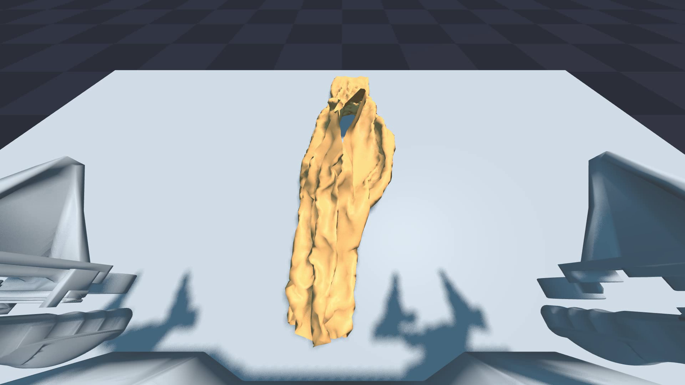
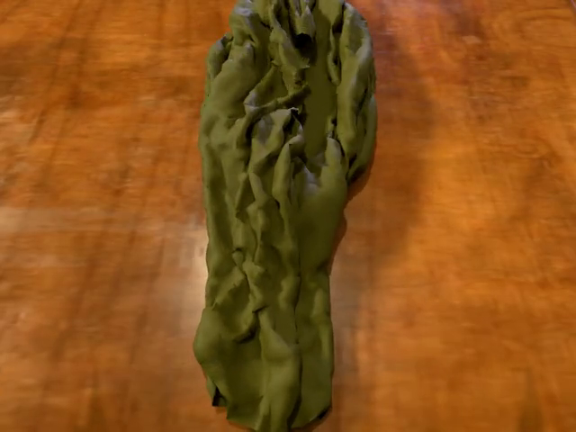
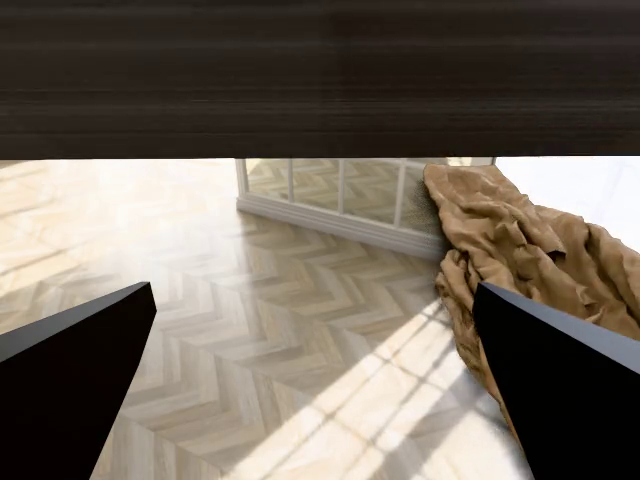
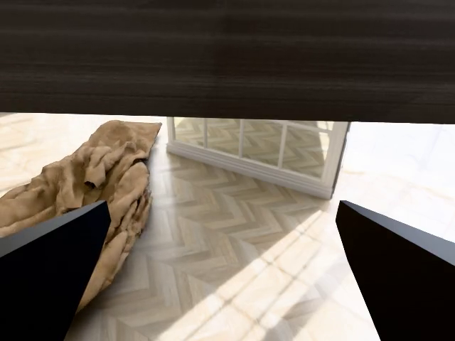

# SIM1 柔体仿真与数据生成：从遥操作到可过滤数据

SIM1 是 InternRobotics 开源的柔体操作仿真与数据生成项目，项目名全称为 **SIM1: Physics-Aligned Simulator as Zero-Shot Data Scaler in Deformable Worlds**。它面向双臂布料操作，提供从交互式遥操作、扩散策略生成轨迹、物理 replay、质量过滤，到可选高保真渲染和 LeRobot 数据转换的一条完整链路。

本章先跑通最小可复现路径。完成后，读者可以在本地看到 SIM1 的交互窗口，保存一段 replay 视频，理解 pipeline 为什么会过滤掉大量柔体轨迹，并继续把一个 smoke 样本转换成高保真渲染视频、LMDB 和 LeRobot 数据集。

## 本章会完成什么

本文使用 Windows + NVIDIA 显卡环境验证，完成以下内容：

1. 安装 SIM1 的 `sim1` Python 环境。
2. 下载运行所需的 Hugging Face 资产和示例轨迹。
3. 启动交互式双臂布料操作窗口。
4. 使用 replay 保存 `.npz`、`.usd` 和 `.mp4` 视频。
5. 运行扩散策略数据生成和完整 pipeline。
6. 解释为什么柔体轨迹通过率低，以及过滤结果如何解读。
7. 运行 `USD -> Blender -> camera/random scene -> MeisterRender -> LMDB`。
8. 把 LMDB 转换为 LeRobot v2 数据集。

SIM1 不依赖 Isaac Sim。它的实时仿真主要基于 Newton、NVIDIA Warp、MuJoCo-Warp 和 PyTorch；Isaac Sim 已安装并不会影响本教程的主流程。

## 已验证环境

本文命令在以下环境中跑通：

| 项目 | 本机验证配置 |
|---|---|
| 系统 | Windows PowerShell |
| Python | 3.11 |
| 环境管理 | micromamba，环境名 `sim1` |
| GPU | NVIDIA GeForce RTX 3060 Laptop GPU，6 GiB 显存 |
| PyTorch | `torch==2.6.0+cu124` |
| Warp | `1.13.0.dev20260417` |
| CUDA | Warp 日志显示 CUDA Toolkit 12.9，Driver 13.0 |

6 GiB 显存可以跑通 teleoperation、replay、小规模 data generation 和 97 帧 smoke 渲染。高保真渲染按帧耗时明显更高，本机 Step 4 约为 `2.6s/frame`，完整长轨迹应单独排队运行。

## 项目目录

本文假设 SIM1 仓库位于：

```powershell
C:\Users\kewei\Documents\2026\07重要学术项目\16SIM1\SIM1
```

Every Embodied 教程仓库位于：

```powershell
C:\Users\kewei\Documents\2025\04资料整理\03具身教程编写\every-embodied
```

如果你的路径不同，只需要把下面命令中的工作目录替换为自己的 SIM1 仓库根目录。

## 克隆和安装

在 Windows 上建议使用 Git Bash 执行仓库自带的 `.sh` 脚本。PowerShell 仍然可以作为主终端，只是在调用脚本时显式指定 Git Bash。

```powershell
cd C:\Users\kewei\Documents\2026\07重要学术项目\16SIM1
git clone --recurse-submodules https://github.com/InternRobotics/SIM1.git
cd SIM1

micromamba create -n sim1 python=3.11 -y
micromamba run -n sim1 "C:\Program Files\Git\bin\bash.exe" setup.sh
```

如果只想先跑仿真，不准备马上跑高保真渲染，可以跳过渲染依赖安装：

```powershell
$env:SIM1_SKIP_RENDER='1'
micromamba run -n sim1 "C:\Program Files\Git\bin\bash.exe" setup.sh
```

Windows 下如果本机 Python 用户目录里有其它包干扰，运行 SIM1 前建议加上：

```powershell
$env:PYTHONNOUSERSITE='1'
```

如果仓库路径包含中文，并且 Python 启动时报 `.pth` 文件或编码相关错误，可以把 SIM1 仓库映射到一个纯英文路径，再让 editable install 指向该路径。这个问题来自 Windows 终端和 Python site-packages 对路径编码的组合影响，不是 SIM1 本身的物理仿真错误。

## 下载资产和示例数据

SIM1 的资产和数据托管在 Hugging Face。下载前需要登录 Hugging Face 账号，读权限 token 即可。不要把 token 写进教程、代码或提交记录。

```powershell
cd C:\Users\kewei\Documents\2026\07重要学术项目\16SIM1\SIM1
$env:PYTHONNOUSERSITE='1'

micromamba run -n sim1 hf auth login
micromamba run -n sim1 "C:\Program Files\Git\bin\bash.exe" download_assets.sh
```

下载完成后，至少应该看到这些文件或目录：

```text
assets/acone/acone.urdf
assets/cloth/short-shirt.usdc
assets/model/flow_ckpt_three.pth
assets/sim_teleoperated_npz/npz/*.npz
```

本机下载并运行一次预处理后，主要目录大小约为：

| 目录 | 本机大小 |
|---|---:|
| `assets/acone` | 65.87 MB |
| `assets/cloth` | 2.49 MB |
| `assets/model` | 131.11 MB |
| `assets/sim_teleoperated_npz` | 35.74 MB |

如果后续要跑高保真渲染，还需要完整的 `assets/random/` 渲染素材。它比最小仿真资产大得多，建议确认磁盘空间后再下载。

## 第一步：启动交互式遥操作

在 SIM1 仓库根目录运行：

```powershell
cd C:\Users\kewei\Documents\2026\07重要学术项目\16SIM1\SIM1
$env:PYTHONNOUSERSITE='1'

micromamba run -n sim1 python apps\teleoperation_app.py --task lift_manip_shirt
```

启动成功后，终端会打印类似信息：

```text
Warp initialized
joint dq cnt check: 19 == 19
=== Cloth Information ===
vertices=(7021, 3), faces=(41301,)
=== Keyboard Teleoperation Controls ===
Left gripper:  W/S=front/back, A/D=left/right, Q/E=down/up, X=toggle grip
Right gripper: I/K=front/back, J/L=left/right, U/O=down/up, M=toggle grip
```

窗口中的机械臂和桌子是白色或灰色材质，这是正常现象。这个窗口是 Newton/Warp 的实时调试 viewer，不是最终的高保真渲染器。布料有颜色，机械臂和桌面使用白膜并不表示资产缺失。

退出窗口后，遥操作数据会保存到：

```text
dataset/lift_manip_shirt/<日期>/<时间>.npz
```

## 第二步：Replay 并保存视频

`replay_app.py` 会把已有 `.npz` 轨迹重新放进仿真器中执行，并保存增强后的 `.npz`、仿真 `.usd`。如果加上 `--save_video`，还会保存 OpenGL viewer 的 `.mp4` 视频。

`--save_video` 需要真实 viewer，因此必须同时加 `--no-headless`：

```powershell
cd C:\Users\kewei\Documents\2026\07重要学术项目\16SIM1\SIM1
$env:PYTHONNOUSERSITE='1'

micromamba run -n sim1 python apps\replay_app.py dataset\smoke_00000_8f.npz --folder_name tutorial_smoke --sim_substeps 4 --no-headless --save_video --fps 30
```

如果没有 `dataset\smoke_00000_8f.npz`，可以从下载的参考轨迹裁剪一个短测试文件：

```powershell
cd C:\Users\kewei\Documents\2026\07重要学术项目\16SIM1\SIM1

@'
import numpy as np
from pathlib import Path

src = Path("assets/sim_teleoperated_npz/npz/00000.npz")
dst = Path("dataset/smoke_00000_8f.npz")
dst.parent.mkdir(parents=True, exist_ok=True)

data = np.load(src, allow_pickle=True)
out = {}
for key in data.files:
    value = data[key]
    if hasattr(value, "shape") and len(value.shape) > 0 and value.shape[0] >= 8:
        out[key] = value[:8]
    else:
        out[key] = value

np.savez_compressed(dst, **out)
print(dst)
'@ | micromamba run -n sim1 python -
```

本机保存的视频如下。它来自 8 帧 smoke replay，主要用于确认 replay、USD 记录和视频保存链路已经工作，不代表最终高保真渲染质量。

<video controls muted preload="metadata" width="100%">
  <source src="assets/sim1/sim1-replay-smoke.mp4" type="video/mp4">
  当前浏览器不支持内嵌视频播放，可以直接打开 assets/sim1/sim1-replay-smoke.mp4。
</video>

对应输出目录：

```text
replay/tutorial_smoke_0001/
  npz/smoke_00000_8f.npz
  usd/smoke_00000_8f.usd
  video/smoke_00000_8f.mp4
```

终端中看到 `Video saved to: ...\video\smoke_00000_8f.mp4` 就表示视频保存成功。

## 第三步：扩散策略生成轨迹

SIM1 的 data generation 不是再做一次人工遥操作，而是从参考轨迹中提取末端位姿、切分子任务，再用模型生成新的双臂轨迹。仓库中默认 checkpoint 是：

```text
assets/model/flow_ckpt_three.pth
```

运行 2 条轨迹：

```powershell
cd C:\Users\kewei\Documents\2026\07重要学术项目\16SIM1\SIM1
$env:PYTHONNOUSERSITE='1'

micromamba run -n sim1 python apps\datagen_app.py --data_folder assets\sim_teleoperated_npz --num 2 --use_dp --mode fine
```

第一次运行时，程序会先计算 normalization stats，并把参考 `.npz` 转成末端位姿表示：

```text
Calculating normalization stats...
Processing 00000.npz...
Saved: assets\sim_teleoperated_npz\ee_pos\00000.npz
...
Saving normalization stats to: assets\sim_teleoperated_npz\ee_pos
```

这里即使 `--num 2`，也会先处理全部参考轨迹。`--num 2` 控制的是最终生成几条新轨迹，不是预处理多少个参考文件。

随后会看到模型参数量和生成进度：

```text
Number of parameters: 10279440
[INFO] processed 9 subtasks (each with several records)
[OK] saved assets\sim_teleoperated_npz\temp_trajs\000000.json
[OK] saved assets\sim_teleoperated_npz\temp_trajs\000001.json
Data Generation in Progress: 100%|...
```

生成结果默认写入：

```text
assets/sim_teleoperated_npz/gen/*.npz
```

## 第四步：运行完整 pipeline

更推荐用仓库提供的 `run_pipeline.sh`。它会串起四个阶段：

```text
Generate -> Smooth -> Replay -> Filter
```

在 Windows PowerShell 中运行：

```powershell
cd C:\Users\kewei\Documents\2026\07重要学术项目\16SIM1\SIM1
$env:PYTHONNOUSERSITE='1'

micromamba run -n sim1 "C:\Program Files\Git\bin\bash.exe" run_pipeline.sh --num 2 --workers 1
```

各阶段含义如下：

| 阶段 | 调用内容 | 输出 |
|---|---|---|
| Generate | `apps/datagen_app.py --use_dp --mode fine` | `assets/sim_teleoperated_npz/gen/*.npz` |
| Smooth | Kalman 平滑 | `assets/sim_teleoperated_npz/gen/kf/*.npz` |
| Replay | `apps/replay_app.py` 重新物理执行 | `replay/pipeline_output_0001/npz` 和 `usd` |
| Filter | 关节突变、末端可达性、布料质量过滤 | 不合格文件移动到 bad 目录 |

本机 `--num 2` 的一次输出中，前两个 replay 都执行完成，但布料质量过滤全部失败：

```text
Passed : 0 / 2
Failed : 2

Moved 2 bad USD  -> replay/pipeline_output_0001/usd_bad_cloth
Moved 2 bad NPZ  -> replay/pipeline_output_0001/npz_bad_cloth

Good trajs    : 0
```

这是柔体操作 pipeline 的正常现象。布料抓取、提升、折叠这类任务对接触、夹爪闭合、布料自碰撞和求解器稳定性都很敏感。扩散模型生成的是候选轨迹，候选轨迹还必须经过物理 replay 和质量过滤，才算可用于后续渲染或训练。

如果单条轨迹通过率不到 10%，那么只生成 2 条时全部失败的概率大约是：

```text
(1 - 0.1)^2 = 81%
```

因此 `--num 2` 更适合作为功能 smoke test，不适合判断方法效果。要获得可用样本，需要增大数量：

```powershell
micromamba run -n sim1 "C:\Program Files\Git\bin\bash.exe" run_pipeline.sh --num 20 --workers 1
```

如果只是想观察生成轨迹，不想被过滤阶段移走文件，可以临时跳过过滤：

```powershell
micromamba run -n sim1 "C:\Program Files\Git\bin\bash.exe" run_pipeline.sh --num 2 --workers 1 --skip_filter
```

## 输出目录怎么读

一次完整 pipeline 会创建类似目录：

```text
replay/pipeline_output_0001/
  npz/                    # 通过前仍保留的 replay npz
  usd/                    # 通过前仍保留的 replay usd
  npz_bad_cloth/          # 布料质量不合格 npz
  usd_bad_cloth/          # 布料质量不合格 usd
  npz_unreachable/        # 关节或末端不可达过滤结果
  cloth_filter_summary.txt
```

当过滤完成后，真正保留下来的 `npz/` 和 `usd/` 才是后续渲染的输入。如果 `Good trajs` 为 0，渲染阶段没有可处理轨迹。

## 保存视频时的常见错误

如果这样运行：

```powershell
micromamba run -n sim1 python apps\replay_app.py dataset\smoke_00000_8f.npz --save_video
```

会报错，因为默认是 headless：

```text
--save-video needs an OpenGL viewer; run with --no-headless
```

正确命令是：

```powershell
micromamba run -n sim1 python apps\replay_app.py dataset\smoke_00000_8f.npz --folder_name tutorial_smoke --no-headless --save_video
```

`run_pipeline.sh` 默认不会加 `--save_video`，所以完整 pipeline 一般只保存 `.npz` 和 `.usd`。要录制视频，可以对某个 `.npz` 单独运行 replay。

## 常见问题

### 机械臂和桌子为什么是白膜？

这是正常现象。teleoperation 和 replay 打开的窗口是实时调试 viewer，不是最终渲染结果。白色机械臂和桌面不影响物理仿真，也不表示 Isaac Sim 资产缺失。

### SIM1 对 Isaac Sim 有版本要求吗？

本教程主流程不需要 Isaac Sim。SIM1 使用 Newton、Warp、MuJoCo-Warp 和 PyTorch 完成仿真与数据生成。后续高保真渲染使用仓库的 Blender/MeisterRender 链路，而不是 Isaac Sim 版本绑定。

### Hugging Face 下载时报 `huggingface-cli` deprecated 怎么办？

新版 Hugging Face 推荐使用 `hf` 命令。可以先确认：

```powershell
micromamba run -n sim1 hf auth whoami
micromamba run -n sim1 hf download --help
```

如果旧脚本仍优先调用 `huggingface-cli`，需要把下载脚本改为优先使用 `hf download`，或者手动下载对应仓库内容到 `assets/`。

### `fatal: expected 'packfile'` 是什么？

这是 Hugging Face Git LFS sparse checkout 过程中可能出现的网络或 LFS 拉取问题。优先使用 `hf download` 方式；如果必须用 Git LFS，建议清理临时目录后重试，并确认当前账号已经获得数据集访问权限。

### pipeline 过滤失败是不是扩散模型效果差？

不能直接这样判断。过滤失败来自多个环节：扩散候选轨迹、逆运动学可达性、夹爪接触、布料求解器稳定性、布料最终姿态阈值。SIM1 的设计思路就是先生成大量候选，再用物理 replay 和质量过滤保留可用数据。

## 随机化形式速查表

SIM1 里容易混在一起的“随机化”主要分两类：一类发生在物理 replay 阶段，会改变布料初始位姿和后续物理轨迹；另一类发生在渲染 Step 3，只改变视觉外观、相机输出和训练图像。下面的表格按当前代码中实际可用的形式整理。

| 形式 | 发生阶段 | 实际随机内容 | 命令或位置 | 对数据的影响 | Smoke 预览 |
|---|---|---|---|---|---|
| 固定 replay | 物理 replay | 不启用布料位姿随机化，沿用 `.npz` 或默认布料位姿 | `apps\replay_app.py ... --no-headless --save_video` | 适合先确认轨迹、USD、视频保存链路 | <br>[视频](assets/sim1/sim1-replay-smoke.mp4) |
| 布料位姿随机化 | 物理 replay | 布料初始位置 `x/y` 在 `±2 cm` 内平移，绕 `z` 轴 yaw 在 `±15°` 内旋转 | `--position-randomize` | 会改变物理接触和过滤结果；pipeline 会先做 EE reachability，再做 aligned cloth quality | <br>[视频](assets/sim1/sim1-replay-posrand.mp4) |
| 完整渲染随机化 | 渲染 Step 3 | 随机 HDRI 背景、随机桌子模型、随机布料材质 | `components\render\main.py --step3 random` | 不改变物理轨迹；改变最终 RGB 图像和 LMDB/LeRobot 视频 | <br>[head](assets/sim1/sim1-render-head.mp4) / [left](assets/sim1/sim1-render-hand-left.mp4) / [right](assets/sim1/sim1-render-hand-right.mp4) |
| 固定桌面渲染脚本 | 渲染 Step 3 | 当前 `--step3 no_random` 脚本固定桌子对象名为 `wooden_table_02`；但代码仍会随机 HDRI 和布料材质 | `--step3 no_random`，必要时用 `SIM1_TABLE_ROOT` 限定桌子目录 | 适合减少桌面几何变化；不是完全无随机 | <br>[head](assets/sim1/sim1-render-fixed-table-head.mp4) / [left](assets/sim1/sim1-render-fixed-table-hand-left.mp4) / [right](assets/sim1/sim1-render-fixed-table-hand-right.mp4) |
| 三路相机输出 | 渲染 Step 4 / LeRobot | `head`、`hand_left`、`hand_right` 三个固定相机流 | Step 4 自动输出 `images.rgb.*` | 不是随机化；是同一轨迹的不同观察视角 | 已在上面两组渲染预览中展示 |
| 主相机 pitch 扰动 | 渲染 Step 2 | 代码里有主相机 pitch jitter，但当前 `max_pitch_noise_deg = 0.0`，默认不启用 | `components/render/step2_compute_camera_acone_yourdf.py` | 需要改代码才会改变主相机俯仰；当前没有 CLI 开关 | 本文不启用 |
| 渲染资产目录约束 | 渲染 Step 3 | 通过环境变量限制随机池，而不是新增随机项 | `SIM1_BG_ROOT`、`SIM1_TABLE_ROOT`、`SIM1_MAT_ROOT` | 可以把随机范围缩小到指定背景/桌子/材质集合 | 本文固定桌面预览使用了 `SIM1_TABLE_ROOT` |
| 语言指令 | Step 4 元信息 | 写入 `meta_info.pkl` 的语言描述 | `batch_step4.sh <session> "Fold the blue short shirt"` | 不改变视觉结果；影响 LMDB/LeRobot 中的任务文本 | 无视觉差异 |

如果只想看外观差异，优先比较 `--step3 random` 和 `--step3 no_random`。如果要看轨迹和过滤差异，比较固定 replay 和 `--position-randomize`。

## 第五步：高保真渲染与 LMDB

高保真渲染链路读取 replay session 中成对的 `npz/` 和 `usd/`，依次完成：

```text
USD -> Blender scene -> camera/random scene -> MeisterRender -> LMDB
```

渲染前需要完整的随机场景素材：

```powershell
cd C:\Users\kewei\Documents\2026\07重要学术项目\16SIM1\SIM1
$env:PYTHONNOUSERSITE='1'

micromamba run -n sim1 hf download InternRobotics/Sim1_Assets --include "assets/random/*" --local-dir .
```

本机下载后，`assets/random/` 约为 `4.1 GB`。渲染依赖如果安装时曾用 `SIM1_SKIP_RENDER=1` 跳过，需要补装：

```powershell
micromamba run -n sim1 python -m pip install bpy==4.5 yourdfpy minexr omegaconf opencv-python
```

可以先做一次导入和资产检查：

```powershell
micromamba run -n sim1 python -c "import numpy,bpy,cv2; from scripts.sim1_asset_paths import validate_render_assets; print(numpy.__version__); print(bpy.app.version_string); print(validate_render_assets())"
```

本机验证输出为：

```text
numpy 1.26.4
bpy 4.5.0
asset_problems []
```

Windows 中文路径下，Blender/USD 可能把 `.usd` 路径解析成乱码，报错类似 `unable to open stage to read ... .usd`。这种情况下不要改 USD 文件，直接把仓库复制或映射到纯英文路径再运行。Junction 仍可能被 USD 解析回真实中文路径，本机采用了最小英文副本：

```powershell
C:\sim1_ascii
```

为了快速验证渲染链路，本文使用前面 8 帧 replay 生成的 smoke session，而不是 1378 帧长轨迹：

```text
replay/render_smoke_0001/
  npz/000000.npz
  usd/000000.usd
```

先运行 Steps 1-3：

```powershell
cd C:\sim1_ascii
$env:PYTHONNOUSERSITE='1'

micromamba run -n sim1 python components\render\main.py --root_dir replay\render_smoke_0001 --step3 random --language_instruction "Fold the blue short shirt"
```

关键输出包括：

```text
USD import completed successfully
Frame range: 0 - 97
Selected BG: brown_photostudio_06_2k.exr
Table: ClassicNightstand_01_1k.gltf
Mat: polar_fleece_1k.gltf
Scene saved to replay\render_smoke_0001\blend_out\000000\*.blend
```

再运行 MeisterRender Step 4：

```powershell
micromamba run -n sim1 "C:\Program Files\Git\bin\bash.exe" components/render/batch_step4.sh replay/render_smoke_0001 "Fold the blue short shirt" 0 1
```

本机 3060 Laptop GPU 上，Step 4 处理 `97` 帧、`3` 个相机，约 `4 分 50 秒` 完成，日志会显示：

```text
OPTIX device: NVIDIA GeForce RTX 3060 Laptop GPU: True
Path tracing 97 frames × 3 cameras
Writing LMDB / MP4 under replay\render_smoke_0001\out_updated\000000
Saved: ... (lmdb/, meta_info.pkl, */demo.mp4)
```

输出目录如下：

```text
replay/render_smoke_0001/out_updated/000000/
  lmdb/data.mdb
  meta_info.pkl
  images.rgb.head/demo.mp4
  images.rgb.hand_left/demo.mp4
  images.rgb.hand_right/demo.mp4
```

下面三段视频来自同一个 smoke 样本的三个相机视角。它们用于验证渲染、LMDB 写入和相机数据链路，不代表完整训练集质量。


<video controls muted preload="metadata" width="100%">
  <source src="assets/sim1/sim1-render-head.mp4" type="video/mp4">
  当前浏览器不支持内嵌视频播放，可以直接打开 assets/sim1/sim1-render-head.mp4。
</video>



<video controls muted preload="metadata" width="100%">
  <source src="assets/sim1/sim1-render-hand-left.mp4" type="video/mp4">
  当前浏览器不支持内嵌视频播放，可以直接打开 assets/sim1/sim1-render-hand-left.mp4。
</video>



<video controls muted preload="metadata" width="100%">
  <source src="assets/sim1/sim1-render-hand-right.mp4" type="video/mp4">
  当前浏览器不支持内嵌视频播放，可以直接打开 assets/sim1/sim1-render-hand-right.mp4。
</video>

## 第六步：LMDB 转 LeRobot v2

`components/lmdb2lerobot/run_local.sh` 会把 Step 4 的 `out_updated/` 转为 LeRobot v2 数据集，并默认继续执行 sim2real parquet 后处理和静态帧删除。smoke 验证时可以保留全部帧：

```powershell
cd C:\sim1_ascii

micromamba run -n py310-lerobot "C:\Program Files\Git\bin\bash.exe" components/lmdb2lerobot/run_local.sh --src ./replay/render_smoke_0001/out_updated --out ./replay/render_smoke_0001/lerobot_dataset --keep-static-frames
```

如果环境缺少 `lmdb`、`scipy` 等依赖，先安装仓库提供的依赖文件：

```powershell
micromamba run -n py310-lerobot python -m pip install -r C:\sim1_ascii\components\lmdb2lerobot\requirements.txt
```

本机转换日志显示：

```text
Found 1 episode(s)
total_steps: [97, 97, ...]
Finished episode .../out_updated/000000
counter_episodes_uncomplete: 0
Step 2: sim2real (parquet)
Skipped remove_static_frames (--keep-static-frames)
Done. LeRobot dataset: .../lerobot_dataset
```

转换后的目录结构：

```text
replay/render_smoke_0001/lerobot_dataset/
  data/chunk-000/episode_000000.parquet
  videos/chunk-000/images.rgb.head/episode_000000.mp4
  videos/chunk-000/images.rgb.hand_left/episode_000000.mp4
  videos/chunk-000/images.rgb.hand_right/episode_000000.mp4
  meta/info.json
  meta/episodes.jsonl
  meta/tasks.jsonl
```

本次 smoke 数据集共 `1` 个 episode、`97` 帧。`meta/info.json` 已随教程保存到 `assets/sim1/sim1-lerobot-info.json`，用于记录这次转换出的 LeRobot 元信息。

## 后续方向

跑通本文后，主要继续做三件事：

1. 增大 `--num`，观察过滤通过率和失败类型。
2. 对通过过滤的长轨迹运行渲染；如果路径含中文，优先在纯英文路径下运行 Blender/USD。
3. 去掉 `--keep-static-frames`，用默认静态帧删除流程生成更接近训练使用的数据集。

## 参考链接

- SIM1 GitHub: https://github.com/InternRobotics/SIM1
- SIM1 Project Page: https://internrobotics.github.io/sim1.github.io/
- SIM1 arXiv: https://arxiv.org/abs/2604.08544
- Newton: https://newton-physics.github.io/newton/
- NVIDIA Warp: https://nvidia.github.io/warp/
