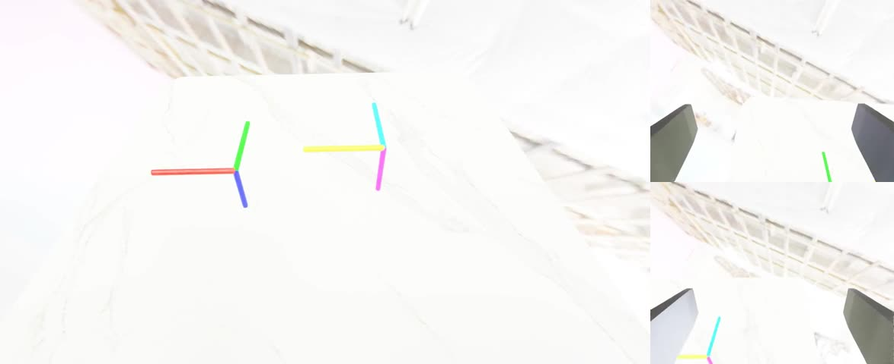
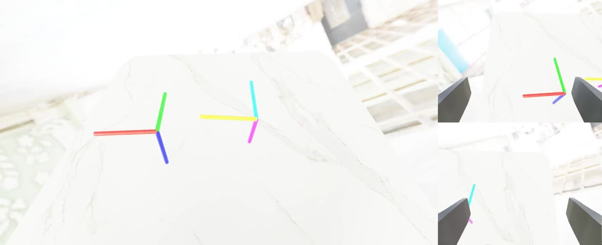
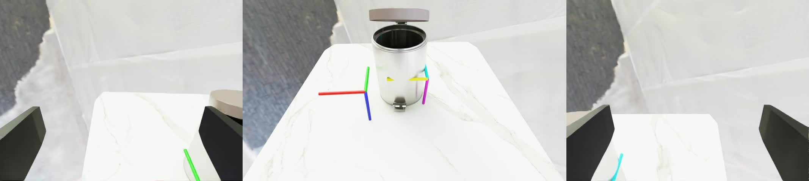

# 不下载 200GB 资产，也能体验 InternDataEngine：一份小空间复现实战教程

InternDataEngine 是 InternVerse 具身数据平台里的数据合成引擎。官方文档覆盖了安装、Quick Start、Workflow、Skills、Objects、Cameras、Robots、Controllers、Domain Randomization、Assets 和 Training 等完整链路，但如果只是想先“摸一遍功能”，直接下载 full assets 并跑完整任务库并不划算。

本文走一条更轻量的路线：不下载约 200GB 的完整资产包，只使用仓库自带的小资产、必要的 CuRobo / Drake 依赖，以及一个约 1MB 的铰接垃圾桶资产，尽可能覆盖 InternDataEngine 的核心能力，并生成可以直接嵌入 Markdown 的三视角视频。

这篇教程适合三类读者：

- 想快速确认当前服务器能不能跑 InternDataEngine；
- 想给课程、汇报或博客准备可视化 demo；
- 想理解 InternDataEngine 的配置、技能、相机、随机化和数据输出链路，但暂时不想拉取 full assets。

本文不会声称已经完整跑通官方 Pick / Place / Open 全任务。它们在小资产路线下进入了相应规划阶段，但仍需要进一步调约束和位姿。本文的重点是：用最小空间先把平台主链路跑起来，把能稳定展示的功能做成素材。

## 最终效果预览

本文整理了 4 组本地渲染视频，全部放在本文同级目录的 `assets/` 下。

### 目标跟踪：Workflow、机器人、控制器、三路相机

<video controls muted preload="metadata" width="100%">
  <source src="assets/track_three_views.mp4" type="video/mp4">
</video>

[打开视频：assets/track_three_views.mp4](assets/track_three_views.mp4)



### 控制技能组合：关节、夹爪、轨迹跟踪

<video controls muted preload="metadata" width="100%">
  <source src="assets/control_mix_three_views.mp4" type="video/mp4">
</video>

[打开视频：assets/control_mix_three_views.mp4](assets/control_mix_three_views.mp4)


### 物体与 Domain Randomization：物体类别、姿态、光照和相机扰动

<video controls muted preload="metadata" width="100%">
  <source src="assets/object_dr_three_views.mp4" type="video/mp4">
</video>

[打开视频：assets/object_dr_three_views.mp4](assets/object_dr_three_views.mp4)



### 小资产铰接物体：ArticulatedObject 加载与渲染

<video controls muted preload="metadata" width="100%">
  <source src="assets/articulation_three_views.mp4" type="video/mp4">
</video>

[打开视频：assets/articulation_three_views.mp4](assets/articulation_three_views.mp4)



## 本文会复现什么

完成本文后，你会得到以下结果：

- 一个本地教程 Markdown：
  `docs_artifacts/InternDataEngine_小空间功能体验教程.md`
- 一个本地视频资产目录：
  `docs_artifacts/assets/`
- 四组可嵌入 Markdown 的三视角视频；
- 四个可复跑的本地最小任务配置；
- 对当前环境中必要兼容补丁的清晰说明；
- 一份关于 Pick / Place / Open 当前状态的如实记录。

这条路线实际覆盖了：

- `simbox_plan_and_render` Workflow；
- YAML 任务配置；
- Split ALOHA 机器人加载；
- CuRobo 控制链路；
- `track`、`joint__ctrl`、`gripper__action` 技能；
- `RigidObject`、`GeometryObject`、`ArticulatedObject`；
- 头部相机、左腕相机、右腕相机；
- 光照、物体、姿态和相机随机化；
- LMDB、`meta_info.pkl`、MP4 视频导出。

## 目录约定

本文默认项目位于：

```bash
/root/gpufree-data/InternDataEngine
```

Isaac Sim Python 位于：

```bash
/isaac-sim/python.sh
```

辅助资产目录位于：

```bash
/root/gpufree-share/internverse_assets
```

进入项目根目录：

```bash
cd /root/gpufree-data/InternDataEngine
```

后文所有命令都默认从这个目录执行。


本文记录如何在一台已经预装 Isaac Sim 的服务器上，用尽量少的磁盘空间体验 InternDataEngine 的核心功能，并生成可以嵌入 Markdown 的多视角视频素材。

本教程的目标不是复现官方完整任务库，也不是下载约 200GB 的 full assets，而是用小资产覆盖以下能力：

- Workflow：`simbox_plan_and_render` 端到端执行
- YAML Config：任务、机器人、相机、技能、资产配置
- Robots / Controllers：Split ALOHA 机器人与 CuRobo 控制器
- Skills：`track`、`joint__ctrl`、`gripper__action`
- Objects：刚体、几何物体、铰接物体
- Cameras：头部相机、左右腕部相机
- Domain Randomization：光照、物体类别、物体姿态、相机扰动
- Data Output：LMDB、`meta_info.pkl`、三路 MP4 视频
- Articulation：用约 1MB 的小垃圾桶资产验证 `ArticulatedObject` 加载与显示

运行完成后，读者会得到一组本地视频，可直接插入 Markdown、课程文档或项目报告。

## 1. 本教程产物

教程文件位于：

```bash
/root/gpufree-data/InternDataEngine/docs_artifacts/InternDataEngine_小空间功能体验教程.md
```

视频和封面图放在同级 `assets/` 目录：

```bash
/root/gpufree-data/InternDataEngine/docs_artifacts/assets/
```

当前已经整理好的素材包括：

```bash
assets/track_three_views.mp4
assets/control_mix_three_views.mp4
assets/object_dr_three_views.mp4
assets/articulation_three_views.mp4
```

这些视频都是由 InternDataEngine 本地渲染生成，不是外链素材。

## 2. 先回答：改了哪些 Isaac Sim / InternDataEngine API

这次没有修改 Isaac Sim 本体，也没有改 `/isaac-sim` 安装目录里的接口实现。实际改动发生在当前工作区的 InternDataEngine 代码里，目的是让官方代码能在当前环境的 Isaac Sim 5.1、Python 3.11、Torch 2.7、Drake 新 API 下继续运行。

### 2.1 保留 `arena_file`，避免重复 reset 丢配置

文件：

```bash
/root/gpufree-data/InternDataEngine/workflows/simbox_dual_workflow.py
```

修改前，workflow 在 reset 过程中会执行：

```python
self.task_cfg.pop("arena_file", None)
```

这会导致同一个 pipeline 中再次 reset 时，配置里的 `arena_file` 被删掉，后续 arena 加载得到 `None`。在本地多技能、小任务 smoke test 中，这个问题会表现为场景 reset 失败。

当前补丁改为保留 `arena_file`：

```python
# Keep arena_file available because the same task_cfg can be reset more
# than once inside the local plan-and-render pipeline.
self.task_cfg.pop("camera_file", None)
self.task_cfg.pop("logger_file", None)
```

这是对 InternDataEngine workflow 状态管理的兼容修复，不是 Isaac Sim API 修改。

### 2.2 兼容 Drake 的 `MultibodyPlantConfig`

文件：

```bash
/root/gpufree-data/InternDataEngine/workflows/simbox/solver/planner_utils.py
```

官方代码假设 `pydrake.multibody.plant.MultibodyPlantConfig` 支持 `discrete_contact_solver` 参数：

```python
MultibodyPlantConfig(
    time_step=time_step,
    discrete_contact_solver=discrete_contact_solver,
)
```

当前环境里的 Drake 版本没有这个字段，会报：

```text
AttributeError: 'pydrake.multibody.plant.MultibodyPlantConfig' object has no attribute 'discrete_contact_solver'
```

补丁采用新旧 API 兼容写法：

```python
try:
    multibody_plant_config = MultibodyPlantConfig(
        time_step=time_step,
        discrete_contact_solver=discrete_contact_solver,
    )
except AttributeError:
    multibody_plant_config = MultibodyPlantConfig(time_step=time_step)
```

### 2.3 兼容 Drake Parser 的 `AddModels`

同一个文件：

```bash
/root/gpufree-data/InternDataEngine/workflows/simbox/solver/planner_utils.py
```

官方代码使用旧接口：

```python
parser.AddModelFromFile(franka_combined_path)
```

当前 Drake 版本中这个接口不存在，会报：

```text
AttributeError: 'pydrake.multibody.parsing.Parser' object has no attribute 'AddModelFromFile'
```

补丁增加了一个兼容函数：

```python
def add_model_from_file(parser, model_path):
    if hasattr(parser, "AddModelFromFile"):
        return parser.AddModelFromFile(model_path)
    return parser.AddModels(model_path)[0]
```

然后把 `AddR5a`、`AddPiper`、`AddFranka` 里的调用改成：

```python
franka = add_model_from_file(parser, franka_combined_path)
```

### 2.4 结论

这次确实改了 InternDataEngine 官方仓库里的代码，但都是小范围兼容补丁：

- 没改 Isaac Sim 本体
- 没改官方任务逻辑的大结构
- 没有把失败任务强行判成功
- 补丁主要解决当前运行环境和官方代码版本之间的 API 差异

如果后续切换到官方推荐的 Isaac Sim / Python / Drake 组合，这些补丁可能不再必要；但保留它们通常也不会影响旧 API，因为补丁采用的是兼容分支。

## 3. 环境

本教程基于以下路径组织：

```bash
/root/gpufree-data/InternDataEngine
/isaac-sim/python.sh
/root/gpufree-share/internverse_assets
```

开始前进入仓库：

```bash
cd /root/gpufree-data/InternDataEngine
```

检查 Isaac Sim Python 是否存在：

```bash
test -x /isaac-sim/python.sh && echo "Isaac Sim python found"
```

检查 GPU：

```bash
nvidia-smi
```

检查当前仓库状态：

```bash
git status --short
```

本教程里的 demo 不要求下载完整 200GB assets。当前使用的是：

- 仓库自带 `workflows/simbox/example_assets`
- 已下载的 `workflows/simbox/curobo`
- 已下载的 `workflows/simbox/panda_drake`
- 单独补充的 1MB 级铰接垃圾桶资产

## 4. 本地文档镜像

官方文档已镜像到本地：

```bash
/root/gpufree-data/internverse-docs-mirror/internrobotics.github.io/InternDataEngine-Docs/index.html
```

可以用浏览器打开这个 HTML，离线查看 Installation、Quick Start、Workflow、Skills、Objects、Cameras、Robots、Controllers、Domain Randomization、Assets、Training 等页面。

如果需要重新镜像官方文档，可使用类似命令：

```bash
cd /root/gpufree-data
wget \
  --mirror \
  --convert-links \
  --adjust-extension \
  --page-requisites \
  --no-parent \
  https://internrobotics.github.io/InternDataEngine-Docs/
```

镜像完成后入口通常在：

```bash
internrobotics.github.io/InternDataEngine-Docs/index.html
```

## 5. 小空间任务配置

本教程新增的任务配置都放在：

```bash
workflows/simbox/core/configs/tasks/example/
```

主要文件如下：

```bash
workflows/simbox/core/configs/tasks/example/track_the_targets.yaml
workflows/simbox/core/configs/tasks/example/local_control_mix.yaml
workflows/simbox/core/configs/tasks/example/local_object_dr_showcase.yaml
workflows/simbox/core/configs/tasks/example/local_articulation_showcase.yaml
workflows/simbox/core/configs/tasks/example/local_pick_left.yaml
workflows/simbox/core/configs/tasks/example/local_pick_place_right.yaml
workflows/simbox/core/configs/tasks/example/local_open_trashcan.yaml
```

其中已稳定生成视频的四个任务是：

- `track_the_targets.yaml`
- `local_control_mix.yaml`
- `local_object_dr_showcase.yaml`
- `local_articulation_showcase.yaml`

`local_pick_left.yaml`、`local_pick_place_right.yaml`、`local_open_trashcan.yaml` 是进一步验证 Pick / Place / Open skill 的尝试配置，目前还需要调规划约束，本文后面会说明现象。

## 6. Demo 1：Track The Targets

这个 demo 用 Split ALOHA 双臂执行简单目标跟踪，主要验证 workflow、YAML、机器人、控制器、相机、渲染和 LMDB 写出。

运行命令：

```bash
cd /root/gpufree-data/InternDataEngine
bash scripts/simbox/simbox_plan_and_render.sh \
  workflows/simbox/core/configs/tasks/example/track_the_targets.yaml \
  1 \
  9
```

参数含义：

- 第一个参数：任务 YAML
- 第二个参数 `1`：生成 1 条随机样本
- 第三个参数 `9`：随机种子

成功后，输出目录类似：

```bash
output/track_the_targets_plan_and_render_seed_9/
```

可以查找视频：

```bash
find output/track_the_targets_plan_and_render_seed_9 \
  -type f -name 'demo.mp4' -print
```

本教程整理后的展示视频如下。

<video controls muted preload="metadata" width="100%">
  <source src="assets/track_three_views.mp4" type="video/mp4">
</video>

如果当前 Markdown 渲染器不支持 HTML video 标签，可直接打开：

[assets/track_three_views.mp4](assets/track_three_views.mp4)

预览帧：


这个 demo 证明当前环境可以完成：

- Isaac Sim 启动
- SimBox workflow 执行
- Split ALOHA 加载
- CuRobo 规划
- 三路相机渲染
- LMDB 数据写出
- MP4 导出

## 7. Demo 2：Control Mix

这个 demo 组合了多个低成本控制技能，用于展示技能系统和控制器命令链路。

运行命令：

```bash
cd /root/gpufree-data/InternDataEngine
bash scripts/simbox/simbox_plan_and_render.sh \
  workflows/simbox/core/configs/tasks/example/local_control_mix.yaml \
  1 \
  24
```

注意技能名：

```yaml
name: joint__ctrl
name: gripper__action
name: track
```

这里 `joint__ctrl` 和 `gripper__action` 是当前代码注册出来的名字，中间是双下划线。若写成 `joint_ctrl` 或 `gripper_action`，会出现技能注册名找不到的问题。

展示视频：

<video controls muted preload="metadata" width="100%">
  <source src="assets/control_mix_three_views.mp4" type="video/mp4">
</video>

直接链接：

[assets/control_mix_three_views.mp4](assets/control_mix_three_views.mp4)

预览帧：


这个 demo 覆盖：

- `joint__ctrl`
- `gripper__action`
- `track`
- dual-arm controller
- head / left wrist / right wrist 三路视频

## 8. Demo 3：Objects 与 Domain Randomization

这个 demo 使用小资产包里的垃圾分类物体和垃圾桶，展示物体加载、类别随机化、物体姿态随机化、光照随机化、相机扰动和 retry 行为。

运行命令：

```bash
cd /root/gpufree-data/InternDataEngine
bash scripts/simbox/simbox_plan_and_render.sh \
  workflows/simbox/core/configs/tasks/example/local_object_dr_showcase.yaml \
  1 \
  41
```

任务中使用的资产根目录是：

```yaml
asset_root: workflows/simbox/example_assets
```

配置中启用了类似字段：

```yaml
env_map:
  apply_randomization: True
  intensity_range: [2500, 7500]
  rotation_range: [0, 180]
```

刚体物体部分启用：

```yaml
apply_randomization: True
randomization_scope: category
orientation_mode: random
optimize_2d_layout: True
```

展示视频：

<video controls muted preload="metadata" width="100%">
  <source src="assets/object_dr_three_views.mp4" type="video/mp4">
</video>

直接链接：

[assets/object_dr_three_views.mp4](assets/object_dr_three_views.mp4)

预览帧：


这个 demo 覆盖：

- `RigidObject`
- `GeometryObject`
- object category randomization
- random yaw / pose
- environment lighting randomization
- camera pose randomization
- invalid layout / planning retry
- 三路视频与 LMDB 输出

## 9. Demo 4：小资产 ArticulatedObject

完整 Articulation 任务通常需要较多铰接资产。这里没有下载 full assets，而是只补了一个很小的垃圾桶资产：

```bash
workflows/simbox/example_assets/art/trashcan/trashcan_0001
```

这个目录约 1MB，包含：

```bash
instance.usd
Kps/open_h/info.json
Kps/open_h/keypoints.json
Kps/open_h/keypoints_final.json
Kps/close_h/info.json
Kps/close_h/keypoints.json
Kps/close_h/keypoints_final.json
```

运行展示任务：

```bash
cd /root/gpufree-data/InternDataEngine
bash scripts/simbox/simbox_plan_and_render.sh \
  workflows/simbox/core/configs/tasks/example/local_articulation_showcase.yaml \
  1 \
  52
```

展示视频：

<video controls muted preload="metadata" width="100%">
  <source src="assets/articulation_three_views.mp4" type="video/mp4">
</video>

直接链接：

[assets/articulation_three_views.mp4](assets/articulation_three_views.mp4)

预览帧：


这个 demo 覆盖：

- `ArticulatedObject` 加载
- `info_name: open_h` 对应的 keypoint metadata 加载
- `joint_position_range` 初始化关节角
- `fix_base: True` 固定铰接物体底座
- 铰接物体放置到桌面
- 随机光照和相机扰动
- 三路视频导出

注意：这个 demo 是 ArticulatedObject 可视化与数据链路展示，不等价于 open skill 成功开盖。

## 10. 输出数据结构

每个成功任务通常会生成类似结构：

```bash
output/<task_name>_plan_and_render_seed_<seed>/
└── BananaBaseTask/
    └── split_aloha/
        └── <task_dir>/
            └── <collect_info>/
                └── <timestamp>/
                    ├── lmdb/
                    │   ├── data.mdb
                    │   └── info.json
                    ├── meta_info.pkl
                    ├── images.rgb.head/
                    │   └── demo.mp4
                    ├── images.rgb.hand_left/
                    │   └── demo.mp4
                    └── images.rgb.hand_right/
                        └── demo.mp4
```

查看某个任务输出：

```bash
find output/local_articulation_showcase_plan_and_render_seed_52 \
  -type f \
  \( -name 'demo.mp4' -o -name 'data.mdb' -o -name 'meta_info.pkl' \) \
  -print
```

查看视频信息：

```bash
ffprobe -v error \
  -select_streams v:0 \
  -show_entries stream=width,height,duration \
  -of default=nw=1 \
  docs_artifacts/assets/articulation_three_views.mp4
```

本地 articulation showcase 拼接视频的实际信息为：

```text
width=2134
height=480
duration=14.666667
```

## 11. 如何整理视频到 Markdown 的 assets 目录

下面命令把三视角拼接视频复制到教程同级的 `assets/` 目录。

```bash
cd /root/gpufree-data/InternDataEngine
mkdir -p docs_artifacts/assets

cp docs_artifacts/videos/track_the_targets/seed9_three_views.mp4 \
  docs_artifacts/assets/track_three_views.mp4
cp docs_artifacts/videos/track_the_targets/seed9_three_views.jpg \
  docs_artifacts/assets/track_three_views.jpg

cp docs_artifacts/videos/control_mix/three_views.mp4 \
  docs_artifacts/assets/control_mix_three_views.mp4
cp docs_artifacts/videos/control_mix/three_views.jpg \
  docs_artifacts/assets/control_mix_three_views.jpg

cp docs_artifacts/videos/object_dr/three_views.mp4 \
  docs_artifacts/assets/object_dr_three_views.mp4
cp docs_artifacts/videos/object_dr/three_views.jpg \
  docs_artifacts/assets/object_dr_three_views.jpg

cp docs_artifacts/videos/articulation_showcase/three_views.mp4 \
  docs_artifacts/assets/articulation_three_views.mp4
cp docs_artifacts/videos/articulation_showcase/three_views.jpg \
  docs_artifacts/assets/articulation_three_views.jpg
```

Markdown 中嵌入视频推荐使用 HTML：

```html
<video controls muted preload="metadata" width="100%">
  <source src="assets/object_dr_three_views.mp4" type="video/mp4">
</video>
```

同时保留普通链接，兼容不支持 HTML video 的 Markdown 渲染器：

```markdown
[assets/object_dr_three_views.mp4](assets/object_dr_three_views.mp4)
```

## 12. 当前未完全跑通的功能

为了节省空间，本文没有下载 full assets。因此 Pick、Place 和真正 Open/Close articulation skill 还没有形成稳定成功视频。

### 12.1 Pick

配置：

```bash
workflows/simbox/core/configs/tasks/example/local_pick_left.yaml
```

观察结果：

```text
Plan did not converge to a solution.
```

这说明场景、对象、抓取标注链路已经进入规划阶段，但当前小配置下 CuRobo 没找到可行轨迹。继续调试的方向是降低物体位置难度、调整 home pose、减少障碍物、放宽抓取姿态或换更容易抓的物体。

### 12.2 Pick + Place

配置：

```bash
workflows/simbox/core/configs/tasks/example/local_pick_place_right.yaml
```

这个配置已经准备好，但因为单步 Pick 还不稳定，暂时没有继续消耗时间跑完整 Pick + Place。

### 12.3 Open Skill

配置：

```bash
workflows/simbox/core/configs/tasks/example/local_open_trashcan.yaml
```

已经修过两个 Drake API 兼容点，open skill 可以进入 KPAM keypose 生成，但当前结果是：

```text
No keyframes found, return empty manip_list
```

这表示安装和 API 兼容问题已经不是主要阻塞，下一步要调的是：

- 垃圾桶在桌面上的位置
- 机器人 base 到垃圾桶的距离
- `constraint_list`
- `contact_pose_index`
- `post_actuation_motions`
- keypoint 方向与 gripper keypoints 的匹配

## 13. 常见问题

### 13.1 `arena_file` 变成空或 reset 失败

检查是否保留了本文第 2.1 节的补丁。多阶段 pipeline 中不要在第一次 reset 后把 `arena_file` 从 `task_cfg` 里删掉。

### 13.2 `MultibodyPlantConfig` 没有 `discrete_contact_solver`

这是 Drake 版本差异。使用本文第 2.2 节的兼容写法。

### 13.3 `Parser` 没有 `AddModelFromFile`

这是 Drake Parser API 差异。使用本文第 2.3 节的 `add_model_from_file()` 兼容函数。

### 13.4 技能名找不到

先看技能类的注册名。当前本地 control mix 中使用：

```yaml
name: joint__ctrl
name: gripper__action
```

不是：

```yaml
name: joint_ctrl
name: gripper_action
```

### 13.5 规划一直不收敛

这不一定是安装失败。`Plan did not converge to a solution` 通常表示当前机器人起始位姿、目标位姿、障碍物、抓取姿态约束组合太难。先用 `track_the_targets.yaml` 或 `local_control_mix.yaml` 验证环境，再调复杂任务。

### 13.6 运行后检查是否有残留进程

```bash
pgrep -af 'simbox_plan_and_render|launcher.py|isaac-sim/kit/python' || true
```

如果确认需要停止当前 demo：

```bash
pkill -f 'launcher.py --config configs/simbox/de_plan_and_render_template.yaml' || true
```

## 14. 推荐复现顺序

第一次复现时建议按这个顺序跑：

```bash
cd /root/gpufree-data/InternDataEngine

bash scripts/simbox/simbox_plan_and_render.sh \
  workflows/simbox/core/configs/tasks/example/track_the_targets.yaml \
  1 9

bash scripts/simbox/simbox_plan_and_render.sh \
  workflows/simbox/core/configs/tasks/example/local_control_mix.yaml \
  1 24

bash scripts/simbox/simbox_plan_and_render.sh \
  workflows/simbox/core/configs/tasks/example/local_object_dr_showcase.yaml \
  1 41

bash scripts/simbox/simbox_plan_and_render.sh \
  workflows/simbox/core/configs/tasks/example/local_articulation_showcase.yaml \
  1 52
```

每跑完一个任务，先检查输出：

```bash
find output -type f -name 'demo.mp4' | tail -20
```

确认没有残留进程：

```bash
pgrep -af 'simbox_plan_and_render|launcher.py|isaac-sim/kit/python' || true
```

## 15. 小结

在不下载 full assets 的情况下，本教程已经用小空间覆盖了 InternDataEngine 的主要使用面：

- 能启动 Isaac Sim 5.1
- 能执行 SimBox workflow
- 能加载 Split ALOHA
- 能跑 CuRobo 控制链路
- 能输出 LMDB 和三路 MP4
- 能展示多种技能
- 能展示 object/domain randomization
- 能用约 1MB 额外资产展示 ArticulatedObject

当前没有声称已经完整跑通官方 Pick、Place、Open/Close skill。它们已经进入相应的规划或 keypose 阶段，但还需要进一步调约束和位姿。对于教程展示、平台功能介绍和 Markdown 视频插图，本文生成的四组视频已经足够支撑“小空间体验 InternDataEngine 核心功能”的说明。
