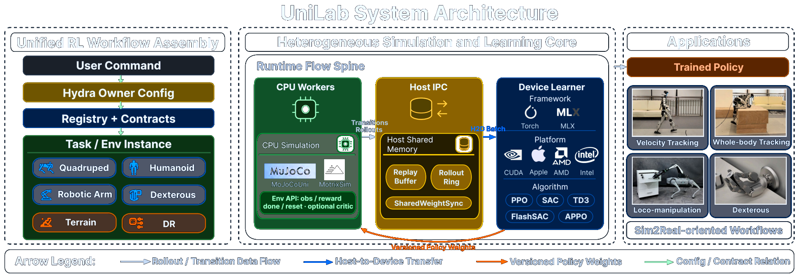
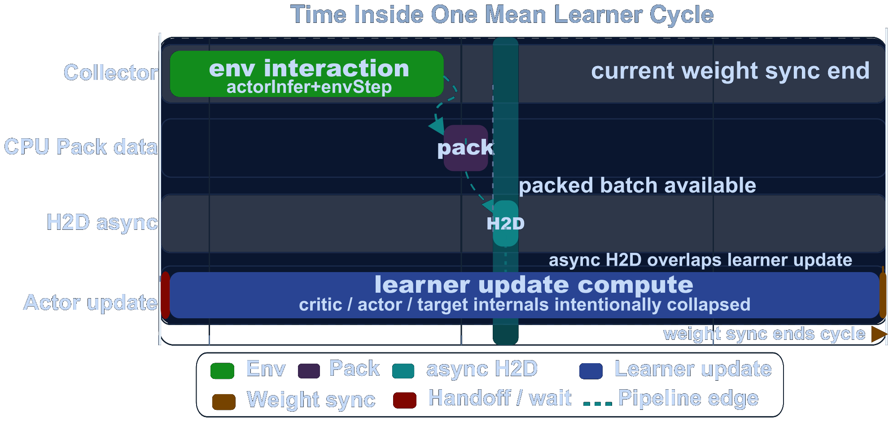
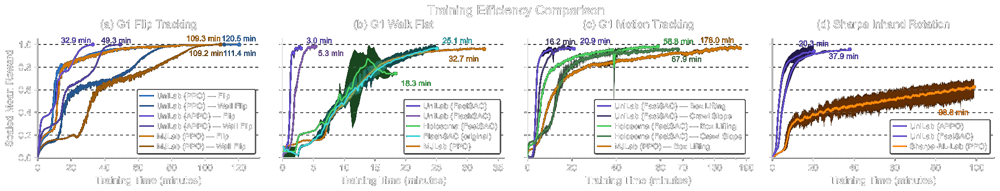
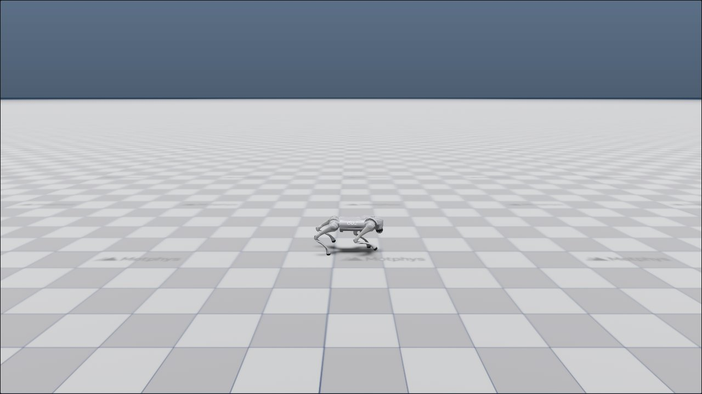
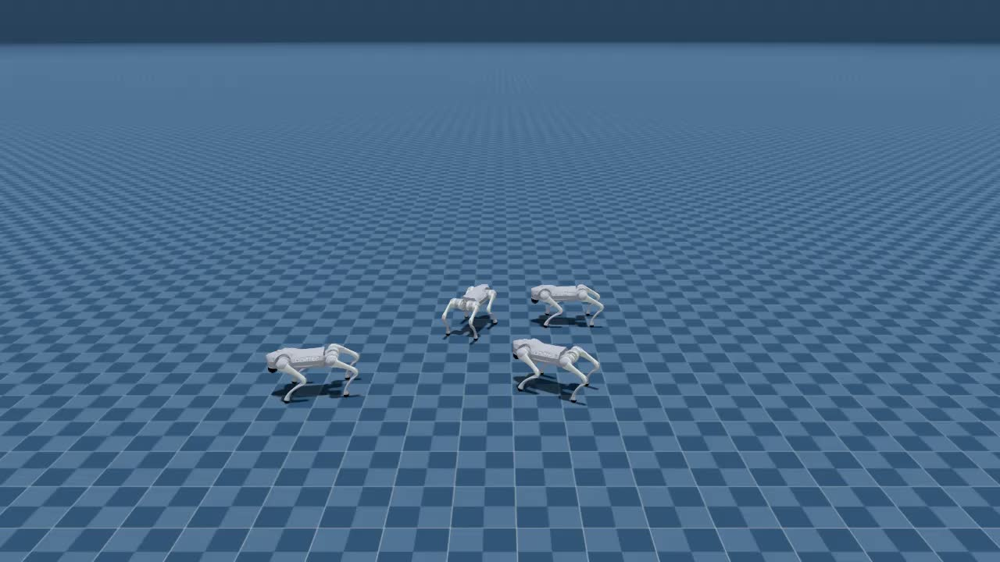
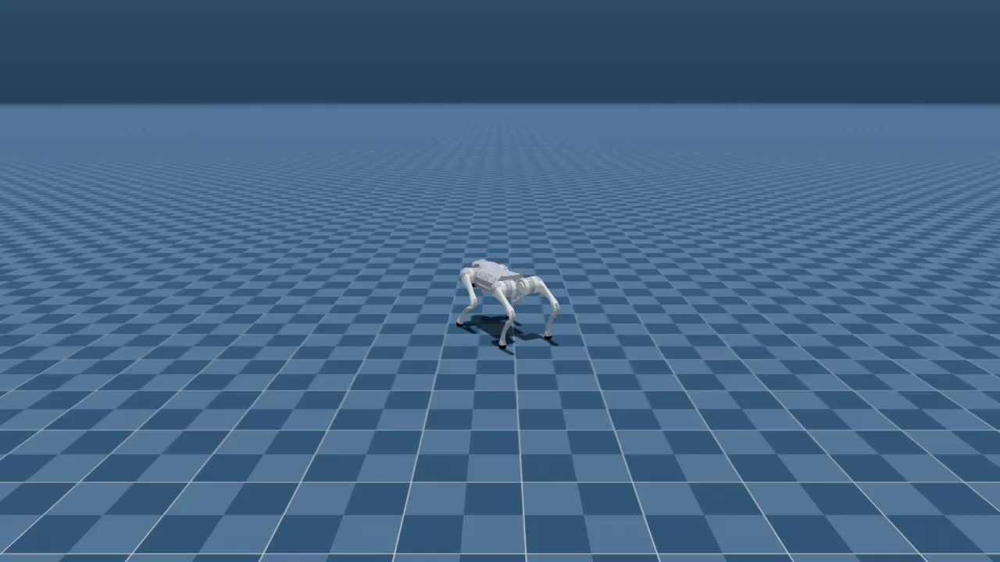
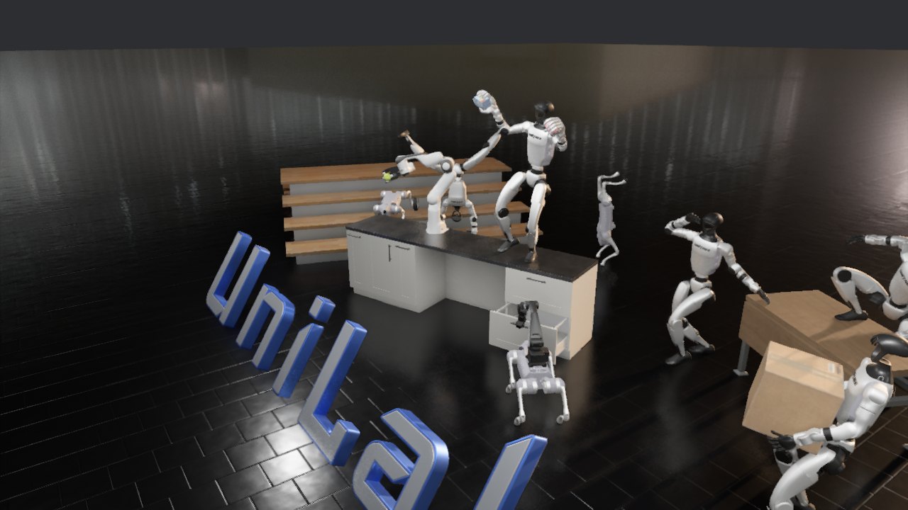
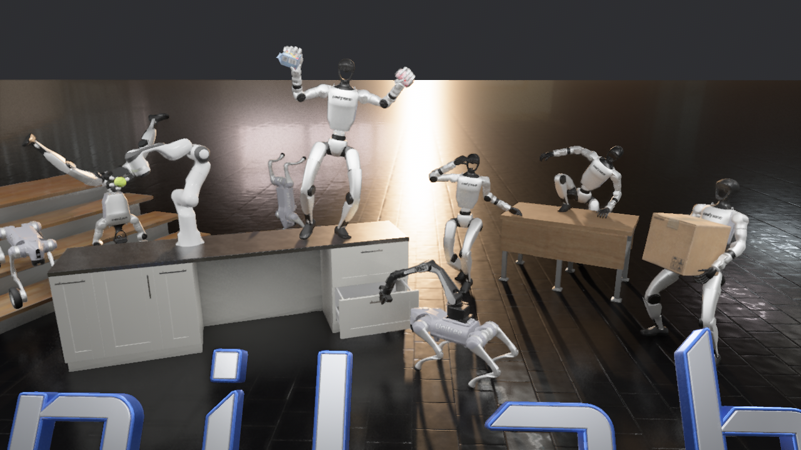

# UniLab + MotrixSim 异构机器人 RL 训练复现

本章带大家在一台 6GB 显存的 Windows 笔记本上，跑通 UniLab 的 MotrixSim 后端和 PPO 训练流程。这个实验的主线是机器人 state-based RL：策略网络读取机器人状态、速度指令和历史观测，在 CPU 侧仿真里采样，再由 GPU learner 更新参数。渲染不是本章的核心方法，只作为 checkpoint 检查、结果展示和 MotrixSim PBR teaser 体验的辅助环节。

本次实测机器为 RTX 3060 Laptop 6GB、AMD Ryzen 7 5800H、64GB 内存。最终跑通了 `go2_joystick_flat + motrix + ppo`，最大实测配置为 `512` 个并行环境、`100` 个 training iteration，累计 `1,228,800` 个环境步。

## 1. UniLab 在解决什么问题

UniLab 的核心思路是把机器人 RL 训练拆成两部分：CPU 侧负责大规模物理仿真和数据采集，GPU 侧负责策略网络学习。这样做的意义在于，大家不一定非要依赖 GPU 物理仿真器才能开始做大批量机器人 RL；只要 CPU 能并行推进足够多的环境，GPU 只需要承担 learner 的工作。



图 1 UniLab 官方系统架构图。大家需要重点看中间的 Runtime Flow Spine：CPU Workers 负责 MuJoCo/MotrixSim 仿真，Host IPC 负责共享内存、rollout 和 replay buffer，Device Learner 才是 CUDA / Apple / AMD / Intel 设备侧的学习模块。来源：[UniLab 官方项目页](https://unilabsim.github.io)。



图 2 UniLab 官方 pipeline timeline。它展示了仿真采样、Host-to-Device 数据移动和 learner 更新如何在异构流水线中排布。来源：[UniLab 官方项目页](https://unilabsim.github.io)。



图 3 UniLab 官方训练效率对比图。这里的完整性能结论需要严格按论文硬件和任务矩阵复现；本章只做 6GB 显卡上的轻量 smoke test 和资源占用记录。来源：[UniLab 官方项目页](https://unilabsim.github.io)。



图 4 UniLab 官方项目页中的 Go2 平地速度跟踪任务截图。本章选择同一个 `go2_joystick_flat` 任务，是因为它比人形舞蹈、灵巧手操作更适合作为第一轮训练 smoke test。来源：[UniLab 官方项目页](https://unilabsim.github.io)。

## 2. 本章能复现到什么程度

这台 6GB 显卡可以跑小规模训练，但不建议把它当作完整论文复现平台。原因有两个：第一，论文中的 3-10x 端到端效率提升需要多任务、多算法、多硬件条件对比；第二，官方当前主要支持 Linux CUDA、Linux ROCm、Linux XPU 和 macOS，Windows 不在官方主路径内。

本章实测得到的结论更适合大家做入门判断：

| 项目 | 本章状态 |
| --- | --- |
| UniLab 官方仓库克隆 | 已完成 |
| MotrixSim 后端导入 | 已完成 |
| CUDA 版 PyTorch | 已完成，`torch 2.7.0+cu128` |
| `go2_joystick_flat` 训练 | 已完成 |
| checkpoint 保存 | 已完成 |
| 无渲染 eval | 已完成 |
| MotrixSim record 视频 | 已完成 |
| MuJoCo 后端 | Windows 下未跑通，卡在 `mujoco-uni` 构建 |
| 完整论文 benchmark | 未复现，需要 Linux/云服务器和更系统的实验矩阵 |

## 3. 环境准备

官方推荐使用 `uv` 管理环境。本机已有 `micromamba` 的 `py310` 环境，所以这里没有新建 micromamba 环境，而是让 UniLab 在项目目录下创建自己的 `.venv`。这样做的好处是隔离 UniLab 依赖，不污染已有环境。

先把工作目录和仓库路径写成变量：

```powershell
$WORKSPACE = "C:\path\to\workspace"
$UNILAB_ROOT = "$WORKSPACE\UniLab"
git clone https://github.com/unilabsim/UniLab.git $UNILAB_ROOT
cd $UNILAB_ROOT
```

如果大家在 Linux 上复现，优先走官方命令：

```bash
make setup-motrix
```

本机 Windows 实测时，`mujoco-uni==3.8.0` 没有可用的 Windows wheel，源码构建会要求 `MUJOCO_PATH`。为了先跑通 MotrixSim 路线，这里使用如下折中命令跳过 `mujoco-uni`：

```powershell
uv sync --extra motrix --no-install-package mujoco-uni `
  --python C:\path\to\micromamba\envs\py310\python.exe
```

随后把项目 `.venv` 里的 PyTorch 换成 Windows CUDA 12.8 wheel：

```powershell
uv pip install --python .\.venv\Scripts\python.exe --reinstall `
  torch==2.7.0 --index-url https://download.pytorch.org/whl/cu128
```

检查 CUDA 是否可用：

```powershell
$env:PYTHONPATH = "src"
uv run --no-sync python -c "import torch; print(torch.__version__, torch.version.cuda, torch.cuda.is_available()); print(torch.cuda.get_device_name(0))"
```

本机输出为：

```text
2.7.0+cu128 12.8 True
NVIDIA GeForce RTX 3060 Laptop GPU
```

## 4. Checkpoint 1：先跑 256 环境的小规模训练

第一次建议大家不要直接使用官方默认的 `1024` 个环境。6GB 显存机器上先从 `256` 个环境开始，确认训练循环、日志和 checkpoint 都能正常工作。

```powershell
$env:PYTHONPATH = "src"
$env:WANDB_MODE = "disabled"

uv run --no-sync train --algo ppo --task go2_joystick_flat --sim motrix `
  training.no_play=true training.device=cuda:0 `
  algo.num_envs=256 algo.max_iterations=50 algo.save_interval=50
```

这个命令会做三件事：用 MotrixSim 在 CPU 侧推进 Go2 平地速度跟踪任务；用 CUDA 上的 PPO learner 更新策略；每 50 个 iteration 保存一次 checkpoint。`training.no_play=true` 会关闭训练后的交互回放，避免窗口渲染影响训练验证。

本机一次成功训练的摘要如下：

| 指标 | 数值 |
| --- | ---: |
| 并行环境数 | 256 |
| iteration | 50 |
| `num_steps_per_env` | 24 |
| 累计环境步 | 307,200 |
| 训练 wall time | 51.30 s |
| 最终 mean reward | 22.48 |
| 最佳 mean reward | 25.52 |
| 最终 checkpoint | `model_49.pt` |

这个 smoke test 证明了数据采集、GPU learner、日志写入、checkpoint 保存都能走通；它不能证明策略已经达到论文或官方 benchmark 水平。

## 5. Checkpoint 2：512 环境、100 iteration 的资源占用

确认 256 环境能跑后，本机继续跑了 `512` 个环境、`100` 个 iteration，并用 `nvidia-smi`、Windows 计数器和进程 RSS 做了粗粒度监控。

```powershell
$env:PYTHONPATH = "src"
$env:WANDB_MODE = "disabled"

uv run --no-sync train --algo ppo --task go2_joystick_flat --sim motrix `
  training.no_play=true training.device=cuda:0 `
  algo.num_envs=512 algo.max_iterations=100 algo.save_interval=50
```

训练摘要：

| 指标 | 数值 |
| --- | ---: |
| 并行环境数 | 512 |
| iteration | 100 |
| 累计环境步 | 1,228,800 |
| 训练 wall time | 132.90 s |
| 外层监控记录时长 | 141.94 s |
| 最终 mean reward | 34.97 |
| 最佳 mean reward | 37.40 |
| 平均 episode length | 1000.0 |

资源占用记录：

| 资源项 | 平均值 | 峰值 | 说明 |
| --- | ---: | ---: | --- |
| GPU 显存 | 233 MiB | 263 MiB | 只包含 `nvidia-smi` 采样值，说明策略网络本身很轻 |
| GPU 利用率 | 13.54% | 60% | learner 间歇更新，利用率不会长期打满 |
| 系统 CPU 使用率 | 62.80% | 81.05% | MotrixSim/CPU 并行仿真是主要负载 |
| 系统内存已用 | 31.22 GiB | 32.24 GiB | 包含系统和后台程序，不是 UniLab 独占 |
| UniLab 相关 Python RSS | 1397 MiB | 1538 MiB | 由相关 Python/uv 进程工作集估算 |

监控文件保存在：

- `assets/local_runs/20260531-210237/resource_monitor.csv`
- `assets/local_runs/20260531-210237/resource_summary_512x100.json`
- `assets/local_runs/20260531-210237/train_summary_512x100.json`

从这组数据可以看出，6GB 显卡不是这个轻量任务的瓶颈，CPU 才是更明显的压力来源。这也符合 UniLab 的设计：CPU 侧承担物理仿真，GPU 侧只处理策略学习。

## 6. Checkpoint 3：导出 MotrixSim 训练回放

Windows 下如果仓库路径包含中文，`eval --render-mode record` 在导出 TorchScript 策略时可能报错：

```text
RuntimeError: Parent directory ... does not exist.
```

本机的原因是原始路径里含有中文，TorchScript 保存时没有正确处理这个路径。解决办法是把训练日志根目录放到 ASCII 路径，例如 `C:/unilab_logs`。

```powershell
$env:PYTHONPATH = "src"
$env:WANDB_MODE = "disabled"

uv run --no-sync train --algo ppo --task go2_joystick_flat --sim motrix `
  training.no_play=true training.device=cuda:0 training.log_root=C:/unilab_logs `
  algo.num_envs=256 algo.max_iterations=50 algo.save_interval=50
```

这里导出的是训练后 checkpoint 的策略回放，不是 PBR teaser。它的作用是验证 state-based policy 能被加载，并能在 MotrixSim 里稳定推进若干步。

多环境回放：

```powershell
uv run --no-sync eval --algo ppo --task go2_joystick_flat --sim motrix `
  --load-run -1 --render-mode record `
  training.log_root=C:/unilab_logs `
  training.play_steps=300 training.play_env_num=4 training.render_spacing=1.4
```

单环境跟随视角回放：

```powershell
uv run --no-sync eval --algo ppo --task go2_joystick_flat --sim motrix `
  --load-run -1 --render-mode record `
  training.log_root=C:/unilab_logs `
  training.play_steps=300 training.play_env_num=1 `
  training.cam_tracking=true training.cam_distance=4.0 training.cam_elevation=-15.0
```

<video controls muted preload="metadata" width="100%">
  <source src="assets/videos/go2_flat_4env_300steps.mp4" type="video/mp4">
</video>

图 5 本机导出的 4 环境 MotrixSim 回放视频。它验证了 checkpoint 可以被加载，并能驱动 MotrixSim 录制 300 step 的策略回放。

<video controls muted preload="metadata" width="100%">
  <source src="assets/videos/go2_flat_1env_300steps.mp4" type="video/mp4">
</video>

图 6 本机导出的单环境跟随视角视频。这个视频更适合检查机器人姿态和动作是否连续。

如果网页构建器不直接显示视频，可以先看两张视频抽帧：



图 7 4 环境回放抽帧。



图 8 单环境回放抽帧。

## 7. 扩展体验：MotrixSim PBR teaser 渲染器

UniLab 这条工作线重点不是做渲染 benchmark，但 MotrixSim 的渲染器已经支持 PBR。官方仓库里提供了一个独立的 teaser 入口，大家可以把它当作视觉体验教程来跑：它加载论文 teaser 场景，打开 MotrixSim renderer，并保持静态场景显示；它不训练策略，也不推进 RL rollout。

在 UniLab 仓库根目录运行：

```powershell
$env:PYTHONPATH = "src"
uv run --no-sync demo teaser
```

第一次运行会自动下载 teaser scene 资产。下载完成后，程序会进入 `src/unilab/tools/render_teaser.py`，调用 `RenderSettings.quality()`，并启用 shadow、SSGI 和完整 render mesh。窗口打开后可以通过 renderer 交互查看场景；关闭窗口即可退出。

本机为了稳定截取多视角图片，使用了 MotrixSim 的 headless system camera capture，而不是录制聊天视频或截屏幕前台窗口。核心思路是加载同一个 teaser MJCF 场景，然后多次调整：

```python
render.system_camera.set_view(lookat, distance, elevation, azimuth)
```

在场景资产已经下载完成后，本机导出 3 张 `1280x720` PNG 截图约用 `24 s`。首次运行会额外下载 `scenes/teaser` 资产；如果日志里出现 `convex hull partial success`、`Duplicate AssetLoader` 或 `wgpu_core::validation` 这类 warning，只要截图正常生成，一般可以先当作渲染器初始化提示处理。

下面三张图都来自本机实际运行的 MotrixSim PBR renderer。

<table>
  <tr>
    <td></td>
    <td></td>
  </tr>
  <tr>
    <td>图 9 PBR teaser 主视角。这里可以看到反光地面、强光入口、机器人和纸箱等展示资产。</td>
    <td>图 10 PBR teaser 左侧高位视角。这个角度更容易观察场景整体布置和阴影层次。</td>
  </tr>
</table>



图 11 PBR teaser 近景视角。这个截图更适合检查 PBR 材质、地面反射、桌面阴影和机器人表面高光。

这个 teaser 适合放在教程里作为“MotrixSim 渲染器体验”小节，但不要把它和前面的 RL 训练指标混在一起理解：前面的 `go2_joystick_flat` 是 state-based RL 训练复现；这里的 teaser 是 renderer-only 静态场景展示。

## 8. 常见问题

### Windows 下 `mujoco-uni` 构建失败

本机报错信息是：

```text
RuntimeError: MUJOCO_PATH environment variable is not set, and no bundled MuJoCo found in package.
```

这是 Windows 路线的限制，不代表 UniLab 本身不能用。大家如果要严肃复现 MuJoCo 后端和论文实验，建议切到 Linux CUDA 或 Docker；如果只是先跑 MotrixSim，可以按本章方式跳过 `mujoco-uni`。

### `unilab` 包导入失败

本机在 Windows 下遇到过 `uv run train` 找不到 `unilab` 的情况。解决办法是在当前 PowerShell 会话里显式设置：

```powershell
$env:PYTHONPATH = "src"
```

### 视频导出路径含中文时报错

把训练日志和 checkpoint 放在 ASCII 路径下：

```powershell
training.log_root=C:/unilab_logs
```

这比移动整个项目更稳，也不会破坏教程仓库结构。

### 6GB 显卡能不能继续加环境数

对于本章这个任务，512 环境并没有吃满 6GB 显存，瓶颈更像 CPU 侧仿真与调度。大家可以继续试 `algo.num_envs=768` 或 `1024`，但建议每次只改一个参数，并保留 `training.no_play=true`。如果 CPU 利用率长期很高、训练速度不升反降，就说明环境数已经超过这台机器的有效并行区间。

## 9. 本章结论

这台 6GB RTX 3060 Laptop 可以在 Windows 上通过 MotrixSim 路线跑通 UniLab 的轻量 state-based RL 训练。最有价值的结果不是 reward 数字，而是确认了 UniLab 的异构设计在小机器上也能工作：CPU 负责并行仿真，GPU 负责策略学习，显存占用很低，CPU 才是主要资源压力。

如果大家要做完整论文复现，建议换到 Linux CUDA 环境，并使用官方支持的 `make setup-motrix` 路线，同时补齐 MuJoCo 后端、多任务、多算法和多硬件对比。6GB 显卡更适合作为课程 smoke test、环境验证和小规模消融实验平台。

## 参考资料

- UniLab 官方项目页：https://unilabsim.github.io
- UniLab GitHub 仓库：https://github.com/unilabsim/UniLab
- UniLab 论文页面：https://unilabsim.github.io/paper/
- UniLab arXiv：https://arxiv.org/abs/2605.30313
- UniLab 官方文档：https://unilabsim.github.io/UniLab-doc/
