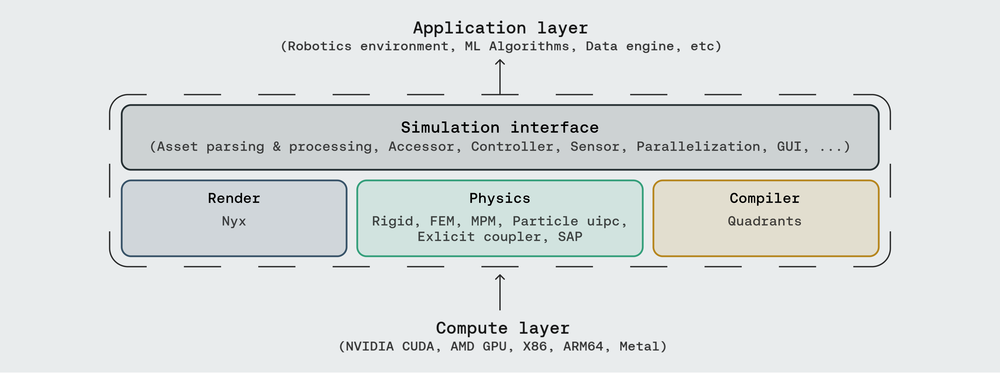
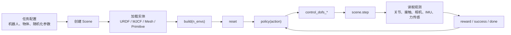
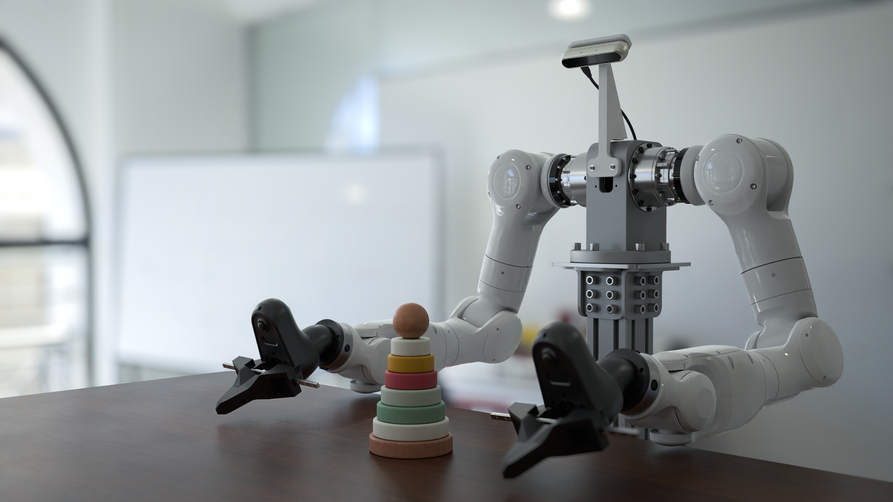
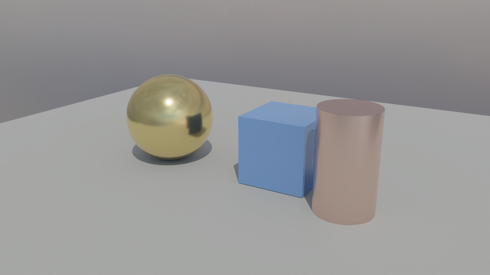
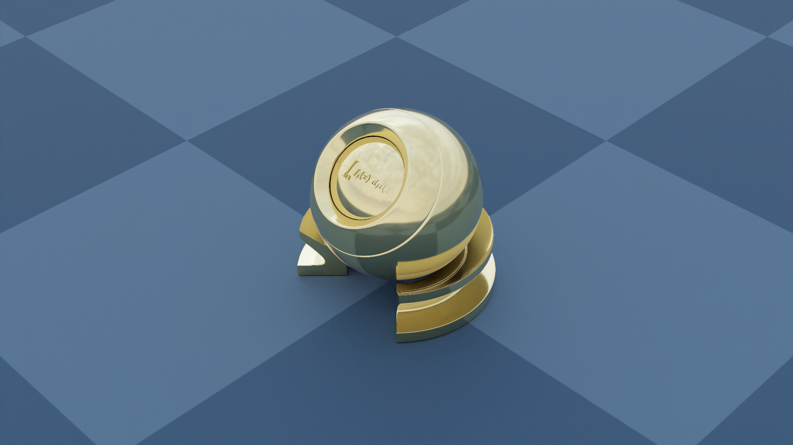
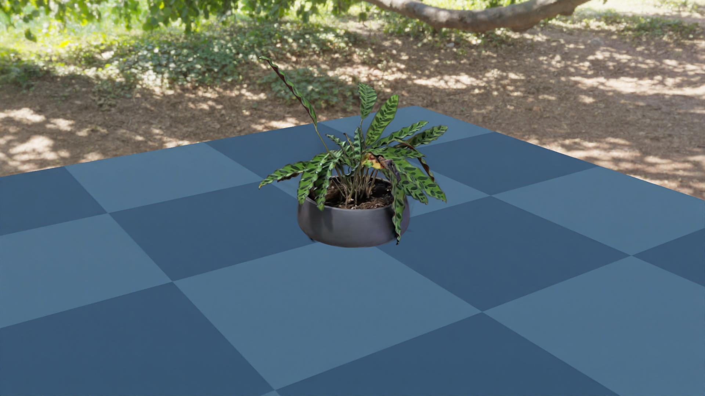
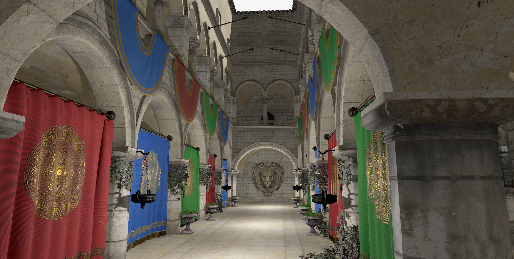
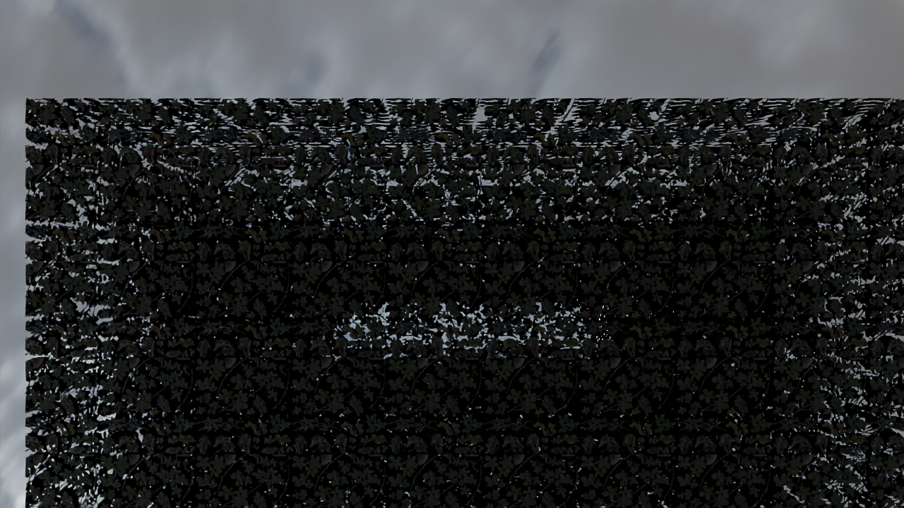

# Genesis World 1.0 完整体验：从仿真底座到 Nyx 高保真渲染

学完这一章后，大家可以完成三件事：

1. 理解 Genesis World 1.0 在具身智能仿真栈中的位置：它更像“物理 + 机器人接口 + 渲染 + 编译器”的底座，而不是一个现成的家庭机器人任务库。
2. 在本地跑通 Genesis World 的机器人仿真、Nyx 高保真渲染和 Gaussian Splat 示例，并知道每一步验证了什么。
3. 分清“官方宣传图”“本地可复现图”和“资产导入边界”，避免把高保真渲染图误认为开源仓库已经提供完整家庭场景 benchmark。

本章适合已经读过前两篇 Genesis 环境配置教程的小伙伴继续学习。如果大家还没有安装过 Genesis，可以先看 [01环境配置和测试](01环境配置和测试.md) 和 [02可视化和渲染](02可视化和渲染.md)。

---

## 1. Genesis World 1.0 到底是什么

Genesis World 1.0 是 Genesis AI 开源的机器人仿真平台。它的定位不是单一的渲染器，也不是单一的物理引擎，而是一个面向 Physical AI / Embodied AI 的仿真基础设施栈。

<div align="center">
  
  <br>
  <strong>图 1 Genesis World 官方封面图</strong>
  <br>
  <sub>这张图展示了 Genesis World 希望达到的高保真机器人仿真观感。它是官方 README 的宣传图，不等价于仓库中某个一键可复现脚本的输出。来源：Genesis World 官方 GitHub README。</sub>
</div>

从机器人学习的角度看，Genesis World 主要覆盖四层：

<div align="center">
  
  <br>
  <strong>图 2 Genesis World 官方系统栈</strong>
  <br>
  <sub>大家可以重点看中间四层：Simulation Interface、Physics、Render 和 Compiler。上层可以接 RL/VLA/数据生成任务，下层可以运行在不同计算后端。来源：Genesis World 官方 GitHub README。</sub>
</div>

| 层级 | 对机器人学习的意义 |
|---|---|
| Simulation Interface | 用 Python 创建场景、加载机器人、读取传感器、控制关节、构建并行环境。 |
| Physics | 支持刚体、FEM、MPM、PBD/SPH、IPC、SAP 和多物理耦合，适合研究接触、软体、颗粒、布料等交互。 |
| Render | 支持普通 viewer、Pyrender/Luisa/Nyx 等渲染路径。Nyx 用于更高保真的视觉观测。 |
| Compiler | Quadrants 将 Python kernel 编译到 CUDA/ROCm/Metal/Vulkan/x86/ARM，提高仿真吞吐。 |

这里最重要的判断是：**Genesis World 开源仓库目前主要提供仿真底座和示例环境，而不是直接提供一个大规模家庭场景机器人 benchmark。** 如果大家要做家庭操作任务，还需要接入 RoboCasa、iGibson、Habitat、BEHAVIOR、Replica/HM3D 或自己构建资产与碰撞层。

---

## 2. 本章使用的本地实验环境

本章的实测环境使用了 NVIDIA Blackwell GPU。Blackwell 机器上安装 PyTorch 时要特别注意 CUDA 版本，不建议照搬旧教程里的 `cu126` 示例。

我们实测通过的组合是：

| 组件 | 实测结果 |
|---|---|
| GPU | NVIDIA RTX PRO 6000 Blackwell Workstation Edition |
| compute capability | 12.0 |
| PyTorch | `2.8.0+cu128` |
| CUDA runtime | 12.8 |
| Genesis World | 1.0.0 |
| Quadrants | 0.8.0 |
| gs-nyx | 0.1.1 |
| gs-nyx-plugin | 0.1.2 |

Checkpoint 1：确认 PyTorch 真的支持 Blackwell。

```bash
python - <<'PY'
import torch
print("torch:", torch.__version__)
print("cuda runtime:", torch.version.cuda)
print("device:", torch.cuda.get_device_name(0))
print("capability:", torch.cuda.get_device_capability(0))
print("arch list:", torch.cuda.get_arch_list())
x = torch.arange(16, device="cuda", dtype=torch.float32)
print("cuda sum:", float((x * x).sum().item()))
PY
```

成功时应能看到 `sm_120` 或 `compute_120`，并且 CUDA tensor 运算不报错。这个检查比只看 `nvidia-smi` 更可靠。

---

## 3. 克隆和安装 Genesis World

建议大家把工作目录放到一块容量充足的磁盘。下面命令用 `$WORKSPACE` 表示大家自己的项目根目录：

```bash
export WORKSPACE=/path/to/workspace
mkdir -p "$WORKSPACE"
cd "$WORKSPACE"

git clone https://github.com/Genesis-Embodied-AI/genesis-world.git
cd genesis-world
```

安装时先安装适合自己 GPU 的 PyTorch。以 Blackwell / CUDA 12.8 为例，可以使用 PyTorch 官方 `cu128` wheel：

```bash
# 示例：请按自己的 Python 版本和 CUDA 版本选择官方 wheel
pip install torch --index-url https://download.pytorch.org/whl/cu128
```

然后安装 Genesis：

```bash
pip install -e ".[dev]"
```

Nyx 高保真渲染需要额外安装：

```bash
pip install gs-nyx gs-nyx-plugin
```

Checkpoint 2：确认核心包可以导入。

```bash
python - <<'PY'
import genesis as gs
import quadrants
import gs_nyx
import gs_nyx_plugin

print("genesis:", getattr(gs, "__version__", "unknown"))
print("quadrants:", getattr(quadrants, "__version__", "unknown"))
print("gs_nyx:", getattr(gs_nyx, "__version__", "unknown"))
print("gs_nyx_plugin: ok")
PY
```

如果这里报 `matplotlib` 版本解析错误，通常是本机装了 release candidate 版本，可以先换回稳定版：

```bash
pip install "matplotlib>=3.10,<3.11"
```

---

## 4. 最小机器人仿真：Franka + Plane

Genesis 的最小机器人仿真非常短。下面这个例子加载地面和 Franka 机械臂，然后推进仿真：

```python
import genesis as gs

gs.init(backend=gs.gpu)

scene = gs.Scene(show_viewer=True)
plane = scene.add_entity(gs.morphs.Plane())
franka = scene.add_entity(
    gs.morphs.MJCF(file="xml/franka_emika_panda/panda.xml"),
)

scene.build()

for _ in range(1000):
    scene.step()
```

这个 smoke test 证明三件事：

- Genesis 可以初始化后端；
- MJCF 机器人资源可以被解析；
- 物理仿真循环 `scene.step()` 可以正常推进。

它不证明控制器、训练环境或视觉渲染已经完整可用。后续大家要继续看 `examples/rigid/control_franka.py`、`examples/manipulation/grasp_env.py` 和 `examples/locomotion/go2_env.py`。

---

## 5. Genesis 机器人仿真的典型流水线

真实做机器人任务时，Genesis 代码通常会组织成下面这条数据流：



**图 3 Genesis 机器人任务的基本闭环。**  
大家可以把它理解为 Gym/RL 环境的机器人版本：`reset()` 设置初始状态，`step(action)` 推进物理，传感器返回 observation，任务代码计算 reward 和 done。

在开源仓库里，大家可以按任务类型学习：

| 学习目标 | 推荐文件 |
|---|---|
| Franka 控制 | `examples/rigid/control_franka.py` |
| IK 和运动规划抓取 | `examples/tutorials/IK_motion_planning_grasp.py` |
| 操作任务环境 | `examples/manipulation/grasp_env.py` |
| 四足机器人 locomotion | `examples/locomotion/go2_env.py` |
| 无人机悬停训练 | `examples/drone/hover_env.py` |
| 性能测试 | `examples/speed_benchmark/franka.py`、`examples/speed_benchmark/anymal_c.py` |

---

## 6. Nyx：把 Genesis 相机换成高保真渲染传感器

Nyx 是 Genesis 生态里的 GPU path tracer。官方 Nyx README 展示了双机械臂桌面场景：

<div align="center">
  
  <br>
  <strong>图 4 Nyx 官方双臂桌面渲染图</strong>
  <br>
  <sub>这张图展示 Nyx 的目标渲染质量。需要注意，当前 Nyx 示例仓没有提供生成该 landing 图的完整脚本和场景资产。来源：Nyx for Genesis 官方 README。</sub>
</div>

Nyx 的使用方式不是 `scene.add_camera()`，而是 `scene.add_sensor(NyxCameraOptions(...))`：

```python
import genesis as gs
import gs_nyx.nyx_py_renderer as npr
import gs_nyx.nyx_py_sdk as nps
from gs_nyx_plugin.nyx_camera_options import NyxCameraOptions

gs.init(backend=gs.gpu)

scene = gs.Scene(show_viewer=False)
scene.add_entity(gs.morphs.Plane())
scene.add_entity(
    gs.morphs.Sphere(
        radius=0.4,
        pos=(0.0, 0.0, 0.4),
        fixed=True,
        collision=False,
    ),
    surface=gs.surfaces.Gold(),
)

env_map = nps.EnvironmentMapAsset()
env_map.texture = "examples/assets/kloppenheim_07_puresky_4k.hdr"
env_map.layout = nps.EEnvMapLayout.LongLat
env_map.multiplier = 2.0

cam = scene.add_sensor(
    NyxCameraOptions(
        res=(1280, 720),
        pos=(2.0, -3.0, 1.5),
        lookat=(0.0, 0.0, 0.3),
        fov=35.0,
        spp=64,
        denoise=True,
        render_mode=npr.ERenderMode.FastPathTracer,
        env_maps=(env_map,),
    )
)

scene.build(n_envs=1)
scene.step()
rgb = cam.read().rgb
```

这里大家要注意两个关键点：

- `spp` 是每像素采样数，越高噪声越低，但越慢；
- `cam.read().rgb` 返回的是 GPU 上的 RGB tensor，可以直接作为视觉策略的 observation。

---

## 7. 本地复现：Nyx 最小渲染、PBR 球和 Gaussian Splat

我们在本地跑通了三个检查点。

<div align="center">
  
  <br>
  <strong>图 5 本地 Nyx primitive smoke test</strong>
  <br>
  <sub>这个结果证明 Nyx path tracing 在本机 GPU 上能正常输出 RGB 图像，但它只是基础几何体测试，不代表已经复现官方双臂宣传图。</sub>
</div>

<div align="center">
  
  <br>
  <strong>图 6 Nyx 官方 01_hello_nyx 示例本地输出</strong>
  <br>
  <sub>这个示例加载 PBR_Ball.glb 和 HDRI 环境贴图，验证 glTF 材质、环境光和 Nyx 相机传感器链路。脚本来源：genesis-nyx/examples/01_hello_nyx.py。</sub>
</div>

<div align="center">
  
  <br>
  <strong>图 7 Nyx Gaussian Splat 示例本地输出</strong>
  <br>
  <sub>这个示例把真实捕获的 Gaussian Splat 与 Genesis 平面几何放在同一帧中渲染，适合学习“真实场景外观 + 仿真几何”的合成方式。脚本来源：genesis-nyx/examples/05_gaussian_splat.py。</sub>
</div>

如果大家从 GitHub zip 下载 Nyx 示例仓，可能会遇到 LFS 指针文件。表现是 `.glb` 或 `.ply` 文件很小，开头是：

```text
version https://git-lfs.github.com/spec/v1
```

这时需要使用 `git lfs pull`，或者从 `media.githubusercontent.com` 下载真实文件。我们本地补齐了：

- `PBR_Ball.glb`
- `plant.ply`

---

## 8. 高保真室内资产的坑：Sponza 不是家庭场景

为了测试 Genesis/Nyx 对高保真室内 glTF 的支持，我们额外下载了 Khronos glTF Sample Assets 中的 Sponza。

<div align="center">
  
  <br>
  <strong>图 8 Sponza 官方参考效果</strong>
  <br>
  <sub>Sponza 是经典的建筑中庭/拱廊光照测试场景，不是家庭场景。图中灯光仅用于参考展示，不一定是 glTF 模型本身的一部分。来源：Khronos glTF Sample Assets / Sponza。</sub>
</div>

这个实验很有教育意义，因为它暴露了一个常见误区：**能被 glTF viewer 正常显示，不代表能被机器人仿真器直接当作高质量任务场景使用。**

我们将 Sponza 导入 Genesis 时使用：

```python
scene.add_entity(
    gs.morphs.Mesh(
        file="Models/Sponza/glTF/Sponza.gltf",
        collision=False,
        fixed=True,
    )
)
```

`trimesh` 可以加载，Genesis 也可以 `build` 成功，但 Genesis viewer 和 Nyx 当前链路对它的 alpha mask、透明材质、坐标系和照明支持并不理想。

<div align="center">
  
  <br>
  <strong>图 9 Sponza 在当前 Nyx 链路中的边界效果</strong>
  <br>
  <sub>这张图不是最终效果，而是一个排坑检查点：复杂 glTF 中的植被/布料 alpha mask 容易变成大块遮挡。大家在做机器人场景时，应把视觉 mesh、碰撞 proxy 和任务物体分层处理。</sub>
</div>

对机器人仿真来说，正确做法是：

- 视觉层：高保真 mesh、PBR 纹理、HDRI、灯光；
- 碰撞层：简化 box、capsule、cylinder 或低模 collision mesh；
- 任务层：可交互物体、机器人、目标位姿、成功判定；
- 语义层：物体类别、可抓取区域、导航区域、约束关系。

不要直接把一个高模室内 glTF 开 `collision=True` 扔进仿真器。复杂场景会触发昂贵的凸分解，既慢，又不一定得到适合机器人运动规划的碰撞网格。

---

## 9. Genesis 是否已经有大规模家庭机器人 benchmark

截至本章整理时，开源 Genesis World 仓库中还没有类似 Habitat Challenge、RoboCasa、LIBERO 那种完整的大规模家庭机器人 benchmark。

公开仓库里有三类内容：

| 类型 | 是否是正式 benchmark | 说明 |
|---|---|---|
| speed benchmark | 部分是 | `examples/speed_benchmark/franka.py`、`anymal_c.py` 主要测试仿真吞吐。 |
| mini training env | 适合学习，不是 leaderboard | `go2_env.py`、`hover_env.py`、`grasp_env.py` 可学习环境封装和训练流程。 |
| 官方宣传/内部评测 | 公开信息有限 | Genesis AI 博客提到 household/lab/industrial workflows，但开源仓库没有完整释放这些任务集。 |

如果大家的目标是家庭操作 benchmark，建议把 Genesis 当作物理和渲染底座，再结合其他任务库：

| 任务方向 | 可参考平台 |
|---|---|
| 厨房和桌面操作 | RoboCasa、robosuite、ManiSkill |
| 家庭导航和场景理解 | Habitat、Replica、HM3D、iGibson |
| 长程家务任务 | BEHAVIOR / OmniGibson |
| 基准评估 | LIBERO、RoboTwin、EBench 等 |

Genesis 的价值在于：当大家需要更高物理吞吐、多物理耦合、GPU 仿真或把 Nyx/Gaussian Splat 接入训练观测时，它可以作为一个新的底层选择。

---

## 10. 学习路线建议

如果大家想系统掌握 Genesis World，建议按下面顺序推进：

1. 跑通最小 Franka + Plane，确认 `scene.add_entity`、`scene.build`、`scene.step`。
2. 跑 `examples/rigid/control_franka.py`，学习关节控制、控制增益和 gripper force。
3. 跑 `examples/tutorials/IK_motion_planning_grasp.py`，学习 IK、路径规划和抓取流程。
4. 阅读 `examples/manipulation/grasp_env.py`，理解一个 RL 环境如何定义 reset、step、reward 和 observation。
5. 跑 Nyx `01_hello_nyx.py` 和 `05_gaussian_splat.py`，理解高保真视觉观测的接入方式。
6. 尝试导入一个简单 GLB 物体，并用 `collision=False` 先验证视觉，再单独做碰撞 proxy。
7. 如果要做家庭任务，不要从 Sponza 这种纯渲染 benchmark 场景开始，优先选择有机器人语义、碰撞或任务定义的数据集。

---

## 11. 常见问题

**问题 1：为什么官方图那么好看，本地示例没有达到同样效果？**  
官方封面和 Nyx landing 图展示的是渲染能力上限，但当前公开仓库没有完整提供这些图对应的场景脚本、机器人模型、灯光布置和相机配置。本章本地复现图验证的是 Nyx 链路可运行，不是像素级复现官方宣传图。

**问题 2：为什么 Sponza 在 Genesis 里看起来很差？**  
Sponza 是 glTF 光照测试场景，大量使用透明/alpha mask 纹理。Genesis viewer 和当前 Nyx 插件对这类材质支持有限。它适合做资产导入压力测试，不适合作为机器人家庭场景。

**问题 3：室内场景是否应该开启 collision？**  
不建议直接对高模室内场景开启 collision。更稳妥的方式是用高模做视觉层，用简化几何体做碰撞层。例如地面用大 box，墙面用 thin box，桌面用 box，柱子用 cylinder。

**问题 4：Nyx 是否支持深度图和分割图？**  
当前 Nyx 文档中明确 RGB 支持较好，但 depth、segmentation、normal、optical flow 等输出通道还不完整。需要深度或分割时，可以先使用 Genesis 普通 camera/rasterizer 路径，或者等待 Nyx 后续能力完善。

---

## 12. 参考资料

- Genesis World 官方仓库：<https://github.com/Genesis-Embodied-AI/genesis-world>
- Genesis World 官方文档：<https://genesis-world.readthedocs.io/>
- Genesis World 1.0 技术博客：<https://www.genesis.ai/blog/the-role-of-simulation-in-scalable-robotics-genesis-world-10-and-the-path-forward>
- Nyx for Genesis 官方仓库：<https://github.com/Genesis-Embodied-AI/genesis-nyx>
- Nyx for Genesis 官方文档：<https://genesis-embodied-ai.github.io/genesis-nyx/latest/>
- Khronos glTF Sample Assets / Sponza：<https://github.com/KhronosGroup/glTF-Sample-Assets/tree/main/Models/Sponza>

