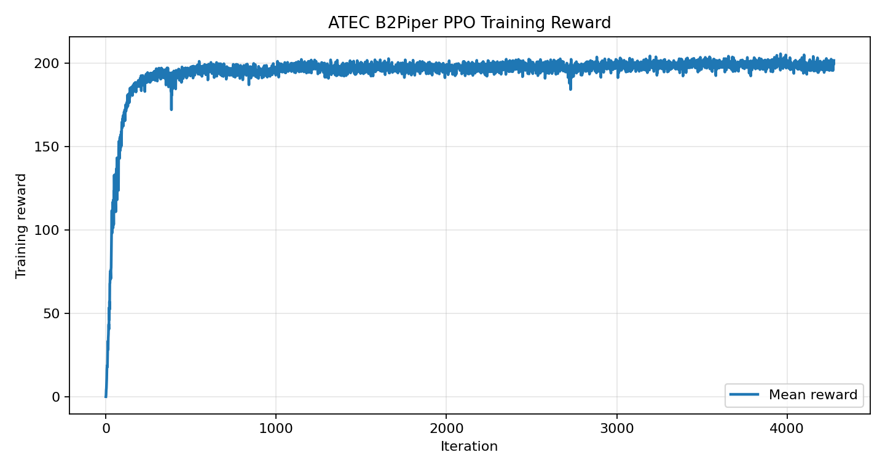
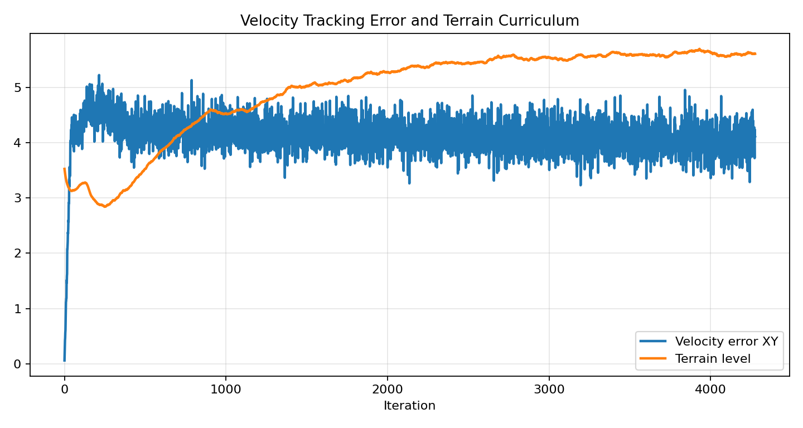
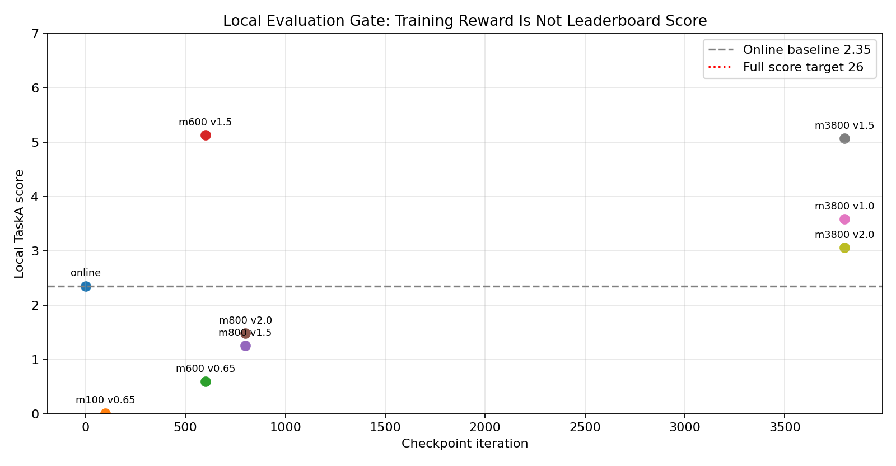

# ATEC2026 线上赛·赛道1 L0 机器人徒步复现与冲榜教程

本文面向希望复现 ATEC2026 线上赛·赛道1「机器人徒步（Locomotion）」的小伙伴。我们会从报名、下载官方代码、搭建 Isaac Sim / Isaac Lab 环境、跑通官方 baseline、完成线上提交讲起，然后把一次真实的本地冲榜实验完整复盘出来：为什么官方 baseline 能提交并拿到有效分数，为什么中间 checkpoint 可以把分数从 2.35 提到 5 分左右，以及中途本地评估为什么比盲目长训更重要。

这篇教程不是“冠军秘笈”。它更像一份可复现实验笔记：大家可以照着先把比赛链路跑通，再基于其中的阶段性提分经验继续改进自己的策略。

## 1. 这场比赛在考什么

ATEC2026 的主题是 **AI and Robotics Real-World Extreme Challenge**，希望通过线上仿真和线下真实场景共同验证具身智能系统的长期稳定性、真实环境适应能力和可复现性。

赛道1线上赛分为 L0 和 L1：

| 层级 | 任务 | 核心目标 |
|---|---|---|
| L0 | 机器人徒步 | 带臂足式机器人沿约 400 m 路线稳定行走，经过平地、粗糙地面、上下坡、上下楼梯 |
| L1 任务1 | 垃圾拾取与投放 | 在 20 m x 20 m 区域中完成目标识别、导航、抓取、运输和投放 |
| L1 任务2 | 越障 | 通过沟壑或高台，可利用箱子等物体改造环境获得加分 |

本文只聚焦 L0。原因很简单：L0 是最适合入门的入口。它不需要先解决视觉识别和抓取，只要大家能把 locomotion 控制、评测、提交链路跑通，就已经完成了具身智能比赛里最关键的一半工程闭环。

官方比赛页：

- ATEC 官网：[https://www.atecup.com/competitions/100017](https://www.atecup.com/competitions/100017)
- 赛道详情页示例：[https://www.atecup.com/matchHomeDetails/100017/1000210](https://www.atecup.com/matchHomeDetails/100017/1000210)
- 官方 baseline 仓库：[https://github.com/atecup/ATEC2026_Simulation_Challenge](https://github.com/atecup/ATEC2026_Simulation_Challenge)

公开资料显示，ATEC2026 报名从 2026 年 4 月 1 日开放，到 2026 年 6 月 15 日 22:00（UTC+8）截止（后续可能有变化，请大家及时关注）；线上赛时间为 2026 年 5 月 1 日 10:00 到 2026 年 6 月 30 日 22:00（UTC+8）。如果大家阅读本文时已经过了报名截止时间，仍然可以把本文当作 Isaac Lab 机器人竞赛复现实验来学习。

## 2. 如何报名和进入提交页

报名和提交都在 ATEC 官网完成。实际页面可能会随官方迭代略有变化，但整体流程大致如下：

1. 打开 ATEC 官网并注册/登录账号。
2. 进入 ATEC2026 比赛页。
3. 点击报名或加入比赛，按页面要求填写赛队信息。
4. 进入「个人主页 / 我的比赛 / 赛道详情」。
5. 在赛道详情页中切换到「资源入口」下载 Demo、选手指南和更新公告。
6. 在「提交入口」中选择任务，例如 L0 的「机器人徒步」。
7. 选择机器人构型，上传源码压缩包或推送镜像。
8. 等待平台构建、运行和打分，在「历史提交」中查看结果。

L0 提交入口里会要求选择机器人模型。我们本次实验使用的是 `B2Piper`，也就是 Unitree B2 四足底盘加 Piper 机械臂。平台源码上传一般要求根目录包含：

```text
solution.py
policy.pt
requirements.txt
```

其中 `solution.py` 是比赛系统调用的入口；`policy.pt` 可以是 TorchScript 导出的策略；`requirements.txt` 可以为空。官方环境已经包含 PyTorch 等基础依赖，空 requirements 并不代表“没有依赖”，而是表示我们没有额外 pip 包需要安装。

## 3. 算力选择：本地机器或租用 L40

ATEC 的 L0 baseline 依赖 Isaac Sim 5.1 和 Isaac Lab 2.3.x，普通笔记本很难稳定跑训练。大家有两种选择：

| 方案 | 适合场景 | 注意点 |
|---|---|---|
| 本地工作站 | 已有大显存 NVIDIA GPU，并且能安装 Isaac Sim / Isaac Lab | 环境安装和驱动匹配成本较高 |
| 租用 GPU 云主机 | 想快速复现、训练、看桌面仿真画面 | 建议选择已经适配 Isaac Sim 的镜像 |

如果使用算力自由这类云算力平台，建议优先选择带远程桌面、NVIDIA 驱动、Isaac Sim / Isaac Lab 环境的镜像。L40 是比较合适的起步卡：它显存足够跑中等规模并行环境，价格通常比 A100/H100 更适合教学实验。

在 LeHome 教程中，我们也采用过类似写法：先说明“单卡 L40 能稳定起跑”，再给出 batch size、日志和 GPU 曲线，而不是承诺一定能冲榜。ATEC 这里同理：L40 能帮助大家快速跑通和训练，但能否拿高分取决于 reward、观测、课程和提交策略。

建议检查 GPU：

```bash
nvidia-smi
```

如果大家看到类似 L40、RTX 4090、A6000、RTX PRO 6000 等 NVIDIA GPU，并且显存充足，就可以继续。我们本地实验使用的是大显存 NVIDIA 工作站；如果换成 L40，建议先从较小并行环境数开始，例如 `--num_envs 1024` 或 `2048`，确认不 OOM 后再加到 `4096`。

## 4. 下载官方代码与机器人模型

官方仓库可以直接克隆：

```bash
export PROJECT_ROOT=$HOME/ATEC2026_Simulation_Challenge

git clone https://github.com/atecup/ATEC2026_Simulation_Challenge "$PROJECT_ROOT"
cd "$PROJECT_ROOT"
```

如果从 GitHub 获取代码，需要额外下载机器人模型：

```bash
curl https://static.atecup.com/atec2026/atec_robot_model.zip -o atec_robot_model.zip
unzip atec_robot_model.zip -d atec_robot_model
```

如果大家从官网「资源入口」下载的是 `ATEC2026_Simulation_Challenge.zip`，通常已经包含 `atec_robot_model`，不需要再重复下载。

建议记录官方资源版本：

```bash
sha256sum atec_robot_model.zip
git rev-parse HEAD
```

比赛后期官方可能发布更新公告，例如机器人初始关节位置更新、Action Configuration 更新、日志说明、LiDAR 扫描范围更新等。大家每次提交前都要确认本地代码和官方资源入口一致，否则线上分数和本地分数可能对不上。

## 5. 安装 Isaac Lab 扩展

在已经装好 Isaac Sim / Isaac Lab 的 Python 环境中安装官方扩展：

```bash
cd "$PROJECT_ROOT/source/atec_rl_lab"
pip install -e .
```

回到项目根目录：

```bash
cd "$PROJECT_ROOT"
```

检查环境：

```bash
python - <<'PY'
import torch
print("torch:", torch.__version__)
print("cuda:", torch.cuda.is_available())
PY
```

如果使用 Isaac Sim 相关脚本，建议带上 EULA 环境变量：

```bash
export ACCEPT_EULA=Y
export OMNI_KIT_ACCEPT_EULA=YES
```

## 6. 跑通官方 L0 baseline

官方博客和 baseline 通常建议先跑 rough locomotion 训练：

```bash
python scripts/rsl_rl/train.py \
  --task ATEC-Isaac-Velocity-Rough-Unitree-B2-v0 \
  --headless
```

训练结束后，导出的策略一般在：

```text
logs/rsl_rl/unitree_b2_rough/<日期>/exported/policy.pt
```

本地播放：

```bash
python scripts/rsl_rl/play.py \
  --task ATEC-Isaac-Velocity-Rough-Unitree-B2-v0
```

提交时，把导出的 `policy.pt` 放到 `demo` 或提交包根目录，并保证 `solution.py` 能加载它。

## 7. 我们的第一版线上提交：能出分，但很低

我们先使用官方 `unitree_b2_flat/policy.pt` 做提交。这个权重和 demo 里的 `policy.pt` 完全一致，是一个 `45` 维观测输入、`12` 维动作输出的 Unitree B2 flat locomotion actor。

本次线上有效提交：

| 项目 | 数值 |
|---|---|
| 机器人 | `B2Piper` |
| 分数 | `2.35` |
| 仿真用时 | `00:03:18.40` |
| 物理用时 | `00:07:25.55` |
| 线上排名位置 | 中下游 |

这说明 baseline 可以完成源码上传、构建、运行和打分，但它离满分 `26` 差得很远。原因也很直观：flat policy 是在相对简单地形上训练出来的，直接放到 400 m 复杂组合地形中，会在第一段后卡住。

我们本地最好的 flat-policy 调参大致是：

```bash
ATEC_VEL_X=0.65
ATEC_VEL_Y=-0.40
ATEC_VEL_YAW=0.0
```

本地最好结果约 `2.31` 分，和线上 `2.35` 接近，说明本地评估有一定参考价值。

## 8. 为什么选择 B2Piper，而不是一开始就上轮足

L0 提交页支持多个构型，例如 `G1`、`Tron1Piper`、`Tron2ALegged`、`Tron2AWheel`、`B2Piper`、`B2wPiper`。

我们的判断是：

| 构型 | 优点 | 风险 |
|---|---|---|
| `B2Piper` | 和官方 B2 flat actor 的 12 维腿部动作完全对齐，最容易迁移 | 速度上限不如轮足 |
| `B2wPiper` | 理论速度更高，适合冲极限时间 | 需要腿+轮动作一起训练，没有现成预训练 |
| `Tron2AWheel` | 轮足结构适合高速 | 需要从头建立训练配置 |
| `G1` | 人形平台灵活 | L0 长距离稳定行走训练成本高 |

所以第一轮冲榜不应该直接换最激进构型，而是先用 `B2Piper` 建立可复现的训练和评测闭环。等 B2Piper 能稳定拿高分后，再考虑 `B2wPiper` 或 `Tron2AWheel` 冲时间。

## 9. 一次真实的高速训练实验

我们尝试过一条看起来很合理、但最后证明有问题的路线：

1. 使用官方 `unitree_b2_flat/policy.pt` 初始化 B2Piper actor。
2. 新增高速 rough locomotion 任务。
3. 把速度命令范围扩大到 `0.5 ~ 4.5 m/s`。
4. 用 4096 个并行环境做 PPO 长训。
5. 每隔若干 checkpoint 导出策略，在 TaskA 本地评估。

训练命令等价于：

```bash
cd "$PROJECT_ROOT"

export ACCEPT_EULA=Y
export OMNI_KIT_ACCEPT_EULA=YES
export ATEC_INIT_ACTOR_POLICY=atec_robot_model/baseline/unitree_b2_flat/policy.pt

python scripts/rsl_rl/train.py \
  --task ATEC-Isaac-Velocity-FastRough-Unitree-B2Piper-v0 \
  --headless \
  --num_envs 4096 \
  --max_iterations 5000 \
  --run_name fast_actorinit_4096x5000
```

这里的关键不是 `4096`，而是 `ATEC_INIT_ACTOR_POLICY`。我们给训练脚本加了一个 actor 初始化入口，使 B2Piper rough policy 不是完全随机起步，而是从官方 B2 flat actor 开始微调。

### 9.1 训练曲线

训练 reward 看起来是在持续上升：



从这张图看，很容易产生一种错觉：训练 reward 涨了，榜单分也会涨。但后面的本地评估证明，这个判断并不可靠。

速度误差和地形课程如下：



这里最值得注意的是 `Velocity error XY` 长期偏高。也就是说，策略虽然在训练环境里拿到更高 reward，但并没有稳定跟踪我们给出的高速命令。

### 9.2 本地 checkpoint 评估

我们把若干 checkpoint 导出到 TaskA 本地评估，结果如下：



关键结果：

| checkpoint | 速度命令 | 本地 TaskA 分数 | 现象 |
|---|---:|---:|---|
| 官方 flat / 线上 | 约 `0.65` | `2.35` | 可出分，但卡在前段 |
| `model_100` | `0.65` | `0.0086` | 几乎原地 |
| `model_600` | `1.5` | `5.1265` | 明显超过 baseline，跑到 `x≈-52` |
| `model_800` | `1.5` | `1.2543` | 退化，快速摔倒 |
| `model_3800` | `1.5` | `5.0660` | 接近 model_600，但仍远低于满分 |

这说明训练后期 reward 继续涨，并不代表 TaskA 分数继续涨。`model_600` 反而是目前最好的中间点。

## 10. 这次阶段性提分说明了什么

这次实验不是“无效训练”：它把本地 TaskA 分数从 baseline 附近的 `2.35` 提到了 `5.12` 左右，已经超过了榜单上一部分队伍。真正的问题是，训练 reward 的上涨没有稳定转化成完整路线通过能力，所以它还不是可以冲满分的最终方案。

### 10.1 reward 教会了“活着”，没有教会“走完路线”

训练中 episode length 接近满时长，reward 也在涨，说明策略学会了在训练地形里保持姿态。但 TaskA 需要的是沿指定路线持续向前，穿过多个真实评测地形段。

也就是说，训练环境奖励和比赛进度奖励没有对齐。

### 10.2 速度命令太激进，破坏了官方 prior

我们直接把命令范围拉到 `0.5 ~ 4.5 m/s`。这对官方 flat actor 来说跨度太大，PPO 很容易把原本能走的 prior 训坏。`model_600` 短暂变好，`model_800` 又退化，就是一个典型信号。

更稳妥的方式应该是课程式增加速度，例如：

```text
0.5 ~ 1.0 m/s
1.0 ~ 1.5 m/s
1.5 ~ 2.0 m/s
```

每一档都要通过 TaskA 本地评估门槛，再进入下一档。

### 10.3 actor 没有地形高度输入

当前 45 维 actor 观测主要包括：

- base angular velocity
- projected gravity
- velocity command
- joint position
- joint velocity
- previous action

critic 有 height scan，但 actor 没有。TaskA 包含坡、台阶、粗糙地面，actor 如果完全看不到地形，只能靠 proprioception 盲走。它在简单地形里可能可以维持步态，但遇到复杂组合地形就很容易卡住或横向漂移。

### 10.4 横向漂移没有被足够惩罚

`model_3800` 在 `vx=1.5` 下跑到：

```text
x ≈ -53.68
y ≈ 10.06
termination = illegal_contact
```

这说明策略不是沿路线直走，而是明显跑偏。训练里虽然有速度跟踪，但没有足够强的路线约束和横向偏移惩罚。

## 11. 正确的中途评估方式

比赛训练不要盲跑到最后。我们建议大家在训练脚本外加一个 checkpoint gate：

1. 等待 `model_100.pt`、`model_300.pt`、`model_600.pt` 等 checkpoint。
2. 用 `scripts/rsl_rl/play.py` 导出 TorchScript `policy.pt`。
3. 临时替换提交目录里的 `policy.pt`。
4. 跑 `ATEC-TaskA-B2Piper` 本地评估。
5. 记录分数、耗时、终止原因、最大 x 位置。
6. 恢复原始可提交 baseline policy。

评估时要注意两个坑：

- TaskA 环境有相机，需要加 `--enable_cameras`。
- 不要并发评估多个 checkpoint，否则多个进程同时替换 `demo/policy.pt`，结果会被污染。

示例流程：

```bash
export ATEC_MAX_STEPS=5000

scripts/eval_l0_checkpoint.sh \
  logs/rsl_rl/unitree_b2_piper_rough/<run>/model_600.pt \
  quick_model_600 \
  "0.65 1.5"
```

建议把结果写成表格：

```text
checkpoint, vx, score, elapsed_time, max_robot_x, termination
model_600, 1.5, 5.1265, 59.98s, -52.47, unfinished
```

## 12. 下一版应该怎么改

下一版不应该继续盲目拉长训练，而应该改训练目标。

建议优先级如下：

1. **低速到高速课程**
   不要一开始就 `4.5 m/s`。先让策略稳定超过 baseline，再逐步加速。

2. **加入路线进度奖励**
   训练 reward 中加入更接近 TaskA 的 `x` 进度、通过关键地形段、到达阈值奖励。

3. **抑制横向漂移**
   对 `|y|` 加强惩罚，或者在命令和 reward 中明确要求贴近中心路线。

4. **actor 加地形观测**
   把 height scan 或低维地形编码加入 actor，而不是只给 critic。

5. **按 checkpoint 选择模型**
   当前实验里 `model_600` 比 `model_3800` 更好。比赛里应按本地任务分选 checkpoint，而不是按训练迭代数选最后一个。

6. **再考虑轮足分支**
   当 B2Piper 能稳定高分后，再开 `B2wPiper` 或 `Tron2AWheel` 分支冲时间。

## 13. 提交前检查清单

提交源码包前，建议检查：

```text
solution.py        必须存在
policy.pt          必须能 torch.jit.load
requirements.txt   可以为空
server.py          不要上传，使用官方版本
run.sh             不要上传，使用官方版本
```

本地做一次导入测试：

```bash
python - <<'PY'
import torch
m = torch.jit.load("policy.pt", map_location="cpu")
print(m(torch.zeros(1, 45)).shape)
PY
```

如果输出是：

```text
torch.Size([1, 12])
```

说明 B2Piper 腿部策略维度至少是对的。

线上提交时选择：

```text
任务：机器人徒步
机器人：B2Piper
上传方式：源码上传
```

如果出现未知错误，先检查：

- 压缩包根目录是否直接包含 `solution.py`
- 是否误上传了嵌套文件夹
- `policy.pt` 是否过大或无法加载
- `requirements.txt` 是否安装了官方镜像没有的复杂依赖
- `solution.py` 是否依赖本地绝对路径

## 14. 本章小结

这次实验最有价值的结论不是“我们已经冲到高分”，而是：

- 官方 flat policy 可以帮助大家跑通提交链路，但不能直接冲榜。
- RobotLab / rough locomotion 配置适合作为训练参考，但 reward 必须对齐比赛任务。
- 训练 reward 上涨不等于排行榜分数上涨。
- 中途本地评估是强化学习比赛的核心工程流程。
- 当前最好的中间策略是 `model_600 + vx=1.5`，本地约 `5.13` 分，但仍不值得作为最终冲榜提交。

如果大家继续做这条线，下一步应该先修 reward 和观测，而不是继续堆训练时长。

## 参考资料

- ATEC 官网：[https://www.atecup.com/competitions/ATEC2026](https://www.atecup.com/competitions/ATEC2026)
- ATEC2026 Simulation Challenge GitHub：[https://github.com/atecup/ATEC2026_Simulation_Challenge](https://github.com/atecup/ATEC2026_Simulation_Challenge)
- ATEC2026 公开新闻稿与报名信息：BusinessWire、CUHK T Stone Robotics Institute 等公开页面
- RobotLab 项目：[https://github.com/fan-ziqi/robot_lab](https://github.com/fan-ziqi/robot_lab)
- 本仓库 LeHome 教程：[../LeHome/README.md](../LeHome/README.md)
