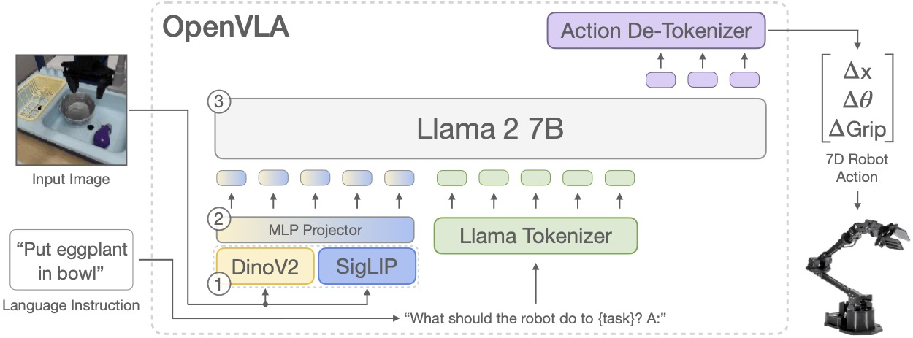
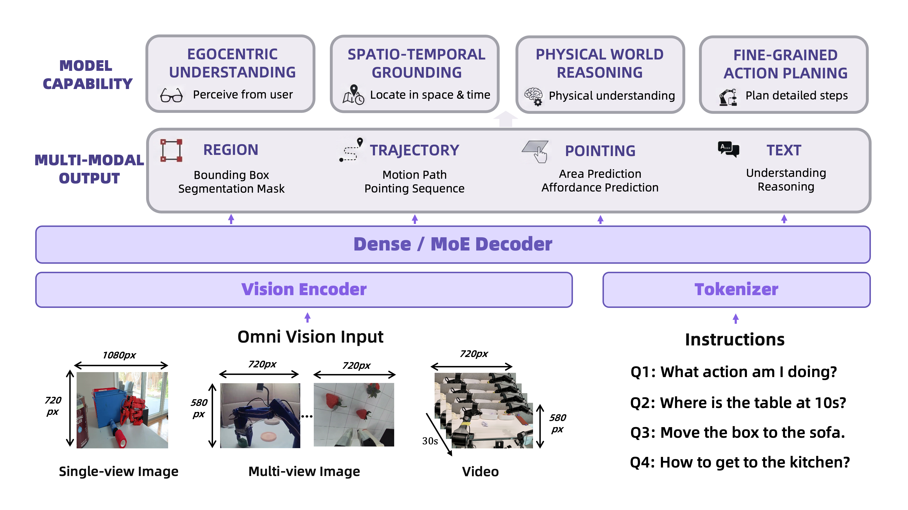
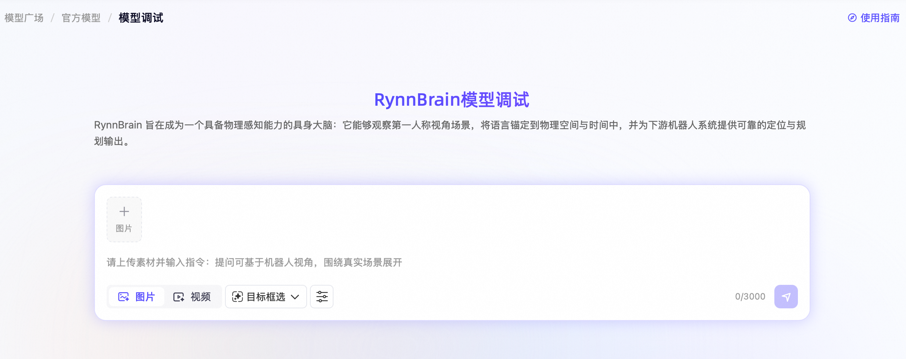
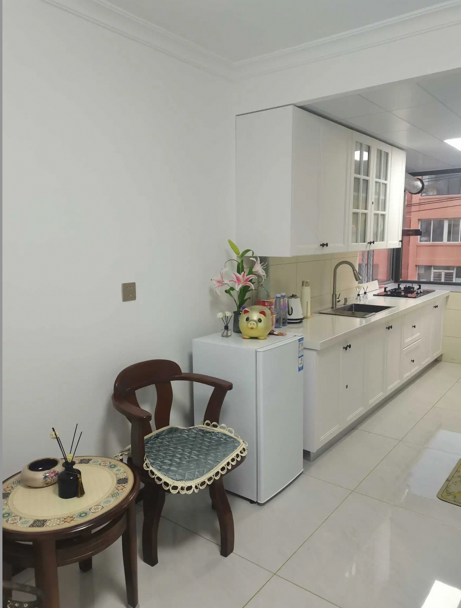
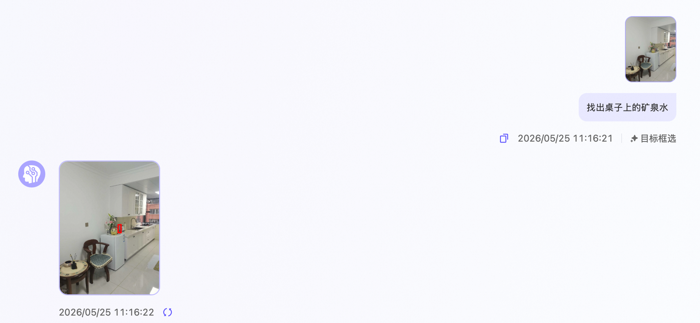
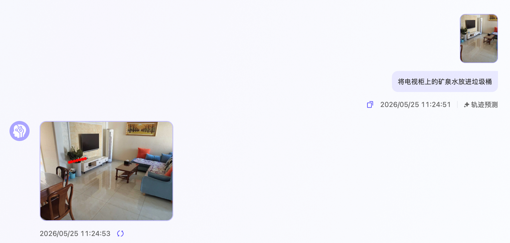
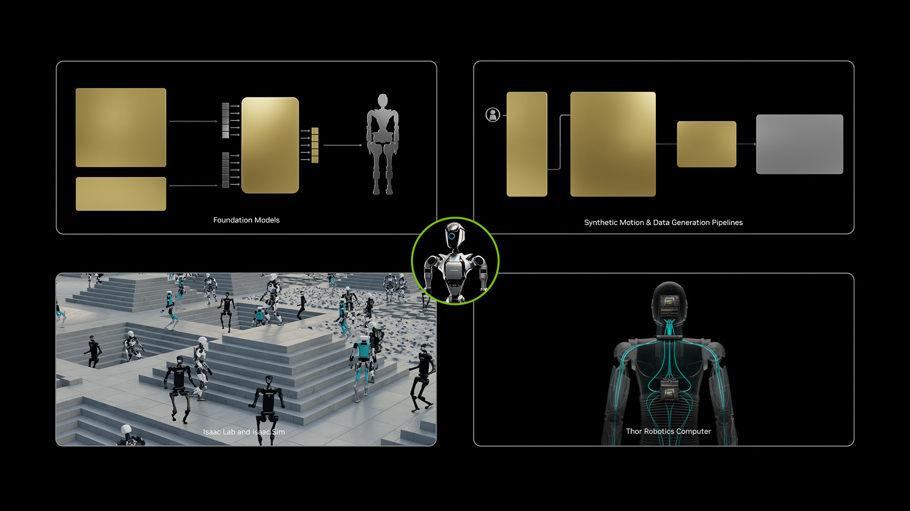

# **Task 02: 技术透视**

## **1. 这一节为什么重要**

很多学习者在第一次接触具身智能时，都会很快遇到几个高频词：VLA、世界模型、VLM、行为基础模型、端云协同。问题在于，这些词在新闻报道和项目介绍里经常被并列摆放，但真正开始学习时，初学者往往并不清楚它们之间究竟是什么关系。比如，VLA 和世界模型到底是不是同一类东西？RynnBrain 是一个动作模型，还是一个更偏“具身大脑”的模型？为什么同样是机器人任务，有的工作强调端到端预测动作，有的工作却强调内部建模和推理？

这一节的目标，就是把这些概念从“听起来很热”的名词，变成可以真正拿来理解模型结构的工具。读完这一节之后，你不需要立刻掌握论文中的所有训练细节，但至少应该建立一种稳定的判断：哪些方法更像“看到之后直接做”，哪些方法更像“先在内部形成对环境的理解，再决定该怎么做”，而达摩院在这个专题中强调的 RynnBrain，又是怎样把“看懂场景”“理解空间”“规划动作”连在一起的。

## **2. 从传统控制到具身大模型**

可以把具身系统先看成一个基本闭环：

```
flowchart LR
    A["感知 Perception"] --> B["理解与推理 Cognition"]
    B --> C["规划与决策 Planning"]
    C --> D["动作执行 Action"]
    D --> E["环境反馈 Feedback"]
    E --> A
```

过去很多机器人系统依赖规则控制、传统规划器和专用策略网络。它们往往在某个任务上表现稳定，但迁移能力有限，也很难直接理解自然语言指令。近年来大模型进入具身领域后，一个明显变化是：感知、理解、规划和动作之间原本高度分散的模块，开始被重新组织到更统一的框架中。也正因为如此，今天讨论具身智能时，大家不再只谈控制器和规划器，而是开始谈模型范式本身。

## **3. 什么是 VLA**

VLA 是 `Vision-Language-Action` 的缩写。最直白的理解方式是：它试图把视觉输入、语言指令和动作输出放进一个统一模型里，让系统直接从“我看到了什么、我被要求做什么”，走到“我下一步该怎么动”。

给模型一张图像、一个文本指令，再加上一些机器人自身状态，让它直接预测下一步动作或动作序列。

从任务角度看，VLA 试图同时解决三件事。第一，它要从图像或视频中提取与任务有关的环境信息；第二，它要理解语言中的目标和约束，比如“把茄子放进碗里”到底要求抓什么、放哪里；第三，它还要把前两者综合起来，变成可以执行的动作表示。这也是为什么 VLA 在近两年会迅速成为具身智能领域的核心关键词之一，因为它非常贴近“机器人听懂一句话并真的去做”的直觉场景。

### **3.1 VLA 的基本工作方式**

```
flowchart LR
    A["视觉输入\n相机图像 / 视频"] --> D["统一模型"]
    B["语言输入\n任务指令"] --> D
    C["机器人状态\n关节角 / 末端位姿 / 触觉等"] --> D
    D --> E["动作输出\nAction Token / 连续动作 / 动作块"]
```

### **3.2 为什么 VLA 重要**

VLA 之所以重要，不在于它单纯把三个词拼在了一起，而在于它确实把“看、听懂、动起来”组织成了一个共同训练、共同推理的问题。这样做的好处是显而易见的：一方面，它天然适合语言驱动的机器人操作任务；另一方面，它也更容易从多任务示范数据中学习相对通用的技能表示。对于学习者来说，VLA 的价值就在于它把原本分散的问题压缩成了一个更直观的范式。

### **3.3 VLA 的典型限制**

但 VLA 也绝不是“有了就万事大吉”的方案。它当前最典型的问题，恰恰来自真实世界的复杂性。首先，它通常对训练数据分布比较敏感，训练里见得多的任务容易学得快，没见过的细节则容易出问题。其次，很多 VLA 模型在长时序任务中会积累误差，因为一步动作的偏差往往会影响后面所有步骤。再次，虽然模型能从图像里学到很多信息，但对三维空间结构、物理约束和接触关系的显式建模往往还不够强。也正因为这些局限，研究者才会继续探索世界模型、显式空间表示以及更强的规划机制。

### **3.4 官方示意图：OpenVLA**



OpenVLA 架构示意图

来源：[**OpenVLA 官方项目页**](https://openvla.github.io/)

如果把这张 OpenVLA 架构图当成一张“教学图”来读，最重要的不是记住每个模块的名字，而是看清它的数据流。图的左侧是输入：上面是一张场景图像，下面是一句自然语言指令，例如“把茄子放进碗里”。中间是模型主体，底层可以看到 DinoV2 和 SigLIP 两个视觉模块，它们负责从图像中抽取不同类型的视觉特征；这些视觉特征经过中间的 `MLP Projector` 投影后，被组织成可以送入 Llama 2 7B 的表示。与此同时，语言指令经过 tokenizer 也被编码成语言 token。最终，视觉 token 和语言 token 在同一个大语言模型框架中共同参与推理。

图中最值得注意的是右上角的 `Action De-Tokenizer`。这意味着 OpenVLA 并不是让 Llama 2 直接输出电机控制信号，而是先把动作表示成一种可被模型预测的 token，再把这些 token 反解为机器人的 7 维动作，例如位置增量、角度增量和夹爪开合等。换句话说，这张图非常清楚地展示了 VLA 的核心思想：先把“看见的”和“听见的”统一成模型可以处理的 token，再把模型输出翻译回机器人可以执行的动作。

图中标出的 `1-2-3` 也很适合拿来帮助初学者理解整个流程。`1` 对应视觉编码阶段，也就是从图像中提取语义与空间特征；`2` 对应特征对齐阶段，也就是把视觉信息映射到语言模型可接受的表示空间；`3` 对应统一推理阶段，也就是让视觉和语言在同一个主干模型中共同决定下一步动作。这正是“VLA 为什么会被叫做视觉-语言-动作一体化模型”的最好说明。

### **3.5 进一步阅读**

- VLA 综述与模型谱系： [**01VLA相关总结综述**](../../06-策略抓取或抓取VLA/01VLA相关总结综述.md)

## **4. 什么是世界模型**

如果说 VLA 更强调“看到指令后直接出动作”，那么世界模型更强调“先在内部形成对环境变化的预测，再据此规划动作”。这个区别非常关键，因为它对应着两种不同的智能观。

先在内部构建一个对环境变化的预测机制，再据此规划动作。

你可以把它理解成机器人在“脑内先演练一遍”。

### **4.1 世界模型到底在建什么**

世界模型通常会尝试建模三类关系：当前环境状态是什么、某个动作执行后环境会如何变化、在若干可能的未来演化中哪条路径更接近目标。对于机器人来说，这相当于在真正出手之前，先在内部“想一遍”接下来会发生什么。它不是简单的反应系统，而更像一个带有内部模拟器的决策系统。

### **4.2 世界模型的核心价值**

世界模型之所以被很多研究者看重，是因为真实世界里的任务往往不是一步就能完成的。机械臂抓取前需要判断物体的朝向和周围障碍物，导航系统前进时需要估计几秒后的可行路径，双臂协作时还要考虑动作之间的时序耦合。在这些任务里，只依赖“看到什么就输出什么”很容易出错，而内部预测可以显著提升规划能力。

### **4.3 一个便于理解的世界模型示意**

```
flowchart LR
    A["当前观测 o_t"] --> B["状态表示 / 潜变量 s_t"]
    B --> C["世界模型\n预测下一状态"]
    D["动作 a_t"] --> C
    C --> E["预测的未来状态 s_t+1"]
    E --> F["规划器 / 价值判断"]
    F --> G["选择更优动作"]
    G --> D
```

### **4.4 为什么很多人会把世界模型看得很重要**

真实世界不是一张静止图片，而是一个会持续演化的系统。目标物会移动，动作顺序会改变后续状态，多步任务中的早期错误还会不断放大。世界模型的价值就在于，它更适合处理这种“动作会改变世界”的问题。也正因为如此，很多研究者会把世界模型理解为具身智能从“反应式系统”迈向“规划式系统”的一个关键方向。

## **5. VLA 和世界模型到底差在哪**

可以先用下面这张表把概念分开。读表时不要把它理解成简单的二选一，而应该把它看作两种建模重心的对比：

| **维度** | **VLA**                           | **世界模型**                   |
| -------- | --------------------------------- | ------------------------------ |
| 核心目标 | 直接从视觉/语言生成动作           | 显式预测环境演化并辅助规划     |
| 强项     | 指令理解、多任务映射、端到端统一  | 长时序推演、状态预测、规划     |
| 常见问题 | 长链路误差积累、空间/物理建模不足 | 训练复杂、状态表示和规划设计难 |
| 更像什么 | “看到后直接做”                    | “先想一遍再做”                 |

现实系统里，这两类方法并不是非此即彼。越来越多工作会在一个统一系统里同时使用端到端动作预测和内部世界建模。换句话说，VLA 与世界模型并不是互相排斥的标签，而是可以互补的技术取向。

## **6. 达摩院 RynnBrain：为什么它值得单独看**

RynnBrain 更适合放在“VLM + 世界模型增强”这条线上理解。与其把它想成一个只负责输出动作的模型，不如把它理解成一个更偏“具身大脑”的系统：它不仅要识别和回答，更要定位、理解、推理和组织任务。

### **6.1 官方架构图**



RynnBrain 官方架构图

来源：[**RynnBrain 官方项目页**](https://alibaba-damo-academy.github.io/RynnBrain.github.io/)

这张图非常适合做精读。最底部是输入层，左边写着 `Omni Vision Input`，明确列出了单视角图像、多视角图像和视频三类视觉输入；右边是指令输入，例如“我在做什么动作？”“10 秒时桌子在哪里？”“把盒子移到沙发上。”这些示例已经隐含地告诉我们，RynnBrain 面向的并不是单一任务，而是识别、定位、操作和导航等多种具身问题。

再往上一层，是 `Vision Encoder` 和 `Tokenizer`。这说明 RynnBrain 先把视觉信息和语言指令分别编码，再送入中间的大型解码器。中间那条最宽的 `Dense / MoE Decoder` 是全图的核心，它代表系统不是简单做单一输出，而是在统一的解码框架里支撑多种下游能力。图中间的“多模态输出”部分尤其值得注意，它不是单一的动作向量，而是被拆成了 `Region`、`Trajectory`、`Pointing` 和 `Text` 四种形式。也就是说，RynnBrain 的输出既可以是目标区域框和分割掩码，也可以是运动轨迹和指向区域，还可以是文本层的理解与推理结果。

最上方的 `Model Capability` 则进一步解释了这种多模态输出是为了解决什么问题。`Egocentric Understanding` 对应第一视角理解，说明模型能从用户视角理解场景；`Spatio-Temporal Grounding` 强调时空定位能力，说明它不仅知道“是什么”，还知道“在哪里、在什么时候”；`Physical World Reasoning` 强调物理世界理解，这意味着模型的推理不是停留在抽象语义层，而是要和物体、空间、动作约束结合；`Fine-Grained Action Planning` 则说明它最终仍然要回到精细动作规划上。这样一来，这张图实际上就把 RynnBrain 的定位说得很清楚了：它不是单纯的问答模型，也不是单纯的动作模型，而是一个能够把理解、定位、推理和规划连成一体的具身基础模型。

也正因为如此，RynnBrain 和普通 VLA 的差异可以更准确地表述为：普通 VLA 更强调从当前输入到动作输出的统一映射，而 RynnBrain 更强调跨时间的场景组织、对空间对象的显式定位，以及由此支撑的任务编排能力。初学者如果只记住三个关键词就足够了，那就是“时空记忆”“空间推理”“任务编排”。

项目Demo演示

### **6.2 体验RynnBrain模型**

RynnBrain 是一个具备物理感知能力的具身大脑：它能够观察第一人称视角场景，将语言锚定到物理空间与时间中，并为下游机器人系统提供可靠的定位与规划输出。

👉🏻体验链接：[RynnBrain模型体验](https://developer.damo-academy.com/allSpark/model/rynnBrainExperience?modelId=183456791d8d4378925e9f29388b81bb&workspaceId=EFnKQ5eSb)



现在，你可以拍摄或上传一张真实环境的图片或者一段视频，让RynnBrain 以第一视角进行通用问答、可操作点检测、目标框选、轨迹预测、区域预测。

| 能力         | 描述                                                         |
| ------------ | ------------------------------------------------------------ |
| 通用问答     | 适用于常规对话和开放式问题，模型将根据指令灵活判断，直接回复文本或在图片上进行相应的视觉标记 |
| 可操作点检测 | 识别物体上最适合交互的关键点，并在图片对应位置标记出醒目的高亮圆点，直观指示操作落点 |
| 目标框选     | 根据指令定位目标物体，并在图片上绘制矩形边框将该物体框选出来，清晰界定目标范围 |
| 轨迹预测     | 根据指令规划物体从起点到终点的运动路径，并在图片上标记出路径上的关键路径点，直观展示物体的移动轨迹 |
| 区域预测     | 识别图像中满足条件的特定区域，并在该区域内部散布标记多个关键点，直观展示该空间的有效范围 |

| **示例一：目标框选**                                       |                                                              |
| ------------------------------------------------------------ | ------------------------------------------------------------ |
| 拍摄一张家庭厨房照片，让机器人以第一视角识别。提示词：找出桌子上的矿泉水。 | 回答：RynnBrain结合场景识别桌子上的矿泉水，并标记出来。 |
| **示例二：轨迹预测**                                       |                                                              |
| 拍摄一张家庭客厅照片，让机器人以第一视角识别。提示词：将电视柜上的矿泉水放进垃圾桶 | 回答：RynnBrain结合场景识别电视柜上的矿泉水和电视柜旁的垃圾桶，并标记出运动轨迹。 |

相关文章：[RynnBrian模型调用参考文档](https://developer.damo-academy.com/documentation?id=100)

## **7. RynnRCP：为什么还需要协议层**

模型再强，也不能自动解决机器人系统的碎片化问题。真正落地时，你仍然要面对不同机器人接口不统一、传感器类型不同、控制链路和推理链路不同步、端侧实时性和云侧算力冲突等问题。RynnRCP（Robotics Context Protocol） 的意义，正是在模型之下补上一层更工程化的连接机制。

可以先把 RynnRCP 理解成：让模型、传感器、动作模块更容易接起来的一层协议和工具接口。它不是在和模型竞争，而是在帮模型获得稳定的“手脚”和“感觉器官”。

```
flowchart TD
    A["LLM / VLM / RynnBrain"] --> B["RynnRCP"]
    B --> C["Robot Server"]
    B --> D["Sensor Server"]
    B --> E["Action Server"]
    D --> A
    E --> A
```

它的意义不是“替代模型”，而是“让模型能更顺畅地接入真实机器人系统”。这一点对初学者尤其重要，因为很多人刚接触具身智能时，会误以为只要模型够强，系统就自然能跑起来。实际上，协议层、接口层和系统集成层，往往决定了模型能不能真正进入真实场景。

## **8. 官方示意图：NVIDIA GR00T**

下面这张图更适合从“生态闭环”的角度来读，而不是把它当作单个模型的细节架构图。它展示的重点不是某一个网络内部怎么连，而是 NVIDIA 如何把基础模型、合成数据、仿真平台和机器人计算平台组织成一个统一体系：



NVIDIA GR00T 官方图

来源：[**NVIDIA Isaac GR00T 官方页面**](https://developer.nvidia.com/project-GR00T)

图的左上部分是 `Foundation Models`，说明模型本身是这个体系的核心之一；右上部分是 `Synthetic Motion & Data Generation Pipelines`，强调合成动作和合成数据生成；左下部分是 `Isaac Lab and Isaac Sim`，说明仿真平台承担了训练、验证和生成的重要角色；右下部分是 `Thor Robotics Computer`，则对应真实机器人上的端侧计算平台。中间被绿色圆圈框出的机器人形象，相当于把这四块连接起来的焦点：模型不是孤立训练、孤立部署的，而是嵌在一个“模型-数据-仿真-硬件”闭环中。

这张图之所以值得放进教材，是因为它提醒学习者一件非常重要的事：今天的具身智能，讨论的早已不是单个算法，而是完整的技术栈。谁能更高效地组织模型、仿真、数据和硬件，谁就更有可能把系统推向可复现和可落地。

## **9. 本节小结**

如果你只记住一句话，可以记这个：

VLA 更像“直接把看见的和听到的映射成动作”，世界模型更像“先预测世界会怎么变，再决定动作怎么做”。

而 RynnBrain 这类系统的重要价值，就在于把更强的理解、记忆和空间推理能力带回到具身任务里。它们让我们看到，具身智能未来的关键竞争力，不会只是“能不能出动作”，而是“能不能先看懂世界，再稳定而细致地组织动作”。

## **10. 当日任务**

### **任务 1**

体验 RynnBrain Demo，重点观察：

- 它是不是只会回答问题
- 它是否体现了场景理解和空间定位
- 它和你想象中的“动作模型”有什么区别

直达链接：[**RynnBrain模型体验**](https://developer.damo-academy.com/allSpark/model/rynnBrainExperience?modelId=183456791d8d4378925e9f29388b81bb&workspaceId=EFnKQ5eSb)

### **任务 2**

写一个简短记录，任选一种形式。你可以用三到五句话解释 VLA 和世界模型的差异，也可以整理一个小表格，对比 Pi0、GR00T、RynnBrain 三者分别更强调什么能力。这里的重点不是求全，而是检验你是否已经建立起了“不同模型范式解决的是不同层面问题”这一判断。

## **11. 延伸阅读**

- VLA 模型综述： [**01VLA相关总结综述**](../../06-策略抓取或抓取VLA/01VLA相关总结综述.md)
- GR00T 介绍： [**Isaac-GR00T README**](../../10-具身智能其他仿真工具及仿真前沿/Isaac-GR00T/README.md)
