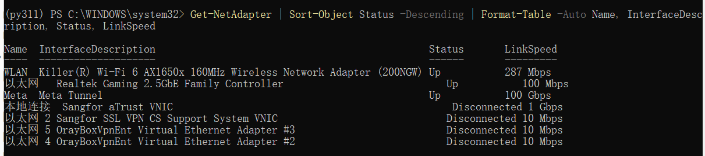
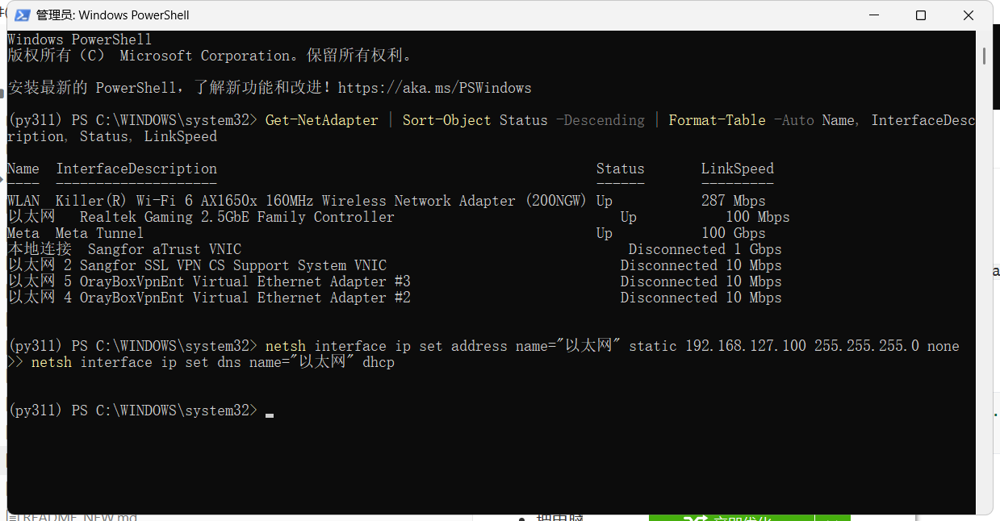
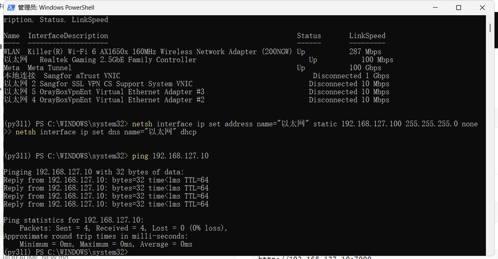
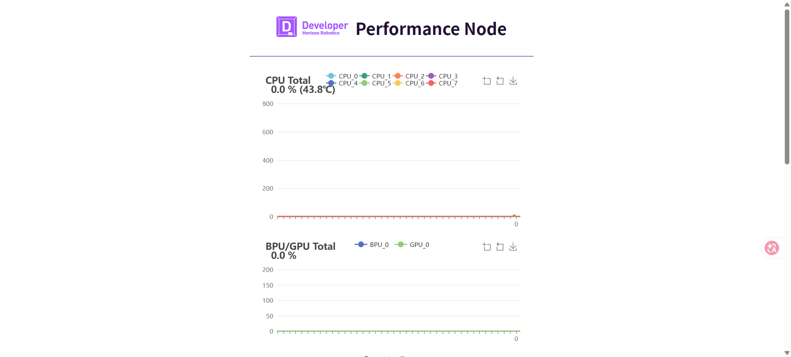
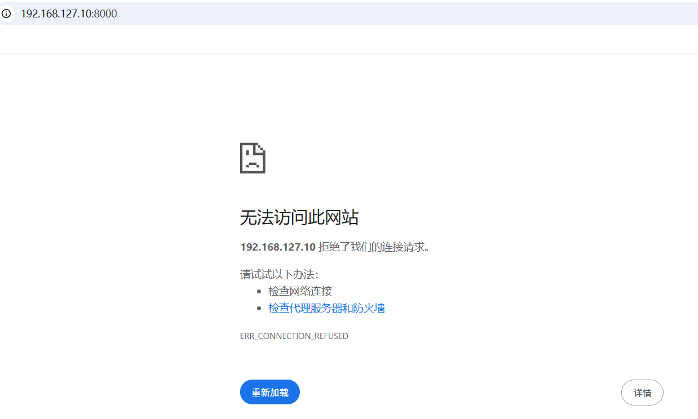
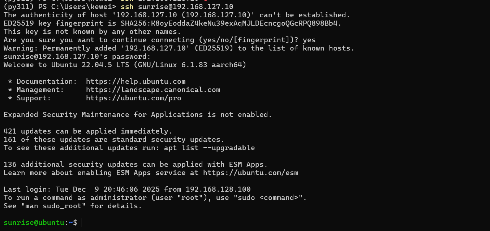
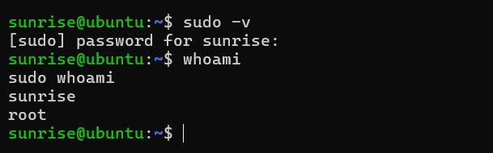

# README 02：有线网口连接与登录

这一章专门解决一个很实际的问题：在不依赖闪连的情况下，如何通过网线把 Windows 电脑和 Magicbox 稳定连起来，并完成第一次登录。对于长期开发而言，这通常比闪连更稳，也更符合真实工作流。

## 一、本章采用的网络前提

本教程默认采用下面这套连接方式：

电脑通过 `WLAN` 连接校园网或互联网。  
电脑通过 `以太网` 直连 Magicbox。  
Magicbox 作为一个独立私有网段设备，通过固定地址和电脑通信。

只要你的校园网走的是 `Wi-Fi`，那么把 `以太网` 这张网卡改成静态地址，通常不会影响校园网连接。原因在于这里只修改直连开发板的那张有线网卡，而且不为它设置默认网关。这样 Windows 依旧会优先通过 `WLAN` 出网，而 `以太网` 只承担与开发板通信的职责。

官方快速入门页面的本地归档如下：

`./assets/official_pages/quickstart.html`

在线地址如下：

`https://d-robotics.github.io/magicbox_doc/quickstart`

## 二、先明确两个地址，不要混用

Magicbox 的网络体验里最容易让初学者混乱的地方，就是把闪连地址和有线地址混成一个概念。其实官方已经给得很明确。

如果你采用闪连方式，开发板地址是：

```text
192.168.128.10
```

如果你采用有线网口直连方式，开发板地址是：

```text
192.168.127.10
```

本章只讨论第二种，也就是有线直连。因此，后续所有 `ping`、浏览器访问和 `ssh` 登录，都应优先以 `192.168.127.10` 为准。

## 三、先判断你改的是不是正确那张网卡

你电脑里可能同时存在 Wi-Fi、以太网、VPN 虚拟网卡以及其他软件网卡。真正需要修改的，只是那张物理有线网卡。

在 PowerShell 中执行：

```powershell
Get-NetAdapter | Sort-Object Status -Descending | Format-Table -Auto Name, InterfaceDescription, Status, LinkSpeed
```

如果你看到类似下面的结果：

```text
以太网   Realtek Gaming 2.5GbE Family Controller   Up
```

那么这通常就是直连开发板的那张网卡。



这一步很关键。因为如果改错了网卡，要么不会连上板子，要么会把原本正常的网络环境改乱。

## 四、为什么电脑需要手动改成静态地址

当电脑用网线直连 Magicbox 时，两端之间通常没有路由器、DHCP 服务器或校园网认证设备来自动分配地址。如果此时电脑保持“自动获取 IP”，Windows 往往会给自己分配一个 `169.254.x.x` 的链路本地地址。这个地址段和 Magicbox 的默认有线地址 `192.168.127.10` 不在同一网段，因此双方无法直接通信。

所以，必须把电脑的这张有线网卡手动改到 `192.168.127.x` 网段。

## 五、Windows 端正确的有线配置方式

这一步必须使用管理员权限执行。普通权限下修改网络配置，系统会直接报错：`The requested operation requires elevation`。

如果你的网卡名称就是 `以太网`，可以直接在管理员 PowerShell 或管理员 CMD 中执行：

```cmd
netsh interface ip set address name="以太网" static 192.168.127.100 255.255.255.0 none
netsh interface ip set dns name="以太网" dhcp
```

这里的含义非常简单：

电脑地址设为 `192.168.127.100`。  
子网掩码设为 `255.255.255.0`。  
默认网关留空。  
DNS 保持自动。



如果你的网卡名字不是“以太网”，应先执行：

```powershell
Get-NetAdapter
```

然后把命令中的 `"以太网"` 改成实际名称。

## 六、改完之后如何验证链路已经打通

修改完成后，第一步不是先打开浏览器，而是先做最简单的网络探测：

```powershell
ping 192.168.127.10
```



如果 `ping` 能通，说明电脑和开发板之间的二层、三层通信已经建立。接下来可以再验证两个网页入口：

```text
http://192.168.127.10:7999
http://192.168.127.10:8000
```

其中 `7999` 是资源监控页面，`8000` 是示例显示页面。





这里需要补一句更准确的话：`8000` 不是永远都会显示内容。它通常依赖相应的示例应用已经被启动。因此，如果你能 `ping` 通、`7999` 能打开，但 `8000` 当前没有内容，不应立刻判断设备异常，而应继续看第三章中的按钮启动流程。

## 七、第一次 SSH 登录应该怎么做

在大多数官方预置系统中，建议优先使用普通用户登录，而不是直接上 `root`。因为后续写教程、装依赖、拉仓库、调试脚本时，普通用户配合 `sudo` 的方式更接近标准 Linux 开发流程，也更安全。

建议先执行：

```bash
ssh sunrise@192.168.127.10
```

常见默认凭据如下：

```text
用户名: sunrise
密码: sunrise
```

如果确实需要以 root 直接登录，再使用：

```bash
ssh root@192.168.127.10
```

常见默认 root 凭据如下：

```text
用户名: root
密码: root
```



## 八、普通用户、root 和 sudo 之间如何选择

在实际开发中，最好先区分这三者的职责，而不是简单地认为“哪个都能用”。

普通用户 `sunrise` 适合日常开发，包括登录、查看目录、拉源码、运行普通命令和维护自己的工作区。  
`sudo` 适合需要管理员权限但仍希望保留标准工作流的场景，例如安装软件、修改系统配置或操作服务。  
`root` 更适合系统级维护、权限排障和极少数必须直接进入超级用户环境的任务。

因此，本教程推荐的默认路径是：

```bash
ssh sunrise@192.168.127.10
sudo -v
sudo -i
```

如果系统给 `sunrise` 配置了 sudo 权限，那么输入其自身密码即可完成提权：

```text
sunrise
```

## 九、如何验证 sudo 权限是否正常

登录后先执行：

```bash
sudo -v
```

再执行：

```bash
whoami
sudo whoami
```

如果输出分别是：

```text
sunrise
root
```

那就说明普通用户提权流程正常。



## 十、如果后面不再直连开发板，怎么恢复自动获取地址

有时候你完成了开发板调试，想把这张有线网卡恢复成普通联网网卡。这时不需要手动去点很多界面，直接用管理员终端执行下面两条命令即可：

```cmd
netsh interface ip set address name="以太网" dhcp
netsh interface ip set dns name="以太网" dhcp
```

本项目根目录还放了两个辅助脚本，可直接使用：

`./set_magicbox_wired_static.cmd`  
`./reset_magicbox_wired_dhcp.cmd`

## 十一、本章结束时应该达到的状态

如果这一章操作正确，你应该已经具备以下能力。

首先，你能稳定地区分闪连地址和有线地址，不再混用 `192.168.128.10` 与 `192.168.127.10`。  
其次，你能从 Windows 端稳定 `ping` 通开发板。  
再次，你能够通过 `ssh sunrise@192.168.127.10` 登录系统。  
最后，你已经具备后续运行按钮启动功能和查看预置目录结构的基础条件。

到这里，Magicbox 才算真正进入“可操作、可调试、可继续开发”的状态。
