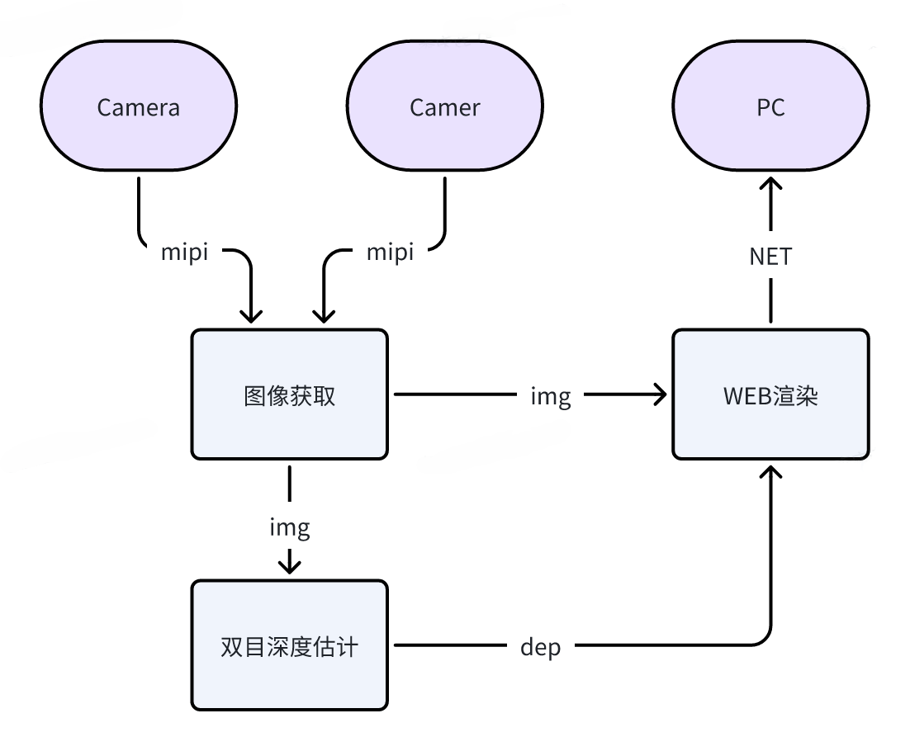
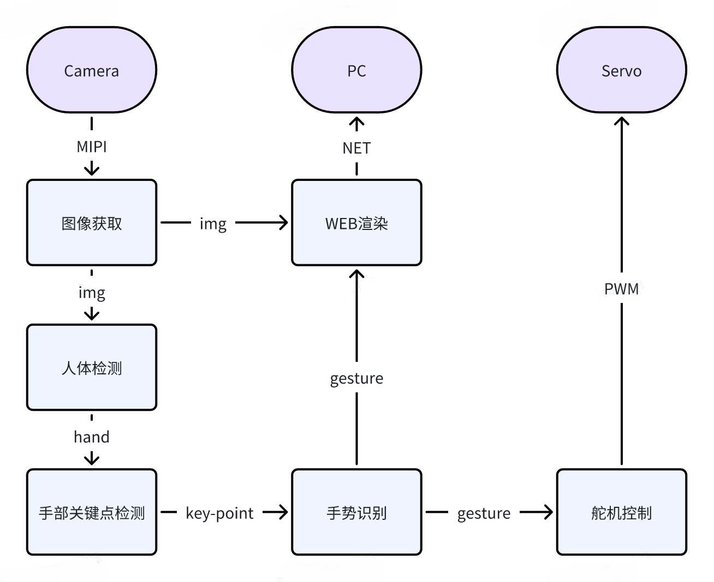

# README 04：算法 Demo：双目深度与手势交互

完成这一章后，读者应该能独立跑通两个视觉 Demo。第一个 Demo 是双目深度，它回答的是“设备能不能看出空间远近”；第二个 Demo 是手势交互，它回答的是“设备能不能看懂人的手势并驱动板载动作”。本章先把功能跑起来，再解释它们各自对应的源码入口、数据流和观察方法。

## 一、本章开始前，先确认四个前提

本章默认你已经完成前三章，并满足下面四个条件。

第一，开发板已经正常开机，并且你可以通过 SSH 登录，例如：

```bash
ssh sunrise@192.168.127.10
```

第二，系统时间已经校正到当前真实时间。如果系统时间仍然停留在 `2000-01-01`，很多日志都会失真，也会影响后续联网能力。先确认：

```bash
date
```

如果时间不对，建议在 Windows 侧执行：

```powershell
powershell -ExecutionPolicy Bypass -File "C:\Users\kewei\Documents\2026\202603\06地瓜机器人新版教程桌宠\openclaw_magicbox\tools\sync_magicbox_time.ps1"
```

第三，双目相机已经接好，且没有左右线接反。对于 RDK X5 Magicbox，双目 Demo 不只是软件问题，相机连接状态本身就会直接决定后续结果。

第四，建议你用普通用户 `sunrise` 操作，在需要时配合 `sudo`。本章命令默认都以 `sunrise` 用户执行。

## 二、为什么这一章不要求先按按钮

很多读者第一次接触 Magicbox 时，会先从左键、中键、右键这三种预置模式入手。这种方式适合体验，但不适合作为本章的主线。原因并不复杂。

按钮模式的优点，是快。系统开机后，按一下左键，就能尝试进入双目模式；按一下中键，就能尝试进入手势模式。对于第一次上手的人，这种体验很好。

但学习算法 Demo 不能只追求“快”，还必须追求“可复现、可排障、可解释源码”。按钮模式背后其实不是一个单独的算法命令，而是一整条预置启动链。系统先由 `magicbox-start` 服务拉起 `/userdata/magicbox/launch/start.sh`，再由 `start.sh` 设置环境变量、加载工作区、启动基础模块，最后 `start.py` 根据按键事件去决定执行哪一个功能脚本。

也就是说，按钮模式更像一个“产品入口”，而本章采用的是“学习入口”。学习入口必须让读者知道命令究竟在哪里执行，环境变量由谁设置，真正启动算法的是哪个脚本，失败以后该先查哪一层。因此，本章采用的路径是：

先讲手工启动，因为它更适合学习和排障；再解释这个手工启动和按钮模式之间的关系。等你把这一章跑通以后，再回头看按钮模式，就会知道它只是把这些步骤打包到了一起。

## 三、本章涉及哪些资料和仓库

本章主要对应两份官方文档和两个本地仓库。

- 双目深度官方页面归档：`./page_algorithm-development_stereo-depth.html`
- 手势交互官方页面归档：`./page_algorithm-development_gesture-interaction.html`
- 双目深度仓库：`./repos/hobot_stereonet`
- 手势交互仓库：`./repos/magicbox_gesture_interaction`

如果你只打算先跑通，不需要一开始就通读源码。建议先把功能跑起来，确认现象正确，再回头看源码入口。

## 四、双目深度 Demo：先跑通，再看结果

双目深度的输入是左右两路相机图像，输出是深度图和网页可视化结果。对初学者来说，最重要的不是先理解立体匹配原理，而是先建立一条清楚的运行链：双摄输入，算法推理，网页显示。



来源：D-Robotics Magicbox 双目深度官方文档，本地图像归档于 `./assets/official_images/Depth-Estimatio-Architecture-Diagram.png`。

### 1. 先修复日志目录权限

你这次实际运行时已经验证过，`hobot_stereonet` 的通用 launch 文件会把 ROS 日志目录固定写成 `/userdata/.roslog`。对应源码在：

- `repos/hobot_stereonet/launch/stereonet_model_web_visual.launch.py`

其中有一行：

```python
os.environ['ROS_LOG_DIR'] = '/userdata/.roslog'
```

如果这个目录不存在，或者 `sunrise` 用户没有写权限，进程会直接因为日志文件无法创建而退出。先执行：

```bash
sudo mkdir -p /userdata/.roslog
sudo chown sunrise:sunrise /userdata/.roslog
```

只要这一步没做，后面的双目命令即使写得正确，也会报：

```text
Failed opening file /userdata/.roslog/... Permission denied
```

### 2. 原厂按钮模式到底启动了什么

原厂按钮模式不是直接运行一条简单的 `ros2 launch`，而是走下面这条链路：

```text
magicbox-start
-> /userdata/magicbox/launch/start.sh
-> /userdata/magicbox/launch/start.py
-> app/ros_ws/src/magicbox/hobot_stereonet/script/run_stereo.sh
```

其中，左键模式在 `start.py` 里调用的是：

```bash
bash app/ros_ws/src/magicbox/hobot_stereonet/script/run_stereo.sh \
  --mipi_rotation 0.0 \
  --stereonet_version v2.4_int8 \
  --camera_info_topic /image_combine_raw/right/camera_info
```

这一点非常重要。因为它解释了一个很多读者都会遇到的困惑：为什么按按钮能跑，自己手敲一条 `ros2 launch ...` 却不完全等价。答案是，按钮模式前面已经经过了 `start.sh` 这层环境准备，而你单独敲命令时，这些上下文并不会自动存在。

### 3. 推荐使用哪一种手工启动方式

对教程来说，最稳妥的做法不是直接写一条最短命令，而是写“与原厂按钮模式等价”的手工启动方式。建议在下面这个目录执行：

```bash
cd /userdata/magicbox
```

然后完整执行：

(建议这些所有命令都以根权限执行。)

```bash
sudo su -
export RMW_IMPLEMENTATION=rmw_fastrtps_cpp
export LD_LIBRARY_PATH=/userdata/magicbox/app/ros_ws/install/qwen_llm/lib:$LD_LIBRARY_PATH
export HOME=/userdata/magicbox
export ROS_LOG_DIR=/userdata/magicbox/log
mkdir -p /userdata/magicbox/log
source /opt/tros/humble/setup.bash
source /userdata/magicbox/app/ros_ws/install/local_setup.bash
bash app/ros_ws/src/magicbox/hobot_stereonet/script/run_stereo.sh \
  --mipi_rotation 0.0 \
  --stereonet_version v2.4_int8 \
  --camera_info_topic /image_combine_raw/right/camera_info
```

这组命令之所以推荐，是因为它尽量还原了原厂按钮模式真正依赖的环境，而不是只调用某个单独 launch 文件。

### 4. 为什么不要直接用 `sudo ros2 launch ...`

实际测试过下面这种写法：

```bash
sudo -E env "PATH=$PATH" ros2 launch hobot_stereonet stereonet_model_web_visual_v2.4_int16.launch.py
```

它会报 `ros2cli` 找不到。这个报错不是算法包损坏，而是 `sudo` 之后 Python 侧的 ROS2 命令环境没有被完整继承，导致：

```text
importlib.metadata.PackageNotFoundError: No package metadata was found for ros2cli
```

因此，这一章不建议把“直接 sudo 跑 ros2”写成标准答案。更可靠的方法，是用普通用户加载正确环境，然后运行与原厂一致的脚本。

### 5. 启动后应该到哪里看结果

双目深度的网页入口通常是：

```text
http://192.168.127.10:8000
```

在某些版本里，也可能自动跳到：

```text
http://192.168.127.10:8000/TogetherROS/
```

这两个地址都属于同一套可视化入口。只要相机链路和后端图像流正常，页面就会显示深度相关结果。

### 6. 为什么网页是紫色的，但没有内容

看到的紫色页面，并不是网页服务没启动，而是网页前端加载出来了，但后端没有收到图像流。

你后面的日志已经把原因写得很明确：

```text
[init]->cap capture init failture.
[init]->mipinode init failure.
Error opening GPIO direction file for writing
Failed to set GPIO direction
Expected Chip ID ... Actual Chip ID Read ...
create_and_run_vflow failed, ret -10
```

这说明真正的问题不在浏览器，而在相机初始化阶段。`mipi_cam` 没有成功起来，后面的 `hobot_codec_republish` 和 `websocket` 就只能持续报“5 秒内未收到图像数据”。

因此，本章必须明确告诉读者：

如果网页是紫色空壳、没有图像，不要先怀疑网页地址写错，而要先回终端看 `mipi_cam` 是否已经退出。

### 7. 跑通以后，读者应该看到什么

双目深度跑通以后，至少要确认三件事。

第一，终端中的 `mipi_cam`、`stereonet_model_node`、`hobot_codec_republish` 和 `websocket` 不再因为权限或初始化问题退出。

第二，浏览器能打开 `http://192.168.127.10:8000`，并且页面不再只是紫色空白壳，而是开始显示持续更新的图像结果。

第三，把相机对准不同距离的物体时，深度效果会发生可观察的变化，而不是始终静止不变。

只要这三件事都成立，就可以认为双目深度 Demo 已经真正跑起来了。

### 8. 如果结果不对，先查哪几项

如果你的结果和这里不一样，优先按下面顺序检查。

第一，确认日志目录权限是否正确：

```bash
ls -ld /userdata/.roslog /userdata/magicbox/log
```

第二，确认相机是否真的被系统识别：

```bash
i2cdetect -r -y 4
i2cdetect -r -y 6
```

第三，确认 `mipi_cam` 是否已经退出。如果它退出了，网页就一定不会有正常图像。

第四，再去看网页入口，而不是反过来先怀疑前端页面。

## 五、双目深度的源码主线应该怎么看

如果读者想理解它为什么能工作，建议抓三层。

第一层是原厂总入口：

- `/userdata/magicbox/launch/start.sh`
- `/userdata/magicbox/launch/start.py`

它们说明了按钮模式到底如何把底层环境和具体功能脚本串起来。

第二层是双目脚本入口：

- `/userdata/magicbox/app/ros_ws/src/magicbox/hobot_stereonet/script/run_stereo.sh`

这个脚本不是简单转发命令，而是负责把一整组参数整理后，再调用真正的 ROS2 launch。

第三层才是通用算法 launch：

- `repos/hobot_stereonet/launch/x5/stereonet_model_web_visual_v2.4_int16.launch.py`
- `repos/hobot_stereonet/launch/stereonet_model_web_visual.launch.py`

从这个角度理解，双目深度不是“点一下按钮出现一张图”，而是一条完整的数据链：相机输入，深度推理，图像编码，网页显示。

## 六、手势交互 Demo：从识别结果到物理动作

手势交互和双目深度很不一样。双目深度更偏“感知空间”，手势交互更偏“识别人类动作并驱动设备执行”。它的价值在于，读者能马上看到视觉算法和舵机、灯光之间的联系。



来源：D-Robotics Magicbox 手势交互官方文档，本地图像归档于 `./assets/official_images/Gesture-Architecture-Diagram.png`。

### 1. 原厂中键模式到底启动了什么

手势模式和双目模式不完全一样。双目模式在原厂链路里有一个单独的 `run_stereo.sh` 脚本，而手势模式没有对应的 `run_gesture.sh`。原厂中键模式实际走的是这条链路：

```text
magicbox-start
-> /userdata/magicbox/launch/start.sh
-> /userdata/magicbox/launch/start.py
-> ros2 launch gesture_interaction gesture_interaction.launch.py
```

也就是说，原厂手势模式本质上就是：

先由 `start.sh` 配好环境，再由 `start.py` 直接执行 `ros2 launch gesture_interaction gesture_interaction.launch.py`。

因此，这一节的正确教学写法，不是去虚构一个并不存在的“原厂手势专用脚本”，而是老老实实把“环境准备 + 直接 launch”这两层写清楚。

### 2. 这组命令应该在哪里执行

如果板子上已经有现成工作区，手势交互的编译目录是：

```bash
/userdata/magicbox/app/ros_ws
```

运行目录建议切回：

```bash
/userdata/magicbox
```

### 3. 与原厂模式等价的手工启动方式

如果你想尽量贴近原厂中键模式，建议在根权限下按下面顺序执行：

```bash
sudo su -
cd /userdata/magicbox
export RMW_IMPLEMENTATION=rmw_fastrtps_cpp
export LD_LIBRARY_PATH=/userdata/magicbox/app/ros_ws/install/qwen_llm/lib:$LD_LIBRARY_PATH
export HOME=/userdata/magicbox
export ROS_LOG_DIR=/userdata/magicbox/log
mkdir -p /userdata/magicbox/log
source /opt/tros/humble/setup.bash
source /userdata/magicbox/app/ros_ws/install/local_setup.bash
ros2 launch gesture_interaction gesture_interaction.launch.py
```

这组命令和原厂中键模式的差别已经很小。差别只在于，原厂是通过 `start.py` 间接调用，而这里是为了教学和排障，直接把那条 launch 命令单独拿出来执行。

这里有一个很容易踩坑的细节：不要把这组命令拆到多个互不相关的 shell 会话里执行。`source /opt/tros/humble/setup.bash` 和 `source /userdata/magicbox/app/ros_ws/install/local_setup.bash` 只会影响当前 shell。一旦你重新开了一个新的 root shell，前面 source 出来的 `PATH` 和 ROS2 环境就会消失，此时再输入 `ros2`，就可能看到：

```text
-bash: ros2: command not found
```

因此，最稳妥的做法是：进入一次 `sudo su -` 后，把整组命令连续执行完，不要中途换 shell。

另一个已经在实机上复现过的问题是，`gesture_interaction` 这条链虽然把 `ROS_LOG_DIR` 指到了 `/userdata/magicbox/log`，但如果这个目录仍然是 `root:root` 且普通用户没有写权限，那么 `ros2 launch` 会在真正拉起节点前，先因为 launch 框架自己无法创建日志目录而退出。典型报错如下：

```text
PermissionError: [Errno 13] Permission denied: '/userdata/magicbox/log/...'
```

如果你准备以 `sunrise` 用户手工调试，而不是始终用 root 运行，先修正一次目录权限：

```bash
sudo mkdir -p /userdata/magicbox/log
sudo chown -R sunrise:sunrise /userdata/magicbox/log
sudo chmod 755 /userdata/magicbox/log
```

修正后，再重新执行上一组启动命令。当前这块板子已经验证过：在原厂等价环境下，`gesture_interaction.launch.py` 可以正常拉起 `mipi_cam`、`hobot_codec_republish`、`websocket`、`hand_gesture_detection`、`tros_perception_fusion` 和 `gesture_interaction` 本体。

如果你修改了源码，需要重新编译，再单独执行：

```bash
sudo su -
cd /userdata/magicbox/app/ros_ws
source /opt/tros/humble/setup.bash
colcon build --packages-select gesture_interaction
cd /userdata/magicbox
source /opt/tros/humble/setup.bash
source /userdata/magicbox/app/ros_ws/install/local_setup.bash
ros2 launch gesture_interaction gesture_interaction.launch.py
```

这里之所以统一改成 `local_setup.bash`，是因为原厂 `start.sh` 实际 source 的也是：

```bash
source /userdata/magicbox/app/ros_ws/install/local_setup.bash
```

因此，这一节最好与原厂保持一致。

### 3.1 为什么整段粘贴会出问题，逐条执行却正常

这不是手势包本身的特例，而是 shell 交互方式带来的问题。最容易出问题的地方恰好就是第一行 `sudo su -`。这条命令会立刻切换到一个新的 root 登录 shell，而 Windows 终端或 SSH 客户端在整段粘贴时，后续几行命令有时会在新 shell 完全就绪之前就被发送出去。结果就是：

- 有的命令落在旧 shell 里执行
- 有的命令落在新 shell 里执行
- `source` 生效的 shell 和后面输入 `ros2 launch` 的 shell 不是同一个

这样一来，就会出现两种非常像“玄学”的现象：要么 `ros2: command not found`，要么看起来像是“整段粘贴没反应，逐条执行又正常”。

因此，教程里不建议把包含 `sudo su -` 的整段命令直接作为“无脑整块粘贴版”。更稳妥的方式有两种。

第一种方式，是先单独执行：

```bash
sudo su -
```

确认提示符已经变成 `root@ubuntu:~#` 之后，再把后续命令整段粘贴进去：

```bash
cd /userdata/magicbox
export RMW_IMPLEMENTATION=rmw_fastrtps_cpp
export LD_LIBRARY_PATH=/userdata/magicbox/app/ros_ws/install/qwen_llm/lib:$LD_LIBRARY_PATH
export HOME=/userdata/magicbox
export ROS_LOG_DIR=/userdata/magicbox/log
mkdir -p /userdata/magicbox/log
source /opt/tros/humble/setup.bash
source /userdata/magicbox/app/ros_ws/install/local_setup.bash
ros2 launch gesture_interaction gesture_interaction.launch.py
```

第二种方式，是直接用一条单命令把整套环境和 launch 都包进同一个 root shell。这个方法最适合复制整段执行，也最不容易因为 shell 切换而丢环境：

```bash
sudo bash -lc '
cd /userdata/magicbox
export RMW_IMPLEMENTATION=rmw_fastrtps_cpp
export LD_LIBRARY_PATH=/userdata/magicbox/app/ros_ws/install/qwen_llm/lib:$LD_LIBRARY_PATH
export HOME=/userdata/magicbox
export ROS_LOG_DIR=/userdata/magicbox/log
mkdir -p /userdata/magicbox/log
source /opt/tros/humble/setup.bash
source /userdata/magicbox/app/ros_ws/install/local_setup.bash
exec ros2 launch gesture_interaction gesture_interaction.launch.py
'
```

如果需要反复执行同一组命令，优先采用第二种写法。它和原厂环境保持一致，同时又比“先 `sudo su -` 再一行行敲”更稳。

### 4. 启动后到哪里看结果

手势交互的主要结果在设备本体上，但它并不是完全没有网页可看。根据原厂 `gesture_interaction.launch.py` 的实际内容，这个 launch 会同时拉起：

- `mipi_cam`
- `hobot_codec_republish`
- `websocket`
- 手势识别相关节点
- `gesture_interaction`

因此，手势模式启动后，同样可以通过浏览器访问：

```text
http://192.168.127.10:8000
```

或者：

```text
http://192.168.127.10:8000/TogetherROS/
```

这个页面的意义，是帮助你确认视觉输入、识别渲染和前端展示链路是否正常；但手势模式是否真正成功，最终仍然要看设备本体有没有按手势做出动作。

当前仓库 README 和源码都能对应出下面这组动作关系。

- `ThumbUp`：耳朵摇晃
- `Victory`：双脚撑起
- `ThumbLeft`：举左腿或左侧动作
- `ThumbRight`：举右腿或右侧动作
- `Okay`：灯光闪烁

因此，这个 Demo 的验收方式不能只看网页，也不能只看设备动作，而要两边一起看。更准确地说：

- 浏览器页面用来确认图像与感知链路是否正常
- 设备本体动作和灯光反馈用来确认交互链路是否真正闭环

如果 `8000` 页面完全没有内容，先回终端检查 `mipi_cam`、`hobot_codec_republish` 和 `websocket` 是否已经起来；如果网页有图，但设备不动，再去检查 `/tros_perc_fusion` 到 `gesture_interaction` 的动作执行链。

### 5. 如果没有动作，应该先查什么

手势交互本质上包含两段链路。第一段是视觉识别链，第二段是动作执行链。只要其中任意一段断掉，读者看到的现象就会变成“识别好像在跑，但设备不动”。

建议先检查下面三项。

第一，启动命令是否已经把 `hand_gesture_detection` 一起拉起。`gesture_interaction.launch.py` 里并不是只启动一个节点，它还会包含：

- `hand_gesture_detection/launch/hand_gesture_fusion.launch.py`

第二，手势控制节点订阅的话题是否正常。源码里 `GestureControlNode` 订阅的是：

```text
/tros_perc_fusion
```

第三，硬件执行层是否正常。`gesture_control_node.cpp` 会把识别结果继续下发到 `ActuatorsControl`，由舵机和灯带执行具体动作。

第四，如果你担心权限问题，优先采用前一节那套根权限启动方式。因为这套板子上的 GPIO、灯带和部分底层设备节点，在实际环境里确实更适合由 root 启动验证。

第五，如果你看到“命令执行后立刻回到提示符、几乎没有任何输出”，不要先判断为程序空跑。先检查两件事。第一，当前 shell 里 `ros2` 是否真的存在：

```bash
command -v ros2
```

第二，`/userdata/magicbox/log` 是否可写：

```bash
ls -ld /userdata/magicbox/log
```

在这块板子上，手势模式已经实机验证过可以正常启动；“看起来没有输出”的最常见原因不是包坏了，而是环境变量没有留在当前 shell，或者 launch 日志目录没有写权限。

## 七、手势交互的源码主线应该怎么看

对这一节，最值得先看的文件有三个。

第一个文件是原厂总入口：

- `/userdata/magicbox/launch/start.sh`
- `/userdata/magicbox/launch/start.py`

它们说明中键模式并没有绕开什么特殊黑盒，而是经过环境准备以后，直接调用 `ros2 launch gesture_interaction gesture_interaction.launch.py`。

第二个文件是 launch 入口：

- `repos/magicbox_gesture_interaction/launch/gesture_interaction.launch.py`

它说明这个 Demo 一启动就包含两部分：手势识别和动作控制，而不是单独的动作程序。

第三个文件是核心控制节点：

- `repos/magicbox_gesture_interaction/src/gesture_control_node.cpp`

这个文件的逻辑很清楚。它先从 `/tros_perc_fusion` 订阅 `PerceptionTargets`，再把识别值提取出来，过滤无效手势，并通过一个长度为 25 的队列做多数表决，尽量减少识别抖动带来的误触发。最后再把稳定下来的手势值映射成具体动作。

第四个文件是头文件定义：

- `repos/magicbox_gesture_interaction/include/gesture_interaction/gesture_control_node.h`

这里直接定义了手势编码与含义，例如 `ThumbUp=2`、`Victory=3`、`Okay=11`、`ThumbRight=12`、`ThumbLeft=13`。这使得教程可以把“手势名称、数值编码、物理动作”三者对应起来，而不是只停留在口头描述。

## 八、本章真正应该让读者掌握什么

学完这一章，读者不只是“跑了两个 Demo”，而是应该建立三条认知。

第一条认知是：按钮模式和手工模式不是互相冲突，而是两个层级不同的入口。按钮模式适合体验，手工模式适合学习和排障。

第二条认知是：双目深度的完整链路是相机输入、深度模型推理、图像编码和网页可视化输出。如果网页是紫色空壳，不要先怪浏览器，要先检查 `mipi_cam` 是否已经退出。

第三条认知是：手势交互在原厂模式里并没有额外的专用启动脚本，而是 `start.sh` 配环境后，直接运行 `ros2 launch gesture_interaction gesture_interaction.launch.py`。

第四条认知是：手势交互也会带起自己的网页展示链路，因此 `8000` 页面并不是只属于双目模式。但对手势模式来说，网页只能说明视觉和渲染链路是否正常，不能代替设备动作本体的验收。

完成本章后，读者应当知道原厂按钮模式背后实际调用的是哪条脚本链，知道双目页面该去哪里看，知道手势 Demo 该在设备本体上看什么现象，并且能说出这两个功能分别对应哪个启动文件和哪个核心源码文件。
