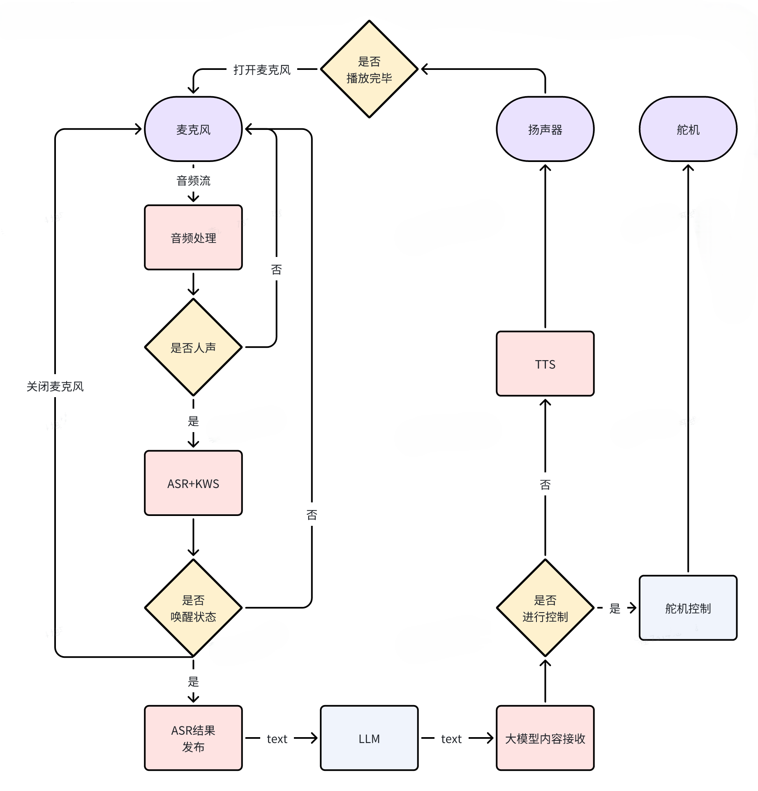

# README 05：算法 Demo：语音与 LLM

完成这一章后，读者应该能独立跑通 Magicbox 的原生语音问答链路，并明确知道这条链路由哪些模型、哪些 ROS2 话题和哪些启动文件组成。更具体地说，本章要完成的是一次完整闭环：设备听到一句话，识别出文本，把文本交给板端 LLM 生成回答，再把回答播报出来。后续无论是接 OpenClaw，还是自己做桌宠状态机，都要建立在这条链路已经稳定可用的前提之上。

## 一、本章开始前，先确认四个前提

第一，开发板已经可以通过有线方式稳定登录，且系统时间已经校准。如果时间仍然停留在 `2000-01-01`，日志会很难看懂，也会影响后续网络与依赖验证。先确认：

```bash
date
```

第二，开发板扬声器与麦克风工作正常。最少要保证板子可以正常发出提示音，并且录音设备没有被系统禁用。语音链路如果失败，最先要排除的往往不是 LLM，而是音频采集和播放本身。

第三，原厂预置环境完整存在。本章第一轮验证不以 U 盘迁移版为主，而是先对齐原厂 `magicbox-start` 的真实路径。只有原厂路径已经跑通后，才建议再考虑模型和依赖迁移。

第四，以下工作区与目录已经在板端存在：

- 工作区根目录：`/userdata/magicbox/app/ros_ws`
- 原厂配置目录：`/userdata/magicbox/config`
- 原厂依赖目录：`/userdata/magicbox/dep`

后续所有命令，除非特别说明，都默认在开发板上执行，并优先使用 `sunrise` 用户而不是直接使用 `root`。这一点对 `audio_io` 尤其重要，因为手工验证时，root 会更容易遇到用户态音频服务、日志路径和设备占用的干扰；而原厂常规使用路径本身也是以普通用户环境为主，再由外层脚本调度不同模式。

## 二、本章涉及哪些资料与仓库

本章主要对应以下内容。

- 语音链路仓库：`./repos/magicbox_audio_io`
- 板端 LLM 仓库：`./repos/magicbox_qwen_llm`
- 语音相关依赖参考：`./repos/sherpa-onnx`
- 官方语音交互页面归档：`./page_algorithm-development_voice-interaction.html`
- 本地功能结构图：`./assets/official_images/Audio-Architecture-Diagram.png`



来源：D-Robotics Magicbox 语音交互官方文档，本地图像归档于 `./assets/official_images/Audio-Architecture-Diagram.png`。

## 三、先理解这条链路到底在做什么

Magicbox 的原生语音链路由四段连续流程组成。

第一段是音频输入。麦克风持续采集音频数据，并由 `audio_io` 负责唤醒词检测、语音识别和播报控制。  
第二段是文本输入边界。`audio_io` 识别出有效中文内容后，会把结果发布到 `/prompt_text`。  
第三段是 LLM 推理。`qwen_llm` 订阅 `/prompt_text`，完成文本推理，并把回答发布到 `/tts_text`。  
第四段是语音播报。`audio_io` 再订阅 `/tts_text`，调用 TTS 合成语音，并通过扬声器播报出来。

因此，本章最关键的不是背下某一条启动命令，而是掌握两个边界话题：

- `/prompt_text`
- `/tts_text`

只要这两个话题已经建立起来，后续无论你是继续用原生语音链路，还是把 OpenClaw 接到板端能力上，都能知道消息应该从哪里进入、又从哪里输出。

## 四、先对齐原厂脚本的真实模型路径

本教程验证的原厂 `magicbox-start` 语音链路并不是从 `/media/sunrise/...` 读取模型，而是使用 `/userdata/magicbox/config` 和 `/userdata/magicbox/dep`。因此，优先检查原厂配置路径，比直接按 U 盘占位路径排查更可靠。

我已经核对过原厂脚本，当前真实路径如下：

```text
ASR 模型: /userdata/magicbox/config/sense-voice-small-fp16.gguf
LLM 模型持久化位置: /userdata/magicbox/config/qwen2.5-1.5b-instruct-q5_k_m.gguf
KWS 依赖目录: /userdata/magicbox/dep/sherpa-onnx/sherpa-onnx-kws-zipformer-wenetspeech-3.3M-2024-01-01
TTS 依赖目录: /userdata/magicbox/dep/matcha-icefall-zh-baker
LLM 运行时位置: /dev/shm/qwen2.5-1.5b-instruct-q5_k_m.gguf
```

其中，`/userdata/magicbox/launch/start.sh` 的核心动作是：

```bash
dd if=/userdata/magicbox/config/qwen2.5-1.5b-instruct-q5_k_m.gguf \
   of=/dev/shm/qwen2.5-1.5b-instruct-q5_k_m.gguf
ros2 launch audio_io audio_io.launch.py &
```

而 `audio_io.launch.py` 默认读取的路径也是：

```text
tts_config_path=/userdata/magicbox/dep/matcha-icefall-zh-baker
asr_model_path=/userdata/magicbox/config/sense-voice-small-fp16.gguf
kws_config_path=/userdata/magicbox/dep/sherpa-onnx/sherpa-onnx-kws-zipformer-wenetspeech-3.3M-2024-01-01
```

因此，本章的正确顺序是：

1. 先按原厂路径验证语音与 LLM 链路
2. 等原厂路径已经跑通后，再决定是否迁移到 U 盘

## 五、先检查原厂路径是否真的存在

在启动任何节点之前，先做一次显式检查。这一步的目的，是先确认你板子上的原厂资源是否完整，而不是让读者在 launch 失败后再回头猜路径。

```bash
ls -ld \
  /userdata/magicbox/config/sense-voice-small-fp16.gguf \
  /userdata/magicbox/config/qwen2.5-1.5b-instruct-q5_k_m.gguf \
  /userdata/magicbox/dep/sherpa-onnx/sherpa-onnx-kws-zipformer-wenetspeech-3.3M-2024-01-01 \
  /userdata/magicbox/dep/matcha-icefall-zh-baker
```

只要这四条路径里有一条不存在，就不要继续后面的语音链路联调。

## 六、先单独跑通 `audio_io`

在真正接入 LLM 之前，先验证音频输入、语音识别和播报链路本身是否健康。这样做的原因很直接：如果 `audio_io` 这一层没有通，后面接 `qwen_llm` 只会让排障范围更大。

从 `repos/magicbox_audio_io/launch/audio_io.launch.py` 可以看到，启动时最关键的是三条路径：

- `tts_config_path`
- `asr_model_path`
- `kws_config_path`

这说明 `audio_io` 是否跑得起来，首先取决于模型与依赖目录是否真实存在。

### 1. 执行目录与环境准备

建议先回到板端工作区根目录，再加载 ROS2 环境：

```bash
cd /userdata/magicbox/app/ros_ws
source /opt/tros/humble/setup.bash
source /userdata/magicbox/app/ros_ws/install/local_setup.bash
```

### 2. 先检查麦克风设备有没有被占用

本教程验证的 `audio_io` 默认采集设备是：

```text
plughw:0,0
```

实际声卡列表中应当能看到对应设备：

```text
card 0: duplexaudioi2s1, device 0
card 1: duplexaudio, device 0
```

所以如果这里仍然报：

```text
alsa_device_init snd_pcm_open plughw:0,0 failed
ret=-16
```

含义并不是“找不到设备”，而是“设备忙，已经被别的进程占用”。常见占用者是：

```text
pulseaudio
```

因此，在手工验证 `audio_io` 之前，先把占用麦克风的用户态音频服务停掉。用 `sunrise` 用户执行：

```bash
pulseaudio -k || true
systemctl --user stop pulseaudio.service pulseaudio.socket 2>/dev/null || true
```

如果你当前就在 root shell 里，建议先退回普通用户终端再执行上面两条。只有在临时排障时，才建议在 root 下直接执行：

```bash
pkill -f pulseaudio || true
```

执行后，可以再做一次最小录音测试：

```bash
arecord -D plughw:0,0 -f S16_LE -r 16000 -c 1 -d 1 /tmp/test.wav
```

只要这条命令不再报 `Device or resource busy`，再继续启动 `audio_io`。

### 3. 启动命令

如果你想先单独验证音频设备本身，可以把 `wait_for_llm` 设为 `False`。这样即使 LLM 还没启动，`audio_io` 也能先把音频侧工作跑起来。下面这组参数与原厂默认值对齐，只是把它们显式写出来，便于教学与排障。

```bash
exit  # 如果当前在 root shell 中，先退回 sunrise 用户
cd /userdata/magicbox/app/ros_ws
source /opt/tros/humble/setup.bash
source /userdata/magicbox/app/ros_ws/install/local_setup.bash
ros2 launch audio_io audio_io.launch.py \
  asr_model_path:=/userdata/magicbox/config/sense-voice-small-fp16.gguf \
  kws_config_path:=/userdata/magicbox/dep/sherpa-onnx/sherpa-onnx-kws-zipformer-wenetspeech-3.3M-2024-01-01 \
  tts_config_path:=/userdata/magicbox/dep/matcha-icefall-zh-baker \
  wait_for_llm:=False
```

### 4. 启动后应该去哪里看结果

这一阶段不需要先看网页，主要看两类现象。

第一类是终端日志。你应该能看到 `audio_io` 正常启动，而不是在模型路径解析阶段直接退出。  
第二类是设备本体现象。板子应当能够进入待命状态，并在检测到语音输入后有对应反应。

如果板子上已有 `/prompt_text` 和 `/tts_text` 相关逻辑，也可以另开一个终端观察话题。

先开一个新的终端，执行：

```bash
sudo su -
cd /userdata/magicbox/app/ros_ws
source /opt/tros/humble/setup.bash
source /userdata/magicbox/app/ros_ws/install/local_setup.bash
ros2 topic list | grep text
```

如果话题存在，再执行：

```bash
ros2 topic echo /prompt_text
```

只要你说话后 `/prompt_text` 能出现合理文本，就说明 ASR 这一段已经通了。

## 七、再接入 `qwen_llm`，完成问答闭环

当 `audio_io` 已经能稳定发布 `/prompt_text` 之后，再接入 `qwen_llm`。`qwen_llm` 在这条链路里的角色很单纯：读取识别文本，生成回答，再把回答送到 `/tts_text`。

### 1. 先把模型复制到 `/dev/shm`

执行目录可以仍然在板端工作区中，命令如下：

```bash
exit  # 如果当前在 root shell 中，先退回 sunrise 用户
cp /userdata/magicbox/config/qwen2.5-1.5b-instruct-q5_k_m.gguf /dev/shm/
ls -lh /dev/shm/qwen2.5-1.5b-instruct-q5_k_m.gguf
```

只有复制成功后，再继续后续启动。

这里需要说明一个非常容易让读者困惑的问题：为什么 `/userdata/magicbox/config` 里已经有一份 `qwen` 模型，还要再复制一份到 `/dev/shm`。

原因不是“模型缺失”，而是运行位置不同。原厂方案本来就是：

- 持久化模型放在 `/userdata/magicbox/config`
- 启动时把模型复制到 `/dev/shm`
- 真正运行时由 `qwen_llm` 读取 `/dev/shm/qwen2.5-1.5b-instruct-q5_k_m.gguf`

这样做的目的，是利用共享内存提高加载速度，并让后续 warmup 更快。也就是说，`/userdata/magicbox/config` 那份是长期保存的源文件，`/dev/shm` 那份是运行时副本，不是多余重复。

### 2. 启动 `qwen_llm`

如果前一个终端里 `audio_io` 已经在运行，那么这里建议另开第二个终端，执行：

```bash
cd /userdata/magicbox/app/ros_ws
source /opt/tros/humble/setup.bash
source /userdata/magicbox/app/ros_ws/install/local_setup.bash
ros2 launch qwen_llm qwen_llm.launch.py wait_for_audio:=True
```

### 3. 启动后应该去哪里看结果

这一阶段的结果观察点有三个。

第一，看 `qwen_llm` 的终端日志，确认节点没有在模型加载阶段直接退出。  
第二，看 `/tts_text` 是否出现回答文本。可以另开第三个终端执行：

```bash
cd /userdata/magicbox/app/ros_ws
source /opt/tros/humble/setup.bash
source /userdata/magicbox/app/ros_ws/install/local_setup.bash
ros2 topic echo /tts_text
```

第三，看设备本体是否真的把回答播报出来。

当你说出一句简单问题后，例如“你好，你是谁”，理想顺序应该是：

1. `audio_io` 识别出文本并发布到 `/prompt_text`
2. `qwen_llm` 收到提示词并生成回答
3. 回答发布到 `/tts_text`
4. `audio_io` 再把回答播报出来

只要这四步成立，就说明“听见 -> 理解 -> 说出”的闭环已经跑通。

## 八、原厂提示音、蓝灯与按钮启动逻辑在哪里

如果你是通过原厂右键模式体验语音交互，而不是手工单独启动 `audio_io`，那么你看到的现象其实不止是“启动语音节点”这么简单。原厂按钮逻辑在：

- `/userdata/magicbox/launch/start.py`

这个文件已经明确写出：

- 右键模式会先把灯带设置为蓝色
- 然后再调用 `ros2 launch qwen_llm qwen_llm.launch.py`

此外，`start.py` 在初始化时还会主动播放：

- `/userdata/magicbox/voice/wakeup.mp3`

并做一轮灯带闪烁。也就是说，原厂开机提示音和部分灯光效果，并不属于 `audio_io` 节点本身，而是属于更外层的按钮调度与灯控脚本。

这也解释了为什么你手工只跑：

```bash
ros2 launch audio_io audio_io.launch.py ...
```

时，并不会天然复现“开机提示音 + 蓝灯 + 模式切换”的完整产品体验。因为这些现象本来就不全在 `audio_io` 里。

至于“说什么话可以开始录音”，当前这部分唤醒词并没有直接明文写在已核对的 `start.py` 和 launch 文件里。已经能够确认的是：

- 右键模式本身会播放原厂提示音
- 语音识别成功后文本会进入 `/prompt_text`
- 播报文本会从 `/tts_text` 回到 `audio_io`

而具体唤醒词属于 KWS 模型配置的一部分，需要再从 `sherpa-onnx` 相关配置或官方文档进一步核对后，才能在教程里写成确定结论。当前这一点不能冒充成已确认事实。
## 九、哪些报错可以先忽略，哪些不能忽略

语音与 LLM 链路的报错不能一概而论。有些日志只是提醒，有些则意味着整条链路根本没有启动成功。

下面这些情况通常不能忽略。

第一，模型路径不存在，例如：

```text
No such file or directory
```

只要 ASR、KWS、TTS 或 GGUF 模型路径有一个不存在，就不应该继续排后面的逻辑。

第二，节点在启动阶段直接退出。只要 `audio_io` 或 `qwen_llm` 进程刚启动就结束，这就不是“效果不好”，而是“链路没起来”。

第三，`/prompt_text` 与 `/tts_text` 根本不存在。如果连这两个话题都没有建立，说明问题还在节点启动层。

下面这些情况通常可以先记住，但不必立刻当成主问题。

第一，模型加载速度慢。GGUF 模型第一次复制到 `/dev/shm` 或首次启动时，本来就可能比按钮演示慢。  
第二，一些性能告警或版本提醒，例如模型构建版本与运行时 SDK 版本不完全一致。如果功能仍然能稳定跑通，这类警告可以先记录，再决定是否后续统一升级。  
第三，偶发的唤醒词不稳定。如果 `/prompt_text` 能正常出字，但唤醒体验不够顺，可以在链路跑通后再回头细调，而不是一开始就把它当成“整个系统不能用”。

## 十、从源码看，这两部分是怎样配合的

如果读者想真正理解这条链路，建议先看两个入口文件。

第一是：

- `repos/magicbox_audio_io/src/hb_audio_io.cpp`

这个文件把整条音频链路拆成了多个线程。麦克风采集线程负责持续读取音频数据，语音引擎负责 ASR 和 KWS，TTS 线程负责把文本变成语音缓存，扬声器线程负责真正输出声音。更关键的是，这个文件还实现了对话轮次控制：识别到有效内容后会先暂停麦克风采集，等到播报结束并收到结束标记后，再重新打开麦克风。这就是为什么板端对话看起来像一个完整轮次，而不是麦克风和扬声器彼此抢占。

第二是：

- `repos/magicbox_qwen_llm/launch/qwen_llm.launch.py`

这个 launch 文件把大模型侧的边界交代得很清楚。它默认把 `/prompt_text` 作为输入，把 `/tts_text` 作为输出，并支持 `enable_function_call` 这样的扩展开关。也就是说，这个包从设计上就不是只做“纯文本回答”，而是为“回答之后继续触发设备能力”留出了接口。

从数据流角度看，整条链路可以直接概括为：

```text
麦克风输入
-> audio_io
-> /prompt_text
-> qwen_llm
-> /tts_text
-> audio_io
-> 扬声器播报
```

只要抓住这条链路，再去读实现细节，源码就会清楚很多。

## 十一、如果结果不对，先查哪几项

如果你的结果和本章描述不一致，建议按下面顺序检查。

第一，先查原厂模型与依赖路径，而不是先查 prompt。执行：

```bash
ls -ld \
  /userdata/magicbox/config/sense-voice-small-fp16.gguf \
  /userdata/magicbox/config/qwen2.5-1.5b-instruct-q5_k_m.gguf \
  /userdata/magicbox/dep/sherpa-onnx/sherpa-onnx-kws-zipformer-wenetspeech-3.3M-2024-01-01 \
  /userdata/magicbox/dep/matcha-icefall-zh-baker
```

第二，确认 `qwen` 模型是否真的已经复制到 `/dev/shm`：

```bash
ls -lh /dev/shm/qwen2.5-1.5b-instruct-q5_k_m.gguf
```

第三，确认两个节点是否都在运行：

```bash
ps -ef | grep -E "audio_io|qwen_llm" | grep -v grep
```

第四，确认麦克风设备没有再被占用。执行：

```bash
lsof /dev/snd/* 2>/dev/null || fuser -v /dev/snd/* 2>/dev/null
```

如果还能看到 `pulseaudio` 持有控制设备，就先不要继续查 LLM。

第五，确认关键话题是否存在：

```bash
cd /userdata/magicbox/app/ros_ws
source /opt/tros/humble/setup.bash
source /userdata/magicbox/app/ros_ws/install/local_setup.bash
ros2 topic list | grep -E "prompt_text|tts_text"
```

第六，再去看具体是 ASR 没出字、LLM 没回答，还是 TTS 没播报。不要一上来就把所有问题都归结为“语音不能用”。

## 十二、如果后续要迁移到 U 盘，应当怎样做

当你已经确认原厂路径版本可以稳定工作后，再考虑把大模型与依赖迁移到 U 盘。这样做的目标不是“第一次就换路径”，而是减少系统盘占用，并为后续 OpenClaw、更多仓库和实验日志腾空间。

迁移时应遵循一个原则：先保持目录结构清晰，再用显式传参替换默认值。下面这组路径只有在真实存在时才应该使用：

```bash
export USB_ROOT=/media/sunrise/MAGICBOX_DATA
ls -ld \
  "$USB_ROOT/models/sense-voice-small-fp16.gguf" \
  "$USB_ROOT/models/qwen2.5-1.5b-instruct-q5_k_m.gguf" \
  "$USB_ROOT/dep/sherpa-onnx-kws-zipformer-wenetspeech-3.3M-2024-01-01" \
  "$USB_ROOT/dep/matcha-icefall-zh-baker"
```

确认无误后，`audio_io` 才改为：

```bash
ros2 launch audio_io audio_io.launch.py \
  asr_model_path:=$USB_ROOT/models/sense-voice-small-fp16.gguf \
  kws_config_path:=$USB_ROOT/dep/sherpa-onnx-kws-zipformer-wenetspeech-3.3M-2024-01-01 \
  tts_config_path:=$USB_ROOT/dep/matcha-icefall-zh-baker \
  wait_for_llm:=False
```

`qwen` 模型也改为先从 U 盘复制到 `/dev/shm`：

```bash
cp "$USB_ROOT/models/qwen2.5-1.5b-instruct-q5_k_m.gguf" /dev/shm/
```

如果你的 U 盘挂载点不是 `/media/sunrise/MAGICBOX_DATA`，就必须先把 `USB_ROOT` 改成真实挂载点，再执行这组命令。

## 十三、为什么这一章必须先于 OpenClaw

从展示效果上看，很多读者会想直接跳到 OpenClaw，因为它更热，也更容易产生“已经接入 AI 助手生态”的成品感。但从工程顺序看，先把 Magicbox 自己的原生话题、动作、灯光和播报链路跑通，仍然更稳。

原因很简单。只有当板端自己的边界已经清楚时，外部网关才知道消息该送到哪里。对本项目来说，最重要的两个边界就是：

- `/prompt_text`
- `/tts_text`

只要这一章已经跑通，后面接 OpenClaw 时，读者就不再是“把一个外部系统硬塞进来”，而是在一个已经清楚的本地能力边界之上接入新的入口层。

## 十四、本章结束后，读者应掌握什么

到这一章结束时，读者不应只是“跑过一次语音命令”，而应该真正掌握下面五件事。

第一，知道 `audio_io` 与 `qwen_llm` 分别负责哪一段链路。  
第二，知道本教程验证的原厂真实路径在 `/userdata/magicbox/config` 与 `/userdata/magicbox/dep`，而不是默认就是某个 U 盘路径。
第三，知道应该去哪里观察结果：`/prompt_text`、`/tts_text`、终端日志和设备本体播报。  
第四，知道出现问题时应该先查原厂模型路径、节点状态和关键话题，而不是笼统地把问题归结为“LLM 不工作”。  
第五，知道 U 盘迁移属于链路跑通之后的扩展步骤，而不是第一次验证原生链路时的默认前提。

如果这五件事已经成立，那么这一章就算真正讲清楚了。
