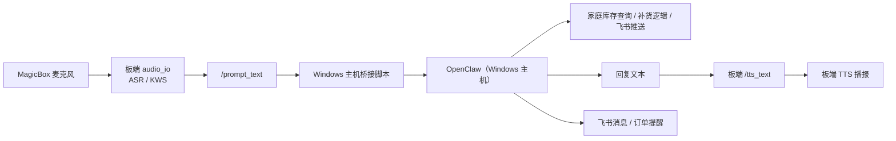

# Windows 主机 OpenClaw 语音桥接与家庭物资助手

本文档说明当前这套桌宠系统的实际架构、启动方式、数据文件、飞书链路，以及后续汇报时应如何介绍这套方案。

## 一、项目目标

这套系统的目标不是把所有能力都塞进开发板，而是做明确分层：

1. 开发板只负责语音输入和语音播报。
2. Windows 主机负责 OpenClaw 推理、家庭物资问答、飞书订单推送。
3. 飞书负责远程通知、补货提醒和订单查看。

这样做的原因很直接：

1. 开发板本身已经具备现成的 ASR/TTS 能力，适合做“听”和“说”。
2. OpenClaw 已经部署在 Windows 主机，适合做“理解”和“决策”。
3. 家庭物资表、补货订单和飞书消息天然更适合放在主机侧维护。

## 二、当前架构

当前系统采用的是“板端语音前端 + 主机 OpenClaw 中枢”的桥接结构。



一句话概括：

开发板负责“把声音变成文字，再把回复文字变回声音”；  
Windows 主机负责“真正的思考”。

## 三、当前已落地的功能

### 3.1 家庭剩余物资清单

当前库存采用本地 CSV 固化，便于长期维护和查阅。

文件位置如下：

- [inventory.csv](C:\Users\kewei\Documents\2026\202603\06地瓜机器人新版教程桌宠\household_data\inventory.csv)
- [locations.csv](C:\Users\kewei\Documents\2026\202603\06地瓜机器人新版教程桌宠\household_data\locations.csv)
- [restock_orders.csv](C:\Users\kewei\Documents\2026\202603\06地瓜机器人新版教程桌宠\household_data\restock_orders.csv)
- [README.md](C:\Users\kewei\Documents\2026\202603\06地瓜机器人新版教程桌宠\household_data\README.md)

其中 `inventory.csv` 保存核心库存信息，字段包括：

1. `物资名字`
2. `阈值`
3. `所在位置`
4. `剩余个数`
5. `购买链接`
6. `建议补货量`
7. `最近更新时间`

### 3.2 家庭物资问答

当前已经支持以下三类问答：

1. 查询最接近阈值的物资
2. 查询某个物品所在位置
3. 为指定物资生成补货单

本地查询脚本如下：

- [household_inventory_cli.py](C:\Users\kewei\Documents\2026\202603\06地瓜机器人新版教程桌宠\openclaw_magicbox\tools\household_inventory_cli.py)

典型命令如下：

```bash
python C:\Users\kewei\Documents\2026\202603\06地瓜机器人新版教程桌宠\openclaw_magicbox\tools\household_inventory_cli.py top --limit 3 --format text
python C:\Users\kewei\Documents\2026\202603\06地瓜机器人新版教程桌宠\openclaw_magicbox\tools\household_inventory_cli.py locate --name 剪刀 --format text
python C:\Users\kewei\Documents\2026\202603\06地瓜机器人新版教程桌宠\openclaw_magicbox\tools\household_inventory_cli.py create-order --name 苹果 --send-feishu --format text
```

### 3.3 飞书补货提醒与订单推送

当前已经可以从 Windows 主机直接向飞书发送补货消息，并且把订单内容写入 `restock_orders.csv`。

这意味着系统已经具备：

1. 发现低库存
2. 生成补货记录
3. 向飞书推送提醒

在汇报中，可以把这一部分描述为：

“桌宠前端负责听用户的需求，OpenClaw 负责理解需求并生成补货动作，飞书负责把动作结果推送给用户。”

## 四、板端语音桥接设计

### 4.1 板端只保留 ASR/TTS

本项目不再把板载 `qwen_llm` 作为主思考模型。

板端当前保留的是：

1. `audio_io`
2. 唤醒词检测
3. 语音转文字
4. 文字转语音

板端不再负责中间推理，推理交给 Windows 主机 OpenClaw。

### 4.2 Windows 主机负责思考

Windows 主机侧负责：

1. 接收板端识别出的文本
2. 调用本机 OpenClaw
3. 进行库存查询、位置查询、补货单生成
4. 把回复文本发回板端 TTS

桥接脚本如下：

- [magicbox_voice_bridge.py](C:\Users\kewei\Documents\2026\202603\06地瓜机器人新版教程桌宠\openclaw_magicbox\tools\magicbox_voice_bridge.py)
- [start_magicbox_voice_bridge.ps1](C:\Users\kewei\Documents\2026\202603\06地瓜机器人新版教程桌宠\openclaw_magicbox\tools\start_magicbox_voice_bridge.ps1)

### 4.3 当前唤醒词

当前板端关键词文件已经扩展为更适合“囤囤钳”这个名字的版本。支持的核心唤醒词包括：

1. `囤囤钳`
2. `囤囤`
3. `豚豚`
4. `吞吞`
5. `屯屯`

同时保留原有：

1. `你好地瓜`
2. `地瓜你好`
3. `地瓜地瓜`
4. `开始对话`
5. `结束对话`
6. `束对话`

### 4.4 退出指令

当前主机桥接层将以下前缀视为退出/休眠信号：

1. `再见`
2. `拜拜`
3. `休眠`
4. `关闭`

当识别到类似“再见囤囤”这一类语音时，主机桥接层会把灯光熄灭，不再继续对话。

## 五、灯光效果设计

当前灯效逻辑分为三种状态：

1. 未唤醒：四灯熄灭
2. 聆听中：呼吸灯
3. 回答中：走马灯

板端灯效脚本已经扩展：

- [magicbox-hw](C:\Users\kewei\Documents\2026\202603\06地瓜机器人新版教程桌宠\openclaw_magicbox\bin\magicbox-hw)

新增的灯效包括：

1. `led breathe`
2. `led marquee`

因此现在可以在板端直接执行：

```bash
sudo python3 /userdata/magicclaw/runtime/bin/magicbox-hw led breathe cyan 2 0.04
sudo python3 /userdata/magicclaw/runtime/bin/magicbox-hw led marquee blue 12 0.08
```

## 六、当前启动方式

### 6.1 启动 OpenClaw 网关

在 Windows 主机上：

```powershell
openclaw gateway restart
```

### 6.2 准备板端语音前端

在 Windows 主机上执行：

```powershell
python C:\Users\kewei\Documents\2026\202603\06地瓜机器人新版教程桌宠\openclaw_magicbox\tools\magicbox_voice_bridge.py prepare
```

这一步会做四件事：

1. 同步唤醒词
2. 关闭板载 `qwen_llm`
3. 以 `ASR/TTS only` 模式拉起 `audio_io`
4. 启动板端 prompt 订阅辅助脚本

### 6.3 启动主机桥接

在 Windows 主机上执行：

```powershell
powershell -ExecutionPolicy Bypass -File "C:\Users\kewei\Documents\2026\202603\06地瓜机器人新版教程桌宠\openclaw_magicbox\tools\start_magicbox_voice_bridge.ps1"
```

或者直接：

```powershell
python C:\Users\kewei\Documents\2026\202603\06地瓜机器人新版教程桌宠\openclaw_magicbox\tools\magicbox_voice_bridge.py run
```

## 七、当前汇报时推荐的演示流程

建议演示顺序如下：

1. 先说明系统分层
2. 展示本地库存表
3. 展示飞书消息推送
4. 展示语音唤醒和问答

推荐演示话术如下。

### 演示一：库存预警查询

用户说：

```text
你好你好，我想知道现在剩余物资最少的 3 样是哪 3 样？
```

系统回答示例：

```text
当前最接近阈值的 3 样物资分别是：
第一，洗衣液，当前剩余 1，阈值 1，已经贴近补货线。
第二，牙膏，当前剩余 2，阈值 3，已经低于阈值。
第三，卷纸，当前剩余 5，阈值 6，也已经接近阈值。
```

### 演示二：生成补货单

用户说：

```text
我想把苹果补一下货，请你直接生成一下订单，推送到我的飞书上。
```

系统回答示例：

```text
好的，已为您生成苹果的补货单，请到飞书查阅。
```

随后在飞书中看到补货提醒。

### 演示三：位置查询

用户说：

```text
我想问一下我的剪刀在哪？
```

系统回答示例：

```text
剪刀在您身后的柜子上。
```

## 八、当前关键文件一览

### 8.1 家庭库存与订单

- [inventory.csv](C:\Users\kewei\Documents\2026\202603\06地瓜机器人新版教程桌宠\household_data\inventory.csv)
- [locations.csv](C:\Users\kewei\Documents\2026\202603\06地瓜机器人新版教程桌宠\household_data\locations.csv)
- [restock_orders.csv](C:\Users\kewei\Documents\2026\202603\06地瓜机器人新版教程桌宠\household_data\restock_orders.csv)

### 8.2 主机侧逻辑

- [household_inventory_cli.py](C:\Users\kewei\Documents\2026\202603\06地瓜机器人新版教程桌宠\openclaw_magicbox\tools\household_inventory_cli.py)
- [magicbox_voice_bridge.py](C:\Users\kewei\Documents\2026\202603\06地瓜机器人新版教程桌宠\openclaw_magicbox\tools\magicbox_voice_bridge.py)
- [start_magicbox_voice_bridge.ps1](C:\Users\kewei\Documents\2026\202603\06地瓜机器人新版教程桌宠\openclaw_magicbox\tools\start_magicbox_voice_bridge.ps1)

### 8.3 板端控制

- [magicboxctl](C:\Users\kewei\Documents\2026\202603\06地瓜机器人新版教程桌宠\openclaw_magicbox\bin\magicboxctl)
- [magicbox-hw](C:\Users\kewei\Documents\2026\202603\06地瓜机器人新版教程桌宠\openclaw_magicbox\bin\magicbox-hw)

## 九、当前状态说明

当前这套方案的核心思路已经明确并且代码已经落地：

1. 板端只负责 ASR/TTS
2. Windows 主机负责 OpenClaw 推理
3. 家庭库存采用本地 CSV 固化
4. 飞书用于补货消息和订单查看
5. 唤醒词和灯效已按“囤囤钳”场景改造

如果汇报时需要一句总括，可以直接使用下面这句话：

> 这套桌宠系统已经从“板端大模型一体化”改造成“板端语音前端 + Windows 主机 OpenClaw 中枢”的结构，既保留了开发板天然适合做的语音输入输出，又把真正的任务理解、家庭库存分析和飞书订单推送交给了更灵活的主机侧智能体。
