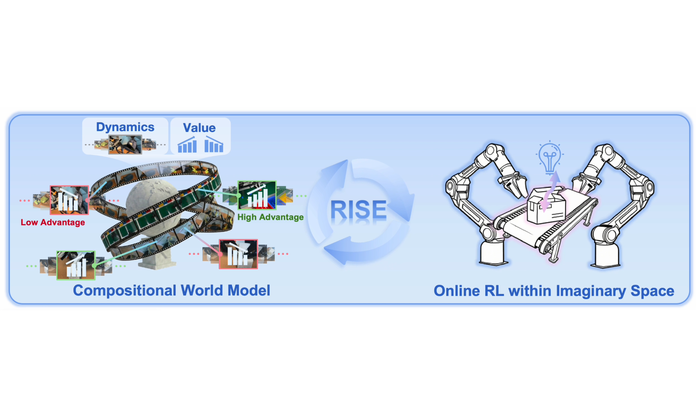
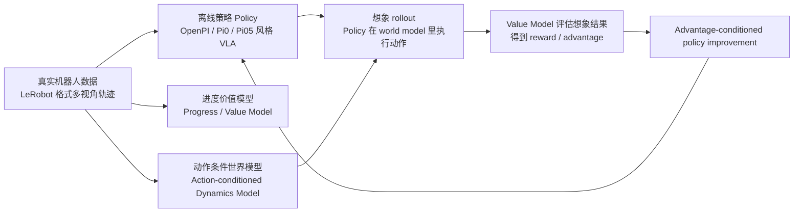
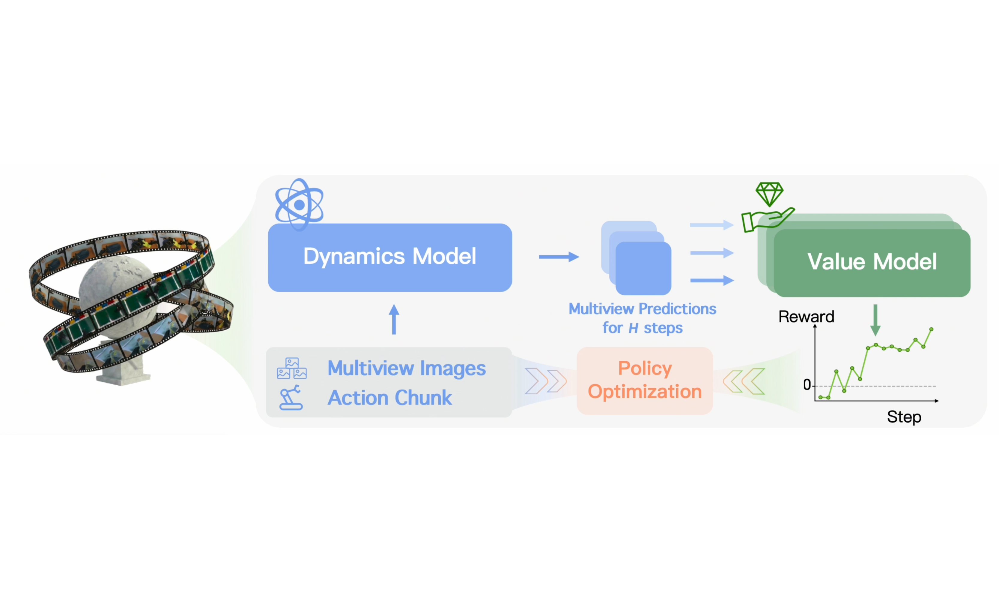
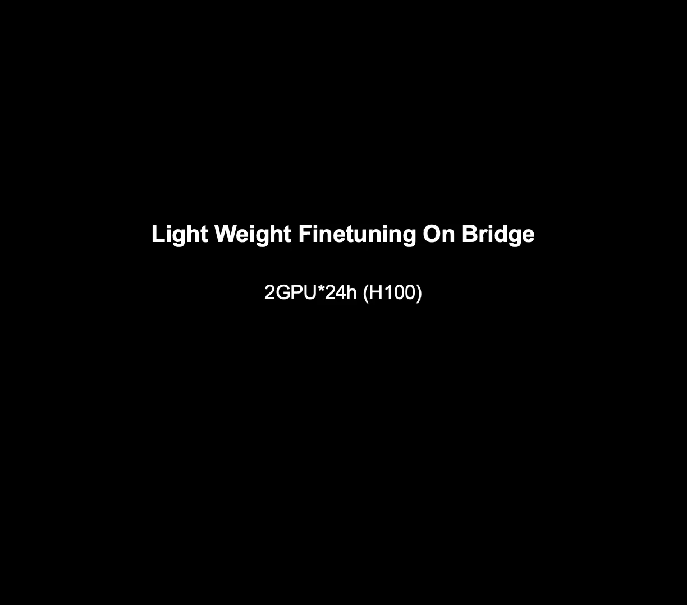
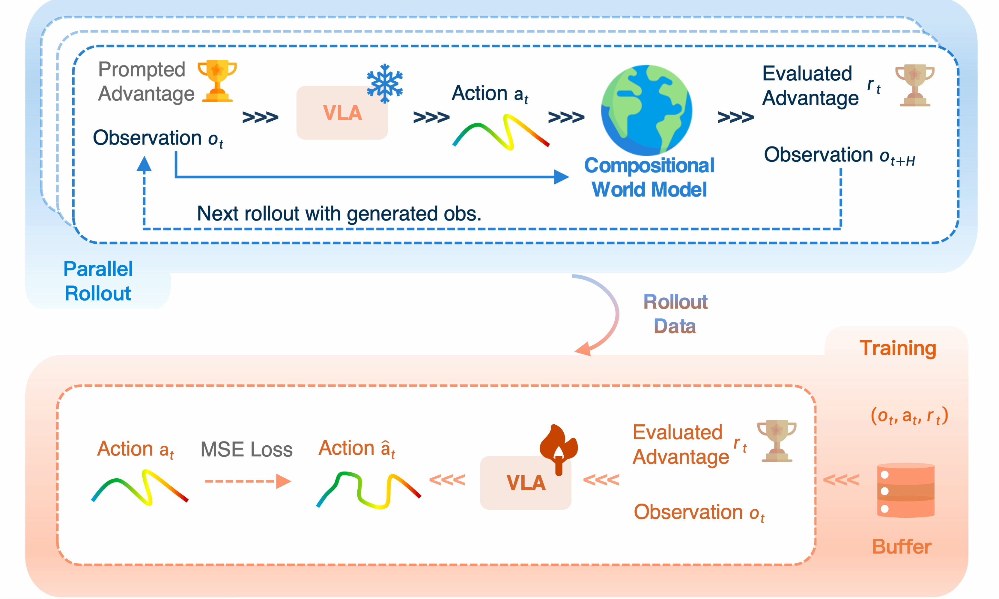
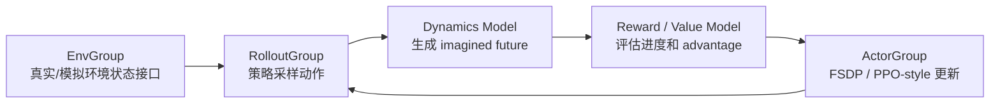
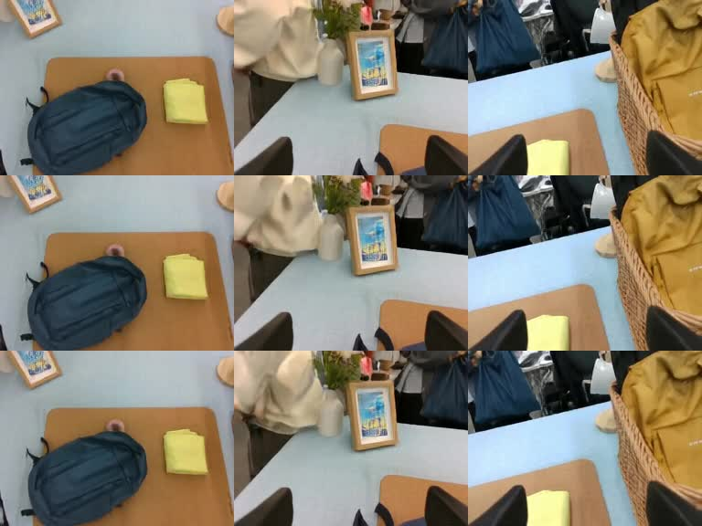

# RISE 自我改进机器人策略：用组合世界模型在“想象中”做强化学习

这一章带大家学习 **RISE: Self-Improving Robot Policy with Compositional World Model**。RISE 对应论文为 [arXiv:2602.11075](https://arxiv.org/abs/2602.11075)，官方项目页为 [OpenDriveLab RISE](https://opendrivelab.com/RISE/)，官方仓库为 [OpenDriveLab/RISE](https://github.com/OpenDriveLab/RISE)。

学完这一章后，大家可以完成四件事：

- 理解 RISE 为什么要把机器人策略改进放到世界模型里，而不是直接在真机上试错；
- 看清 RISE 仓库的三段式流水线：离线 policy/value 训练、动作条件 dynamics world model、online imagination RL；
- 在 Blackwell GPU 机器上复刻 RISE 的核心 Python 环境，并下载和校验公开的 dynamics model 资产；
- 分清官方效果、本地 smoke test、公开权重边界，避免把“能跑通环境”误解成“完整复现论文所有结果”。

## 一、RISE 到底解决什么问题

机器人操作任务里，模仿学习很常见：收集一批人类遥操作或专家演示，然后训练一个视觉语言动作模型，让机器人从图像、语言指令和自身状态中输出动作。问题是，离线数据学出来的策略通常很脆。遇到物体位置偏一点、扰动大一点、接触过程复杂一点，策略就可能进入训练数据里没见过的状态。

最直接的想法是做强化学习，让机器人在真实世界里继续试错。但真实机器人试错有几个硬伤：

- 真机 rollout 慢，机械臂每次 reset 都耗时间；
- 错误动作可能损坏物体、夹爪、机械臂或环境；
- 对背包整理、盒子闭合、动态传送带分拣这类任务，失败状态非常多，收集 on-policy 经验很贵；
- 真实场景中很难并行出几十上百个环境。

RISE 的核心思想是：**不让机器人在真机里大量试错，而是训练一个动作条件世界模型，让策略在“想象环境”里 rollout，再用进度价值模型给这些想象结果打分，最后把 advantage 反馈给策略。**

<p align="center">
  
</p>

**图 1 RISE 官方任务效果总览。** 这张图展示了论文关注的三类真实机器人操作任务：动态分拣、背包整理和盒子闭合。大家要注意，RISE 的目标不是通用聊天式机器人控制，而是让已有操作策略在高动态、精细接触和强扰动任务上继续提升。

<p align="center"><sub>来源：RISE 官方项目页。</sub></p>

## 二、RISE 的一句话架构

RISE 可以概括为：



这条链路里最重要的是“组合式”二字。RISE 没有把所有功能塞进一个巨大的黑盒模型，而是把世界模型拆成两个互补部分：

- **dynamics model** 负责预测“执行动作后，多视角图像未来会变成什么样”；
- **progress value model** 负责判断“这个未来离成功更近还是更远”。

这就很适合机器人学习：视觉未来预测可以利用视频扩散模型的能力，任务进度判断可以利用 policy/value 模型对成功和失败轨迹的理解，策略更新则交给 RLinf 这类分布式 RL 框架。

## 三、官方视频：先建立直观印象

下面这些视频来自 RISE 官方项目页或官方仓库素材，本章下载到本地 `assets/videos/`，便于教程长期可读。官方视频用于理解论文目标，不代表本章已经重新训练出同等策略。

<video controls muted preload="metadata" width="100%">
  <source src="assets/videos/website_teaser.mp4" type="video/mp4">
</video>

**视频 1 RISE 官方总览视频。** 大家可以先看任务难点：机器人需要在真实物理接触中处理动态物体、柔性背包空间和盒盖闭合这类不稳定状态。

<p align="center"><sub>来源：RISE 官方项目页 `website_teaser.mp4`。</sub></p>

<table>
  <tr>
    <td width="33%">
      <video controls muted preload="metadata" width="100%">
        <source src="assets/videos/conveyor_continuous_11_RISE_v3.mp4" type="video/mp4">
      </video>
      <p><strong>视频 2 动态传送带分拣。</strong> 这里的难点是目标一直运动，策略必须边观察边调整。</p>
      <p align="center"><sub>来源：RISE 官方项目页。</sub></p>
    </td>
    <td width="33%">
      <video controls muted preload="metadata" width="100%">
        <source src="assets/videos/backpack_continuous_21_RISE_v3.mp4" type="video/mp4">
      </video>
      <p><strong>视频 3 背包整理。</strong> 任务涉及空间约束、柔性开口和多步放置，失败恢复很重要。</p>
      <p align="center"><sub>来源：RISE 官方项目页。</sub></p>
    </td>
    <td width="33%">
      <video controls muted preload="metadata" width="100%">
        <source src="assets/videos/box_continuous_10_RISE_v3.mp4" type="video/mp4">
      </video>
      <p><strong>视频 4 盒子闭合。</strong> 这个任务考验接触精度，策略需要把物体状态推向可闭合区域。</p>
      <p align="center"><sub>来源：RISE 官方项目页。</sub></p>
    </td>
  </tr>
</table>

<video controls muted preload="metadata" width="100%">
  <source src="assets/videos/dynamics_world_visualization_compressed.mp4" type="video/mp4">
</video>

**视频 5 RISE 官方 dynamics world model 可视化。** 这段视频展示 world model 如何根据历史观测和动作预测未来视觉结果。它不是简单的图像补帧，而是带动作条件的多视角未来预测。

<p align="center"><sub>来源：RISE 官方项目页。</sub></p>

## 四、方法细节：三类模型分别学什么

先把论文里的核心数学对象翻译成工程语言。RISE 不是只训练一个“会想象的视频模型”，而是把真实环境里的 RL 交互拆成三个可学习模块：

```text
policy π:      根据当前观测和任务，提出未来 H 步动作 chunk
dynamics D:    根据历史观测和动作 chunk，预测未来 H 步多视角观测
value V:       根据观测和任务，估计当前状态离成功还有多近
```

论文把多视角观测写成 `o_t = [m_t^1, ..., m_t^n]`，其中 `n` 是相机数量。历史窗口是 `O_t = {o_{t-N}, ..., o_t}`，动作不是单步动作，而是一段 action chunk：

```text
a_t = [a_t, a_{t+1}, ..., a_{t+H-1}]
```

dynamics model 学的是：

```text
o_hat_{t+1}, ..., o_hat_{t+H} = D(O_t, a_t)
```

value model 则给每个想象出来的未来状态打一个进度分 `V(o_hat, l)`，其中 `l` 是任务语言指令。RISE 最关键的 advantage 定义是：

```text
A(o_t, a_t, l) = (1 / H) * sum_{k=1..H} [ V(o_hat_{t+k}, l) - V(o_t, l) ]
```

这个公式非常值得大家记住：**一个动作 chunk 好不好，不是看它的动作本身漂不漂亮，而是看 world model 预测执行后，value model 认为任务进度平均提升了多少。** 这也解释了为什么 RISE 必须同时有 dynamics 和 value：只有 dynamics 没有 value，就只有未来视频，没有学习信号；只有 value 没有 dynamics，就无法评价当前 policy 新提出的动作会把机器人带到什么状态。

把这套公式对应到仓库，大家可以这样读：

| 论文对象 | 工程含义 | 代码/配置入口 |
| --- | --- | --- |
| `π` | VLA policy，输出 action chunk | `policy_and_value/policy_offline_and_value` |
| `D` | action-conditioned dynamics video model | `dynamics/dynamics_model/infer.py` |
| `V` | progress value / reward model | `Policy_offline_release`、`value_release` |
| `A` | 想象 rollout 算出的 advantage 标签 | `action_advantage`、`with_advantage_condition` |
| imagination rollout | policy 在 world model 里交互 | `policy_and_value/policy_online/examples/embodiment/config/rl_release.yaml` |

从论文角度看，RISE 的理论设计有三个重点。

第一，**组合式世界模型比单一大模型更适合机器人 RL**。机器人控制既需要“动作可控的未来预测”，又需要“对失败敏感的进度评估”。这两件事对模型结构和训练目标的要求不同，所以 RISE 把它拆成 dynamics model 和 progress value model，再把二者组合起来给 policy 提供 advantage。

第二，**value model 不能只学时间进度**。论文里 value 先用 progress regression 学 `t/T` 这种稠密进度信号，再引入 TD learning，让模型能从成功/失败轨迹中学到错误状态的价值下降。对接触丰富的任务来说，这点很重要：比如拉链卡住、盒盖差一点没扣上，这些失败在视觉上可能很细微，单纯按时间进度学会过度乐观。

第三，**想象 rollout 不是无限往后梦**。生成式视频模型会有误差累积，论文里的 self-improving loop 从离线数据采样初始状态，最多连续想象有限步，再把想象出的状态和动作 advantage 放进训练 buffer。这个边界对实践很重要：world model 是用来提供高吞吐、低成本的短视野交互信号，不是替代真实世界的完整长期仿真器。

### 1. 离线 policy：先学一个能做事的 VLA 策略

RISE 的 policy/value 代码在：

```text
policy_and_value/policy_offline_and_value
```

它基于 OpenPI / Pi0 / Pi05 风格的视觉语言动作模型。输入一般包括：

- 多视角图像，例如 `top_head`、`hand_left`、`hand_right`；
- 机器人 proprioception，例如关节状态；
- 语言 prompt 或任务文本；
- action chunk，也就是一次输出一段未来动作；
- 在 RISE 的改进配置里，还会加入 `action_advantage`。

官方 release 配置里最值得看的两个名字是：

```text
Policy_offline_release
value_release
```

`Policy_offline_release` 是带 advantage conditioning 的策略训练配置。它的 repack transform 会把数据集里的 `action_advantage` 字段打包进模型输入。换句话说，RISE 后续在想象中算出的 advantage，不只是用于 PPO 损失，也会变成 policy 条件的一部分，让策略知道“哪些动作更值得强化”。

### 2. progress value model：判断未来是否更接近成功

value model 和 policy 共用相近的 OpenPI 结构，但会打开 value head。它学习的不是简单二分类，而是任务进度或价值信号：当前状态、未来状态、动作是否让任务往成功方向推进。

这一步在机器人任务里非常关键。世界模型能生成未来视频，不等于知道“生成的视频好不好”。例如，机械臂把物体推到画面右侧并不一定是成功；背包任务里，物体放进背包但卡住拉链也可能是失败。value model 负责把这些视觉未来转成可优化的 reward / advantage。

离线阶段训练好 value model 后，仓库提供了标注脚本：

```bash
cd $RISE_ROOT/policy_and_value/policy_offline_and_value
bash label_value.sh vis_value_release_joint_T /path/to/value/checkpoint/steps
```

这个脚本会给 LeRobot 数据集补充 value / advantage 标签。大家做自己的任务时，这一步相当于把“轨迹好坏判断”写回数据集，为 policy improvement 做准备。

论文里的 value model 训练有两个互补损失，实践上可以这样理解：

| 损失 | 直觉 | 为什么需要 |
| --- | --- | --- |
| progress regression | 让 value 大致随任务推进而上升 | 提供稠密、稳定、好优化的学习信号 |
| TD learning | 用成功/失败回报修正 value | 让模型对失败、卡住、偏离目标等状态更敏感 |

论文报告的消融结果也支持这个判断：去掉 progress 会明显降低成功率，去掉 TD learning 下降更大。对大家自己的机器人任务来说，如果 value 只按时间进度学，很可能学到“动作一直执行就越来越好”的假象；如果只靠稀疏成功/失败，又会很难训练稳定。

### 3. dynamics model：动作条件的视频世界模型

RISE 的 dynamics model 在：

```text
dynamics/dynamics_model
```

它使用 LTX-Video 的 tokenizer、T5 text encoder 和 VAE 作为 backbone，再接入 RISE 自己训练的 action-conditioned diffusion transformer。官方配置里能看到这些组件：

```yaml
pretrained_model_name_or_path: path/checkpoints
tokenizer_class: T5Tokenizer
textenc_class: T5EncoderModel
vae_class: AutoencoderKLLTXVideo
diffusion_model_class: LTXVideoTransformer3DModel
diffusion_scheduler_class: FlowMatchEulerDiscreteScheduler
```

<p align="center">
  
</p>

**图 2 RISE world model 结构示意。** 大家可以把它理解成一个“动作条件未来视频生成器”：历史多视角图像进入 VAE latent 空间，动作 token 控制 diffusion transformer 生成未来 latent，再由 VAE 解码成未来多视角视频。

<p align="center"><sub>来源：RISE 官方项目页。</sub></p>

这里一定要和常见的 text-to-video 区分开。RISE 的 dynamics model 不是让大家输入一句 prompt，然后模型自由生成机器人视频；它建模的是机器人控制里的条件转移：

```text
P(未来多视角图像 | 当前/历史多视角图像, 未来动作序列, 任务条件)
```

在官方 `infer.py` 这个入口里，输入输出关系更具体：

| 项目 | 在 RISE dynamics 推理里的含义 |
| --- | --- |
| 图像输入 | 三路相机 `top_head`、`hand_left`、`hand_right` 的历史观测帧，源码中每路相机读取 `0.png` 并重复成 4 帧记忆 |
| 动作输入 | `act_tokens.pt`，形状是 `[batch, 25, action_dim]`；本章 smoke test 使用 `[1, 25, 14]` |
| 文本条件 | 代码加载 T5 tokenizer/text encoder，但 `infer.py` 内部把 `prompt` 覆盖为空字符串；这个入口没有暴露“用户输入 prompt 生成视频”的用法 |
| 模型输出 | 未来 25 步左右的三视角视频预测，保存为横向拼接的 `video.mp4` |

所以，更准确的说法是：**RISE dynamics model 是动作条件的多视角未来预测模型，不是通用文生视频模型。** 文本/任务条件在整个 RISE 数据和 policy 流水线里很重要，但本章跑通的官方 dynamics checkpoint 推理主要验证的是“观测 + 动作 -> 未来视觉”的链路。

<p align="center">
  
</p>

**图 3 RISE dynamics world model 可视化示意。** 这张图对应官方视频中的 world-model 预测效果。学习时建议大家把它和普通视频预测区分开：这里的未来不是无条件生成，而是由机器人动作序列驱动。

<p align="center"><sub>来源：RISE 官方项目页。</sub></p>

论文里还强调了 dynamics model 的两个实践约束：**速度**和**动作一致性**。RL 训练需要大量 rollout，如果生成 25 步多视角未来要等很久，整个 self-improvement 就会被世界模型吞吐卡住；同时，视频看起来真实还不够，预测必须跟给定动作一致，否则 policy 学到的 advantage 会变成噪声。RISE 因此在视频扩散 backbone 上加入动作条件，并用 task-centric batching 强化同一任务场景下不同动作的对比学习。

## 五、online imagination RL：真正的“脑补自我进化”

RISE 在线阶段使用的是：

```text
policy_and_value/policy_online
```

配置入口是：

```text
policy_and_value/policy_online/examples/embodiment/config/rl_release.yaml
```

这份配置里有几个开关特别重要：

| 配置项 | 含义 |
| :-- | :-- |
| `algorithm.policy_config_name: Policy_offline_release` | online 阶段加载与离线训练一致的 policy 配置 |
| `rollout.model_dir` | 离线 IL policy checkpoint 路径 |
| `actor.checkpoint_load_path` | actor 从 rollout policy checkpoint 初始化 |
| `add_dynamics_model: True` | 打开 dynamics world model |
| `dynamics_model_config` | 指向 `dynamics/dynamics_model/configs/ltx_model/infer.yaml` |
| `add_reward_model: True` | 打开 progress value / reward model |
| `reward_model_config: value_release` | 使用 value model 配置 |
| `reward_model_ckpt` | value model checkpoint 路径 |
| `with_advantage_condition: True` | policy 输入中使用 advantage 条件 |
| `advantage_scale: 5` | advantage 对策略更新的影响强度 |

<p align="center">
  
</p>

**图 4 RISE self-improvement 流水线。** offline policy 先产生候选动作，world model 在想象中预测动作后果，value model 给想象结果打分，最后把 advantage 反馈给 policy。大家可以把它看成一套不依赖真机密集试错的 policy improvement 闭环。

<p align="center"><sub>来源：RISE 官方项目页。</sub></p>

论文实验部分有几条结论很适合指导复现：

| 论文现象 | 对实践复刻的启示 |
| --- | --- |
| RISE 在动态分拣、背包整理、盒子闭合三类任务上分别相对强基线有约 35%-45% 的成功率提升 | world model 最有价值的场景是动态、接触丰富、恢复困难的长流程任务 |
| 只用 online action 提升有限，同时加入 world-model 生成的 online state 才明显提升 | 不要只把它理解成“多采样几组动作”，关键是扩展训练状态分布 |
| offline data ratio 太低会崩，太高又限制探索 | self-improvement 仍要混合离线数据，避免 policy 被想象数据带偏或遗忘基本技能 |
| 去掉 dynamics 预训练、task-centric batching、progress loss、TD learning 都会下降 | 这四个不是装饰项，分别对应视觉先验、动作可控性、稠密进度信号、失败敏感性 |
| dynamics/value 只在训练阶段使用 | 真机部署时执行的是改进后的 policy，不需要每一步都跑视频世界模型 |

所以大家读论文时，不建议只记“机器人会做梦”。更工程化的理解是：RISE 用一个短视野、动作可控、可打分的 world model，把昂贵的真机 on-policy 数据流替换成高吞吐的 imagination data stream，再用 advantage-conditioned policy 把这些想象经验吸收回控制策略。

在 RLinf 的执行结构里，online 阶段可以拆成三组角色：



这里的 `EnvGroup` 不一定意味着真机并行环境。RISE 的关键在于，策略改进用到的高成本 rollout 可以转移到 world model 里。对真实机器人研究来说，这相当于把“试错预算”从硬件转移到 GPU。

## 六、仓库复刻：Blackwell 环境路线

本章复刻时使用的是 Blackwell GPU，所以不能照搬官方 `install.sh` 里的旧 cu124 安装方式。大家在 Blackwell 机器上要优先保证 PyTorch wheel 支持 `sm_120`。

建议大家用独立环境，不要污染已有 OpenPI 或 Isaac 环境：

```bash
export RISE_ROOT=/path/to/RISE
export RISE_ENV=/path/to/envs/rise-py311

micromamba create -y -p $RISE_ENV python=3.11
micromamba run -p $RISE_ENV python -m pip install \
  torch==2.8.0+cu128 torchvision==0.23.0+cu128 \
  --index-url https://download.pytorch.org/whl/cu128
```

本地复刻时实际验证过的关键结果如下：

```text
torch: OK 2.8.0+cu128
torchvision: OK 0.23.0+cu128
torch cuda: 12.8
device: NVIDIA RTX PRO 6000 Blackwell Workstation Edition
capability: (12, 0)
arch list: ['sm_70', 'sm_75', 'sm_80', 'sm_86', 'sm_90', 'sm_100', 'sm_120']
cuda matmul: OK
```

**Checkpoint 1：Blackwell 环境检查。** 这个检查证明 PyTorch 能识别 Blackwell GPU，wheel 包含 `sm_120`，并且一次 CUDA 矩阵乘可以正常执行。它不证明 RISE 已经训练收敛，只证明底层 GPU 栈可用。

本地复刻还补充了一个检查脚本，大家可以在自己的仓库里写成类似形式：

```bash
cd $RISE_ROOT
bash scripts_local/check_rise_env.sh $RISE_ENV
```

如果这里看到 `sm_120` 不在 arch list 中，说明 PyTorch 版本仍然不适合 Blackwell，需要卸掉旧 torch/torchvision/nvidia CUDA wheel，再安装 cu128 或更新的 Blackwell-capable wheel。

## 七、模型资产下载与校验

RISE 公开发布的模型资产主要是 dynamics model。policy/value checkpoint 在官方 release 配置里仍是占位路径，大家需要自己训练或准备。

本章已下载并校验的公开资产包括：

```text
checkpoints/
├── text_encoder/
│   ├── config.json
│   ├── model-00001-of-00004.safetensors
│   ├── model-00002-of-00004.safetensors
│   ├── model-00003-of-00004.safetensors
│   ├── model-00004-of-00004.safetensors
│   └── model.safetensors.index.json
├── tokenizer/
│   ├── added_tokens.json
│   ├── special_tokens_map.json
│   ├── spiece.model
│   └── tokenizer_config.json
├── vae/
│   ├── config.json
│   └── diffusion_pytorch_model.safetensors
└── dynamics_model/pretrained/
    └── diffusion_pytorch_model.safetensors
```

下载来源：

- LTX-Video backbone：[Lightricks/LTX-Video](https://huggingface.co/Lightricks/LTX-Video)
- RISE dynamics checkpoint：[OpenDriveLab-org/RISE_Assets](https://huggingface.co/OpenDriveLab-org/RISE_Assets)

本地校验结果：

```text
required files OK: 13
vae/diffusion_pytorch_model.safetensors keys 190
dynamics_model/pretrained/diffusion_pytorch_model.safetensors keys 797
```

**Checkpoint 2：模型资产检查。** 这个检查证明公开 dynamics 资产已经完整下载，两个 safetensors 文件能被读取。它不代表已经完成 policy/value 训练，也不代表能直接启动 online self-improvement。

如果大家在国内网络环境下载 HF 大文件很慢，可以优先尝试 ModelScope 镜像下载 LTX-Video 资产，再从 Hugging Face 下载 RISE dynamics 权重。大文件建议使用 `aria2c -c` 断点续传。

## 八、官方 dynamics checkpoint 推理 smoke test

为了确认官方公开的 dynamics checkpoint 不只是“文件能读”，本章补跑了一次增强版 smoke test。输入来自 RISE_Assets 的官方 `backpack_packing_sample_data` 第 0 个 episode：

- 从三路官方视频 `observation.images.top_head`、`observation.images.hand_left`、`observation.images.hand_right` 抽取 `0.png` 到 `3.png`，作为 `infer.py` 需要的三视角历史观测；
- 从官方 parquet 的 `action` 字段取第 4 帧之后的 25 步，保存为 `[1, 25, 14]` 的 `act_tokens.pt`；
- 使用本章已下载的 `checkpoints/` 作为 LTX-Video backbone 和 RISE dynamics checkpoint；
- 将官方 `infer.yaml` 中的占位路径 `path/checkpoints` 改成教程本地配置里的 `checkpoints`。

这次推理可以写成下面这个输入输出契约：

```text
输入:
  observation.images.top_head/0.png ... 3.png
  observation.images.hand_left/0.png ... 3.png
  observation.images.hand_right/0.png ... 3.png
  act_tokens.pt                     # [1, 25, 14]
  checkpoints/                      # LTX-Video + RISE dynamics checkpoint

输出:
  backpack_history_outputs/video.mp4 # 三视角未来视频预测
```

这里没有输入自然语言 prompt。虽然模型组件里有 T5 text encoder，但官方 `infer.py` 会把 `prompt` 设为空字符串，真正决定未来怎么变化的是历史多视角图像和动作 token。大家可以把这一步理解为：给世界模型一个当前场景的短历史，再告诉它“接下来机器人将执行这 25 个动作”，让它预测三路相机未来会看到什么。

推理时关键日志如下：

```text
>>> mismatched_keys: []
>>> missing: []
>>> unexpected: []
>>> Loaded weights from pretrained checkpoint: checkpoints/model/diffusion_pytorch_model.safetensors
Total parameters for transfomer model:(1990672572, 1990672572)
100%|██████████| 50/50 [00:01<00:00, 33.09it/s]
```

<video controls muted preload="metadata" width="100%">
  <source src="assets/videos/local_official_checkpoint_backpack_history.mp4" type="video/mp4">
</video>

**视频 6 本地官方 dynamics checkpoint 推理。** 视频为三路相机横向拼接，分辨率 `768x192`，10 FPS，共 29 帧。这个版本使用官方 sample 的真实连续 4 帧作为历史观测，并将动作 token 从第 4 帧之后对齐到未来 25 步；相比只重复第 0 帧的最小 smoke test，画面稳定性明显更好。

<p align="center">
  
</p>

**图 5 本地四帧历史输入抽帧。** 这张图是本章本地生成视频按时间抽出的三帧拼图。大家可以看到，三路视角的场景结构基本保持稳定，但动作推进仍然比较弱，细节质量也不能和官方展示视频等价。因此，这个结果说明公开 checkpoint 的推理链路能在本机跑通，并能产生较稳定的短视野未来预测；它仍不代表已经达到论文或官方展示视频中的视觉质量。

想把本地效果做得接近官方，最重要的是先把输入条件对齐。我们这次做了一个小修正：官方 `infer.py` 的 `load_images()` 中虽然设置了 `n_mem = 4`，但循环里把 `i` 固定为 `0`，实际会重复读取同一张起始图。这里将这行固定赋值去掉，让脚本读取 `0.png`、`1.png`、`2.png`、`3.png` 四帧真实历史，再用第 4 帧之后的 25 步动作作为 `act_tokens.pt`。

即便这样，和官方展示仍然有差距，主要原因包括：

- 本章只做了最小 smoke test，没有进行任务特定 fine-tuning，也没有完整跑 online imagination RL；
- 公开资产是预训练 dynamics model，官方仓库里的部分 task-specific 配置仍指向作者内部路径，例如 `release_ckpt_dynamics/box/diffusion_pytorch_model.safetensors`；
- 本章动作来自 sample episode 的未来 25 步，用于验证 action token 接入；它不是由已经改进过的 RISE policy 针对当前状态重新规划出来的动作；
- 官方展示视频通常是经过任务配置、数据对齐和可视化整理后的效果，本地 smoke test 不应和它做等价比较。

这个 smoke test 也有明确边界：

- 它不是论文里的完整 benchmark rollout；
- 它没有加载 policy checkpoint 或 value checkpoint；
- 它没有进行 online RL policy improvement；
- 输入动作来自官方 sample episode，不是由 RISE policy 重新生成；
- 输出视频用于验证 dynamics checkpoint 推理链路，不应用来判断最终任务成功率。

大家自己复刻时，可以按下面的思路准备输入：

```bash
cd $RISE_ROOT/dynamics/dynamics_model

# 1. 准备三路相机 0.png 到 3.png 四帧历史
mkdir -p official_infer/backpack_history_input/observation.images.top_head
mkdir -p official_infer/backpack_history_input/observation.images.hand_left
mkdir -p official_infer/backpack_history_input/observation.images.hand_right

# 2. 从 LeRobot parquet 读取第 4 帧之后的未来 action，保存为 [1, 25, 14] 的 act_tokens.pt
# 3. 使用本地 infer 配置运行官方 dynamics checkpoint
python infer.py \
  --config_file official_infer/infer_local.yaml \
  --image_root official_infer/backpack_history_input \
  --output_path official_infer/backpack_history_outputs \
  --act_tokens_path official_infer/backpack_history_input/act_tokens.pt \
  --norm_constant FINETUNE_TASK
```

**Checkpoint 3：官方 dynamics checkpoint 推理。** 这一步证明公开的 dynamics model 能完成一次最小前向推理，并生成未来多视角视频。它仍然不证明 policy/value/online RL 已经完整复现。

## 九、数据格式：为什么 LeRobot 是这里的中间层

RISE 的离线 policy/value 和 dynamics model 都围绕 LeRobot 风格数据组织。一个任务数据集通常长这样：

```text
task_A/
├── data/
│   └── chunk-000/
│       ├── episode_000000.parquet
│       └── ...
├── meta/
│   ├── info.json
│   ├── episodes.jsonl
│   ├── episodes_stats.jsonl
│   └── tasks.jsonl
└── videos/
    └── chunk-000/
        └── observation.images.<camera_name>/
            ├── episode_000000.mp4
            └── ...
```

dynamics model 文档建议把视频预处理到 `256x192`，并保存到 `videos_small/`。这一步不是为了省一点显存这么简单，它也让 VAE 编码、多视角拼接和训练 batch 更稳定。

```bash
cd $RISE_ROOT/dynamics/dynamics_model
./preprocess.sh <dataset_name>
```

**Checkpoint 4：视频预处理检查。** 成功后，大家应该能看到每个数据集下多出 `videos_small/`，目录结构与原始 `videos/` 对齐。这个检查证明视频预处理流程能跑通，不证明训练数据质量足够好。

## 十、从零到完整训练，大家需要补齐什么

如果大家要从自己的机器人数据完整跑 RISE，推荐按下面顺序推进：

1. **准备 LeRobot 数据。** 至少要有多视角视频、状态、动作、任务文本和 meta 信息。动作维度、相机名、prompt 要和配置对齐。
2. **计算 norm stats。** 先跑 `Compute_norm`，让 policy/value 知道状态和动作如何归一化。
3. **训练离线 policy。** 用 `Policy_offline_release` 或根据自己的相机/action 维度改配置。
4. **训练 value model。** 用 `value_release` 学习 progress/value signal。
5. **用 value model 标注数据。** 生成 `action_advantage` 等字段，让 policy 能做 advantage conditioning。
6. **准备 dynamics model。** 可先加载官方 dynamics checkpoint，也可以用自己的数据 finetune。
7. **配置 online RL。** 在 `rl_release.yaml` 中填入 `rollout.model_dir`、`reward_model_ckpt`、`dynamics_model_config` 和 GPU placement。
8. **跑 imagination rollout。** 先小 batch、小环境数验证 world model、reward model、actor 通信，再扩大规模。

这条链路最容易卡住的不是某个单独命令，而是**字段对齐**：相机名、动作维度、action chunk、norm key、checkpoint 路径和 policy config 必须一致。

## 十一、公开复现边界

这里必须把边界讲清楚，避免大家误解：

- 官方仓库公开了训练代码、文档、sample data 和预训练 dynamics model；
- 公开资产中没有完整 policy/value checkpoint；
- `Policy_offline_release`、`value_release`、`rl_release.yaml` 中仍有 `path/to/ckpt`、`path/to/reward/model/ckpt/steps` 这类占位路径；
- 本章已经完成的是环境复刻、Blackwell 栈适配、公开 dynamics 资产下载、safetensors 校验、官方媒体本地归档和流水线解析；
- 要完整复现论文数值结果，还需要论文规模的真实机器人数据、policy/value 训练、dynamics finetune、online imagination RL 训练和真机评估。

所以，本章的定位是：**帮助大家把 RISE 的方法和工程链路学明白，并搭好能继续训练的基础环境**。它不是把论文中所有实验结果一键重跑出来。

## 十二、大家可以继续深入的源码位置

| 学习目标 | 建议阅读路径 |
| :-- | :-- |
| 看 policy/value 配置 | `policy_and_value/policy_offline_and_value/src/openpi_value/training/config.py` |
| 看离线训练入口 | `policy_and_value/policy_offline_and_value/train.sh` |
| 看 value 标注 | `policy_and_value/policy_offline_and_value/label_value.sh` |
| 看 dynamics inference | `dynamics/dynamics_model/infer.py` |
| 看 dynamics 配置 | `dynamics/dynamics_model/configs/ltx_model/infer.yaml` |
| 看 online RL 配置 | `policy_and_value/policy_online/examples/embodiment/config/rl_release.yaml` |
| 看 checkpoint 转换 | `policy_and_value/policy_online/toolkits/ckpt_convertor/` |

如果大家只想先读懂思想，优先读 `config.py`、`infer.yaml`、`rl_release.yaml`。这三个文件分别对应 policy/value、world model、online imagination RL。

## 十三、参考资料与素材来源

- RISE 论文：[RISE: Self-Improving Robot Policy with Compositional World Model](https://arxiv.org/abs/2602.11075)
- RISE 官方项目页：[https://opendrivelab.com/RISE/](https://opendrivelab.com/RISE/)
- RISE 官方仓库：[OpenDriveLab/RISE](https://github.com/OpenDriveLab/RISE)
- RISE 公开模型资产：[OpenDriveLab-org/RISE_Assets](https://huggingface.co/OpenDriveLab-org/RISE_Assets)
- LTX-Video backbone：[Lightricks/LTX-Video](https://huggingface.co/Lightricks/LTX-Video)
- OpenPI 项目：[openpi/openpi](https://github.com/openpi/openpi)
- RLinf 文档：[https://rlinf.readthedocs.io](https://rlinf.readthedocs.io)

本章 `assets/official_images/` 和 `assets/videos/` 中的官方图像、视频来自 RISE 官方项目页或官方仓库；本地转换的 `teaser.mp4`、`conveyor.mp4`、`backpack.mp4`、`box.mp4` 来自 RISE 仓库 `rise_assets/*.gif`，仅用于教程展示和学习对照。
