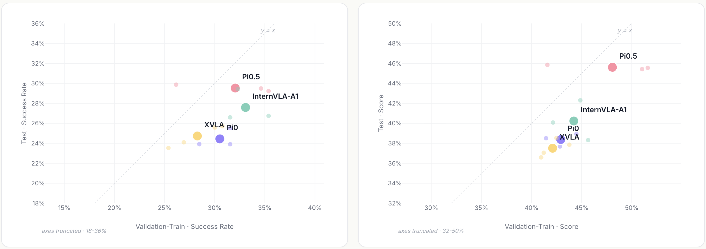
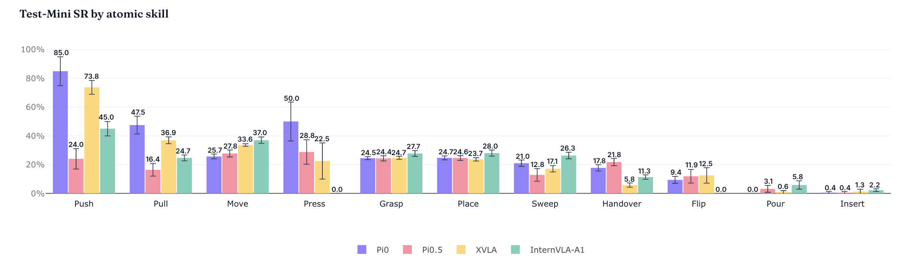
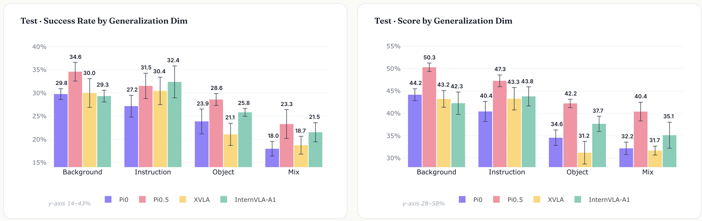
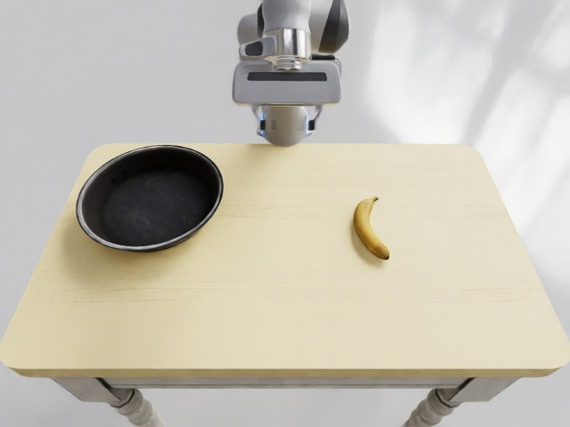
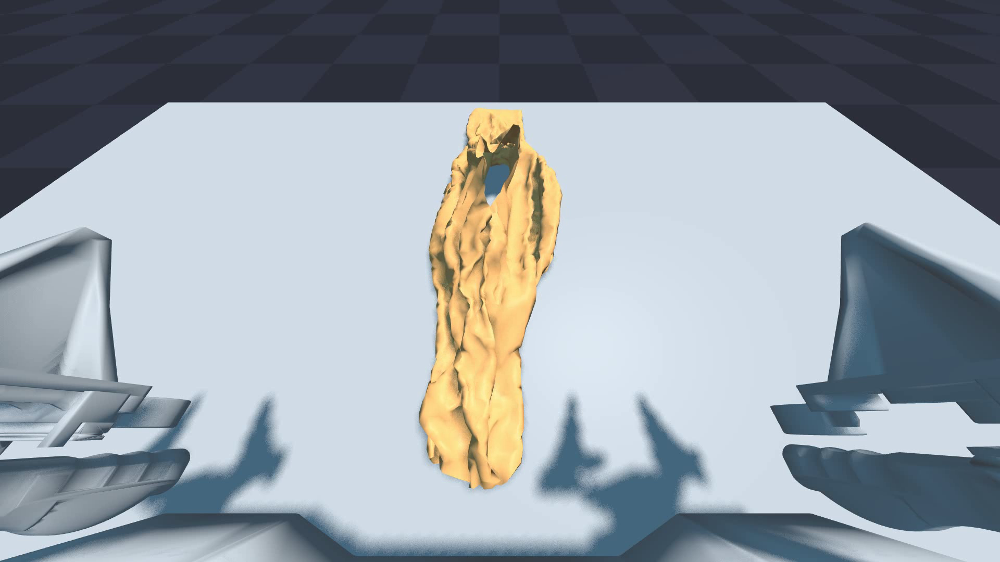
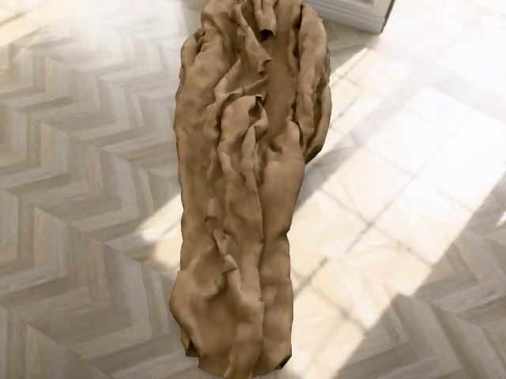

## 标题：从“能跑通”到“能诊断”：上海AI Lab推出具身操作仿真评测基座EBench

在大模型不断刷新认知智能上限之后，具身智能正把研究重点进一步推向真实物理世界。这里的核心问题不再只是模型“能不能理解”，而是机器人能否真正完成复杂操作，并在新环境、新物体和新任务条件下保持稳定表现。

而要回答这个问题，评测体系正在成为无法绕开的关键基础设施。

今天，具身领域并不缺模型，也不缺一个又一个不断刷新的 benchmark 分数。真正稀缺的，是一种能够帮助研究者回答“模型到底强在哪、弱在哪，以及这种能力能否迁移”的评测方式。

换句话说，行业现在缺的，不只是一个排行榜，而是一套能够把总分拆开、把能力看清、把泛化测准的评测基座。

正是在这样的背景下，上海 AI Lab 物理智能中心推出 EBench。它不是一个只负责产出总分的新榜单，而是一套围绕能力解析、真实泛化与高效迭代构建的具身操作仿真评测基座。

目前，EBench 共包含 26 种任务，并从场景（Scene）、原子技能（Atomic Skill）、时长（Horizon）、精度（Precision）和操作模式（Operating Mode）五个维度进行任务标注；同时覆盖物体泛化（Object）、背景泛化（Background）、指令泛化（Instruction）和组合扰动（Mixed perturbation）四类泛化维度，共构建 794 条测试任务，希望把具身操作评测从“给出分数”推进到“解释能力”。


相关链接：

项目开源地址：https://github.com/InternRobotics/EBench

评测集 Hugging Face 下载链接：https://huggingface.co/datasets/InternRobotics/EBench-Dataset

评测集 ModelScope 下载链接：https://modelscope.cn/datasets/InternRobotics/EBench-Dataset

在线仿真评测平台：https://internrobotics.shlab.org.cn/eval

## 从“抓与放”到复杂操作：让任务本身更接近真实场景

要让评测真正具备诊断价值，首先需要让任务本身足够接近真实操作场景。真实环境中的机器人操作，很少只是单一桌面上的“抓取—放置”，而往往同时涉及空间理解、精细控制、长程规划，以及机械臂、双手和移动底盘之间的协同。

因此，EBench 在任务设计上突破了传统“抓取—放置”循环，覆盖单步抓放、精细装配、移动操作和长程协同等多种任务形态。

在空间上，任务从二维桌面扩展到具有高度、纵深和层级关系的三维环境；在精度上，从“能放下”进一步走向“能对齐、能调准”；在时序上，从单步动作扩展到多步骤规划与中途纠错；在执行主体上，也从单机械臂延伸到双手协同与移动底盘协同。

这些任务将抓取（Grasp）、放置（Place）、插装（Insert）、倒入（Pour）、翻面（Flip）、推扫（Sweep）、递交（Handover）等动作原语融入真实操作语义中，使 EBench 不只是记录“做没做成”，也能进一步分析模型到底强在哪、弱在哪。


## 从总分到能力画像：让模型表现有据可拆

EBench 想做的第一件事，是把“任务是否成功”进一步还原到“能力为什么成功”。

过去，很多 benchmark 会给出一个整体成功率。这个数字足够直观，却不够可解释。模型分数提高了，研究者仍然很难判断：提升到底来自移动能力增强、精细控制改善、长程任务更稳定，还是只是某些低难度任务占比带来的结果变化。

为此，EBench 为每条任务建立五维标签体系，将任务结果重新映射到具体能力维度中。

其中，场景维度用于观察模型在不同视觉环境中的表现差异；原子技能维度用于拆解模型在不同基础操作技能上的能力分布；时长维度用于刻画任务链条长度，帮助区分短程任务与长程任务中的稳定性差异；精度维度用于分析模型面对不同精度要求时的表现；操作模式维度则用于区分灵巧操作与移动操作，观察模型在不同操作形态下是否存在明显差异。

这样一来，EBench 输出的不再只是一个“成功率”，而是一张可以进一步分析的能力画像。研究者不只知道模型有没有提升，还能继续追问：提升发生在哪个维度，短板集中在哪类任务，以及下一步优化应该优先补哪里。

对于具身操作模型而言，这意味着仿真评测不再只是“跑通任务”，而开始具备“拆解能力结构”的作用。

## 从任务完成到真实泛化：区分“会刷题”和“会迁移”

为避免模型在持续迭代中对 benchmark 本身形成适配，EBench 采用标准的验证集—测试集隔离机制。

验证集包含已见任务（Validation-Train）与未见任务（Validation-Unseen），用于日常调参与快速迭代；隔离测试集（Test）则用于在分布外情境中考察模型面对新任务、新对象、新组合时的真实适应能力，而非对训练数据的简单记忆。

在此基础上，EBench 进一步设置了四类泛化测试：物体泛化（Object）、背景泛化（Background）、指令泛化（Instruction）和组合扰动（Mixed perturbation）。

这里的关键不只是“多测几种情况”，而是让不同泛化因素尽量被分开观察。这样一来，当模型在测试集中出现性能下降时，研究者可以进一步判断：问题主要来自新物体，还是新背景；来自指令表达变化，还是多种因素叠加后的组合挑战。

换句话说，EBench 不是简单告诉研究者“模型换了测试集以后掉分了”，而是进一步帮助定位“模型为什么掉分”。

此外，考虑到不同具身模型当前覆盖的能力范围并不完全一致，EBench 还提供 Specialist 与 Generalist 双轨评测入口。

其中，Specialist 面向 Dexterous / Mobile Manip 等专项能力评估；Generalist 则面向同时具备多类操作能力的模型，进行更统一的综合测试。这样的设计既兼顾当前模型发展的不同阶段，也为后续更通用的具身操作模型提供了比较基线。

## 从研发闭环到能力诊断：让评测不止停留在结果页

对于具身操作模型来说，评测本身也是高成本环节。链路长、资源重、反馈慢，都会让 benchmark 难以真正进入研发流程。因此，EBench 在基础设施上提供了两类支持：一是开源分布式评测工具，在 8 卡 4090 配置下约 30 分钟即可完成验证集评测，便于本地快速回归；二是提供 7×24 小时在线评测服务，用户可在统一协议下发起标准化测试。

在此基础上，EBench 的结果分析也不止停留在“谁的分数更高”。目前，EBench 已在 π0、π0.5、XVLA、InternVLA-A1 等代表性模型上完成首轮验证。结果显示，整体成功率相近，并不代表能力结构相同。



从验证集进入隔离测试集后，不同模型的分数波动并不一致。InternVLA-A1 与 π0 的波动相对较小，π0.5 的下降更明显。这说明，在缺少隔离机制的评测中，验证集上的领先可能包含对训练分布的适配，而不一定代表真实泛化能力。


以移动操作和灵巧操作为例，InternVLA-A1 在移动操作任务中表现突出，但在灵巧操作上下降明显；π0 则在两类操作形态之间更加均衡。

精度维度上，低精度任务中各模型差距有限；但进入高精度操作后，π0 仍保持相对领先，而 XVLA 与 π0.5 的表现下降明显。这说明，模型在低精度任务中的稳定表现，不能直接等同于其具备高精度操作能力。

原子技能也呈现出互补性：π0 在拉（Pull）上表现更好；XVLA 在推（Push）上更具优势，但在交接 / 递送（Handover）任务上相对较弱。



*不同模型在原子技能维度上的成功率对比*

泛化测试进一步显示，背景变化和指令变化相对容易适应；一旦引入新物体，模型表现会明显下降；当多个因素同时变化，即进入组合扰动（Mixed perturbation）场景时，表现会进一步降低。整体来看，物体泛化（Object）和组合扰动（Mixed perturbation）是当前模型更容易失守的两个环节。在泛化性上，π0.5同样处于当前领先位置，在背景、物体、组合3个泛化维度上均优于其他模型，其中背景和前景物体泛化维度的优势最为明显。这也在一定程度上解释了社区普遍对于π0.5预训练“好用”的体验——模型经过后训练微调仍具有较好的泛化性。

这些结果说明，对于具身操作模型而言，高分并不自动等于高泛化。EBench 更重要的价值，是帮助研究者看清分数来自哪类能力、能否迁移到分布外任务，以及模型真正的短板在哪里。



## 快速上手指南：先跑通一个最小闭环

如果只是想快速体验 EBench，不建议一上来就下载完整数据集、部署大模型 policy 或跑完整验证集。更稳妥的路径是先跑一个 smoke test：确认 Isaac Sim、GenManip、cuRobo 规划、轨迹保存和视频渲染链路全部可用。

本次我们复现的是 GenManip 中的 `Minimal_Banana` 任务：让 Franka 把香蕉放到平底锅上。它不代表完整 EBench 跑分，但可以作为环境是否可用的最小检查。

### 1. 推荐硬件与版本

最小 smoke test 对显存要求不高，一张 24GB 显存的 RTX 4090 或 L40 就可以跑通。更大规模的验证集评测、并行数据生成或模型 policy 部署，才需要多卡和更大的磁盘空间。

本次验证使用的关键版本如下：

| 项目 | 本次验证版本 |
| --- | --- |
| 系统 | Ubuntu 22.04 |
| Python | 3.10 |
| Isaac Sim | 4.1.0.0 |
| PyTorch | 2.4.0+cu121 |
| NumPy | 1.26.4 |
| cuRobo | v0.7.8 |

需要注意的是，Isaac Sim 4.x 的 PyPI 包通常要求 Python 3.10。如果用 Python 3.11 安装 Isaac Sim 4.1，会遇到 `Requires-Python ==3.10.*` 这类版本错误。

### 2. 准备环境

建议把 Python 虚拟环境放在数据盘，而不是共享盘，减少安装和解压时的 IO 开销。启动 Isaac Sim 前需要接受 Omniverse EULA：

```bash
export OMNI_KIT_ACCEPT_EULA=YES
export HF_HOME=/root/gpufree-data/hf_home
export TMPDIR=/root/gpufree-data/tmp
```

cuRobo 建议固定到 `v0.7.8`。GenManip 当前代码会使用旧版导入路径：

```python
from curobo.geom.sdf.world import CollisionCheckerType
```

如果直接使用 cuRobo 最新主分支，可能出现 `No module named 'curobo.geom'`。可以这样固定：

```bash
cd saved/envs/curobo
git checkout v0.7.8
pip install -e . --no-build-isolation
```

### 3. 生成最小任务轨迹

进入 GenManip 根目录后运行：

```bash
python demogen.py \
  --config configs/tasks/minimal.yml \
  --record minimal_planning
```

如果只加 `--without_planning`，程序会保存场景和少量轨迹信息，但后续 `render.py` 无法生成完整动作视频。因此要得到可视化结果，应先跑带规划的 `demogen.py`。

成功后，会在类似目录中看到轨迹数据：

```text
saved/demonstrations/Minimal_Banana/trajectory/
```

### 4. 渲染并导出视频

默认相机配置会开启 depth、semantic segmentation、2D/3D bbox 和 motion vector。我们在双 4090 环境中遇到过 Isaac/Hydra 的 CUDA interop 报错，例如：

```text
CUDA error 700: an illegal memory access was encountered
HydraEngine::render failed
Rendering failed
```

对于快速 smoke test，可以先关闭多 GPU，并把相机配置改成 RGB-only。这样可以先确认“任务规划 -> 轨迹回放 -> RGB 渲染 -> 视频导出”这条主链路可用。

核心改法如下：

```python
simulation_app = SimulationApp(
    {
        "headless": True,
        "active_gpu": 0,
        "physics_gpu": 0,
        "multi_gpu": False,
        "max_gpu_count": 1,
    }
)
```

相机配置中关闭非 RGB annotator：

```yaml
with_distance: false
with_semantic: false
with_bbox2d: false
with_bbox3d: false
with_motion_vector: false
```

随后运行 RGB-only 渲染：

```bash
python render_single_gpu.py \
  --config configs/tasks/minimal_rgb_only.yml \
  --without_depth \
  --record rgb_only_single_gpu_full
```

本次 smoke test 成功渲染出 316 帧，并从 LMDB 解码为三路相机视频。

### 5. 本地可视化结果

下面的视频是本次最小任务的 RGB 渲染结果。它们是 smoke test 产物，用于确认链路已跑通，不等同于正式 EBench 评测视频。

<video controls muted preload="metadata" width="100%">
  <source src="assets/ebench/ebench_minimal_banana_obs_camera.mp4" type="video/mp4">
</video>

[打开视频：assets/ebench/ebench_minimal_banana_obs_camera.mp4](assets/ebench/ebench_minimal_banana_obs_camera.mp4)

<video controls muted preload="metadata" width="100%">
  <source src="assets/ebench/ebench_minimal_banana_obs_camera_2.mp4" type="video/mp4">
</video>

[打开视频：assets/ebench/ebench_minimal_banana_obs_camera_2.mp4](assets/ebench/ebench_minimal_banana_obs_camera_2.mp4)

<video controls muted preload="metadata" width="100%">
  <source src="assets/ebench/ebench_minimal_banana_realsense.mp4" type="video/mp4">
</video>

[打开视频：assets/ebench/ebench_minimal_banana_realsense.mp4](assets/ebench/ebench_minimal_banana_realsense.mp4)

俯视图如下：



### 6. 排错顺序

如果复现失败，可以按下面顺序排查：

1. 先确认 `OMNI_KIT_ACCEPT_EULA=YES`，避免 Isaac Sim 卡在 EULA 输入。
2. 确认 Python 是 3.10，Isaac Sim 4.1 不适配 Python 3.11。
3. 确认 cuRobo 是 `v0.7.8`，否则可能找不到 `curobo.geom`。
4. 先跑 `demogen.py`，不要只跑 `--without_planning`。
5. 如果默认渲染触发 CUDA/Hydra 错误，先切到 RGB-only + single GPU。
6. 只要 smoke test 先跑通，再考虑恢复 depth、semantic、bbox 等完整标注输出。

## 不止 EBench：三条仿真与数据生成路线

EBench 解决的是“如何评测具身操作策略”的问题。围绕它，还可以看到 InternRobotics 生态中另外两条重要路线：SIM1 面向柔体操作数据生成，InternVerse / InternDataEngine 面向更通用的合成数据引擎。它们和 EBench 不是互相替代的关系，而是覆盖了具身研发闭环中的不同位置。

### SIM1：面向柔体世界的数据生成器

SIM1 全称是 **Physics-Aligned Simulator as Zero-Shot Data Scaler in Deformable Worlds**，重点不在刚体 pick-and-place，而在双臂布料等柔体操作。它提供从遥操作、扩散策略生成轨迹、物理 replay、质量过滤，到高保真渲染和 LeRobot 数据转换的一条数据生成链路。

在最小复现中，SIM1 可以先用很短的 replay 样本验证链路。下面的视频来自 8 帧 smoke replay，主要用于确认 replay、USD 记录和视频保存链路已经工作。



<video controls muted preload="metadata" width="100%">
  <source src="assets/sim1/sim1-replay-smoke.mp4" type="video/mp4">
</video>

[打开视频：assets/sim1/sim1-replay-smoke.mp4](assets/sim1/sim1-replay-smoke.mp4)

高保真渲染链路会把 replay 结果进一步转成多相机 RGB、LMDB 和 LeRobot 数据。下面是同一 smoke 样本的 head camera 渲染结果。



<video controls muted preload="metadata" width="100%">
  <source src="assets/sim1/sim1-render-head.mp4" type="video/mp4">
</video>

[打开视频：assets/sim1/sim1-render-head.mp4](assets/sim1/sim1-render-head.mp4)

SIM1 的关键价值在于：柔体轨迹不是生成出来就直接可用，而是要经过物理 replay 和质量过滤。通过率低并不一定意味着环境安装失败，而是柔体接触、夹爪闭合、布料姿态和求解器稳定性共同作用后的结果。

### InternVerse / InternDataEngine：小空间体验合成数据引擎

InternDataEngine 是 InternVerse 具身数据平台中的数据合成引擎。完整资产包很大，但如果只是体验功能，不必一开始下载约 200GB 的 full assets。小空间路线可以用仓库自带资产、必要的 cuRobo / Drake 依赖，以及少量补充资产，覆盖 workflow、机器人、控制器、技能、物体、相机、随机化和数据输出链路。

下面的视频来自小空间体验任务，用 Split ALOHA 展示 workflow、控制器和三路相机输出。


<video controls muted preload="metadata" width="100%">
  <source src="assets/internverse/track_three_views.mp4" type="video/mp4">
</video>

[打开视频：assets/internverse/track_three_views.mp4](assets/internverse/track_three_views.mp4)

物体与 Domain Randomization 任务可以展示物体类别、姿态、光照和相机扰动。


<video controls muted preload="metadata" width="100%">
  <source src="assets/internverse/object_dr_three_views.mp4" type="video/mp4">
</video>

[打开视频：assets/internverse/object_dr_three_views.mp4](assets/internverse/object_dr_three_views.mp4)

铰接物体 demo 则用于验证 `ArticulatedObject` 加载与多视角渲染。


<video controls muted preload="metadata" width="100%">
  <source src="assets/internverse/articulation_three_views.mp4" type="video/mp4">
</video>

[打开视频：assets/internverse/articulation_three_views.mp4](assets/internverse/articulation_three_views.mp4)

这条路线的意义在于：即使不下载完整资产，也能先体验合成数据平台的主要模块，包括 `simbox_plan_and_render` workflow、Split ALOHA、cuRobo 控制链路、三路相机、LMDB 和 MP4 输出。对于课程展示、公众号短文和功能预览，这种“小空间功能体验”比完整任务库更轻量。

### 三者如何放在一起理解

可以把三者放在一个研发闭环中理解：

| 工具 | 主要作用 | 适合先跑什么 |
| --- | --- | --- |
| EBench | 评测策略能力，拆解成功率背后的能力结构 | `Minimal_Banana` smoke test |
| SIM1 | 生成和过滤柔体操作数据 | 8 帧 replay 与高保真渲染 smoke |
| InternDataEngine | 通用合成数据引擎，覆盖技能、物体、相机和随机化 | 小空间三视角 demo |

EBench 更像“考场”，SIM1 和 InternDataEngine 更像“训练数据工厂”和“合成数据引擎”。当评测指出模型在物体泛化、高精度操作或长程任务上存在短板时，后两者可以继续为特定能力补充数据和可视化样本。

## 想继续动手？Every-Embodied 开源教程已经整理好了

如果你读到这里，最关心的问题可能已经不只是“EBench 评什么”，而是：我能不能自己跑起来、改起来、继续往科研项目里接？

Datawhale 的 **every-embodied** 具身智能中文开源教程，正是为这个需求准备的。项目把具身智能学习拆成可实践的章节，覆盖基础概念、具身导航与 VLN、仿真环境、策略学习、VLA / VLM、数据集与评估基准、竞赛实践和专题组队学习，尽量把“看懂论文”和“真正跑通代码”之间的距离缩短。

完整开源项目直达：

https://github.com/datawhalechina/every-embodied

在线阅读地址：

https://datawhalechina.github.io/every-embodied/zh-cn/

这次 EBench、SIM1 和 InternVerse / InternDataEngine 的复现记录，也已经同步到 every-embodied 项目中。它们不是停留在“概念介绍”，而是按“先跑通一条最小链路”的方式组织：先说明环境要求和关键配置，再给出 smoke test 视频，最后把常见错误和排错顺序写清楚。

如果你刚入门，可以从导航、仿真和基础操作章节开始；如果你已经在做具身操作模型，可以把 EBench 当成评测入口，把 SIM1 / InternDataEngine 当成数据生成入口，用同一个开源教程项目串起“学习、复现、评测、迭代”的完整路径。


## 结语

今天的具身智能，不缺新模型，也不缺新榜单。真正缺的，是一套能够帮助研究者持续建立“模型能力认知”的评测体系。

EBench 想表达的，正是这一点：它不只是一个新的仿真 benchmark，也不只是一个新的 leaderboard，而是希望把具身操作评测从“被动计分”推进到“主动诊断”，把仿真评测从“跑通任务”推进到“解析能力”。

当研究者不再只能看到一个总分，而能够真正看清模型的能力结构、泛化边界与真实短板时，评测才不再只是结果页上的一个数字，而开始成为推动模型迭代和方法创新的基础设施。


（欢迎扫码加入用户交流群）

欢迎访问在线仿真评测平台

https://internrobotics.shlab.org.cn/eval
