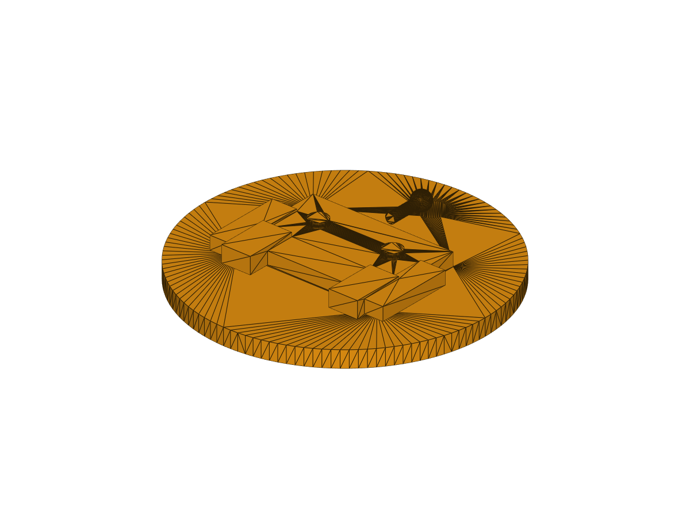
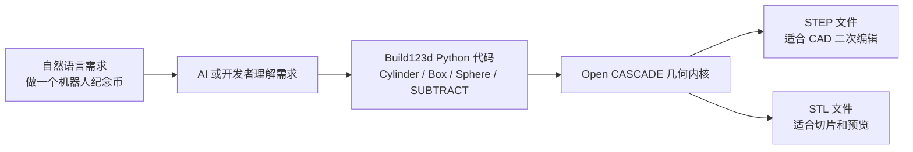
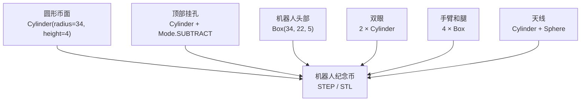
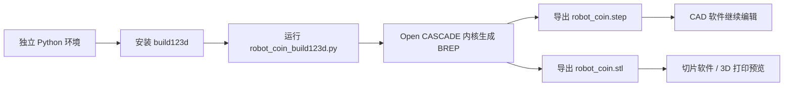
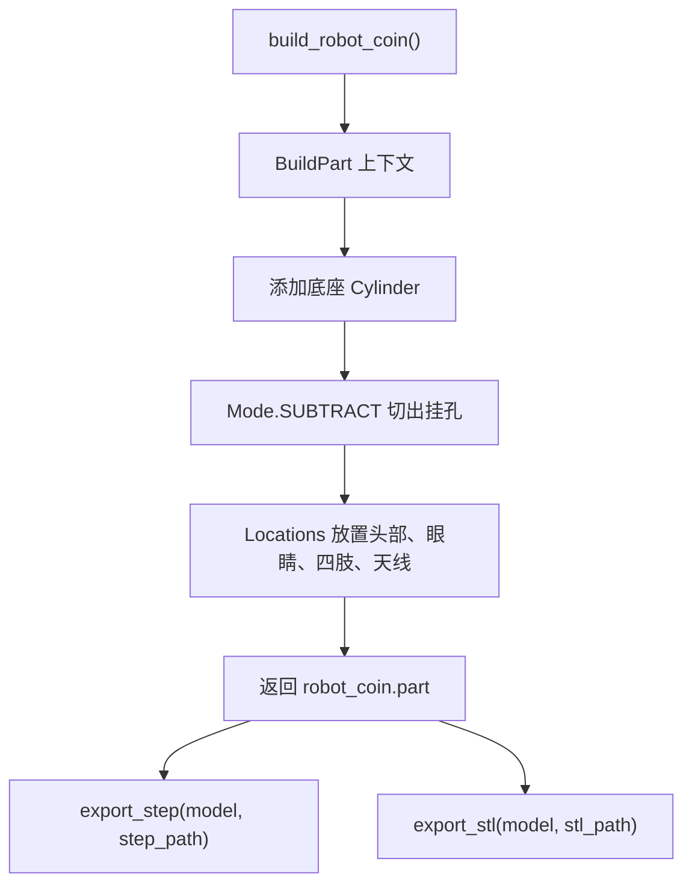

# Build123d 代码建模入门：复刻一个机器人纪念币

Build123d 是一个 Python 参数化 CAD 建模库，适合用代码生成可重复修改的机械零件、机器人结构件和 3D 打印模型。本章先不追求复杂机械臂装配，而是用一个小型“机器人纪念币”跑通完整链路：理解设计意图、安装隔离环境、用 Python 建模、导出 STEP/STL，并解释代码里的几何结构为什么会生成当前这个形状。

这里需要先澄清一个容易误解的点：Build123d 本身不是“自然语言直接生成 STL”的工具，它真正执行的是 Python 几何代码。自然语言可以作为需求描述，例如“生成一个带挂孔的机器人纪念币”，AI 或开发者再把这句话翻译成 `Cylinder`、`Box`、`Sphere`、`Mode.SUBTRACT` 等 Build123d 代码。运行脚本以后，Build123d 才会调用底层 Open CASCADE 几何内核生成实体，并导出 STEP/STL 文件。

因此，本章里的“机器人纪念币”并不是某个提示词直接生成出来的模型。可以把自然语言理解成建模任务书，例如：“做一个圆形底座，上面有凸起的机器人图案，顶部留一个可穿钥匙圈的小孔，并导出 STL 和 STEP。”这句话本身不会被 Build123d 执行，它需要先变成 `robot_coin_build123d.py` 里的 Python 代码。脚本才是真正的可复现资产，STEP/STL 是脚本运行后的结果。

这一章的核心不是让大家记住某几行命令，而是理解“从设计意图到可制造文件”的路径：

```text
自然语言设计需求
→ Python / Build123d 几何代码
→ Open CASCADE 实体建模
→ STEP / STL 文件
→ CAD 编辑或 3D 打印切片
```

学完这一章后，大家可以得到三个可复现结果：

```text
outputs/robot_coin.step
outputs/robot_coin.stl
assets/robot_coin_preview.png
```

本仓库已保留一份本机复刻结果：[robot_coin.step](outputs/robot_coin.step)、[robot_coin.stl](outputs/robot_coin.stl)。如果大家只想先看结果，可以直接下载这两个文件；如果想学习 CAD-as-code 的建模过程，建议从环境安装和脚本运行开始完整复刻一遍。

<p align="center">
  
</p>

图 1 本机离屏渲染得到的机器人纪念币预览图。该图由 `outputs/robot_coin.stl` 自动渲染生成，不需要手动打开 CAD 软件截图。

## 为什么选择机器人纪念币作为第一个例子

第一个 Build123d 示例不适合一上来就做完整机械臂。机械臂涉及连杆、关节、装配约束、电机安装位、轴承孔、公差和运动范围，概念密度太高，初学者很容易把“代码建模语法”和“机械设计问题”混在一起。本章选择机器人纪念币，是因为它足够简单，但又覆盖了代码建模最核心的几类操作。

圆形币面对应最基础的实体生成，机器人头部和四肢对应盒体定位，眼睛和天线对应圆柱与球体，顶部挂孔对应布尔减法。也就是说，这个小模型虽然不是复杂机构，却已经包含了参数化 CAD 的基本思想：先把目标形状拆成若干可描述的几何特征，再用代码逐个生成、定位、相加或相减。

它之所以长成“圆形底座 + 凸起机器人图案 + 顶部挂孔”的样子，是为了让大家在一个模型里同时看到三类结果。第一类是实体添加，比如底座、头部、眼睛、四肢和天线；第二类是实体减去实体，比如挂孔；第三类是导出格式差异，STEP 用于后续 CAD 编辑，STL 用于切片和预览。理解了这个小模型，再去做夹爪支架、传感器固定座、开发板安装板或机械臂末端转接件，就只是把几何特征换成更工程化的尺寸。

## 本章会完成什么

本文使用 Windows PowerShell + Python 3.12 验证。大家会先创建独立 Python 环境，避免 Build123d 的 CAD 依赖影响已有机器人仿真环境；随后运行 `robot_coin_build123d.py` 生成实体模型，导出 `.step` 和 `.stl`；最后用 `render_robot_coin_preview.py` 自动渲染一张 PNG 预览图。教程最后会回到代码层面，解释每一类几何操作如何对应到模型上的可见结构。

## 官方图与本文图示

按照教程编写规范，技术方法类教程优先查找官方项目页、官方文档或论文中的架构图。本章检查了 Build123d 官方文档和官方 GitHub 仓库。官方资料里有示例模型图库和 API 文档，但没有适合直接放入本章的“系统架构图”。因此本文不搬运社交平台截图，也不使用非官方二次转载图片，而是使用 Mermaid 绘制可维护的教学图。

图 2 展示自然语言、代码和 CAD 文件之间的关系。大家需要注意，Build123d 执行的是中间的 Python 代码，而不是最左侧的自然语言。



图 2 自然语言并不直接生成 STL。它先被转写为 Build123d Python 脚本，脚本运行后才生成可打开的 CAD 文件。

图 3 展示本章复刻对象的结构拆解。最终模型不是手工拖拽出来的，而是由一组基础几何体和一次布尔减法组合得到的。



图 3 机器人纪念币的几何组成。这个示例刻意使用少量基础实体，便于大家先理解 Build123d 的建模上下文、定位和布尔操作。

图 4 展示从 Python 脚本到 CAD 文件的复刻流程。排查问题时，可以按这个链路判断问题发生在环境安装、脚本建模、几何导出还是 CAD 查看阶段。



图 4 Build123d 代码建模流程。Build123d 负责把 Python 描述转成几何实体，STEP 更适合 CAD 二次编辑，STL 更适合 3D 打印切片。

## 已验证环境

本机验证结果如下：

| 项目 | 本机验证配置 |
|---|---|
| 系统 | Windows PowerShell |
| Python | 3.12.3 |
| Build123d | 0.10.0 |
| 验证方式 | 独立虚拟环境 |
| 输出格式 | STEP、STL、PNG |
| 输出尺寸 | 约 `68 mm × 68 mm × 9.4 mm` |

当前仓库常用的 Python 环境可能已经安装了 ManiSkill、机器人学和深度学习相关依赖。直接在这类环境里安装 Build123d 会牵动 `numpy`、`scipy`、`vtk` 等包版本，容易和现有仿真工具冲突。因此本章推荐大家始终使用独立虚拟环境。

## 目录结构

本章文件位于：

```text
21-机械臂和机器人设计/
└── 01Build123d代码建模入门/
    ├── README.md
    ├── requirements.txt
    ├── robot_coin_build123d.py
    ├── render_robot_coin_preview.py
    ├── assets/
    │   └── robot_coin_preview.png
    └── outputs/
        ├── robot_coin.step
        └── robot_coin.stl
```

表 1 本章文件说明。`robot_coin_build123d.py` 是可复现建模脚本，`render_robot_coin_preview.py` 负责把 STL 自动渲染成教程图片，`outputs/` 是脚本生成的 CAD 结果。

## 第一步：创建隔离环境

下面命令假设大家已经进入 Every-Embodied 仓库根目录。不要在命令里写本地用户绝对路径，统一使用相对路径即可。

```powershell
py -3.12 -m venv .venv-build123d
.\.venv-build123d\Scripts\python.exe -m pip install --upgrade pip
.\.venv-build123d\Scripts\python.exe -m pip install -r .\21-机械臂和机器人设计\01Build123d代码建模入门\requirements.txt
```

如果没有安装 Python 3.12，也可以先尝试 Python 3.11：

```powershell
python -m venv .venv-build123d
.\.venv-build123d\Scripts\python.exe -m pip install --upgrade pip
.\.venv-build123d\Scripts\python.exe -m pip install build123d==0.10.0
```

不要把 `.venv-build123d/` 提交到仓库。它只是本地运行环境。

Checkpoint 1：确认 Build123d 可以被导入。

```powershell
.\.venv-build123d\Scripts\python.exe -c "import build123d; print(build123d.__version__)"
```

本机输出为：

```text
0.10.0
```

这个检查只证明 Python 能导入 Build123d，还没有证明几何内核和文件导出链路正常。真正的建模验证在下一步完成。

## 第二步：运行复刻脚本

继续在仓库根目录运行：

```powershell
.\.venv-build123d\Scripts\python.exe .\21-机械臂和机器人设计\01Build123d代码建模入门\robot_coin_build123d.py
```

运行成功后，终端会输出类似结果：

```text
Build123d robot coin generated.
Bounding box: bbox: -34.0 <= x <= 34.0, -34.0 <= y <= 34.0, -2.0 <= z <= 7.4
STEP: ...\outputs\robot_coin.step
STL:  ...\outputs\robot_coin.stl
```

这里的包围盒是理解模型形状的第一把尺子。`x` 和 `y` 都从 `-34` 到 `34`，说明底部圆币半径是 34 mm；`z` 从 `-2.0` 到 `7.4`，说明 4 mm 厚的币面上又叠加了机器人凸起和天线结构。换句话说，终端输出并不是随便打印的日志，它告诉我们脚本确实生成了一个有厚度、有凸起、有挂孔的三维实体。

Checkpoint 2：如果能看到上述包围盒，说明 Build123d 已经成功创建实体模型。这个烟测证明了三件事：Python 环境可用、Open CASCADE 几何内核可用、STEP/STL 导出链路可用。它不代表模型已经适合直接量产或打印，打印前仍建议检查壁厚、悬垂和切片结果。

Checkpoint 3：确认输出文件存在。

```powershell
Get-ChildItem .\21-机械臂和机器人设计\01Build123d代码建模入门\outputs
```

应至少看到：

```text
robot_coin.step
robot_coin.stl
```

## 第三步：自动渲染预览图

如果教程需要展示模型效果，大家不必手动打开 CAD 软件截图。本章提供了一个离屏渲染脚本，它会读取 `outputs/robot_coin.stl`，调用 VTK 设置相机、打光并导出 PNG 图片：

```powershell
.\.venv-build123d\Scripts\python.exe .\21-机械臂和机器人设计\01Build123d代码建模入门\render_robot_coin_preview.py
```

成功后会生成：

```text
21-机械臂和机器人设计/01Build123d代码建模入门/assets/robot_coin_preview.png
```

Checkpoint 4：如果 `assets/robot_coin_preview.png` 可以正常打开，说明模型预览图已经完成自动生成。这个预览图适合放进教程正文；如果要做工程尺寸检查，仍然建议打开 STEP 文件或导入 CAD 软件进一步确认。

## 第四步：查看输出模型

`robot_coin.step` 适合在 FreeCAD、SolidWorks、Fusion、Onshape 等 CAD 工具中继续编辑；`robot_coin.stl` 适合导入 Bambu Studio、PrusaSlicer、Cura 等切片软件进行 3D 打印预览。

建议大家先打开 STEP 文件检查结构，因为 STEP 保留了更完整的边界表示；确认模型没问题后，再用 STL 做打印切片。如果只想验证脚本是否能生成模型，打开仓库里的 `outputs/robot_coin.step` 即可。

## 代码机理说明：为什么形状会长这样

核心代码位于：

```text
21-机械臂和机器人设计/01Build123d代码建模入门/robot_coin_build123d.py
```

这个脚本没有从外部加载模型文件，也没有调用自然语言生成接口。模型的全部形状都来自 `build_robot_coin()` 函数里的几何语句。理解这段代码时，可以把它看成一套“搭积木”的过程：先放一个圆形底座，再从底座上挖出挂孔，然后在表面堆叠机器人图案。

第一步是币面。`Cylinder(radius=34, height=4)` 生成一个半径 34 mm、高 4 mm 的圆柱体。因为 Build123d 默认把圆柱放在原点附近，所以它的高度范围是 `-2` 到 `2`。这就是包围盒里 `z` 最小值为 `-2.0` 的原因。这个圆柱不是机器人本体，而是所有凸起特征的承载平面，类似徽章或钥匙扣的底板。

第二步是挂孔。脚本在 `(0, 25, 0)` 位置放置一个半径 3.2 mm、高 8 mm 的圆柱，并使用 `mode=Mode.SUBTRACT`。这里的关键不是“再加一个圆柱”，而是“用这个圆柱从已有实体里减去材料”。因此预览图顶部会出现一个通孔。这个设计对应实际制造里的穿绳孔或钥匙圈孔，是机器人纪念币具有实用性的原因。

第三步是机器人图案。`Box(34, 22, 5)` 在币面上方生成一个长方体，用来表示机器人头部或身体。两个小圆柱放在头部上方，形成眼睛；四个长方体分别表示手臂和腿；最后用一个横向圆柱加小球表示天线。它们都不是独立漂浮的对象，而是通过 `Locations(...)` 定位后合并进同一个 `BuildPart()` 上下文，所以最终导出的是一个整体零件。

图 5 用函数级数据流概括了这个过程。大家可以把它和预览图对照起来看：每一个可见凸起都能在代码里找到对应的几何语句。



图 5 `robot_coin_build123d.py` 的函数级数据流。脚本的输入是代码里的尺寸参数，输出是两个 CAD 文件；自然语言需求只参与“设计描述”，不直接参与几何求解。

这种代码建模方式的价值在于可解释和可修改。如果大家希望币面更大，修改底座圆柱半径即可；如果希望头部更宽，修改 `Box(34, 22, 5)` 的第一个参数即可；如果希望挂孔更靠近边缘，调整 `Locations((0, 25, 0))` 的第二个坐标即可。模型不是一次性的图片，而是一份可以反复修改、重新生成的设计程序。

## 可调整参数

下面这张表只列最常改的参数。初学时建议一次只改一个参数，重新运行脚本后观察 STEP/STL 和 PNG 的变化，这样更容易建立“代码参数—几何结果”的对应关系。

| 目标 | 修改位置 | 建议 |
|---|---|---|
| 改币面大小 | `Cylinder(radius=34, height=4)` | 半径控制外径，高度控制厚度 |
| 改挂孔位置 | `Locations((0, 25, 0))` | 第二个数值越大，挂孔越靠近上边缘 |
| 改机器人头部 | `Box(34, 22, 5)` | 三个参数分别控制长、宽、高 |
| 改眼睛大小 | `Cylinder(radius=2.2, height=1.4)` | 半径越大，眼睛越明显 |
| 改天线高度 | `Cylinder(radius=1.2, height=8, rotation=(90, 0, 0))` | `height` 控制天线长度 |

表 2 常用参数修改位置。修改后重新运行脚本即可覆盖生成新的 STEP/STL/PNG 文件。

## 常见问题

### 1. 不建议直接装进已有机器人环境

Build123d 会安装 Open CASCADE、VTK、NumPy、SciPy 等依赖。本机测试时，直接装进已有机器人环境会触发依赖冲突提示。建议始终使用独立虚拟环境。

### 2. 看到字体警告怎么办

本机在导入 Build123d 时出现过如下警告：

```text
cannot open font 'C:\WINDOWS\Fonts\mstmc.ttf': Not a TrueType or OpenType font
```

本章没有使用文字建模，该警告不影响 STEP/STL 导出。如果后续要做文字浮雕，建议显式指定可用字体文件。

### 3. STEP 和 STL 应该选哪个

STEP 更适合 CAD 二次编辑，STL 更适合 3D 打印切片。教程归档时建议同时保留脚本和 STEP；如果担心仓库体积，可以不提交 STL，让读者本地生成。

### 4. 是否必须手动打开 CAD 软件截图

不必须。本章的 `render_robot_coin_preview.py` 已经把“打开 STL、设置相机、打光、导出 PNG”自动化了，适合生成教程中的预览图。只有在需要检查工程尺寸、装配约束或打印支撑时，才需要再打开 CAD 或切片软件手动查看。

### 5. 什么时候需要生成概念图片

如果教程目标是讲清楚“流程”和“参数关系”，优先用 Mermaid 或 SVG，因为它们可维护、可搜索、不会随着截图分辨率变糊。如果需要做封面图、宣传图或概念插画，可以再用图像生成工具绘制，但不应替代可复现的 CAD 脚本和本章的 STEP/STL 结果。

## 参考资料

- Build123d 官方安装文档：https://build123d.readthedocs.io/en/latest/installation.html
- Build123d 官方示例页：https://build123d.readthedocs.io/en/latest/examples_1.html
- Build123d GitHub 仓库：https://github.com/gumyr/build123d
