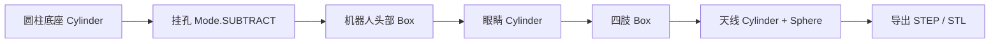

# Build123d 代码建模入门：复刻一个机器人纪念币

Build123d 是一个 Python 参数化 CAD 建模库，适合用代码生成可重复修改的机械零件、机器人结构件和 3D 打印模型。本章先不追求复杂机械臂装配，而是用一个小型“机器人纪念币”跑通完整链路：安装隔离环境、用 Python 建模、导出 STEP/STL，并理解代码里的几何结构如何对应到 CAD 实体。

完成本章后，读者可以得到两个可直接打开或切片的文件：

```text
outputs/robot_coin.step
outputs/robot_coin.stl
```

本仓库已保留一份本机复刻结果：[robot_coin.step](outputs/robot_coin.step)、[robot_coin.stl](outputs/robot_coin.stl)。

图 1 复刻目标是一个带挂孔的机器人徽章：底部是圆形币面，上方用长方体、圆柱和球体组合出机器人头部、眼睛、手臂、腿和天线。

## 本章会完成什么

本文使用 Windows + Python 3.12 验证，完成以下内容：

1. 检查本机是否具备运行 Build123d 的条件。
2. 创建独立 Python 虚拟环境，避免污染已有机器人/仿真环境。
3. 运行 `robot_coin_build123d.py` 生成机器人纪念币。
4. 导出 `.step` 和 `.stl` 两种常用 CAD/3D 打印格式。
5. 解释 Build123d 中 `Cylinder`、`Box`、`Sphere`、`Locations` 和 `Mode.SUBTRACT` 的作用。
6. 给出常见安装和导出问题的处理方法。

## 已验证环境

本机验证结果如下：

| 项目 | 本机验证配置 |
|---|---|
| 系统 | Windows PowerShell |
| Python | 3.12.3 |
| Build123d | 0.10.0 |
| 验证环境 | `%TEMP%\every_embodied_build123d_venv` |
| 输出格式 | STEP、STL |

当前仓库常用的 `py311` 环境已经安装了 ManiSkill、机器人学和深度学习相关依赖。直接在这个环境里安装 Build123d 会牵动 `numpy`、`scipy`、`vtk` 等包版本，容易和现有仿真工具冲突。因此本章推荐使用独立虚拟环境。

## 第一步：创建隔离环境

在仓库根目录运行：

```powershell
cd C:\Users\kewei\Documents\2025\04资料整理\03具身教程编写\every-embodied

py -3.12 -m venv .venv-build123d
.\.venv-build123d\Scripts\python.exe -m pip install --upgrade pip
.\.venv-build123d\Scripts\python.exe -m pip install -r .\21-机械臂和机器人设计\01Build123d代码建模入门\requirements.txt
```

如果没有安装 Python 3.12，也可以先尝试 Python 3.11：

```powershell
python -m venv .venv-build123d
.\.venv-build123d\Scripts\python.exe -m pip install --upgrade pip
.\.venv-build123d\Scripts\python.exe -m pip install build123d==0.10.0
```

不要把 `.venv-build123d/` 提交到仓库。它只是本地运行环境。

## 第二步：运行复刻脚本

进入本章目录，执行脚本：

```powershell
cd C:\Users\kewei\Documents\2025\04资料整理\03具身教程编写\every-embodied\21-机械臂和机器人设计\01Build123d代码建模入门

..\..\.venv-build123d\Scripts\python.exe .\robot_coin_build123d.py
```

如果使用的是临时环境，可以把命令中的 Python 路径替换为自己的虚拟环境路径。本机烟测使用的是：

```powershell
$env:TEMP\every_embodied_build123d_venv\Scripts\python.exe .\robot_coin_build123d.py
```

运行成功后，终端会输出类似结果：

```text
Build123d robot coin generated.
Bounding box: bbox: -34.0 <= x <= 34.0, -34.0 <= y <= 34.0, -2.0 <= z <= 7.4
STEP: outputs\robot_coin.step
STL:  outputs\robot_coin.stl
```

Checkpoint 1：如果能看到上述包围盒，说明 Build123d 已经成功创建实体模型。模型尺寸约为 `68 mm × 68 mm × 9.4 mm`。

Checkpoint 2：确认输出文件存在：

```powershell
Get-ChildItem .\outputs
```

应至少看到：

```text
robot_coin.step
robot_coin.stl
```

## 第三步：查看输出模型

`robot_coin.step` 适合在 FreeCAD、SolidWorks、Fusion、Onshape 等 CAD 工具中继续编辑；`robot_coin.stl` 适合导入 Bambu Studio、PrusaSlicer、Cura 等切片软件进行 3D 打印预览。

建议先打开 STEP 文件检查结构，因为 STEP 保留了更完整的边界表示；确认模型没问题后，再用 STL 做打印切片。

## 代码结构说明

核心代码位于：

```text
21-机械臂和机器人设计/01Build123d代码建模入门/robot_coin_build123d.py
```

代码的建模流程如下：



`BuildPart()` 是建模上下文，所有几何体都会被加入当前零件。`Cylinder(radius=34, height=4)` 创建圆形币面；`Box(34, 22, 5)` 创建机器人头部；`Locations(...)` 用于把几何体放到指定坐标；`Mode.SUBTRACT` 用于从币面中减去挂孔。

这类代码建模的优势是参数可控。如果希望把纪念币做大，只需要修改半径和各组件尺寸；如果希望变成机器人铭牌，可以把底座从圆柱改成长方体。

## 可调整参数

常用改动如下：

| 目标 | 修改位置 | 建议 |
|---|---|---|
| 改币面大小 | `Cylinder(radius=34, height=4)` | 半径控制外径，高度控制厚度 |
| 改挂孔位置 | `Locations((0, 25, 0))` | 第二个数值越大，挂孔越靠近上边缘 |
| 改机器人头部 | `Box(34, 22, 5)` | 三个参数分别控制长、宽、高 |
| 改眼睛大小 | `Cylinder(radius=2.2, height=1.4)` | 半径越大，眼睛越明显 |
| 改天线高度 | `Cylinder(radius=1.2, height=8, rotation=(90, 0, 0))` | `height` 控制天线长度 |

## 常见问题

### 1. 不建议直接装进已有机器人环境

Build123d 会安装 Open CASCADE、VTK、NumPy、SciPy 等依赖。本机测试时，直接装进已有 `py311` 机器人环境会触发依赖冲突提示。建议始终使用独立虚拟环境。

### 2. 看到字体警告怎么办

本机在导入 Build123d 时出现过如下警告：

```text
cannot open font 'C:\WINDOWS\Fonts\mstmc.ttf': Not a TrueType or OpenType font
```

本章没有使用文字建模，该警告不影响 STEP/STL 导出。如果后续要做文字浮雕，建议显式指定可用字体文件。

### 3. STEP 和 STL 应该选哪个

STEP 更适合 CAD 二次编辑，STL 更适合 3D 打印切片。教程归档时建议同时保留脚本和 STEP；如果担心仓库体积，可以不提交 STL，让读者本地生成。

## 参考资料

- Build123d 官方安装文档：https://build123d.readthedocs.io/en/latest/installation.html
- Build123d GitHub 仓库：https://github.com/gumyr/build123d
