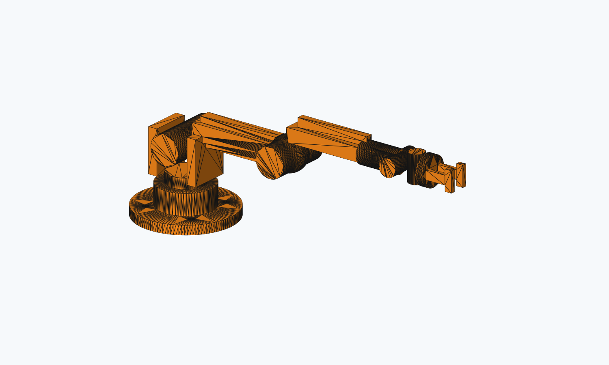
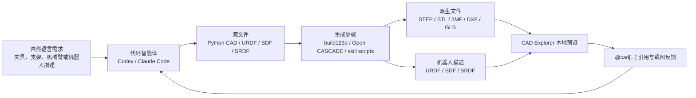
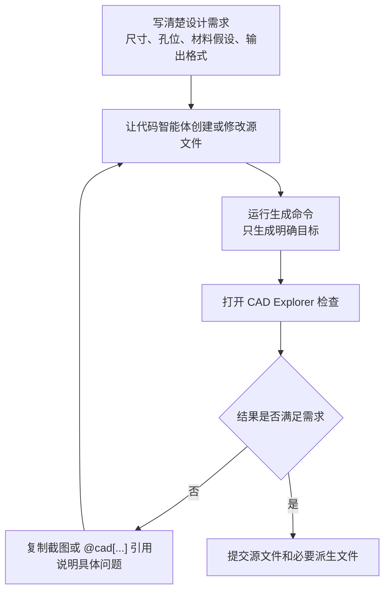

# Text-to-CAD 工程化建模入门：用代码智能体生成可复现 CAD

Text-to-CAD 不是“一句话直接变成一个完美 3D 模型”的魔法工具。更准确地说，它是一套把自然语言需求、代码智能体、参数化 CAD 脚本、几何导出和本地预览串起来的工程化工作流。大家可以先用自然语言描述想要的零件、夹具、机器人机构或 URDF 结构，再让 Codex、Claude Code 等代码智能体修改仓库里的 Python 源文件，最后由 CAD 工具链导出 STEP、STL、3MF、DXF、GLB、URDF、SDF 或 SRDF 等结果。

本章基于开源项目 [earthtojake/text-to-cad](https://github.com/earthtojake/text-to-cad) 编写。官方仓库当前的定位是 “Open Source CAD Skills And Harnesses”，核心价值不是替代所有 CAD 软件，而是把 CAD 设计变成更接近软件工程的流程：源代码可读、版本可控、生成结果可复现、每一轮修改都有明确输入和输出。

学完这一章后，大家应该能理解三件事。第一，Text-to-CAD 的“文本”主要是需求描述和迭代指令，不是直接喂给几何内核的 prompt。第二，真正可复现的资产是 CAD/URDF/SDF/SRDF 源文件和生成脚本，而不是聊天记录。第三，工程化闭环必须包含预览、引用、检查和提交，否则很容易停留在“看起来像”的演示阶段。

<p align="center">
  
</p>

图 1 本章本地生成的原创 6DOF 教学机械臂预览图。该图由 `outputs/every_embodied_6dof_arm.stl` 离屏渲染得到，不使用公众号推文中的图片素材。

## 为什么把 Text-to-CAD 放在机器人设计章节

机器人设计天然需要跨越三类文件：机械结构文件、机器人描述文件和仿真/运动规划文件。传统 CAD 软件擅长精细建模，但当大家需要频繁修改一个安装孔、调整一个连杆长度、同步更新 URDF 网格路径、把多个零件导出到仿真环境时，纯手工操作会变得很难维护。

Text-to-CAD 的思路是把这些对象当成工程项目来管理。一个零件可以由 Python 参数化脚本生成，一个机器人可以由 URDF/SDF/SRDF 文件描述，CAD Explorer 可以在本地查看 STEP、STL、URDF 等文件。这样做的好处是，每一次修改都可以留下代码 diff；如果模型坏了，也可以回到上一个可用版本，而不是在复杂 CAD 历史树里猜测哪里出错。

这也是它和上一章 Build123d 教程的关系。Build123d 更像是底层的代码建模能力，大家直接写 Python 生成几何体；Text-to-CAD 则在这个基础上增加了 agent skills、CAD Explorer、几何引用和项目级约束，让代码智能体可以更稳定地参与迭代。

## 工作流总览

图 2 展示 Text-to-CAD 的基本链路。大家需要注意，最左侧的自然语言只是设计任务书，真正写入仓库的是中间的源文件，最终可打开和可制造的是右侧的派生文件。



图 2 Text-to-CAD 的工程化闭环。自然语言负责表达意图，代码智能体负责改源文件，CAD 工具链负责生成几何结果，本地预览负责验证结果是否符合预期。

这个流程的关键不是“让 AI 一次生成最终答案”，而是建立一个可反复检查的闭环。第一次生成的模型可能有孔位偏差、比例不合理或装配干涉，大家需要在 CAD Explorer 中查看，再把具体问题反馈给代码智能体。官方项目强调 `@cad[...]` 这类稳定几何引用，就是为了让下一轮修改能指向具体面、边或对象，而不是只用模糊语言描述“左边那个地方”。

## 本章会完成什么

本章不直接复刻网络推文中的机械臂图片，避免素材版权和设计归属不清的问题。教程提供一个原创的简化 6DOF 桌面机械臂教学模型，用它来验证 Text-to-CAD 的工程链路：底座回转、肩关节、肘关节和腕部三轴都用可见几何结构表达，但它仍然是教学模型，不是可以直接制造和承载的真实机械臂。

大家会完成以下检查：克隆官方仓库；创建独立 Python 环境；安装 CAD runtime 依赖；生成原创 6DOF 教学机械臂的 STEP、STL、3MF 和 GLB；安装 CAD Explorer 前端依赖；启动本地 Explorer；确认项目能够进入“源文件修改、生成结果、打开预览”的工作状态。这个烟测证明的是工具链可用，不证明某个复杂机器人模型已经达到可制造或可仿真的质量。

## 已验证和推荐的环境策略

官方仓库标注 Python 3.11+，并在本地开发说明中使用 `python3.11 -m venv .venv` 创建虚拟环境。Windows 学习者通常有两种可选方案：普通 venv 和 micromamba。这里建议优先使用 venv，因为它更接近官方文档，也不需要额外安装 conda/mamba；如果大家已经习惯用 micromamba 管理机器人环境，也可以使用 micromamba。

| 方案 | 适合人群 | 优点 | 注意事项 |
|---|---|---|---|
| venv | 大多数 Windows / macOS / Linux 初学者 | 最接近官方文档，依赖少，便于删除重建 | 需要系统已有 Python 3.11+ |
| micromamba | 已经使用 conda/mamba 管理机器人环境的同学 | Python 版本和依赖隔离更明确 | 需要先安装 micromamba |

表 1 Text-to-CAD 环境方案选择。本文主线使用 venv，micromamba 作为备选路径。

## 第一步：克隆官方仓库

建议大家不要直接把 `text-to-cad` 克隆进 Every-Embodied 仓库内部。它是一个独立工具项目，包含自己的 skills、CAD Explorer 和生成资产。放在并列目录或单独实验目录更清晰，也可以避免把大量派生文件误提交到教程仓库。

```powershell
git clone https://github.com/earthtojake/text-to-cad.git #其他案例也可以参考这个仓库
cd text-to-cad
```

Checkpoint 1：确认仓库结构存在。

```powershell
Get-ChildItem
```

应能看到类似目录：

```text
skills/
harness/
scripts/
README.md
INSTALLATION.md
```

如果只想查看教程，不需要安装 Git LFS。官方仓库的部分 GIF 和 benchmark 资产使用 LFS 管理，轻量克隆时可能只是指针文件；这不影响大家阅读源码和安装基本工具链。

## 第二步：使用 venv 配置 CAD 运行环境

下面命令假设大家已经进入 `text-to-cad` 仓库根目录。Windows PowerShell 可以这样创建环境：

```powershell
py -3.11 -m venv .venv
.\.venv\Scripts\python.exe -m pip install --upgrade pip
.\.venv\Scripts\python.exe -m pip install -r .\skills\cad\requirements.txt
```

如果本机 `py -3.11` 不可用，可以先确认已有 Python 版本：

```powershell
python --version
```

只要是 Python 3.11 或更高版本，通常可以改用：

```powershell
python -m venv .venv
.\.venv\Scripts\python.exe -m pip install --upgrade pip
.\.venv\Scripts\python.exe -m pip install -r .\skills\cad\requirements.txt
```

Checkpoint 2：确认 CAD runtime 能导入。

```powershell
.\.venv\Scripts\python.exe -c "import build123d, vtk, trimesh, ezdxf; print('CAD runtime OK')"
```

如果这里成功，说明 Python 侧至少具备 build123d、VTK、trimesh 和 DXF 相关依赖。这个检查只验证依赖导入，不代表任意 CAD 模型都能正确生成。

## 备选：使用 micromamba 配置环境

如果大家已经安装 micromamba，也可以用下面方式创建独立环境：

```powershell
micromamba create -n text2cad python=3.11 -y
micromamba activate text2cad
python -m pip install --upgrade pip
python -m pip install -r .\skills\cad\requirements.txt
```

Checkpoint 与 venv 相同：

```powershell
python -c "import build123d, vtk, trimesh, ezdxf; print('CAD runtime OK')"
```

如果 micromamba 环境里 `pip install` 失败，建议先回到 venv 方案。Text-to-CAD 本身不是深度学习训练项目，对 conda 生态没有强依赖，使用 venv 通常更直接。

## 第三步：生成原创 6DOF 教学机械臂

本教程在当前目录提供了一个原创示例源文件：

```text
21-机械臂和机器人设计/02Text-to-CAD工程化建模入门/examples/every_embodied_6dof_arm.py
```

它的作用是给大家一个比简单方块更接近机器人主题的测试对象。这个模型由底座、肩部支架、上臂、肘关节、前臂、腕部三轴、工具法兰和简化夹爪组成。它刻意采用基础圆柱、盒体、球体和布尔孔位，目的是验证 Text-to-CAD 的生成链路，而不是展示复杂曲面建模。

这里需要把“Codex 调用 CAD skill”说清楚。理想情况下，大家在安装并重启 Codex 后，可以直接提出如下任务：

```text
使用 cad skill，在 text-to-cad/examples/ 下创建一个原创 6DOF 桌面教学机械臂。
要求：
1. 使用 build123d Python 源文件，定义 gen_step()。
2. 机械臂包含 J1 底座回转、J2 肩关节、J3 肘关节、J4-J6 三轴腕部、工具法兰和简化夹爪。
3. STEP 是主输出，同时生成 STL、3MF 和 GLB。
4. 运行 inspect refs --facts --planes --positioning 验证尺寸和几何解析。
5. 不要复刻网络图片，只做原创教学模型，并说明它不是可制造成品。
```

Codex 接到这类任务后，不应该直接手写或修改 STEP/STL。CAD skill 的正确流程是先把需求转成 `examples/every_embodied_6dof_arm.py` 这样的源文件，再调用官方生成入口 `skills/cad/scripts/step`，最后用 `skills/cad/scripts/inspect` 做几何检查。本章本地复现采用的就是这个流程；区别只是当前教程把生成后的源文件也保留下来，方便大家不用重新让 agent 生成一遍也能验证。

```text
自然语言任务书
→ Codex / CAD skill 生成 build123d 源文件
→ gen_step() 返回闭合实体
→ scripts/step 生成 STEP + sidecars
→ scripts/inspect 验证几何事实
→ CAD Explorer 或截图预览
```

这一点很重要：如果只是人工复制一段 Python 再运行，那是 Build123d 教程；如果由 Codex 根据任务书创建源文件、运行 CAD skill 的生成和检查工具，并根据检查结果修正源文件，才是 Text-to-CAD 工程化工作流。

图 3 展示这个教学机械臂的结构意图。J1 是底座绕 Z 轴回转，J2 和 J3 分别表达肩、肘俯仰，J4、J5、J6 则用三个正交圆柱表达腕部姿态调整。真实 6DOF 机械臂还需要电机、减速器、轴承、线缆、限位、惯量和控制接口，本示例先只保留最容易观察的几何骨架。


图 3 原创 6DOF 教学机械臂的自由度示意。这个图解释模型为什么长成“底座 + 连杆 + 三轴腕部”的形状，而不是让大家机械复制某张网络图片。

在克隆好的 `text-to-cad` 仓库根目录中新建 `examples/`，并把教程里的 `every_embodied_6dof_arm.py` 复制进去：

```powershell
New-Item -ItemType Directory -Force .\examples
Copy-Item ..\every-embodied\21-机械臂和机器人设计\02Text-to-CAD工程化建模入门\examples\every_embodied_6dof_arm.py .\examples\
```

上面的 `..\every-embodied\...` 只是示例相对路径。大家实际操作时，只需要把教程目录中的 `examples/every_embodied_6dof_arm.py` 放到 `text-to-cad/examples/` 下即可。

然后运行官方 CAD skill 的 STEP 生成工具。注意这里的 `--stl`、`--3mf`、`--glb` 输出路径要使用 `/`，不要使用 Windows 反斜杠 `\`。本机实测如果写成 `outputs\xxx.stl`，工具会报 `stl must use POSIX '/' separators`。

```powershell
.\.venv\Scripts\python.exe skills\cad\scripts\step examples/every_embodied_6dof_arm.py --stl outputs/every_embodied_6dof_arm.stl --3mf outputs/every_embodied_6dof_arm.3mf --glb outputs/every_embodied_6dof_arm.glb
```

本机成功输出为：

```text
[scripts/step] generated part STEP: examples/every_embodied_6dof_arm.step
```

这里还有一个容易忽略的路径规则：`outputs/every_embodied_6dof_arm.stl` 是相对 STEP 输出目录解析的。因为 STEP 被写到 `examples/every_embodied_6dof_arm.step`，所以 STL、3MF 和 GLB 实际会落在 `examples/outputs/` 下。

Checkpoint 3：确认输出文件存在。

```powershell
Get-ChildItem .\examples, .\examples\outputs
```

本机实测生成了以下文件：

```text
examples/every_embodied_6dof_arm.py
examples/every_embodied_6dof_arm.step
examples/.every_embodied_6dof_arm.step.glb
examples/outputs/every_embodied_6dof_arm.stl
examples/outputs/every_embodied_6dof_arm.3mf
examples/outputs/every_embodied_6dof_arm.glb
```

其中 `every_embodied_6dof_arm.step` 是主 CAD 文件，`stl/3mf/glb` 是显式请求的副产物，隐藏的 `.every_embodied_6dof_arm.step.glb` 是 CAD Explorer 使用的拓扑/预览 sidecar。

为方便大家不重新运行也能查看结果，本教程同步保留了一份本机输出：

```text
outputs/every_embodied_6dof_arm.step
outputs/every_embodied_6dof_arm.stl
outputs/every_embodied_6dof_arm.3mf
outputs/every_embodied_6dof_arm.glb
outputs/.every_embodied_6dof_arm.step.glb
assets/every_embodied_6dof_arm_preview.png
```

其中 `assets/every_embodied_6dof_arm_preview.png` 是从 STL 离屏渲染得到的截图，用于让教程页面直接展示机械臂外观。这个截图只是视觉检查，几何事实仍以 STEP 和 `inspect refs` 输出为准。

Checkpoint 4：运行几何检查。

```powershell
.\.venv\Scripts\python.exe skills\cad\scripts\inspect refs examples/every_embodied_6dof_arm.step --facts --planes --positioning
```

本机检查结果为 `ok: true`。关键几何信息如下：

```text
kind: part
shapeCount: 4
faceCount: 96
edgeCount: 249
bounds min: [-42.0, -41.986946, -4.0]
bounds max: [253.0, 41.986946, 100.0]
size: [295.0, 83.973892, 104.0]
extentAxis: x
center: [105.5, 0.0, 48.0]
```

这组数字说明模型确实是沿 X 方向展开的桌面机械臂骨架，整体长度约 295 mm，高度约 104 mm，底座宽度约 84 mm。这个检查证明几何文件可被工具解析，并且尺寸与脚本意图一致；它不证明机械臂已经具备真实运动学、强度或装配可制造性。

## 第四步：安装并启动 CAD Explorer

Text-to-CAD 的一个重要组件是 CAD Explorer。它不是 CAD 几何内核，而是本地 Web 查看器，用来查看生成后的 STEP、STL、3MF、DXF、URDF、SDF、SRDF 等文件。它能帮助大家把“代码生成了文件”转化为“我能看见并检查这个模型”。

先安装前端依赖：

```powershell
npm --prefix .\skills\cad-explorer\scripts\explorer install
```

本机在 Windows PowerShell 中实测时，`npm --prefix ... install` 没有按预期解析，npm 去仓库根目录寻找 `package.json` 并报错。更稳的做法是先进入 Explorer 前端目录，再运行 `npm install`：

```powershell
Set-Location .\skills\cad-explorer\scripts\explorer
npm install
Set-Location ..\..\..\..
```

然后从 `text-to-cad` 仓库根目录启动或复用 CAD Explorer。官方 README 给出的命令如下：

```powershell
npm --prefix .\skills\cad-explorer\scripts\explorer run dev:ensure -- --workspace-root . --root-dir .
```

如果 Windows 下 npm 参数转发异常，可以直接进入前端目录启动 Vite：

```powershell
Set-Location .\skills\cad-explorer\scripts\explorer
npm run dev -- --host 127.0.0.1 --port 4178
```

本机实测 `http://127.0.0.1:4178/?file=examples/every_embodied_6dof_arm.step` 返回 HTTP 200，说明 CAD Explorer 页面可以访问。这里的重点不是端口号，而是确认本地查看器可以启动，并且能以当前仓库作为工作空间。

Checkpoint 5：CAD Explorer 页面能够打开。这个检查证明 Node.js 依赖和前端查看器可用；模型是否显示正确，还需要大家在浏览器中实际查看 STEP 文件。

如果想打开某个具体文件，可以在命令后追加 `--file` 参数。例如后续生成了一个 STEP 文件，可以这样打开：

```powershell
npm --prefix .\skills\cad-explorer\scripts\explorer run dev:ensure -- --workspace-root . --root-dir . --file path\to\model.step
```

如果使用本章生成的 6DOF 教学机械臂，浏览器地址可以写成：

```text
http://127.0.0.1:4178/?file=examples/every_embodied_6dof_arm.step
```

本机还测试了 `skills/cad/scripts/render` 渲染预览图。该脚本在 Windows 上默认会尝试使用 Unix domain socket daemon，直接运行可能报 `render daemon requires Unix domain socket support`；加 `--no-daemon` 后又需要额外的 `skills/cad/explorer/node_modules/three` 依赖。由于 CAD Explorer 已能打开 STEP，本教程不把 render 脚本作为必做步骤，避免初学者在非主线依赖上卡住。

## 第五步：安装或使用项目内 skills

官方仓库提供了多组 skills：CAD、CAD Explorer、URDF、SDF、SRDF/MoveIt2 和 SendCutSend。它们的作用不是“模型文件本身”，而是给代码智能体提供稳定的操作规范。例如 CAD Skill 负责生成 STEP/STL/3MF/DXF/GLB 和几何引用；URDF Skill 负责机器人 link、joint、limit 和 mesh 引用；SRDF Skill 则面向 MoveIt2 语义配置和运动规划相关检查。

如果大家只是阅读教程，可以先不安装这些 skills；如果希望在 Codex 或 Claude Code 中实际使用 Text-to-CAD 的工作流，就需要把 skills 安装到对应 agent 能读取的位置。官方给出的 Codex 安装方式是：

```bash
./scripts/codex-install.sh
```

Windows 上如果没有可用 Bash，也可以直接调用安装脚本背后的 Python 入口。本机实测 Bash 路径会触发 Windows/WSL 服务错误，但 Python 入口可以正常安装：

```powershell
python .\scripts\install-skills.py --agent codex --dry-run
python .\scripts\install-skills.py --agent codex
```

`--dry-run` 会先打印将要复制到哪里，确认无误后再去掉 `--dry-run` 执行安装。本机实测安装结果包括 `cad`、`cad-explorer`、`urdf`、`sdf`、`srdf` 和 `sendcutsend`。安装完成后需要重启 Codex，因为 Codex 的 skill 列表是在会话启动时加载的，当前会话不能热加载刚复制进去的新 skill。

不同 agent 的目录规则不同，建议以官方 [INSTALLATION.md](https://github.com/earthtojake/text-to-cad/blob/main/INSTALLATION.md) 为准。

Checkpoint 6：安装后重启对应 agent，并确认它能识别 CAD 或 URDF 等 skill。这个检查依赖大家使用的 agent 环境，本教程不把它作为必须完成项。

## 一次最小 Text-to-CAD 迭代应该怎么做

图 4 展示一次最小迭代。它看起来像聊天，但本质上是“改源文件、生成派生文件、检查派生文件、再改源文件”的软件工程循环。



图 4 一次最小 Text-to-CAD 迭代。不要直接手改 STEP/STL 这类派生文件，优先修改源文件，再重新生成。

这里最容易犯的错误是把 Text-to-CAD 当成图片生成器使用。比如“帮我生成一个机械臂”这样的需求太宽泛，模型很容易看起来像机械臂，但无法装配、无法仿真、无法制造。更好的需求应该包含结构、尺寸、坐标、输出格式和验证标准，例如：

```text
创建一个 100 mm × 60 mm × 20 mm 的安装块。
中心保留一个 20 mm 直径通孔。
四角各放一个 6 mm 垂直通孔，孔心距离外边缘 12 mm。
上表面外轮廓加 2 mm 倒角。
导出 STEP 和 STL，并生成一张预览图。
```

这样的描述更接近工程任务书。代码智能体可以把它转写成 build123d 脚本，生成结果后大家也能根据尺寸判断对错。

## 为什么这类方法对机器人有价值

机器人项目常见的问题不是“没有一个模型”，而是模型、描述文件和仿真配置之间无法稳定同步。一个末端执行器支架如果改变了安装孔位置，CAD 模型要改，URDF mesh 路径可能要改，惯量和碰撞几何也可能要重新检查。传统流程里，这些修改分散在多个工具和文件里，容易靠人工记忆维护。

Text-to-CAD 的价值在于把这些变化变成可追踪的工程资产。CAD 源文件、URDF/SDF/SRDF、生成的 STEP/STL、预览截图和检查记录都可以放在同一个版本控制流程里。对于教学而言，这能帮助大家建立一个更重要的意识：机器人设计不是单个漂亮模型，而是“几何、运动学、仿真和制造约束”共同组成的系统。

不过它也有边界。复杂曲面、真实材料强度、装配公差、有限元分析、长期疲劳、加工工艺和安全认证，仍然需要专业 CAD/CAE 工具和工程经验。Text-to-CAD 更适合作为概念设计、夹具草模、教学复刻、参数化模板和机器人描述文件生成的起点，而不是直接替代工程师审图。

## 常见问题

### 1. Text-to-CAD 和 Build123d 是什么关系

Build123d 是 Python 参数化 CAD 建模库，负责用代码描述和生成几何体。Text-to-CAD 是更上层的工程化 harness 和 skills 集合，它可以使用 build123d 这类工具生成 CAD，同时提供 CAD Explorer、URDF/SDF/SRDF 等面向机器人项目的工作流。

### 2. 它是不是自然语言直接生成 STL

不是。自然语言通常先被代码智能体转写成源文件，源文件再通过 CAD runtime 生成 STEP/STL 等结果。真正应该被版本控制和复现的是源文件与生成命令，而不是单次聊天输出。

### 3. 为什么推荐先跑小零件，而不是直接做机械臂

小零件能快速暴露环境、几何生成、导出和预览链路是否正常。机械臂涉及多个 link、joint、limit、mesh、坐标系和运动规划，调试难度更高。初学时先用安装块、支架、法兰或夹具练习，更容易建立可靠工作流。

### 4. CAD Explorer 打不开怎么办

先确认 Node.js 和 npm 可用：

```powershell
node --version
npm --version
```

再重新安装前端依赖：

```powershell
npm --prefix .\skills\cad-explorer\scripts\explorer install
```

如果端口被占用，终端通常会给出新的本地地址或报错信息。优先按照终端输出排查，不要同时启动多个 Explorer 实例反复占用端口。

### 5. 哪些文件应该提交

教学项目建议提交源文件、README、必要的小型 STEP/STL 示例和预览图。大型 benchmark 资产、缓存、虚拟环境、node_modules、临时截图和重复生成的重资产不应直接提交。官方仓库也提醒 CAD 输出和 benchmark 资产可能通过 Git LFS 管理，大家在自己的项目里要提前规划文件体积。

## 参考资料

- Text-to-CAD 官方仓库：https://github.com/earthtojake/text-to-cad
- Text-to-CAD 安装说明：https://github.com/earthtojake/text-to-cad/blob/main/INSTALLATION.md
- Build123d 官方文档：https://build123d.readthedocs.io/
- Open CASCADE Technology：https://dev.opencascade.org/
