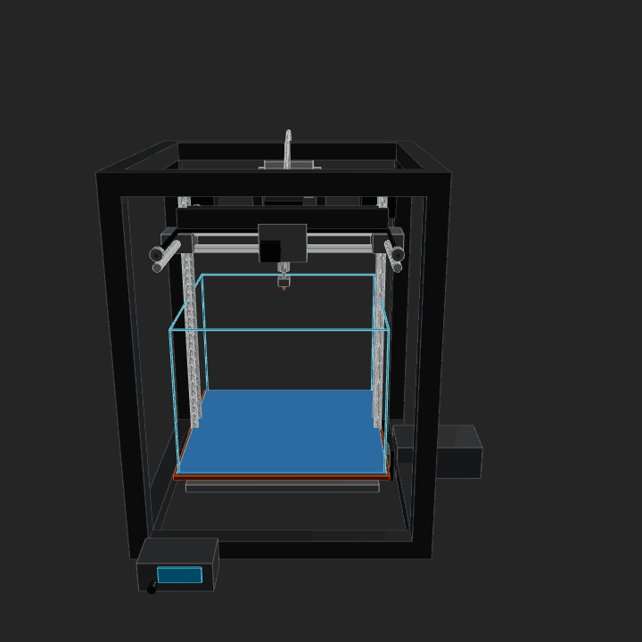
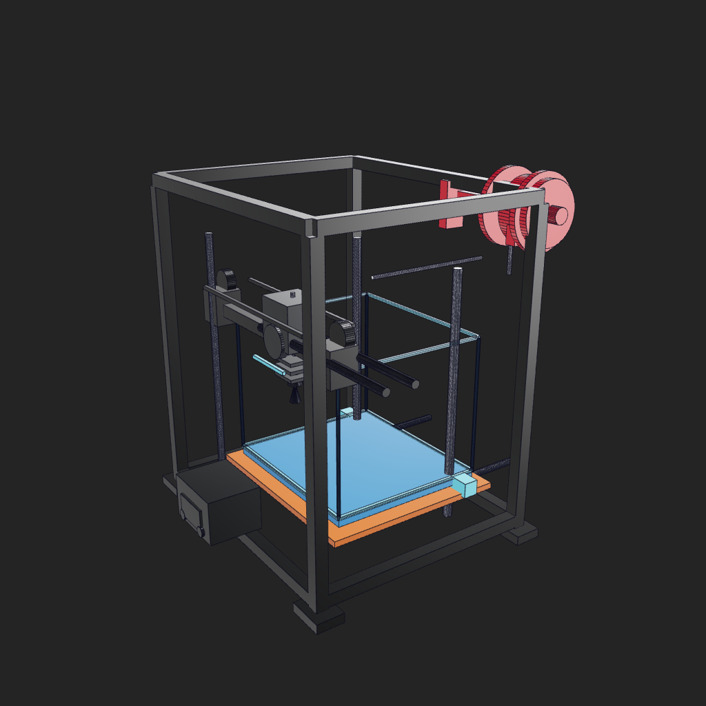
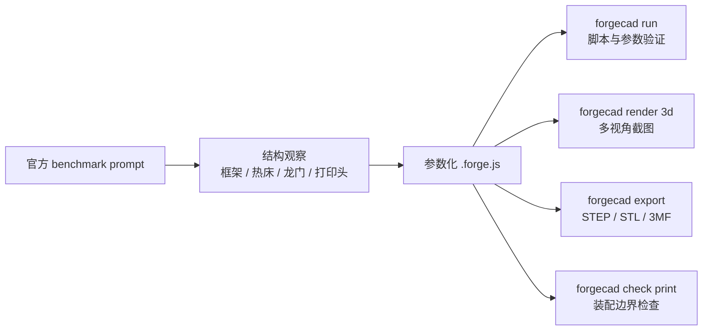
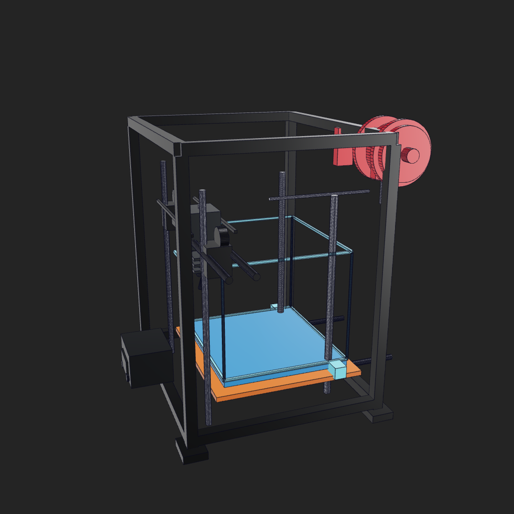
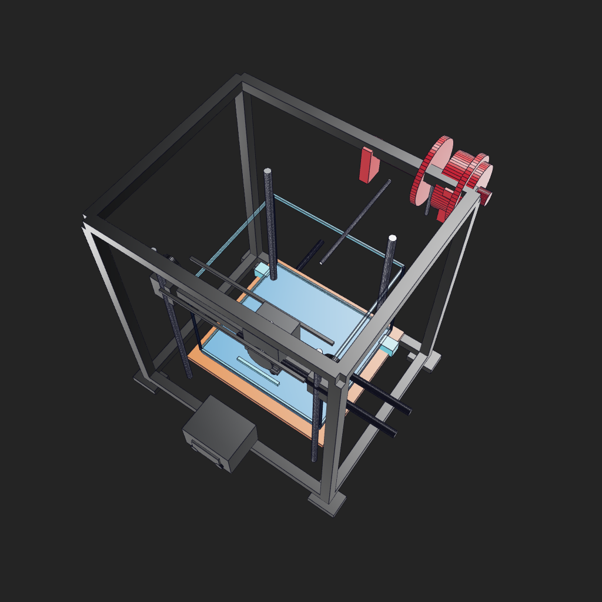
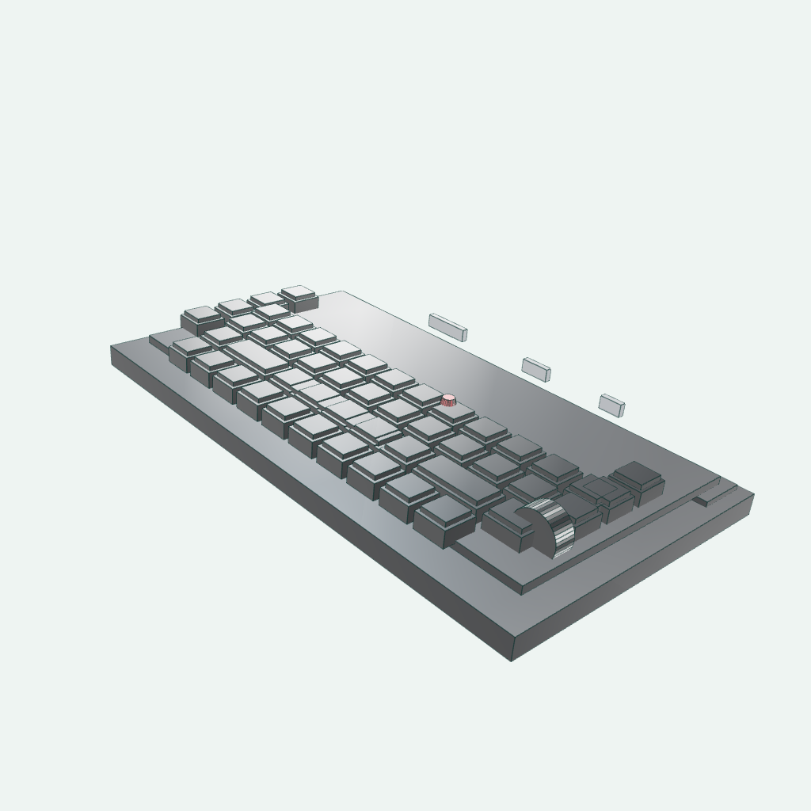
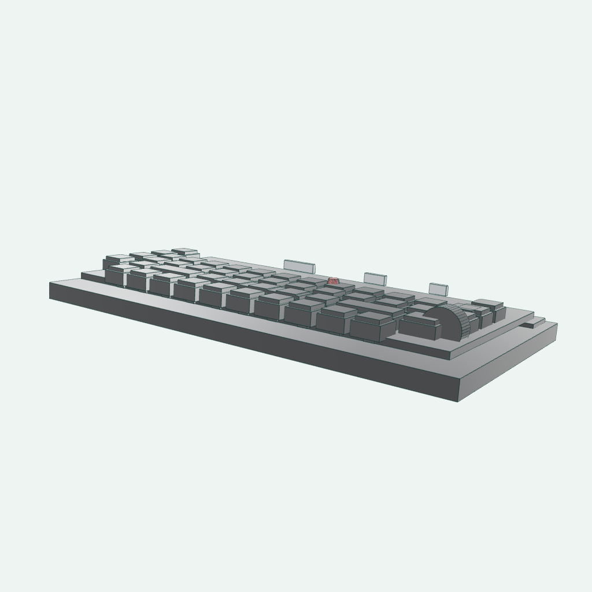
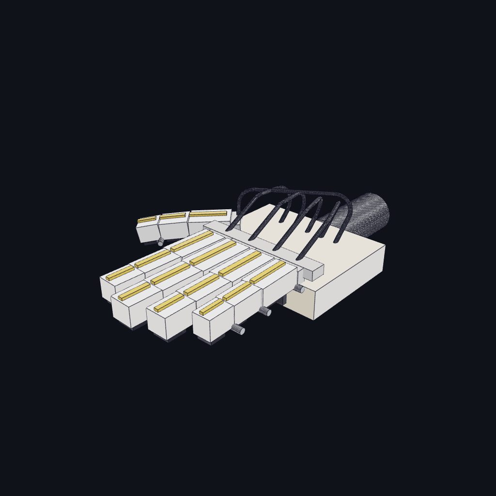
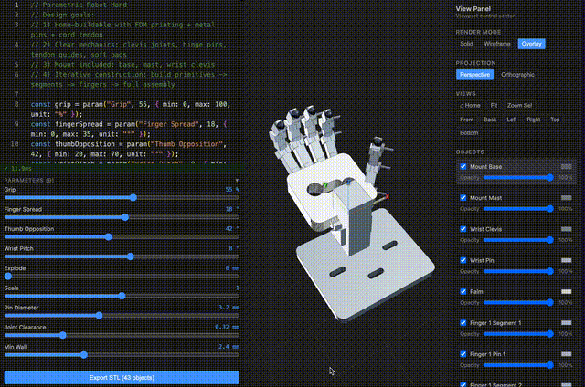

# ForgeCAD 官方 3D 打印机、键盘与灵巧手案例复现：从 benchmark GIF 到参数化装配

本章复刻 ForgeCAD public kit 里的官方 benchmark 条目 `3dprinter-gpt52codex`，并补充视频里很有辨识度的键盘和官方可动灵巧手案例。官方 3D 打印机公开的是 README 表格、prompt 和 GIF 结果，public kit 与 assets 仓库里没有放出对应源码；灵巧手则有可运行示例 `examples/mechanical/5-finger-robot-hand.forge.js`。本章把官方公开动图、本地渲染和可运行脚本都放进同一条复现链路。



图 1 官方 benchmark 资产 `3dprinter-gpt52codex-2026-02-13-14-36-06-v2.gif`。来源是 [KoStard/forgecad-public-kit](https://github.com/KoStard/forgecad-public-kit) README 中的 LLM Benchmarks 表格，GIF 文件托管在 [KoStard/ForgeCAD-assets](https://github.com/KoStard/ForgeCAD-assets)。

## 这章为什么替换掉简单 CAD 支架

之前的小支架能说明 ForgeCAD 的基础命令，但视觉效果和官方宣传里的“复杂装配”差距比较大。3D 打印机案例更适合放在主 README：它有龙门框架、热床、X/Y/Z 运动部件、打印头、皮带、线材、料盘和控制盒，读者一眼能看懂这是一个完整的机电装配，而不是单个小零件。视频里的键盘也适合作为第二个案例：它不是机器人机构，但能展示 ForgeCAD 对密集重复结构、按键阵列、外壳倾角和局部强调色的表达能力。

这也更接近机器人教程需要强调的能力：不是只生成一个漂亮外壳，而是把结构关系写成可编辑参数。打印头 X 位置、热床 Y 位置、龙门 Z 高度、构建体积尺寸都写在脚本参数里，后续可以用同一份源码反复修改和验证。

## 官方条目核对

| 字段 | 内容 |
| --- | --- |
| 官方仓库 | `KoStard/forgecad-public-kit` |
| benchmark 名称 | `3dprinter-gpt52codex` |
| 时间与版本 | `2026-02-13 14-36-06 · v2` |
| 官方 prompt | `Make a detailed home 3D printer, showing the internal details of how it should work. Add some params for controlling positions, etc.` |
| 官方 GIF | `https://raw.githubusercontent.com/KoStard/ForgeCAD-assets/main/benchmarks/3dprinter-gpt52codex-2026-02-13-14-36-06-v2.gif` |
| 源码状态 | public kit 当前没有公开对应 `.forge.js`，本章使用本地复刻脚本演示可运行流程 |

复查命令如下：

```powershell
git clone https://github.com/KoStard/forgecad-public-kit.git ..\forgecad-public-kit
git clone https://github.com/KoStard/ForgeCAD-assets.git ..\ForgeCAD-assets

rg -n "3dprinter-gpt52codex|Make a detailed home 3D printer|ForgeCADBenchmark" ..\forgecad-public-kit\README.md
rg --files ..\forgecad-public-kit | rg -i "3dprinter|gpt52|version_2|forge\.js$"
rg --files ..\ForgeCAD-assets | rg -i "3dprinter|gpt52"
```

本机结论是：public kit 的 README 有官方表格行，ForgeCAD-assets 有 GIF，未找到公开的 3D 打印机 `.forge.js` 源文件。

## 本地复刻文件

本章保留的可复现资产如下：

| 文件 | 作用 |
| --- | --- |
| [forgecad_3d_printer_demo.forge.js](forgecad_3d_printer_demo.forge.js) | 本地可运行的 ForgeCAD 3D 打印机复刻脚本 |
| [forgecad_keyboard_demo.forge.js](forgecad_keyboard_demo.forge.js) | 本地可运行的 ForgeCAD 键盘复刻脚本 |
| [forgecad_robot_hand_publickit.forge.js](forgecad_robot_hand_publickit.forge.js) | 从 public kit 复制的官方 5 指灵巧手示例 |
| [assets/official_3dprinter_gpt52codex.gif](assets/official_3dprinter_gpt52codex.gif) | 从官方 assets 仓库保存的 benchmark GIF |
| [assets/official_robot_hand_v2.gif](assets/official_robot_hand_v2.gif) | ForgeCAD public kit README 顶部官方可动灵巧手 GIF |
| [assets/official_robot_hand_gpt52codex.gif](assets/official_robot_hand_gpt52codex.gif) | `robot-hand-gpt52codex` benchmark GIF |
| [assets/official_3dprinter_gpt52codex_frame.png](assets/official_3dprinter_gpt52codex_frame.png) | 从官方 GIF 抽取的 README 静态预览帧 |
| [assets/forgecad_3d_printer_iso.png](assets/forgecad_3d_printer_iso.png) | 本地复刻模型等轴测渲染 |
| [assets/forgecad_3d_printer_front.png](assets/forgecad_3d_printer_front.png) | 本地复刻模型前视渲染 |
| [assets/forgecad_3d_printer_top.png](assets/forgecad_3d_printer_top.png) | 本地复刻模型俯视渲染 |
| [assets/forgecad_keyboard_iso.png](assets/forgecad_keyboard_iso.png) | 本地复刻键盘等轴测渲染 |
| [assets/forgecad_keyboard_low_angle.png](assets/forgecad_keyboard_low_angle.png) | 本地复刻键盘低视角渲染 |
| [assets/forgecad_robot_hand_param_sweep.gif](assets/forgecad_robot_hand_param_sweep.gif) | 本地用 4 组参数渲染并合成的灵巧手动作 GIF |
| [outputs/forgecad_3d_printer_demo.step](outputs/forgecad_3d_printer_demo.step) | 精确 CAD 交换文件 |
| [outputs/forgecad_3d_printer_demo.stl](outputs/forgecad_3d_printer_demo.stl) | 网格导出，适合预览或切片检查 |
| [outputs/forgecad_3d_printer_demo.3mf](outputs/forgecad_3d_printer_demo.3mf) | 3D 打印工作流常用容器格式 |
| [outputs/forgecad_keyboard_demo.step](outputs/forgecad_keyboard_demo.step) | 键盘精确 CAD 交换文件 |
| [outputs/forgecad_keyboard_demo.stl](outputs/forgecad_keyboard_demo.stl) | 键盘 STL 导出 |
| [outputs/forgecad_keyboard_demo.3mf](outputs/forgecad_keyboard_demo.3mf) | 键盘 3MF 导出 |
| [outputs/forgecad_robot_hand_publickit.step](outputs/forgecad_robot_hand_publickit.step) | 官方灵巧手 STEP 导出 |
| [outputs/forgecad_robot_hand_publickit.stl](outputs/forgecad_robot_hand_publickit.stl) | 官方灵巧手 STL 导出 |
| [outputs/forgecad_robot_hand_publickit.3mf](outputs/forgecad_robot_hand_publickit.3mf) | 官方灵巧手 3MF 导出 |



图 2 本章复刻脚本生成的 3D 打印机装配。当前版本已经按官方 GIF 对齐了主要视觉特征：深色背景、黑色机架、银色导轨、蓝色热床、橙色加热板、青色构建体积框、右上红色料盘和前方控制盒。它仍然不是官方源码的逐行还原，而是围绕同一个 prompt 做的可运行教学版；如果要像素级一致，需要官方公开原始 `.forge.js`、相机和 scene 配置。

## 环境选择

这个案例不需要创建新的 micromamba 环境。ForgeCAD 走 Node.js/npm CLI，渲染 PNG 时调用本机 Chrome；不涉及 PyTorch、CUDA 或机器人仿真依赖，也不吃显卡显存。

本机复现环境：

| 项目 | 本机设置 |
| --- | --- |
| 系统 | Windows PowerShell |
| Node.js | `22.16.0` |
| npm | `10.9.2` |
| ForgeCAD | `npx --yes forgecad@0.9.14` |
| Chrome | `C:\Program Files\Google\Chrome\Application\chrome.exe` |
| GPU | 不需要；CLI 建模和导出主要走 CPU，渲染由 Chrome/WebGL 完成 |

安装检查：

```powershell
node --version
npm --version
npx --yes forgecad@0.9.14 --version
```

## 建模拆解

本地复刻脚本按 3D 打印机的真实功能模块拆成多个对象。这里没有把所有零件合并成一个大 `union`，因为官方 GIF 的可读性很依赖局部颜色：黑色框架、银色导轨、蓝色热床、橙色加热板、青色构建体积框和红色料盘都需要单独保留材质。



| 模块 | 脚本对象 | 说明 |
| --- | --- | --- |
| 龙门框架 | `frame` | 立柱、上下横梁和脚垫，表达 CoreXY/盒式机架轮廓 |
| 热床 | `orange heater plate` / `blue print bed` / `bed carriage and rails` | 蓝色构建板、橙色加热板、Y 轴导轨和床车 |
| Z 轴 | `z motion system` | Z 向光轴和丝杆 |
| 构建体积 | `cyan build volume cage` | 用青色细边框模拟官方图里的透明打印空间 |
| X 轴与打印头 | `x gantry` / `print head` / `belts` | X 横梁、导轨、皮带轮、风扇、热端、喷嘴和散热片 |
| 料盘与耗材 | `red spool` / `filament` | 右上角红色料盘、支架和简化耗材路径 |
| 控制与细节 | `front electronics` / `small details` | 前方控制盒、屏幕、旋钮和局部导向件 |

关键参数集中在文件开头：

```javascript
const headX = Param.number("Print Head X", 22, { min: -70, max: 70, unit: "mm" });
const bedY = Param.number("Print Bed Y", 12, { min: -45, max: 45, unit: "mm" });
const gantryZ = Param.number("Gantry Z", 128, { min: 70, max: 175, unit: "mm" });
const buildVolumeW = Param.number("Build Volume Width", 118, { min: 80, max: 150, unit: "mm" });
const buildVolumeD = Param.number("Build Volume Depth", 105, { min: 80, max: 135, unit: "mm" });
```

这几个参数对应官方 prompt 中的 “params for controlling positions”。教程读者可以先只改这几个值，观察打印头、热床和构建体积如何变化。

## 运行脚本

进入本章目录：

```powershell
cd 21-机械臂和机器人设计/03ForgeCAD视觉逆向工程入门
```

运行 ForgeCAD 脚本：

```powershell
npx --yes forgecad@0.9.14 run forgecad_3d_printer_demo.forge.js
```

本机结果：

```text
Objects: 13
Verifications: 5 pass, 0 fail
Params: Frame Width=180, Frame Depth=150, Frame Height=210,
        Print Head X=22, Print Bed Y=12, Gantry Z=128,
        Build Volume Width=118, Build Volume Depth=105
Time: 563ms
```

这里的 5 个验证包括整体宽度、深度、高度、龙门高度和打印头是否仍在机架内部。它们不是机械强度校核，只是防止参数改坏后模型明显失真。

## 多视角渲染

渲染需要 Chrome 路径。本机命令如下：

```powershell
$chrome = "C:\Program Files\Google\Chrome\Application\chrome.exe"

npx --yes forgecad@0.9.14 render 3d forgecad_3d_printer_demo.forge.js `
  --output assets/forgecad_3d_printer_iso.png `
  --camera 55:20 `
  --background "#242424" `
  --edges thin `
  --render-style classic `
  --chrome-path $chrome `
  --fresh-server `
  --port 5180

npx --yes forgecad@0.9.14 render 3d forgecad_3d_printer_demo.forge.js `
  --output assets/forgecad_3d_printer_front.png `
  --camera 70:18 `
  --background "#242424" `
  --edges thin `
  --render-style classic `
  --chrome-path $chrome `
  --fresh-server `
  --port 5181

npx --yes forgecad@0.9.14 render 3d forgecad_3d_printer_demo.forge.js `
  --output assets/forgecad_3d_printer_top.png `
  --camera 35:58 `
  --background "#242424" `
  --edges thin `
  --render-style classic `
  --chrome-path $chrome `
  --fresh-server `
  --port 5182
```

如果大家想尽量接近官方 GIF 的观感，关键是这三点：使用深色背景 `--background "#242424"`，使用 `--render-style classic` 保持更硬朗的 CAD 视图质感，并用 `--camera 55:20` 让右上角红色料盘和前方控制盒同时进入画面。官方没有公开原始 `.forge.js`、viewport scene、相机 JSON 和材质状态，所以无法保证像素级一模一样；要完全一致，只能拿到官方 benchmark 的源脚本和原始 viewport 配置。



图 3 前视图能更清楚地看到打印头、热床、Z 轴光轴和控制盒。



图 4 高俯视图能检查机架、料盘、皮带和热床位置关系。

本机三张图的渲染输出都报告了相同几何边界：

```text
Size:   224.0 x 224.0 x 229.0 mm
Volume: 449408.0 mm3
Bounds: [-102.0,-108.0,-3.0] -> [122.0,116.0,226.0]
```

## 第二个案例：视频里的键盘

视频画面里的键盘很适合补充到本章后半部分。它和 3D 打印机的教学重点不同：3D 打印机强调复杂装配和运动部件，键盘强调规则阵列、外壳倾角、局部强调色和大量重复零件的组织方式。大家可以把它看成 ForgeCAD 的“产品外观 + 参数化阵列”练习。

本章没有直接把视频截图放进仓库，而是新建了 [forgecad_keyboard_demo.forge.js](forgecad_keyboard_demo.forge.js)。脚本里保留了这些可调参数：

```javascript
const cols = Param.number("Columns", 12, { min: 8, max: 14, unit: "keys" });
const keyPitch = Param.number("Key Pitch", 15, { min: 12, max: 18, unit: "mm" });
const caseAngle = Param.number("Case Angle", 6, { min: 0, max: 12, unit: "deg" });
const knobOffset = Param.number("Knob Offset", 0, { min: -18, max: 18, unit: "mm" });
const accentKeyX = Param.number("Accent Key X", 2, { min: -4, max: 4, unit: "keys" });
```

运行键盘模型：

```powershell
npx --yes forgecad@0.9.14 run forgecad_keyboard_demo.forge.js
```

本机结果：

```text
Objects: 5
Verifications: 4 pass, 0 fail
Params: Columns=12, Key Pitch=15, Case Angle=6, Knob Offset=0, Accent Key X=2
Time: 3127ms
```

渲染命令：

```powershell
$chrome = "C:\Program Files\Google\Chrome\Application\chrome.exe"

npx --yes forgecad@0.9.14 render 3d forgecad_keyboard_demo.forge.js `
  --output assets/forgecad_keyboard_iso.png `
  --camera 48:31 `
  --edges thin `
  --render-style studio `
  --chrome-path $chrome `
  --fresh-server `
  --port 5184

npx --yes forgecad@0.9.14 render 3d forgecad_keyboard_demo.forge.js `
  --output assets/forgecad_keyboard_low_angle.png `
  --camera 35:16 `
  --edges thin `
  --render-style studio `
  --chrome-path $chrome `
  --fresh-server `
  --port 5185
```



图 5 键盘等轴测图。这里重点看按键阵列、右侧旋钮、深色功能键区和红色点按键。



图 6 低视角更容易看出外壳厚度和轻微上扬的键盘角度。

键盘渲染输出的几何边界：

```text
Size:   214.0 x 119.9 x 33.9 mm
Volume: 327930.0 mm3
Bounds: [-107.0,-58.2,-6.1] -> [107.0,61.7,27.8]
```

## 第三个案例：官方可动灵巧手

ForgeCAD public kit 顶部还有一个很吸引人的可动灵巧手 GIF。这个案例比键盘更适合机器人方向，因为它把参数、连杆、铰链、肌腱线缆和装配对象都放在同一个 `.forge.js` 里。我们直接复用官方示例：

```powershell
Copy-Item ..\forgecad-public-kit\examples\mechanical\5-finger-robot-hand.forge.js `
  .\forgecad_robot_hand_publickit.forge.js
npx --yes forgecad@0.9.14 run forgecad_robot_hand_publickit.forge.js
```

本机结果：

```text
Objects: 76
Params: Scale=1, Finger Curl=40, Thumb Curl=35, Finger Spread=8
Time: 530ms
```

“能动”的核心不是视频播放器，而是参数驱动姿态。下面 4 帧分别修改 `Finger Curl`、`Thumb Curl` 和 `Finger Spread`，再合成一个本地 GIF：

```powershell
npx --yes forgecad@0.9.14 render 3d forgecad_robot_hand_publickit.forge.js `
  --param "Finger Curl=45" `
  --param "Thumb Curl=38" `
  --param "Finger Spread=12" `
  --output assets/forgecad_robot_hand_02.png `
  --camera 42:28 `
  --background "#101318" `
  --edges thin `
  --render-style classic `
  --chrome-path $chrome
```



图 7 本地用官方灵巧手示例渲染出的参数动作。大家可以把它理解为“低成本动画”：每一帧都是同一个 CAD 脚本在不同参数下的真实渲染，而不是手动剪视频。

官方动图也保存在本章，方便对比：



## 导出 CAD 与打印文件

导出 STEP：

```powershell
npx --yes forgecad@0.9.14 export step forgecad_3d_printer_demo.forge.js `
  --output outputs/forgecad_3d_printer_demo.step
```

导出 STL：

```powershell
npx --yes forgecad@0.9.14 export stl forgecad_3d_printer_demo.forge.js `
  --output outputs/forgecad_3d_printer_demo.stl
```

导出 3MF：

```powershell
npx --yes forgecad@0.9.14 export 3mf forgecad_3d_printer_demo.forge.js `
  --output outputs/forgecad_3d_printer_demo.3mf
```

键盘案例使用同样的命令，只需把脚本名和输出名换成 `forgecad_keyboard_demo`：

```powershell
npx --yes forgecad@0.9.14 export step forgecad_keyboard_demo.forge.js `
  --output outputs/forgecad_keyboard_demo.step

npx --yes forgecad@0.9.14 export stl forgecad_keyboard_demo.forge.js `
  --output outputs/forgecad_keyboard_demo.stl

npx --yes forgecad@0.9.14 export 3mf forgecad_keyboard_demo.forge.js `
  --output outputs/forgecad_keyboard_demo.3mf
```

灵巧手同样可以导出：

```powershell
npx --yes forgecad@0.9.14 export step forgecad_robot_hand_publickit.forge.js `
  --output outputs/forgecad_robot_hand_publickit.step
npx --yes forgecad@0.9.14 export stl forgecad_robot_hand_publickit.forge.js `
  --output outputs/forgecad_robot_hand_publickit.stl
npx --yes forgecad@0.9.14 export 3mf forgecad_robot_hand_publickit.forge.js `
  --output outputs/forgecad_robot_hand_publickit.3mf
```

本机输出文件大小：

| 文件 | 大小 |
| --- | ---: |
| `forgecad_3d_printer_demo.step` | 1.1 MB |
| `forgecad_3d_printer_demo.stl` | 256 KB |
| `forgecad_3d_printer_demo.3mf` | 54 KB |
| `forgecad_keyboard_demo.step` | 3.2 MB |
| `forgecad_keyboard_demo.stl` | 153 KB |
| `forgecad_keyboard_demo.3mf` | 39 KB |
| `forgecad_robot_hand_publickit.step` | 3.7 MB |
| `forgecad_robot_hand_publickit.stl` | 717 KB |
| `forgecad_robot_hand_publickit.3mf` | 261 KB |

STEP 更适合导入 CAD 软件继续编辑；STL/3MF 更适合切片软件预览。这个模型是教学装配，不是可直接打印的一体化零件。

## 打印检查结果怎么理解

命令：

```powershell
npx --yes forgecad@0.9.14 check print forgecad_3d_printer_demo.forge.js
```

本机结果是 `FAIL`，这不是脚本运行失败，而是检查器指出了装配展示模型不适合当作单件直接 FDM 打印：

```text
Scene: 13 shape(s), 5128 triangle(s), bbox 224.0 x 224.0 x 229.0mm
PASS print.script.verifications: 5 script verification(s) passed.
FAIL print.geometry.collisions: 14 positive-volume collision(s) found.
FAIL print.fdm.wall-thickness: 1 object(s) have sampled wall area below 1.2mm.
WARN print.fdm.overhangs: 8 object(s) exceed 45deg unsupported overhang budget.
PASS print.mesh.validity: Meshes are closed and manifold at the sampled tolerance.
```

这正好是一个教学点：官方 GIF 展示的是复杂装配能力，不能把它等价成“整台打印机可一次性打印”。如果目标是制造，需要把机架、热床、导轨支座、打印头壳体等拆成单件，再分别加壁厚、倒角、螺孔、公差和支撑策略。

键盘案例也会得到类似的装配检查结论：

```text
Scene: 5 shape(s), 3056 triangle(s), bbox 214.0 x 119.9 x 33.9mm
PASS print.script.verifications: 4 script verification(s) passed.
FAIL print.geometry.collisions: 4 positive-volume collision(s) found.
PASS print.mesh.validity: Meshes are closed and manifold at the sampled tolerance.
FAIL print.fdm.wall-thickness: 1 object(s) have sampled wall area below 1.2mm.
```

这里的碰撞主要来自键帽、外壳和功能区被当成同一个展示装配来检查。真实键盘外壳如果要打印，需要把键帽、底壳、上盖、旋钮和接口挡板拆成单独零件。

## 资源占用与耗时

本机用 PowerShell 采样 `cmd -> npm/npx -> node/chrome` 子进程的 Working Set，得到大致峰值：

| 步骤 | 耗时 | 峰值内存 | 说明 |
| --- | ---: | ---: | --- |
| `forgecad run` | 4.67 s | 262 MB | CLI 冷启动总耗时；ForgeCAD 自报建模时间约 0.5 s |
| 单张 `render 3d` | 7.77 s | 826 MB | 含 Chrome 渲染服务冷启动 |
| `export stl` | 5.07 s | 未单独采样 | 输出 256 KB STL |
| `export 3mf` | 5.10 s | 未单独采样 | 输出 54 KB 3MF |
| `export step` | 19.41 s | 未单独采样 | 精确 STEP 导出更慢，输出 1.1 MB |
| `check print` | 5.53 s | 未单独采样 | 网格检查约 5128 triangles |
| 键盘 `run` | 约 9.8 s | 未单独采样 | ForgeCAD 自报建模时间约 3.1 s |
| 键盘单张 `render 3d` | 约 15 s | 未单独采样 | 按键数量更多，冷启动渲染稍慢 |
| 键盘 `export stl` | 10.14 s | 未单独采样 | 输出 153 KB STL |
| 键盘 `export 3mf` | 8.13 s | 未单独采样 | 输出 39 KB 3MF |
| 键盘 `export step` | 30.81 s | 未单独采样 | 精确 STEP 导出 3.2 MB |
| 灵巧手 `export stl` | 3.94 s | 未单独采样 | 输出 717 KB STL |
| 灵巧手 `export 3mf` | 4.23 s | 未单独采样 | 输出 261 KB 3MF |
| 灵巧手 `export step` | 32.36 s | 未单独采样 | 精确 STEP 导出 3.7 MB |

这个量级对普通笔记本很轻，不需要 6GB 显卡。真正可能吃资源的是更复杂的曲面、布尔操作、超高分辨率网格或浏览器端动画渲染。

## 常见问题

### 1. 为什么不直接提交官方源码

因为 public kit 当前没有公开 `3dprinter-gpt52codex` 对应的 `.forge.js`。教程只保存官方公开 GIF，并明确说明本地脚本是教学复刻，不把它伪装成官方原始结果。

### 2. 为什么不直接把网上视频或截图塞进教程

教程应该保留可复现链路。这里的官方 GIF 是公开 benchmark 资产，用来说明复刻目标；真正的教学主体是 `forgecad_3d_printer_demo.forge.js`、CLI 命令、渲染图和导出文件。

### 3. 是否需要 micromamba

不需要。这个案例只有 Node.js/npm/Chrome。除非后续把 ForgeCAD 和 Python CAD、机器人仿真或学习算法混在同一个实验里，否则没必要为它新建 micromamba 环境。

### 4. 这个模型能用于真实 3D 打印机设计吗

不能直接用于真实机器制造。它是教学级参数化装配，用来演示 code-first CAD、复杂结构拆解和 CLI 验证。真实机械设计还要做强度、刚度、传动、公差、采购件、装配和安全检查。

## 参考资料

- ForgeCAD public kit：https://github.com/KoStard/forgecad-public-kit
- ForgeCAD assets：https://github.com/KoStard/ForgeCAD-assets
- ForgeCAD 文档：https://forgecad.io/docs
- ForgeCAD npm 包：https://www.npmjs.com/package/forgecad
