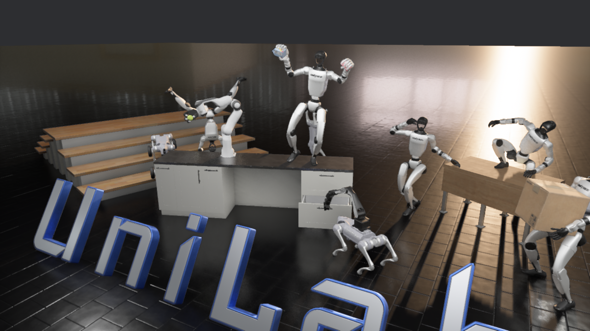
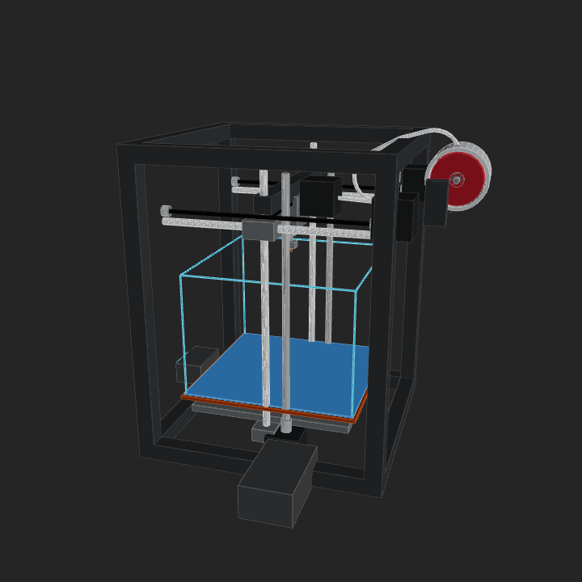

<div align="center">
    


  <pre style="font-family: 'Courier New', monospace; font-size: 16px; color: #000000; margin: 0; padding: 0; line-height: 1.2; transform: skew(-1deg, 0deg); display: block;">
  ███████╗███╗   ███╗██████╗  ██████╗ ██████╗ ██╗███████╗██████╗ 
  ██╔════╝████╗ ████║██╔══██╗██╔═══██╗██╔══██╗██║██╔════╝██╔══██╗
  █████╗  ██╔████╔██║██████╔╝██║   ██║██║  ██║██║█████╗  ██║  ██║
  ██╔══╝  ██║╚██╔╝██║██╔══██╗██║   ██║██║  ██║██║██╔══╝  ██║  ██║
  ███████╗██║ ╚═╝ ██║██████╔╝╚██████╔╝██████╔╝██║███████╗██████╔╝
  ╚══════╝╚═╝     ╚═╝╚═════╝  ╚═════╝ ╚═════╝ ╚═╝╚══════╝╚═════╝ 
  </pre>

  # Every-Embodied : Zero to Hero in Embodied AI

  <p align="center">
    📌 <a href="https://datawhale-eai.feishu.cn/wiki/QvxQwV2Qyij1NakV9IdcjTl1nJd">组队学习文档 (Team Learning)</a> · ✨ <a href="#learning-map">学习地图 (Learning Map)</a> · 🤖 <a href="#sota">前沿复现 (SOTA)</a> · 📖 <a href="https://datawhalechina.github.io/every-embodied/zh-cn/" target="_blank">在线阅读</a>
  </p>

  <p align="center">
      <a href="https://github.com/datawhalechina/every-embodied/stargazers" target="_blank">
          </a>
      <a href="https://github.com/datawhalechina/every-embodied/network/members" target="_blank">
          </a>
      <a href="LICENSE" target="_blank">
          </a>
  </p>
  <p align="center">
    <a href="./README.md"></a>
    <a href="./README.en.md"></a>
  </p>
  <div align="center">
    <p><strong>Supported By</strong></p>
     
     
    
     
     
     
  </div>

</div>

  

  

  ## 🚀 快速开始 (Quick Start) ：一分钟体验 Hello Every-Embodied

  想要立刻在本地跑通第一个具身智能仿真 Demo？只需三步：

  ```bash
  # 1. 克隆仓库
  git clone --depth 1 https://github.com/datawhalechina/every-embodied.git
  cd every-embodied
  
  # 2. 创建并激活 Conda 环境
  conda create -n embodied python=3.8
  conda activate embodied
  
  # 3. 安装依赖并运行基础机械臂抓取 Demo
  pip install mujoco
  # 可选：更平滑的 jerk 限制轨迹规划
  pip install ruckig
  python examples/01_hello_every_embodied_mujoco.py
  ```
  详细说明请见：`examples/README.md`


  <br>

<table align="center">
  <tr>
    <td width="33%" valign="top" align="center">
      
      <br>
      <strong><a href="./examples/README.md">项目快速入门</a></strong>
      <br>
      <sub>基于mujoco一键了解项目基础</sub>
    </td>
    <td width="33%" valign="top" align="center">
      
      <br>
      <strong><a href="./10-具身智能其他仿真工具及仿真前沿/08GenieSim3配置.md">Genie Sim的Pi0部署</a></strong>
      <br>
      <sub>基于Pi0和Isaac Sim实现高保真仿真</sub>
    </td>
    <td width="33%" valign="top" align="center">
      
      <br>
        <strong><a href="./03-机器人硬件、lerobot及地瓜RDK-X5开发板控制教程/03RDK-X5连接lerobot机械臂进行遥操作.md">LeRobot 遥操作</a></strong>
      <br>
      <sub>支持地瓜 RDK-X5 连接 SO101 机械臂实操</sub>
    </td>
  </tr>
  <tr>
    <td width="33%" valign="top" align="center">
      
      <br>
        <strong><a href="./04-具身场景的计算机视觉、3D重建/01-sam和深度估计.md">视觉语义感知</a></strong>
      <br>
      <sub>场景分割与目标检测，让机器人“看懂”环境</sub>
    </td>
    <td width="33%" valign="top" align="center">
      
      <br>
        <strong><a href="./13-其他前沿项目复现/无人机大模型+Groundingdino实践/无人机多模态大模型.md">LLM控制无人机导航VLN</a></strong>
      <br>
      <sub>通过WebUI快速上手无人机大模型VLN导航</sub>
    </td>
    <td width="33%" valign="top" align="center">
      
      <br>
      <strong><a href="./06-策略抓取或抓取VLA/大模型控制、VLA、VLM/01SmolVLA-LIBERO/01SmolVLA-libero.md">基于SmolVLA微调LIBERO基准</a></strong>
      <br>
      <sub>小型VLA测试机器人终身学习基准</sub>
    </td>
  </tr>
    <tr>
    <td width="33%" valign="top" align="center">
      
      <br>
        <strong><a href="./07-机器人操作、运动控制/Locomotion/01春晚舞蹈机器人复刻.md">春晚机器人复刻</a></strong>
      <br>
      <sub>输入豆包生成功夫视频，输出机器人mujoco仿真</sub>
    </td>
    <td width="33%" valign="top" align="center">
      
      <br>
        <strong><a href="./08-具身导航及VLN/03前沿VLN复现/01VLNCE/02ETPNav代码复现.md">ETPNav-VLN导航复现</a></strong>
      <br>
      <sub>连续环境视觉语言导航 (VLN-CE) 领域强力 Baseline</sub>
    </td>
    <td width="33%" valign="top" align="center">
      
      <br>
        <strong><a href="./04-具身场景的计算机视觉、3D重建/03-LingBot-Map视频流式三维重建.md">LingBot-Map 视频建图</a></strong>
      <br>
      <sub>从连续校园视频流式估计轨迹、深度与点云</sub>
    </td>
  </tr>
  <tr>
    <td width="33%" valign="top" align="center">
      
      <br>
        <strong><a href="./10-具身智能其他仿真工具及仿真前沿/11UniLab-MotrixSim异构RL训练/README.md">UniLab + MotrixSim 异构 RL</a></strong>
      <br>
      <sub>6GB 显卡跑通 state-based RL，并体验 uv run --no-sync demo teaser 的 PBR 渲染器</sub>
    </td>
    <td width="33%" valign="top" align="center">
      
      <br>
        <strong><a href="./10-具身智能其他仿真工具及仿真前沿/09SIM1柔体仿真与数据生成/01SIM1环境配置与运行.md">SIM1 柔体仿真与数据生成</a></strong>
      <br>
      <sub>双臂布料任务的 replay、渲染与扩散轨迹生成流程</sub>
    </td>
    <td width="33%" valign="top" align="center">
      
      <br>
        <strong><a href="./21-机械臂和机器人设计/03ForgeCAD视觉逆向工程入门/README.md">ForgeCAD 3D 打印机、键盘与灵巧手</a></strong>
      <br>
      <sub>复刻 public kit 的 3D 打印机、视频键盘和可动灵巧手案例，跑通参数渲染 GIF 与 STEP/STL/3MF 导出</sub>
    </td>
  </tr>


</table>


  <div align="center">
    <h3>⭐ 欢迎点点 Star 共同构建具身智能开源生态 ❤️</h3>
  </div>
  具身智能（Embodied AI）是通往通用人工智能（AGI）的关键钥匙。

  **Every-Embodied 致力于打造一个“基础友好、工程可复现、前沿可拓展”的学习库。**
  我们希望降低门槛：即使你目前只有 Python 基础，也可以从仿真和最小可运行 Demo 出发，逐步完成从“看懂”到“动手复现”的跨越。

  - **入门友好**：优先提供可运行示例与环境脚本，不要求你一开始就掌握复杂机器人学推导
  - **实践导向**：强调“跑起来-看结果-再理解原理”的学习路径，减少抽象概念带来的挫败感
  - **前沿连接**：从 MuJoCo / Isaac Sim 到 VLA / VLN，让学习路径与产业热点保持同步

## 👥 项目受众

这个项目不仅面向机器人专业背景同学，也欢迎更多跨领域学习者加入：

- **Python 初学者 / 转型开发者**：有基础编程能力，希望系统进入 AI+机器人、具身智能方向
- **高校学生 / 研究生**：希望通过课程项目、毕业设计或论文复现快速建立具身智能实践能力
- **算法工程师**：希望把视觉、强化学习、大模型能力迁移到真实物理交互场景
- **硬件与机器人爱好者**：希望理解从硬件控制、仿真验证到 Sim2Real 部署的完整链路
- **教育工作者与社区组织者**：希望基于开源教程组织课程、读书会、训练营和项目共创

---


  本教程分为三个阶段，带你逐层深入具身智能的世界：

| 阶段         | 核心技能                            | 产出                                                         |
| :----------- | :---------------------------------- | :----------------------------------------------------------- |
| **第一阶段** | 机器人学基础、硬件选型、ROS 入门    | 搭建自己的第一台仿真机器人 / 配置仿真环境                    |
| **第二阶段** | 计算机视觉、运动规划、强化学习      | 完成“识别-规划-抓取”闭环任务                                 |
| **第三阶段** | 模仿学习、大模型(VLA/VLN)、Sim2Real | 复现大模型导航VLN、OpenVLA、SmolVLA 等前沿项目，实现仿真或真实部署 |

  ## 🔥 News & Highlights
  - **[2026-06-02]** 新增 [RISE 自我改进机器人策略复现教程](./17-具身世界模型/RISE自我改进机器人策略复现/README.md)，覆盖论文方法、组合世界模型流水线、OpenPI policy/value、LTX-Video dynamics model、RLinf imagination RL、Blackwell cu128 环境适配、公开模型资产下载校验，以及官方图与视频素材本地归档。
  - **[2026-06-02]** 新增 [LeWorldModel 世界模型分析解读与实验复现](./17-具身世界模型/Leworldmodel分析解读与实验复现/Leworldmodel分析解读与实验复现.md)，补充世界模型基础概念、表征崩溃问题、SIGReg 正则、潜空间预测与规划流程，适合作为 RISE 前置理论阅读。
  - **[2026-06-02]** 新增 [AGILE 人形机器人 Loco-Manipulation Isaac Lab 复现教程](./05-具身场景的深度和强化学习/03AGILE人形机器人Loco-Manipulation复现/README.md)，覆盖官方任务边界、Isaac Sim 5.1 / Isaac Lab 2.3.2 复刻、T1/G1 本地渲染视频、pick-place checkpoint 未随仓库开源说明、评估报告与 Sim2MuJoCo 链路。
  - **[2026-06-02]** 新增 [HIMLoco 四足机器人运动控制 Isaac Lab 复现教程](./05-具身场景的深度和强化学习/02HIMLoco-IsaacLab复现/README.md)，覆盖论文方法、原仓库流水线、Blackwell GPU 旧栈排障、Isaac Lab 迁移、smoke test 曲线与本地渲染视频。
  - **[2026-06-02]** 新增 [Genesis World 1.0 完整体验与机器人仿真流水线](./10-具身智能其他仿真工具及仿真前沿/Genesis仿真环境配置/03Genesis%20World%201.0完整体验与机器人仿真流水线.md)，补充 Genesis World 1.0 环境配置、机器人仿真流程和功能体验记录。
  - **[2026-05-31]** 新增 [ForgeCAD 官方 3D 打印机、键盘与灵巧手案例复现](./21-机械臂和机器人设计/03ForgeCAD视觉逆向工程入门/README.md)，对齐 `KoStard/forgecad-public-kit` 的 `3dprinter-gpt52codex` benchmark，补充视频键盘和官方可动灵巧手，跑通参数渲染 GIF、多视角截图、STEP/STL/3MF 导出和打印检查边界说明。
  - **[2026-05-31]** 新增 [UniLab + MotrixSim 异构机器人 RL 训练复现](./10-具身智能其他仿真工具及仿真前沿/11UniLab-MotrixSim异构RL训练/README.md)，覆盖 6GB 显卡上的 state-based RL 训练、资源占用记录、MotrixSim checkpoint 回放，以及 `uv run --no-sync demo teaser` 的 PBR renderer 多视角截图体验。
  - **[2026-05-14]** 新增 [LingBot-Map 视频流式三维重建教程](./04-具身场景的计算机视觉、3D重建/03-LingBot-Map视频流式三维重建.md)，覆盖官方连续校园场景 smoke test、点云渲染预览、环境配置、代码与论文数据流讲解，以及轻量本地 Web demo。
  - **[2026-05-12]** 新增 [Build123d 代码建模](./21-机械臂和机器人设计/01Build123d代码建模入门/README.md) 与 [Text-to-CAD 6DOF 教学机械臂](./21-机械臂和机器人设计/02Text-to-CAD工程化建模入门/README.md) 教程，补充 CAD-as-code、Codex CAD skill、STEP/STL/GLB 生成与预览。
  - **[2026-05-11]** 新增 [DiT4DiT-LIBERO 训练与评估复现教程](./06-策略抓取或抓取VLA/大模型控制、VLA、VLM/05DiT4DiT-LIBERO/01DiT4DiT-LIBERO训练与评估.md)，覆盖官方方法图解、LIBERO 评估 smoke test、`libero_spatial` 训练 smoke test、数据元信息修复、日志与多视角视频结果展示。
  - **[2026-04-29]** 新增 [SIM1 柔体仿真与数据生成](./10-具身智能其他仿真工具及仿真前沿/09SIM1柔体仿真与数据生成/01SIM1环境配置与运行.md)、[InternVerse / InternDataEngine 小空间体验教程](./10-具身智能其他仿真工具及仿真前沿/10Internverse教程/InternDataEngine_小空间功能体验教程.md)、[EBench / GenManip 最小复现记录](./09-具身智能数据及评估基准benchmark/04-EBench.md)，补充仿真数据生成、合成数据引擎与评测基准介绍。
  - **[2026-04-11]** 新增了无人机相关教程：系统的讲解无人机从控制到轨迹生成再到轨迹优化的完整流程，包括比较难以理解的微分平坦性，SE3控制器，minimumsnap轨迹优化等内容，包含12个可运行的简单易懂案例，不用复杂的环境，不用复杂的代码，助你从零入门无人机。
  - **[2026-04-07]** 新增LeWorldModel世界模型教程和复现指导！用最通俗的话、最清晰的结构，把LeWM从头到尾讲明白，一步到位带你吃透最新的LeWM世界模型算法，不管是入门世界模型还是深入科研都能用
  - **[2026-03-17]** 新增具身导航综合入门实践视频教程！仅需“半天”即可走通从感知决策再到规划控制的所有的算法：从入门具身导航到深入研究一站式
  - **[2026-03-17]** 新增视频教程：LeHome柔性衣物折叠ICRA2026比赛视频教程 http://xhslink.com/o/2oxCz0RTXcA
  - **[2026-03-16]** 新增达摩院 x Datawhale 组队学习 https://github.com/datawhalechina/every-embodied/tree/main/16-%E4%B8%93%E9%A2%98%E7%BB%84%E9%98%9F%E5%AD%A6%E4%B9%A0/01-%E8%BE%BE%E6%91%A9%E9%99%A2%E7%BB%84%E9%98%9F%E5%AD%A6%E4%B9%A0
  - **[2026-03-16]** 新增LeHome ICRA2026 比赛教程 https://github.com/datawhalechina/every-embodied/blob/main/15-Challenge%E7%AB%9E%E8%B5%9B/LeHome/README.md
  - **[2026-03-05]** 算力自由平台复刻ETPNav连续环境导航算法视频教程 http://xhslink.com/o/8t08X6dROt5 
  - **[2026-03-02]** 新增[具身智能面试教程](./12-具身智能面试问题汇总)
  - **[2026-02-28]** 复刻ACT机械臂抓取水杯算法 https://www.bilibili.com/video/BV1YFAbzoECf
  - **[2026-02-25]** 复刻mujoco机械臂数据采集 https://www.bilibili.com/video/BV1DNAbzpE6Z
  - **[2026-02-23]** 新增春晚武术机器人复刻视频教程 https://www.datawhale.cn/learn/content/258/6228
  - **[2026-02-22]** 新增 ETPNav(IEEE TPAMI 2024)复现教程指导
  - **[2026-02-21]** 新增春晚武术机器人复刻
  - **[2026-02-16]** 新增GenieSim一键启动镜像和视频教程
  - **[2026-01-15]** 新增Habitat导航实战一键启动镜像和视频教程及大模型导航实战VLN教程

  <details>
  <summary>Past News</summary>

  - **[2025-07-02]** 新增 **地瓜 RDK-X5** 连接 LeRobot SO101 遥操作实战教程。
  - **[2025-06-25]** 发布 **OpenVLA** 及 OmniGibson 仿真环境深度指南。
  - **[2025-03-31]** 推出 **具身场景的计算机视觉** 模块，支持物体识别与复杂抓取。
  - **[2025-01-01]** 项目初始化，发布具身智能基础路线图。
    </details>


  <span id="sota"></span>
  ## 📽️视频教程

  Habitat导航基础复现： https://www.datawhale.cn/learn/content/258/6154

  GenieSim一键启动教程：https://www.datawhale.cn/learn/content/258/6172

  Joycon服务器本地异步遥控机械臂教程：https://www.datawhale.cn/learn/content/258/5728

  Mujoco仿真UR机械臂抓取实验：https://www.bilibili.com/video/BV1WhxeznE61/

  春晚武术机器人复刻视频教程：http://xhslink.com/o/1lB9dX0Vt2t

  ACT机械臂抓取水杯算法训练 https://www.bilibili.com/video/BV1YFAbzoECf
    
  Mujoco机械臂数据采集 https://www.bilibili.com/video/BV1DNAbzpE6Z

  算力自由平台复刻ETPNav连续环境导航算法视频教程 http://xhslink.com/o/8t08X6dROt5

  具身导航入门到实践！仅需“半天”即可走通从感知决策再到规划控制的所有的算法：从入门具身导航到深入研究一站式
  - Part 1 环境基础与安装: http://xhslink.com/o/9KuYgWrRpaE
  - Part 2 代码演示讲解与分析: http://xhslink.com/o/2xY3fit6cmj

  


  <span id="learning-map"></span>
  ## 🗺️ 学习地图

  > Obsidian 用户可从 [00-具身智能学习路线](./00-具身智能学习路线.md) 进入完整索引。

  ### 一、基础入门 - 建立具身智能与机器人系统框架

| 顺序 | 模块 | 推荐笔记 | 状态 |
| :--- | :--- | :--- | :--- |
| 1 | 具身智能概述 | [定义、背景与发展趋势](./01-具身智能概述/01具身智能概述.md)、[机器人发展历史与背景](./01-具身智能概述/module1_1_机器人发展历史与背景/README.md)、[机器人系统组成与分类](./01-具身智能概述/module1_2_机器人系统组成与分类/README.md) | ✅ |
| 2 | 机器人学基础 | [空间描述与坐标变换](./02-机器人基础和控制、手眼协调/01机器人空间描述与坐标变换.md)、[运动学与 DH 参数](<./02-机器人基础和控制、手眼协调/02机器人运动学与 DH 参数.md>)、[动力学](./02-机器人基础和控制、手眼协调/03机器人动力学.md)、[雅可比矩阵](./02-机器人基础和控制、手眼协调/04速度运动学与雅可比矩阵.md) | ✅ |
| 3 | 控制与手眼协调 | [PID 控制](./02-机器人基础和控制、手眼协调/补充02PID_Control.md)、[手眼协调](./02-机器人基础和控制、手眼协调/补充01手眼协调.md)、[综合实战与仿真](./02-机器人基础和控制、手眼协调/05综合实战与仿真.md) | ✅ |
| 4 | 硬件与数据采集 | [RDK X5 入门](./03-机器人硬件、lerobot及地瓜RDK-X5开发板控制教程/01RDKX5超新手入门教程.md)、[LeRobot 遥操作](./03-机器人硬件、lerobot及地瓜RDK-X5开发板控制教程/03RDK-X5连接lerobot机械臂进行遥操作.md)、[执行器选型](./03-机器人硬件、lerobot及地瓜RDK-X5开发板控制教程/05执行器原理与选型.md)、[传感器与采集](./03-机器人硬件、lerobot及地瓜RDK-X5开发板控制教程/06传感器选型与数据采集.md) | ✅ |
| 5 | 软件基础设施 | ROS/ROS2 通信机制、[Build123d / Text-to-CAD / ForgeCAD 代码建模](./21-机械臂和机器人设计/README.md)、AutoCAD/SolidWorks 基础 | 🚧 |

  ### 二、核心技术 - 从感知到决策控制

| 顺序 | 模块 | 推荐笔记 | 状态 |
| :--- | :--- | :--- | :--- |
| 6 | 具身视觉与三维理解 | [SAM 与深度估计](./04-具身场景的计算机视觉、3D重建/01-sam和深度估计.md)、[抓取注意力热图](./04-具身场景的计算机视觉、3D重建/02-抓取注意力热图.md)、[视频流式三维重建 (LingBot-Map)](./04-具身场景的计算机视觉、3D重建/03-LingBot-Map视频流式三维重建.md) | ✅ |
| 7 | 运动与控制 | 路径规划 (A*/RRT)、轨迹优化、PID 与 MPC 控制、模仿学习 (IL)、[ACT 复现](./06-策略抓取或抓取VLA/大模型控制、VLA、VLM/04mujoco复现ACT、Pi0、SmolVLA/3.train.ipynb)、[Hand-Eye 标定](./02-机器人基础和控制、手眼协调/补充01手眼协调.md)、AnyGrasp 抓取算法、灵巧手操作 | 🚧 |
| 8 | 深度学习与强化学习 | [多机器人搬运家具强化学习](./05-具身场景的深度和强化学习/01多机器人搬运家具强化学习.md)、[ManiSkill Sim2Real](./05-具身场景的深度和强化学习/补充02maniskill_sim2real.md)、[UniLab + MotrixSim state-based RL 训练](./10-具身智能其他仿真工具及仿真前沿/11UniLab-MotrixSim异构RL训练/README.md) | ✅ |
| 9 | 仿真环境 | [仿真工具总览](./10-具身智能其他仿真工具及仿真前沿/README.md)、[ManiSkill](./10-具身智能其他仿真工具及仿真前沿/02Maniskill环境仿真配置.md)、Isaac Sim 高级渲染、[MuJoCo 物理引擎下 OMY/Nova5/Franka 机械臂和 ACT/Pi0/SmolVLA 算法复现](./06-策略抓取或抓取VLA/大模型控制、VLA、VLM/04mujoco复现ACT、Pi0、SmolVLA)、[Genie-Sim3 教程](./10-具身智能其他仿真工具及仿真前沿/08GenieSim3配置.md)、[MotrixSim PBR teaser 渲染体验](./10-具身智能其他仿真工具及仿真前沿/11UniLab-MotrixSim异构RL训练/README.md#7-扩展体验motrixsim-pbr-teaser-渲染器) | ✅ |

  ### 三、导航、仿真与评估 - 形成可复现实验闭环

| 顺序 | 模块 | 推荐笔记 | 状态 |
| :--- | :--- | :--- | :--- |
| 10 | 具身导航与 VLN | [具身导航算法基本介绍](./08-具身导航及VLN/01快速入门导航算法详解及实战/具身导航算法基本介绍.md)、[Habitat-Sim 环境搭建](./08-具身导航及VLN/02仿真环境基础/habitat导航环境/habitat_sim环境搭建及数据集介绍.md)、[VLN-CE 方法概述](./08-具身导航及VLN/03前沿VLN复现/01VLNCE/01连续环境下视觉语言导航（VLN-CE）方法概述.md)、[ETPNav 复现](./08-具身导航及VLN/03前沿VLN复现/01VLNCE/02ETPNav代码复现.md) | ✅ |
| 11 | 数据与评估基准 | [LIBERO](./09-具身智能数据及评估基准benchmark/01-libero.md)、[SimplerEnv](./09-具身智能数据及评估基准benchmark/02-simplerenv.md)、[VR 数据采集](./09-具身智能数据及评估基准benchmark/03-VR数据采集.md)、[开源项目推荐](./09-具身智能数据及评估基准benchmark/99-相关开源项目推荐.md) | ✅ |
| 12 | VLA 大模型 | [VLA 总结综述](./06-策略抓取或抓取VLA/01VLA相关总结综述.md)、[SmolVLA 训练和部署](./06-策略抓取或抓取VLA/大模型控制、VLA、VLM/01SmolVLA-LIBERO/01SmolVLA-libero.md)、[OpenVLA 部署](./06-策略抓取或抓取VLA/大模型控制、VLA、VLM/02OpenVLA复现/02openvla复现.md)、[DiT4DiT-LIBERO 训练与评估](./06-策略抓取或抓取VLA/大模型控制、VLA、VLM/05DiT4DiT-LIBERO/01DiT4DiT-LIBERO训练与评估.md)、[RT-1 / RT-2 / RT-X 论文解读与代码分析](./06-策略抓取或抓取VLA/大模型控制、VLA、VLM/03RT系列论文解读与代码分析/01RT系列论文解读与代码分析.md) | ✅ |
| 13 | VLN 大模型 | [VLN 概念基础](./08-具身导航及VLN/03前沿VLN复现/01VLNCE/02ETPNav代码复现.md)、[ETPNav](./08-具身导航及VLN/03前沿VLN复现/01VLNCE/02ETPNav代码复现.md) | ✅ |

  ### 四、前沿专题 - 项目复现、世界模型、无人机与面试

| 顺序 | 模块 | 推荐笔记 | 状态 |
| :--- | :--- | :--- | :--- |
| 12 | 综合项目复现 | [具身导航综合入门实践](./13-其他前沿项目复现/具身导航综合入门实践/具身导航综合入门实践.md)、[无人机多模态大模型](./13-其他前沿项目复现/无人机大模型+Groundingdino实践/无人机多模态大模型.md)、[BitVLA](./13-其他前沿项目复现/BitVLA.md)、[OmniGibson](./13-其他前沿项目复现/omnigibson.md) | ✅ |
| 13 | 世界模型与无人机 | [LeWorldModel](./17-具身世界模型/Leworldmodel分析解读与实验复现/Leworldmodel分析解读与实验复现.md)、[无人机控制](./18-无人机专题/无人机控制教程.md)、[无人机规划](./18-无人机专题/无人机规划教程.md) | ✅ |
| 14 | 专题组队学习与竞赛 | [达摩院组队学习](./16-专题组队学习/01-达摩院组队学习/README.md)、[Challenge 竞赛](./15-Challenge竞赛/README.md)、[Datawhale 组队学习路径](./18-Datawhale每月组队学习/02组队学习路径v2.md) | ✅ |
| 15 | 面试与复习 | [面试题库 1](./12-具身智能面试问题汇总/01具身智能面试题库1.md)、[面试题库 2-4](./12-具身智能面试问题汇总/03具身智能面试题库2及解答.md)、[强化学习算法面试题](./12-具身智能面试问题汇总/06具身智能面试题库5及解答（DDPG 、 PPO 、 TD3 、 SAC 等算法的原理）.md)、[扩散模型面试题](./12-具身智能面试问题汇总/07具身智能面试题库6及解答（DDPM和DDIM）.md) | ✅ |

  ## 🛠️ 环境要求

  在开始之前，请确保你的开发环境满足以下基础要求（不同子项目复现可能略有不同，请参考各自项目的readme，我们会通过conda或mamba环境实现）：

  - **Python**: 3.8+
  - **GPU**: 推荐 NVIDIA RTX 3060+ (用于 Isaac Sim 渲染与 RL 训练)
  - **OS**: Ubuntu 20.04 / 22.04 (推荐)
  - **Core Libs**:
    - `MuJoCo` (物理引擎)
    - `Isaac Sim` (Nvidia 仿真平台，需要IsaacSim配置时我们会为大家提供预安装的一键启动镜像)

  ## 🤝 参与贡献

  我们非常欢迎社区的贡献！无论是修复 Bug、补充文档，还是提交新的复现代码！

  

## 贡献者名单（教程部分）

| 姓名            | 职责                     | 简介           | GitHub                                                 |
| --------------- | ------------------------ | -------------- | ------------------------------------------------------ |
| Ethan-Chen-plus | 项目负责人               | 中国科学院大学 | [@Ethan-Chen-plus](https://github.com/Ethan-Chen-plus) |
| YYPro           | 第1、2、3、4章贡献者     | 中国科学院大学 | [@YYpro](https://github.com/Suibian-YY-pro)            |
| 李昀迪          | 第2、8、13章贡献者       | 北京科技大学   | [@muzilyd](https://github.com/muzilyd)                 |
| 张天一          | 第8章贡献者              | 北京工业大学   | [@GodoneZ](https://github.com/GodoneZ)                 |
| 陈可为          | 第5、6、7、9、10章贡献者 | 中国科学院大学 | [@Ethan-Chen-plus](https://github.com/Ethan-Chen-plus) |
| 霍海杰          | 第1章贡献者             | 佛山大学      | [@howe12](https://github.com/howe12) |

  **其他贡献者风采（补充相关资源、单独push readme子教程、文档挑错）：**

  感谢以下小伙伴的参与和贡献：howe, Miles, 麦芒, HAO, [zhangningboo](https://github.com/zhangningboo)，[机智流硬件冷小莫](1412195676@qq.com)，[icarried](https://github.com/icarried)[修复雅可比矩阵文档](https://github.com/datawhalechina/every-embodied/issues/29) , [PeterH0323-贡献RDKx5入门教程](https://github.com/PeterH0323) 

  **英文教程翻译者贡献：**

我们同时准备了[英文部分](./en)的教程，感谢如下小伙伴的贡献：Lune、刘远洋、苏家煜、梁坚斌

  <div align=center style="margin-top: 30px;">
    <a href="https://github.com/datawhalechina/every-embodied/graphs/contributors">
      
    </a>
  </div>

  ## Star History

  [](https://www.star-history.com/#datawhalechina/every-embodied&type=date&legend=top-left)

  ## 📬 联系我们

  <div align=center>
  <p>如果你发现教程有 Bug，或者有任何想要交流、学习、讨论、吐槽的具身智能内容，或者有更 High-level 的 Idea，别让它只停留在你的神经元里！扫码直连微信交流群（Every-Embodied读者交流2群），一起为具身智能‘注入灵魂’。</p>
  
  <p>扫描下方二维码关注公众号：Datawhale</p>
  
  <p>
    <a href="https://datawhale-eai.feishu.cn/wiki/QvxQwV2Qyij1NakV9IdcjTl1nJd">📚 飞书知识库</a> | 
    <a href="https://www.datawhale.cn/learn/summary/258">🌐 官方网站</a>
  </p>


  </div>

  ## 📄 LICENSE

  <div align="center">
  <a rel="license" href="https://creativecommons.org/licenses/by/4.0/">
    
  </a>
  <br />
  本项目文档与教程内容采用 <strong>Creative Commons Attribution 4.0 International (CC BY 4.0)</strong> 许可协议。
  <br />
  你可以自由分享与改编本项目内容，但需保留来源署名。详细条款见 <a href="LICENSE">LICENSE</a>。
  </div>

